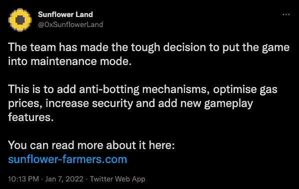
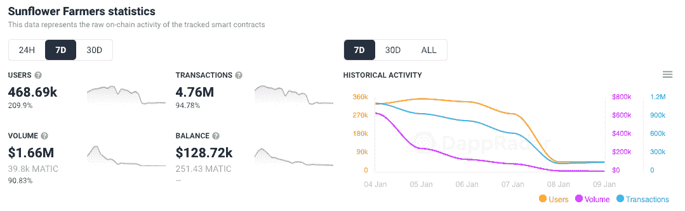

# 向日葵农民在堵塞多边形区块链后离线

> 原文：<https://web.archive.org/web/https://dappradar.com/blog/sunflower-farmers-taken-offline-after-clogging-polygon-blockchain>

## 向日葵农民将多边形煤气费从 30 吉威提高到 500 吉威

**向日葵农民，多边形网络上一款新的玩赚游戏，正在肆虐多边形区块链上的** [**油价**](https://web.archive.org/web/20221202203334/https://polygonscan.com/gastracker) **和** [**dapps**](https://web.archive.org/web/20221202203334/https://twitter.com/DoubleProtocol/status/1478606054883614724) **。一个智能合同漏洞允许用户铸造无限铁镐，导致大量玩家和潜在的机器人滥用编程错误。**

玩家和潜在机器人的涌入导致多边形区块链的汽油费从每笔交易约 30 gwei 的基础水平上升到 500 gwei 以上。从大约 0.00009 美元增加到大约 0.001 美元。与以太坊的汽油费相比还是便宜的。当然，令人难以置信的汽油费上涨更令人震惊，因为相对于已经很贵的以太坊区块链，Polygon 应该是一个更便宜的选择。

[作为回应](https://web.archive.org/web/20221202203334/https://docs.sunflower-farmers.com/)，截至 1 月 7 日星期五，向日葵农民团队决定让游戏进入维护模式，因为他们进行了改进并重新推出了 SFF 令牌。这意味着旧的 SFF 令牌将被放弃。

## 按暂停

该系统利用了一个漏洞，使得用户可以铸造无限铁镐。社区提出了这个问题，一旦这个问题引起了团队的注意，游戏立即被关闭，以防止人们制作更多的物品。[此时，拍摄了快照](https://web.archive.org/web/20221202203334/https://polygonscan.com/block/23451693)以保存农民的库存、资源和 NFT。这是在 [block #23451693](https://web.archive.org/web/20221202203334/https://polygonscan.com/block/23451693) 拍摄的，将用于兑换所有 NFT 和资源。值得注意的是，如果玩家想要兑换的话，他们必须拥有这些代币和 NFT。

虽然游戏已经被取消，但从区块链或像 QuickSwap 这样的分散式交易所取消智能合约是不可能的。团队采取了必要的措施将令牌列入黑名单。尽管如此，机器人将不可避免地继续通过区块链直接交互来玩去中心化游戏，人们将继续猜测 SFF 令牌。鉴于区块链的无许可性质，向日葵农民背后的团队无法阻止任何人交易 SFF。

那些继续交易的人纯粹是投机和奖励继续与智能合约互动的机器人。任何从宽限期获得令牌的人这样做纯粹是对旧的 SFF 令牌的投机，并且不会保证任何新的令牌。

[<picture></picture>](https://web.archive.org/web/20221202203334/https://dappradar.com/blog/what-is-polygon-a-simple-explanation)[<picture></picture>](https://web.archive.org/web/20221202203334/https://dappradar.com/polygon/exchanges/quickswap)[<picture></picture>](https://web.archive.org/web/20221202203334/https://dappradar.com/blog/what-is-a-dapp-on-the-blockchain)[<picture></picture>](https://web.archive.org/web/20221202203334/https://dappradar.com/polygon/defi/sushi)[<picture></picture>](https://web.archive.org/web/20221202203334/https://dappradar.com/blog/set-up-metamask-on-layer-2-and-avoid-ethereum-gas-fees)[<picture></picture>](https://web.archive.org/web/20221202203334/https://dappradar.com/polygon/defi/1inch-network-on-polygon)

## 油老虎

几个原因可以解释为什么以农业为主题的游戏会导致 Polygon 上的汽油费问题。核心原因是游戏中的智能合约被设置为每一个游戏动作奖励玩家 SFF 代币。因此，玩家可以通过不断执行任务(如种植和收获作物)来获得代币。因此，在过去的 7 天里观察到大量的交易数字。赚取的代币可用于购买游戏内的 NFT 和支付其他福利，以进一步增加游戏中的赚取机会。

其次，游戏的机制激励玩家积极竞争，以获得尽可能多的象征性奖励。该游戏的[代币经济学](https://web.archive.org/web/20221202203334/https://docs.sunflower-farmers.com/tokenomics)规定，随着代币供应迅速变得紧缩以推动稀缺性，早期用户将获得更高份额的奖励。因此，玩家希望获得更大份额的游戏代币，并支付高额汽油费，以确保他们的交易被接受。

## 蝇蛆病

具有简单机制的玩赚游戏长期以来一直是机器人活动的受害者。2021 年 3 月，在外星世界观察到类似的活动。蜡区块链上的一个玩到赚的游戏，当活跃的钱包爆炸到创纪录的水平。带领游戏引入新的验证码设置，尝试帮助消除机器人。

当你考虑向日葵农民的基本行动时，例如，种下一颗种子，等待它生长，收获它，并获得回报——很容易看出玩家如何能让机器人一天多次执行简单的动作。激励性的农业游戏可能吸引了试图提取价值的机器人。[上周的报告显示](/web/20221202203334/https://dappradar.com/blog/sunflower-farmers-game-flourishes-on-polygon-blockchain/)令人印象深刻但又有点可疑的用户数据。纯粹是因为《向日葵农民》以闪电般的速度成长为 DappRadar 上的头号游戏。

更全面地看待这种情况引发了人们对一个 dapp 如何能造成这种天然气费用飙升的担忧。尽管如此，与以太坊相比，Polygon 的汽油费仍然很低，以太坊目前的单笔交易费用在 50 美元至 100 美元之间。重要的是，多边形没有经历停机问题，这确实发生在索拉纳区块链最近。2021 年 12 月，Solana，一个领先的第 1 层区块链，暂停了几个小时，由于 IDO 发布的超额预订，无法处理新的数据块。

在撰写本文的时候，Polygon 团队还没有谈到它计划如何解决由 play-to-earn 游戏和 dapps(如向日葵农民)造成的拥堵问题。然而，这个例子表明网络具有强大的机制来处理这些向前发展的可扩展性问题。

大规模采用即将到来。但是代价是什么呢？

 NewsletterUnsubscribe at any time. [T&Cs](https://web.archive.org/web/20221202203334/https://dappradar.com/terms) and [Privacy Policy](https://web.archive.org/web/20221202203334/https://dappradar.com/privacy-policy)

***以上不构成投资建议。此处给出的信息仅供参考。请行使尽职调查，做你的研究。作者持有 ETH、BTC、AGIX、HEX、LINK、GRT、CRO、OMI、不变 X、ENS、GALA、AVASTR、GMEE、CUBE、RADAR、FLOW、FTM、BNB、SPS、WRLD、ATOM 和 ADA。***