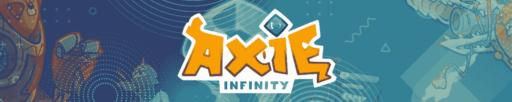
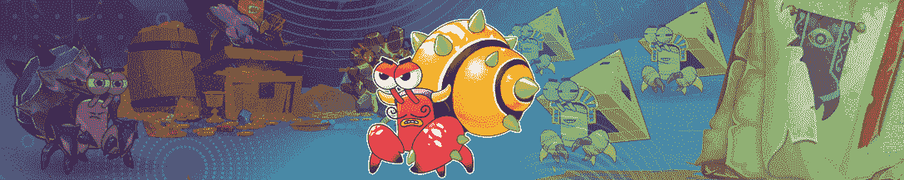

# 由于 SFL 的推出，向日葵王国占据了主导地位

> 原文：<https://web.archive.org/web/https://dappradar.com/blog/sunflower-land-dominates-thanks-to-sfl-launch>

## 在熊市趋势下，虚拟世界表现不佳，因为代币价格下跌

由于推出了本土代币 SFL,《向日葵王国》荣登每周游戏排行榜榜首。尽管代币价格浮动，但这提高了游戏的活跃度。令人印象深刻的是，虚拟世界继续挣扎，因为整个空间正在经历熊市，令牌价格正在崩溃。

WorldWideWebb 是本周唯一登上排行榜的虚拟世界，并令人印象深刻地位居第二。考虑到相当不利的市场条件，该项目的一个可取之处是它还没有一个本地令牌。

根据我们最新的[BGA 2022 年 Q1 区块链游戏报告](https://web.archive.org/web/20220925073323/https://dappradar.com/blog/dappradar-x-bga-games-report-q1-2022)，区块链游戏驱动了 52%的在线活动。这篇文章通过结合连锁活动、NFT 交易量、代币估值和围绕项目的新闻，来审视本月最热门的游戏 dapps。

浏览以下本月十大区块链游戏的完整列表。单击相应的图片，了解每个平台的更多信息。或者，看看下面的视频，它总结了排名，可以快速查看。

[https://web.archive.org/web/20220925073323if_/https://www.youtube.com/embed/FohNS2Cm7zc?feature=oembed](https://web.archive.org/web/20220925073323if_/https://www.youtube.com/embed/FohNS2Cm7zc?feature=oembed)

## 区块链十大运动会–第 19 周

### 1.[向日葵地](https://web.archive.org/web/20220925073323/https://dappradar.com/polygon/games/sunflower-land)

向日葵地已经效仿了它的前身向日葵农场的成功，现在在每周顶级区块链游戏排行榜上排名第一。本周，这款游戏推出了自己的本土代币 SFL，这推动了该平台的活跃程度。

### 2.[环球韦布](https://web.archive.org/web/20220925073323/https://dappradar.com/ethereum/collectibles/worldwide-webb-land)

WorldWideWebb 是本周唯一进入排行榜的虚拟世界。在过去的七天里，该平台吸引了超过 50 万美元的 NFT 交易量。

### 3.[夹板垫](https://web.archive.org/web/20220925073323/https://dappradar.com/hive/games/splinterlands)

上周的冠军 Splinterlands 在本周的排名中下降了几个名次。尽管这款游戏本身的价值在下降，但它仍然吸引了大量玩家。在过去的七天里，Splinterlands 吸引了 456，900 个独特的活动钱包。

### 4.[轴无穷大](https://web.archive.org/web/20220925073323/https://dappradar.com/ronin/games/axie-infinity)

玩赚巨人 Axie Infinity 已经设法从 Ronin bridge hack 中复活，现在回到了区块链游戏排名的前列。更重要的是，随着 Android 移动设备上 Origin 版本的推出，Sky Mavis 继续为 Axie 游戏玩家带来新产品。说到性能，Axie Infinity 在过去七天里吸引了超过 38，000 个独特的活动钱包。

### 5. [Arc8](https://web.archive.org/web/20220925073323/https://dappradar.com/polygon/games/arc8-by-gamee-1)

移动游戏平台 Arc8 本周排名上升，位列第五。该平台在 5 月初推出了大量更新。用户现在可以参加锦标赛，以各种代币赠送奖励，包括塔和快速。此外，该平台吸引了超过 28，000 个独特的活动钱包。

### 6.aavegotchi

基于多边形的 Aavegotchi 度过了星光灿烂的一周，玩家们蜂拥而至享受 Gotchiverse。这款游戏本周排名第六，吸引了超过 9000 名玩家的钱包，NFT 交易量超过 30 万美元。

### 7.[peg xy](https://web.archive.org/web/20220925073323/https://dappradar.com/polygon/games/pegaxy)

Polygon 的后起之秀 Pegaxy 本周排名第七，因为该团队对该游戏的移动应用程序进行了测试。这一版本推动了游戏的活动，在过去的七天里吸引了超过 64，000 个独特的活动钱包。

### 8. [Mobox](https://web.archive.org/web/20220925073323/https://dappradar.com/binance-smart-chain/games/mobox-nft-farmer)

BSC NFT 农业游戏 Mobox 本周排名第八。随着 Momoverse 的宣传和新奇逐渐消失，Mobox 已经找到了稳定的回归用户群。在过去的七天里，Mobox 在 NFT 产生了超过 200 万美元的交易量。

### 9.[农民世界](https://web.archive.org/web/20220925073323/https://dappradar.com/wax/games/farmers-world)

本周第二个上榜的农业游戏是《农民世界》。虽然该团队在社交媒体上并不活跃，但区块链蜡像馆的平台已经成功吸引了大量用户。在过去的一周，农民世界吸引了超过 162，000 个独特的活动钱包。

### 10.[克拉巴达](https://web.archive.org/web/20220925073323/https://dappradar.com/avalanche/games/crabada)

最后但并非最不重要的是，本周我们有克拉巴达排名第十。对于团队和平台来说，在经历了几个动荡的星期后，这款闲置的游戏变得越来越强大。重要的是，Crabada 现在已经成功地完成了从其原始链雪崩到游泳者网络的桥梁。

## 向日葵地接管多边形游戏

向日葵地再次占领了多边形的区块链。游戏的前身向日葵农场设法堵塞了链条，但新版本更加稳定，并分阶段加入新玩家。

虽然这款游戏仍在建立自己的用户群，但原生 SFL 代币的推出带来了显著的活跃度提升。玩家可以在游戏的 alpha 和 beta 版本中获得 SFL，但是不支持提款。现在，每个人都有机会实际兑现他们的 SFL 收入，并在分散的交易所将代币换成其他加密货币。或者，当然，投资更多的向日葵土地获得更多的财富。

如果你想了解更多关于向日葵农场和 SFL 代币的信息，请查看这个[详细概述](https://web.archive.org/web/20220925073323/https://dappradar.com/blog/sunflower-land-and-its-sfl-token)。在接下来的几个月里，我们会继续关注这款游戏，因为它会有更多的新玩家加入。在[推特](https://web.archive.org/web/20220925073323/https://twitter.com/dappradar)上关注 DappRadar，抢先获得最新的区块链博彩新闻。

 NewsletterUnsubscribe at any time. [T&Cs](https://web.archive.org/web/20220925073323/https://dappradar.com/terms) and [Privacy Policy](https://web.archive.org/web/20220925073323/https://dappradar.com/privacy-policy)