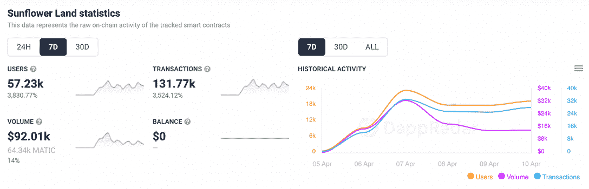
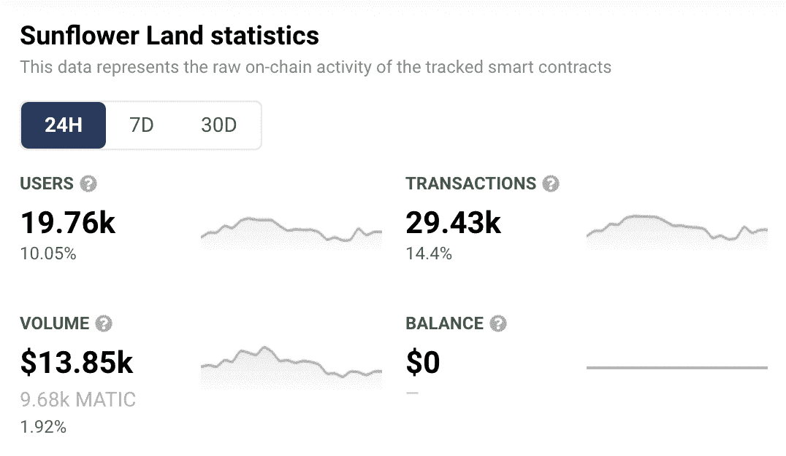
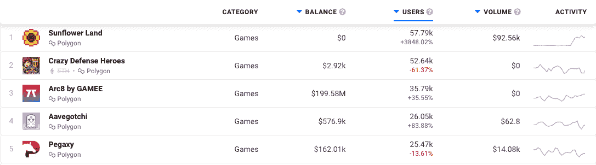

# 向日葵地在重新开业后获得了巨大的成功

> 原文：<https://web.archive.org/web/https://dappradar.com/blog/sunflower-land-finds-tremendous-success-after-relaunch>

## 自 4 月 7 日公测以来，活跃钱包的数量飙升了 3，830%

随着《向日葵之地》的成功重启，这款游戏的用户数量一路攀升。与此同时，该平台处理的交易数量激增了 3，524%。进入游戏智能合约的金额也上升了。对向日葵地社区来说，好消息是这看起来不像昙花一现。

**总结**

*   ***《葵花宝地》东山再起了*** [***巨大成功***](https://web.archive.org/web/20221011001948/https://dappradar.com/blog/10-blockchain-games-to-play-and-earn-in-april-2022)
*   ***向日葵地坐拥*** [***多边形游戏排行榜***](https://web.archive.org/web/20221011001948/https://dappradar.com/rankings/protocol/polygon/category/games)
*   ***[一款面向未来的游戏](https://web.archive.org/web/20221011001948/http://future-plans/)***

## 惊人的连锁活动

随着新老玩家蜂拥进入公测，向日葵之地的美丽复兴在本周持续进行。DappRadar [本周早些时候](https://web.archive.org/web/20221011001948/https://dappradar.com/blog/how-to-join-sunflower-land-open-beta)报道了如何加入即将到来的公测发布会。

继向日葵地的第二次亮相后，成千上万的玩家加入了进来，以填补 100，000 个可用的位置。在过去的七天里，共有 57，230 个不同的活动钱包与 dapp 的智能合约进行了交互。

请记住，游戏有一个严格的一人一个农场的政策，我们可以非常肯定，每个独特的活动钱包代表一个人，而不是一个人使用多个钱包。此外，向日葵土地团队在 4 月 7 日晚宣布，超过 30，000 名“农民已经在建立他们的帝国”。

[DappRadar’s on-chain analytics for Sunflower Land](https://web.archive.org/web/20221011001948/https://dappradar.com/polygon/games/sunflower-land)

我应该指出，虽然游戏的公开测试版在 4 月 7 日正式发布，但实际上它是在 4 月 6 日秘密发布的。这与右边的图表相对应，显示了当天的活动略有增加，然后在第二天直线上升得更快。

我也应该举双手说，在测试版发布时引用百分比的增加可能会有点误导。如果你从 1 美元涨到 2 美元，你的钱增加了 100%。但你还是不会告诉别人你很富有。

在公测开始之前，向日葵地只有有限的连锁活动。1，000 名玩家参加了封闭测试，因此开放游戏的人数达到这个数字的 100 倍将不可避免地表现为显著的百分比跃升。

出于这些原因，我看了一下过去 24 小时的链上活动，我们可以看到，虽然这些数字并不太引人注目，但它们确实代表了游戏的持续增长。像这样的统计数据可能更能代表向日葵地里的活动在接下来的一周左右会如何增加。说到这里，五天内吸引超过 57，000 名玩家是开发团队的巨大成就。

[DappRadar 24-hour on-chain activity for Sunflower Land](https://web.archive.org/web/20221011001948/https://dappradar.com/polygon/games/sunflower-land)

## 顶部的向日葵地

如果我们去看看 DappRadar 在 Polygon 上的游戏排名页面，我们可以看到这种活动的激增是如何影响向日葵地的位置的。下面的列表是过去七天活动的数据，在堆的顶部，是向日葵地。

[DappRadar’s Polygon games ranking page](https://web.archive.org/web/20221011001948/https://dappradar.com/rankings/protocol/polygon/category/games)

过去一周，与该平台建立联系的独特活动钱包数量，超过了与区块链博彩业一些大牌的联系。它已经把 Animoca Brands 的疯狂防御英雄们从它通常的巅峰位置上赶走了。和 [Aavegotchi](https://web.archive.org/web/20221011001948/https://dappradar.com/polygon/games/aavegotchi) ，本身享受与[推出其 playdrop](https://web.archive.org/web/20221011001948/https://dappradar.com/blog/aavegotchi-rewards-real-fans-by-replacing-airdrops-with-playdrops) 的流行时刻，坐在第四位。

随着葵花宝地的代币发行将于本周晚些时候(4 月 15 日)举行，预计会有更多的玩家加入进来，并继续增加人数。

## 向日葵地的未来计划

向日葵地背后的团队所做的决定将永远被今年早些时候经历的创伤事件所影响。当你阅读《T2》的未来路线图时，你会发现可持续性和更多的控制是游戏未来愿景的关键组成部分。

如上所述，向日葵地原生令牌将于 4 月 15 日推出。他们将它命名为 SFL，它将具有游戏内效用以及一个有趣的游戏化赌注功能，名为[许愿井](https://web.archive.org/web/20221011001948/https://docs.sunflower-land.com/fundamentals/wishing-well)。团队已经更新了他们的[令牌燃烧过程](https://web.archive.org/web/20221011001948/https://docs.sunflower-land.com/fundamentals/tokenomics)，这样事情就不会像过去那样失控。

从我的角度来看，我读了很多关于这个游戏的书，并且昨天有机会玩了它，看起来在一个专门开发的团队背后有一个强大的社区。他们从自己的错误中吸取了惨痛的教训，仍然致力于创建一个玩家共同拥有的去中心化游戏平台。

公测会一直运行到游戏正常启动；向日葵地的团队还没有宣布具体日期。需要注意的是:公测中的 100，000 个空间可能听起来很多。但其中一半以上已经消失了——其余的可能会在下周消失。所以如果你想加入这个派对，趁你还能加入的时候，现在就加入吧。

要了解向日葵地的复兴，请关注 DappRadar [博客](https://web.archive.org/web/20221011001948/https://dappradar.com/blog/)。您可以使用我们的[令牌浏览器](https://web.archive.org/web/20221011001948/https://dappradar.com/hub/tokens/ethereum/all/1)跟踪 4 月 15 日掉落的令牌。你可以通过查看向日葵地在[的在线活动](https://web.archive.org/web/20221011001948/https://dappradar.com/polygon/games/sunflower-land)和查看其在 [DappRadar 排名页面](https://web.archive.org/web/20221011001948/https://dappradar.com/rankings/protocol/polygon/category/games)中的位置来了解向日葵地是否保持其受欢迎程度。