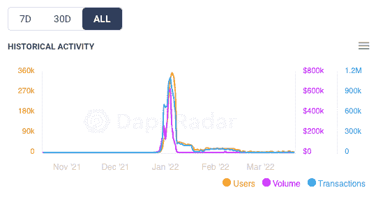
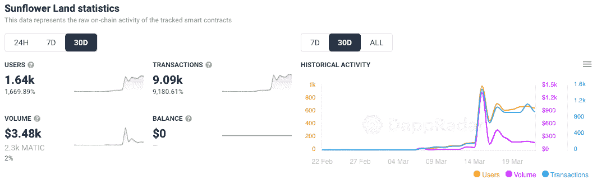
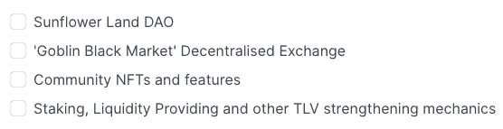

# 从向日葵农民的灰烬中重生的向日葵地

> 原文：<https://web.archive.org/web/https://dappradar.com/blog/sunflower-land-revived-from-the-ashes-of-sunflower-farmers>

## P2E 向日葵游戏的新版本推出了封闭测试版

向日葵农民团队成功地以新的名字“向日葵地”恢复了它的项目。今年早些时候，这款游戏的第一次迭代取得了巨大成功，但恶意攻击和对智能合约的利用将它彻底摧毁。该团队已经发布了一个改进的、更安全的第二版游戏，这个版本已经获得了关注。

向日葵农民最初于 2021 年 9 月推出。然而，直到同年 12 月，它才开始获得关注。那时，该团队推出了石头开采和木材切割技术，提高了玩家的奖励和收入。突然间，《向日葵农民》成了 GameFi 年度热门歌曲。

多边形区块链上的游戏经常在 DappRadar Games 排行榜上名列前茅，每周吸引成千上万的用户。它也成为了[多边形区块链](https://web.archive.org/web/20221208155205/https://dappradar.com/rankings/protocol/polygon)上访问量最大的游戏赚取平台。不幸的是，底层代码还没有准备好容纳如此快速涌入的用户。那么 2022 年 1 月发生了什么，为什么向日葵农民不再正常运作？

## 向日葵农民堵塞多边形区块链

希望在《向日葵农民》上玩和赚钱的用户蜂拥而至。不幸的是，除了合法玩家之外，一大批机器人也涌向了平台的智能合约。

这种输入活动的激增导致 Polygon 区块链的天然气费用从每笔交易约 30 gwei 的基础水平上升到 500 gwei 以上。从大约 0.00009 美元增加到大约 0.001 美元。当然，汽油费不可思议的上涨格外令人震惊。Polygon 被认为是昂贵的以太坊区块链的廉价替代品。

交易涌入的另一个原因是游戏智能合约中的漏洞。它允许用户开发制造系统，使他们能够铸造无限铁镐。社区提出了这个问题，一旦引起了团队的注意，[游戏立即被关闭，以防止人们制作更多的物品](https://web.archive.org/web/20221208155205/https://dappradar.com/blog/sunflower-farmers-taken-offline-after-clogging-polygon-blockchain)。

此时，[在块#23451693 处进行快照](https://web.archive.org/web/20221208155205/https://discord.com/channels/880987707214544966/897231700776615936/929066226326597643),以保存农民的库存、资源和 NFT。对于现在重新发行的《向日葵地》来说，这是一个关键时刻。在快照中拥有物品和资源的地址可以在新游戏中兑换这些物品和资源。

## 向日葵地有什么不同？

在向日葵种植者艰难地停下来之后，这个团队不得不重新评估他们的主要原则。最初的平台是一个 100%分散的项目，没有合同所有权。不幸的是，这种程度的权力下放是不可持续的。bot 攻击和对多边形网络造成的相当大的压力是由于缺乏集中组织造成的。

为了使[向日葵地](https://web.archive.org/web/20221208155205/https://dappradar.com/polygon/games/sunflower-land)成为一个更加精致和全面的产品，该团队选择添加社区治理机制。去中心化仍然是新游戏的重要组成部分。但是，该结构将通过类似 DAO 的机制添加。

值得注意的是，DAO 机制将是一长串 beta 测试和改进目标中的最后一个重要里程碑。向日葵地目前正处于封闭测试的早期阶段。这个阶段给予有限数量的玩家访问平台的权限。尽管如此，根据 DappRadar 的数据，在过去的 30 天里，新的向日葵土地平台上的活动一直在蓬勃发展。凭借超过 1600 个独特的活动钱包和近 10，000 笔已处理的交易，这款游戏在[多边形区块链](https://web.archive.org/web/20221208155205/https://dappradar.com/rankings/protocol/polygon)追踪的所有 dapps 中排名第 24。

## 接下来是向日葵地

根据[官方路线图](https://web.archive.org/web/20221208155205/https://docs.sunflower-land.com/fundamentals/roadmap)，向日葵之地为玩家提供了大量令人兴奋的补充内容。这款游戏将于 4 月推出公测版，所有向日葵地不和谐成员均可使用。这一阶段还将引入大量 NFT 物品和资源的回归。

在公开测试的第二阶段，该团队旨在提议对新的令牌组学和每种资源的供应限制进行社区投票。目的是增加资源的稀缺性，提高游戏的长期可持续性。此外，将开发和部署陆地 NFT 功能。

最后，在第三阶段，团队将开发分散协议，准备将游戏控制权交给向日葵地道。这一阶段还包括一些里程碑，如推出分散式交易所和更以社区为中心的 NFT 收藏。

DappRadar 将继续监督向日葵地项目，因为它是从它的前身向日葵农民的灰烬中重生的。就像一只凤凰，这个改进的项目有潜力超越它的初始版本。要了解更多关于向日葵地的信息，请查看游戏的[官方 dapp 页面](https://web.archive.org/web/20221208155205/https://dappradar.com/polygon/games/sunflower-land)。此外，你可以在[的 Twitter](https://web.archive.org/web/20221208155205/https://twitter.com/dappradar) 上关注 DappRadar，首先了解最新的区块链游戏更新。

 NewsletterUnsubscribe at any time. [T&Cs](https://web.archive.org/web/20221208155205/https://dappradar.com/terms) and [Privacy Policy](https://web.archive.org/web/20221208155205/https://dappradar.com/privacy-policy)