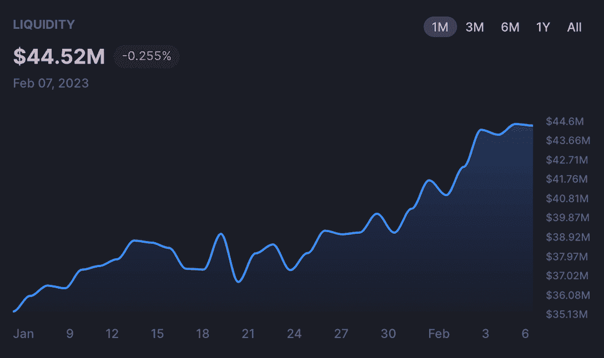
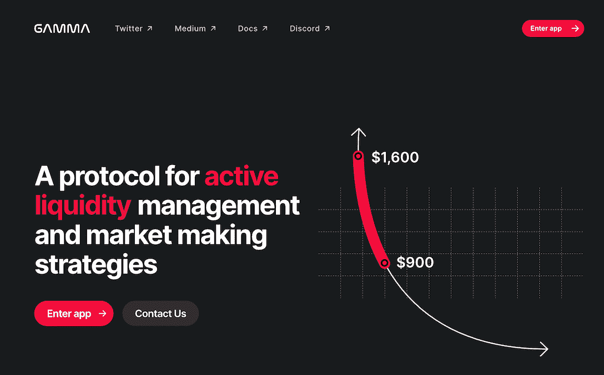

# 用 Gamma 策略增强你在 QuickSwap V3 上的 LP 挖掘

> 原文：<https://web.archive.org/web/https://dappradar.com/blog/supercharge-your-lp-mining-on-quickswap-v3-with-gamma-strategy>

## 随着流动性存款的增加，cryptosphere 采用了 QuickSwap 的 Gamma 集成

**QuickSwap 已经与 Gamma 进行了本机集成，支持 V3 主动流动性管理。这种集成让用户享受到高效的流动性管理，以最大限度地提高 LP 和农业产量，由 Gamma 的自动化策略提供动力。自推出以来，这种合作关系已经给 QuickSwap 带来了流动性存款的强劲增长。**

**内容**

*   *[QuickSwap 的 V3 流动性存款在伽马融合后增长](https://web.archive.org/web/20230210044217/https://dappradar.com/blog/supercharge-your-lp-mining-on-quickswap-v3-with-gamma-strategy/#quick)*
*   *[伽马是什么？](https://web.archive.org/web/20230210044217/https://dappradar.com/blog/supercharge-your-lp-mining-on-quickswap-v3-with-gamma-strategy/#what)*
*   *[Gamma 如何惠及 QuickSwap 用户？](https://web.archive.org/web/20230210044217/https://dappradar.com/blog/supercharge-your-lp-mining-on-quickswap-v3-with-gamma-strategy/#how)*
*   *[流动性池投资和回报增长](https://web.archive.org/web/20230210044217/https://dappradar.com/blog/supercharge-your-lp-mining-on-quickswap-v3-with-gamma-strategy/#growth)*
*   *[有用链接](https://web.archive.org/web/20230210044217/https://dappradar.com/blog/supercharge-your-lp-mining-on-quickswap-v3-with-gamma-strategy/#useful)*

## Gamma 整合后，QuickSwap 的 V3 流动性存款有所增长

QuickSwap 已与 Gamma 集成，为 DeFi 用户提供更高效的流动性管理和强大的 LP 挖掘体验。多亏了 Gamma，用户现在在体验 [QuickSwap 的 V3 池和农场](https://web.archive.org/web/20230210044217/https://quickswap.exchange/)时，拥有了先进的流动性管理能力。

Gamma 是领先的 Web3 流动性管理解决方案提供商，允许用户更有效、更轻松地管理他们的资产，并利用改进和提高产量的农业机会。自 Gamma 实施以来， [QuickSwap](https://web.archive.org/web/20230210044217/https://quickswap.exchange/#/) 注意到 V3 流动性存款显著增加。

image: [QuickSwap’s analytics](https://web.archive.org/web/20230210044217/https://quickswap.exchange/#/analytics)

当 QuickSwap 推出与 Gamma 的集成时，DEX 的 V3 流动性为 3912 万美元。在撰写本文时，仅仅一周之后，QuickSwap 的 V3 已经获得了大约 4452 万美元的 TVL。

Hi V3 流动性提供商现在可以利用 Gamma 的技术通过 LP 采矿产生被动收入，因为这将有助于将他们的流动性保持在选定的价格范围内。

[Learn more about Gamma](https://web.archive.org/web/20230210044217/https://quickswap.gamma.xyz/)

## 伽马是什么？

[Image: Gamma’s official website](https://web.archive.org/web/20230210044217/https://www.gamma.xyz/)

Gamma 是一个为流动性的非托管、自动化和主动管理而设计的协议。Gamma 的主要特点是 Vault，这是一种非托管的头寸经理合同，可以为流动性池提供策略。这些金库为用户创建可用于内部和外部激励计划的代币，例如 QuickSwap 上的 Gamma Farms。

该协议具有管理功能，如再平衡、头寸设置和费用处理，使用户能够在不牺牲资产托管的情况下管理 QuickSwap 流动性池中的资金。

Gamma 是 GAMMA 协议的本机令牌。用户可以下注 Gamma 来赚取费用，这是所有 GAMMA 池产生的费用的一部分-费用的百分比因池而异。

## Gamma 如何让 QuickSwap 用户受益？

有了 Gamma，QuickSwap 用户不再需要手动设置和重新设置价格范围，要求复合费用，或者自己监控非永久性损失的风险。相反，所有这些现在都将由他们的 V3 池中的自动化来处理，使整个过程更加耗时，同时最大限度地减少一些可怕的未知因素。

Gamma 会自动重新平衡 QuickSwap V3 用户的流动性以保持在范围内，并自动计算产生的交换费用。因此，对于希望通过自己选择的策略获得最大潜在回报的用户来说，它简化了这一过程。

[Join Gamma Farms on QuickSwap](https://web.archive.org/web/20230210044217/https://quickswap.exchange/#/farm?tab=gamma-farms)

## 流动性池投资和回报的增长

Gamma 的智能和高度自动化系统允许 QuickSwap 农民被动而有效地管理他们的 V3 流动性。这让用户有时间优化他们的资产组合。此外，Gamma 通过自动重新平衡其流动性以保持在范围内和自动复利互换费用，最大限度地提高了用户的回报。所有这些都与该应用程序易于使用的界面相结合，使其对 DeFi 用户极具吸引力。

此外，QuickSwap 通过向 V3 提供 600，000 美元的流动资金来支持这一新的整合，从而为 2023 年的增长提供额外的动力。

总之，整合将帮助 QuickSwap 实现飞轮效应，使用户群、奖励和流动性持续增长。

### 有用的链接

*   QuickSwap 上的伽马农场
*   [伽马网站](https://web.archive.org/web/20230210044217/https://www.gamma.xyz/)
*   [QuickSwap Twitter](https://web.archive.org/web/20230210044217/https://twitter.com/QuickswapDEX)
*   [快速交换不和谐](https://web.archive.org/web/20230210044217/https://discord.gg/dSMd7AFH36)
*   [伽马推特](https://web.archive.org/web/20230210044217/https://twitter.com/GammaStrategies)
*   [伽马不一致](https://web.archive.org/web/20230210044217/https://t.co/zDK9zRh3zG)

**免责声明** —这是一篇赞助文章。DappRadar 不认可本页面上的任何内容或产品。DappRadar 旨在提供准确的信息，但读者应该在采取行动之前总是自己做研究。DappRadar 的文章不能被认为是投资建议。