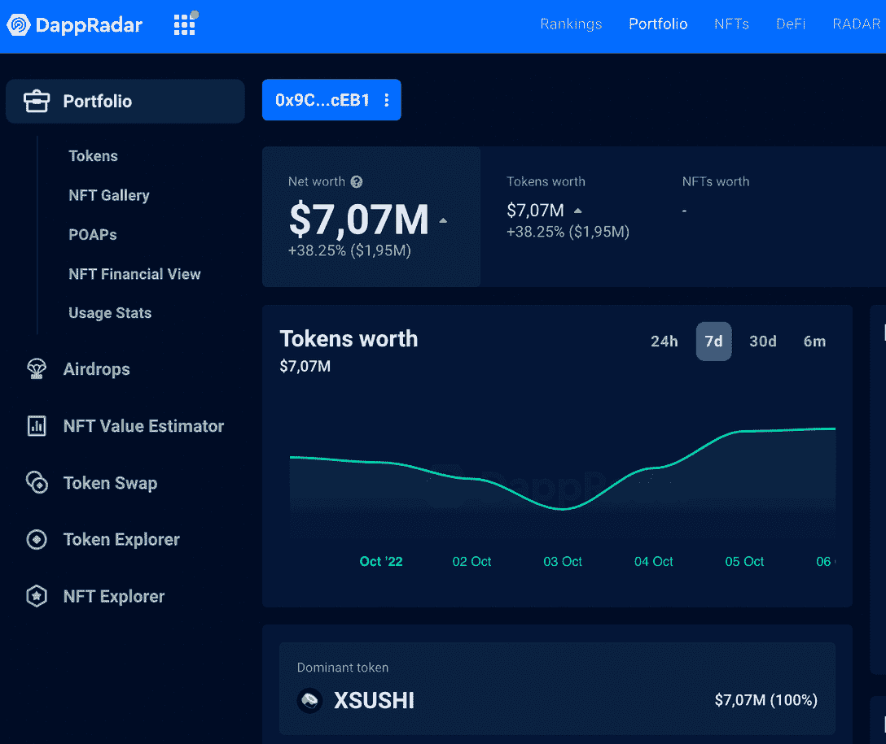
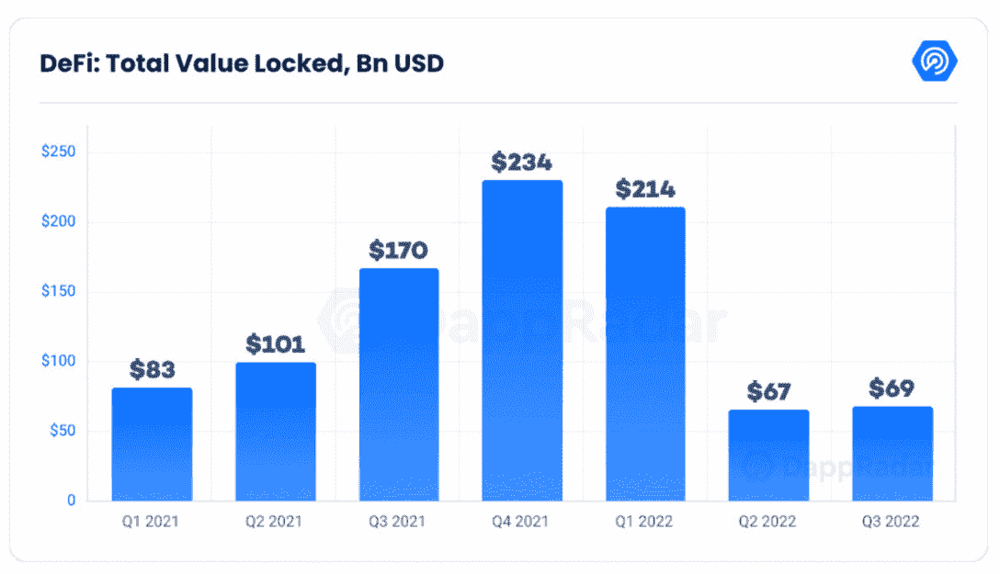

# 寿司在抽水:这是 DeFi 觉醒吗？

> 原文：<https://web.archive.org/web/https://dappradar.com/blog/sushi-is-pumping-is-this-the-defi-awakening>

## 巨型资产管理公司 GoldenTree 在 SushiSwap 上下注超过 500 万美元，引发了这次飙升

**德菲没有死。SushiSwap 本周带着产品更新和一家领先的传统金融机构进入 Web3 重新成为头条新闻。根据最新的市场趋势，这会是 DeFi 项目的菲尼克斯时刻吗？让我们仔细阅读图表和新闻告诉我们的内容。**

## 摘要

*   在 SushiSwap 的绿色月份，在资产管理公司 GoldenTree 宣布后，寿司标志已经攀升到图表的顶端；
*   从那时起，DeFi 行业出现了普遍的积极趋势；
*   DappRadar 的工具可以帮助你理解这条新闻对 Web3 的发展意味着什么。

## 资产管理巨头向 SushiSwap 投资 500 万美元

传统金融巨头也开始涉足 web 3——现在这家美国资产管理公司拥有近 500 亿美元的资金。

根据[他们在 Sushi 论坛上为机构投资者发布的帖子](https://web.archive.org/web/20221128074635/https://forum.sushi.com/t/hello-from-goldentree/11221/5)，黄金投资者在 [SushiSwap](https://web.archive.org/web/20221128074635/https://dappradar.com/multichain/defi/sushi) 看到了*“最好的 DeFi”*，并决定与这个项目合作*“令人难以置信的潜力”*

他们在 SushiSwap 上押了大约 530 万美元的代币，使寿司在一个月内上涨了 14%,这已经对 DEX 有利。

公告中最有趣的部分之一是 GoldenTree/GoldenChain 团队也开始变得透明——公开分享他们的加密投资钱包地址。

[<picture></picture>](https://web.archive.org/web/20221128074635/https://dappradar.com/hub/wallet/eth/0x9C2ba3E13616e27eC15E799797424B0c3D00cEB1)

Via DappRadar Portfolio Tracker

在里面，我们可以看到超过 700 万美元的 XSUSHI——他们从 SushiSwap 的寿司股份中获得的象征。

*   你可以通过 DappRadar 投资组合跟踪器查看 [GoldenTree 的加密钱包。](https://web.archive.org/web/20221128074635/https://dappradar.com/hub/wallet/eth/0x9C2ba3E13616e27eC15E799797424B0c3D00cEB1)

## 寿司的复兴对 DeFi 意味着什么？

退一步来看整个 DeFi 行业的总价值锁定(TVL)，我们可以发现一个跟随[持续升值](https://web.archive.org/web/20221128074635/https://dappradar.com/multichain/defi/sushi)的总体趋势。

正如 [DappRadar 的第三季度行业报告](https://web.archive.org/web/20221128074635/https://dappradar.com/blog/dappradar-q3-industry-report-on-chain-indicators-signal-a-recovering-crypto-market)所指出的:

> ***“DeFi 并没有死，它显示出复苏的迹象，TVL 从 Q2 增长了 2.9%。”***

[<picture></picture>](https://web.archive.org/web/20221128074635/https://dappradar.com/blog/dappradar-q3-industry-report-on-chain-indicators-signal-a-recovering-crypto-market)

Source: DappRadar 2022 Q3 Industry Report

虽然以太坊仍然是最主要的连锁店，在 TVL 拥有超过 480 亿美元，但其他区块链的数字最近急剧上升。这就是特佐斯、T2、海德拉和 T4 乐观派的情况，他们的主要 dapps 都与 DeFi 和 NFT 有关。

换句话说，无论是大玩家的进入，还是市场的普遍情绪，似乎都指向了一个更新的时刻。今年对于 DeFi 来说是一个艰难的时期，自从 Terra 崩溃以来，NFTs 和游戏已经成为区块链产业中最强的领域。然而，乐观的迹象可能表明，DeFi 的转折点就在这里。

[Explore DeFi Industry TVL](https://web.archive.org/web/20221128074635/https://dappradar.com/defi)

## 使用 DappRadar 跟踪寿司并跟上 DeFi 趋势

我们 DappRadar 将继续关注市场趋势的发展。如果你对跟上 DeFi 的最新趋势和 Web3 项目的激动人心的世界感兴趣，DappRadar 是你应该去的地方。

从我们在[博客](https://web.archive.org/web/20221128074635/https://dappradar.com/blog/)上的新手指南中学习，深入到我们的[排名](https://web.archive.org/web/20221128074635/https://dappradar.com/rankings)的实时数据中，并在行业领先的[报告](https://web.archive.org/web/20221128074635/https://dappradar.com/reports)中看到所有这些应用。

我们希望您喜欢更多地了解 DeFi 的未来。请务必在 Twitter 上关注 DappRadar，加入我们的社区。

### 有用的链接

*   [使用投资组合跟踪器查看 GoldenTree 的钱包](https://web.archive.org/web/20221128074635/https://dappradar.com/hub/wallet/eth/0x9C2ba3E13616e27eC15E799797424B0c3D00cEB1)
*   [用令牌浏览器追踪寿司](https://web.archive.org/web/20221128074635/https://dappradar.com/hub/token/eth/SUSHI)
*   [与 DappRadar 一起监督 TVL 的 DeFi 工业](https://web.archive.org/web/20221128074635/https://dappradar.com/rankings/category/defi)
*   [跟随 SushiSwap dapp 页面](https://web.archive.org/web/20221128074635/https://dappradar.com/multichain/defi/sushi)
*   [阅读我们最新的第三季度行业报告](https://web.archive.org/web/20221128074635/https://dappradar.com/blog/dappradar-q3-industry-report-on-chain-indicators-signal-a-recovering-crypto-market)

***以上不构成投资建议。此处给出的信息仅供参考。请尽职调查并自行研究。***

## 随身携带您的 Web3 之旅

使用 DappRadar 移动应用程序，再也不会错过 Web3。查看最受欢迎的 dapps 的性能，并关注您投资组合中的 NFT。您在 DappRadar 上的帐户会与我们的移动应用程序同步，这样您很快就可以选择实时接收提醒。

[Download the DappRadar app now](https://web.archive.org/web/20221128074635/https://dappradar.app.link/blog)[<picture></picture>](https://web.archive.org/web/20221128074635/https://play.google.com/store/apps/details?id=com.portfolio.dappradar) NewsletterUnsubscribe at any time. [T&Cs](https://web.archive.org/web/20221128074635/https://dappradar.com/terms) and [Privacy Policy](https://web.archive.org/web/20221128074635/https://dappradar.com/privacy-policy)