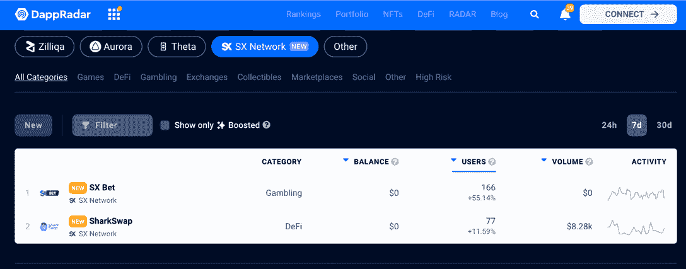

# SX 区块链 Dapps 现已在 DappRadar 上市

> 原文：<https://web.archive.org/web/https://dappradar.com/blog/sx-blockchain-dapps-now-listed-on-dappradar>

## 专为扩展博彩、DeFi 和 NFT 应用而构建的网络

DappRadar 很高兴能整合 SX 区块链及其 dapps 生态系统。DappRadar 上每月超过 100 万的用户现在可以通过 SX 排名发现和分析所有类型的 dapps。此外，DappRadar 为用户提供了每个 SX dapp 指标的直观视图，包括用户量、交易量和历史性能。

[SX 网络](https://web.archive.org/web/20220926005447/https://dappradar.com/preview/rankings/protocol/sxnetwork)是 Polygon 的第一个二层区块链。它完美地继承了 Polygon 的安全性，同时为开发者和用户提供了超低气体体验。SX 网络是独一无二的，因为它是第一个具有本地预测市场协议的独立智能合约平台。

该网络的动态生态系统具有三个相互关联的平台:

*   SX 打赌-世界上最大的区块链预测市场。
*   SX 协议–为所有 SX 预测市场提供便利的开源智能合约协议。
*   SX 区块链——构建在多边形边缘的高度可扩展、EVM 兼容的区块链。

SX 是赋予其生态系统力量的 [SX 网络](https://web.archive.org/web/20220926005447/https://dappradar.com/preview/rankings/protocol/sxnetwork)的内置原生令牌。它有三个主要用途:支付交易费用，作为验证者的赌注债券，以及权力治理。

## SX dapps 在 DappRadar

在发布时，DappRadar 将跟踪 SX 网络上最突出的[dapp，涵盖 DeFi 和游戏，随着生态系统的扩展，未来将有更多 dapp 加入。](https://web.archive.org/web/20220926005447/https://dappradar.com/preview/rankings/protocol/sxnetwork)

[SX 赌注](https://web.archive.org/web/20220926005447/https://dappradar.com/sxnetwork/gambling/sx-bet)是一个点对点的赌注交换，允许用户提供和接受赌注。这与传统的体育博彩不同，在传统的体育博彩中，用户只能接受集中公司提供的投注。这种点对点的赌博模式带来了更好的赔率，并消除了所有者利用用户获利的能力。

SharkSwap 是 SX 网络上独一无二的 DeFi 平台。它努力成为一个社区拥有的分散交易所，拥有与预测市场相联系的创新机制。此外，SharkSwap 协议由其本机令牌 SHARK 提供支持。用户因在 SharkSwap 协议上提供流动性而赚取 SHARK。

## dapp 开发者的 SX

想要在预测市场或博彩游戏中推出产品的开发者可以利用这个充满活力的社区。

此外，SX 允许基于多边形的区块链 dapps 很容易移植到 SX 网络。它为 DeFi、NFT 和 gaming dapps 打开了一扇新的机会之门，让他们无需脱离 Polygon 就能进入一个全新的社区和生态系统。

dappRadar 邀请 Dapp 开发者向 DappRadar 提交他们的 Dapp，为不断扩大的 SX 生态系统在世界 Dapp 商店上创造更多的可见性。那些有兴趣了解更多关于 SX 和可能性的人可以从 SX 网站和 T2 开发者文档开始。

 NewsletterUnsubscribe at any time. [T&Cs](https://web.archive.org/web/20220926005447/https://dappradar.com/terms) and [Privacy Policy](https://web.archive.org/web/20220926005447/https://dappradar.com/privacy-policy)