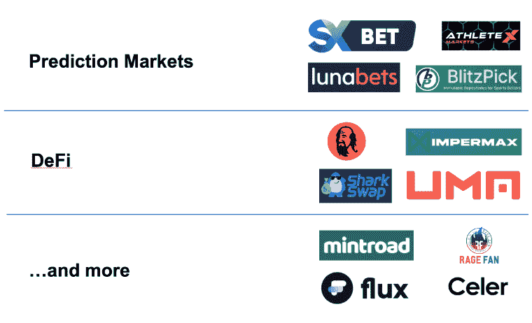
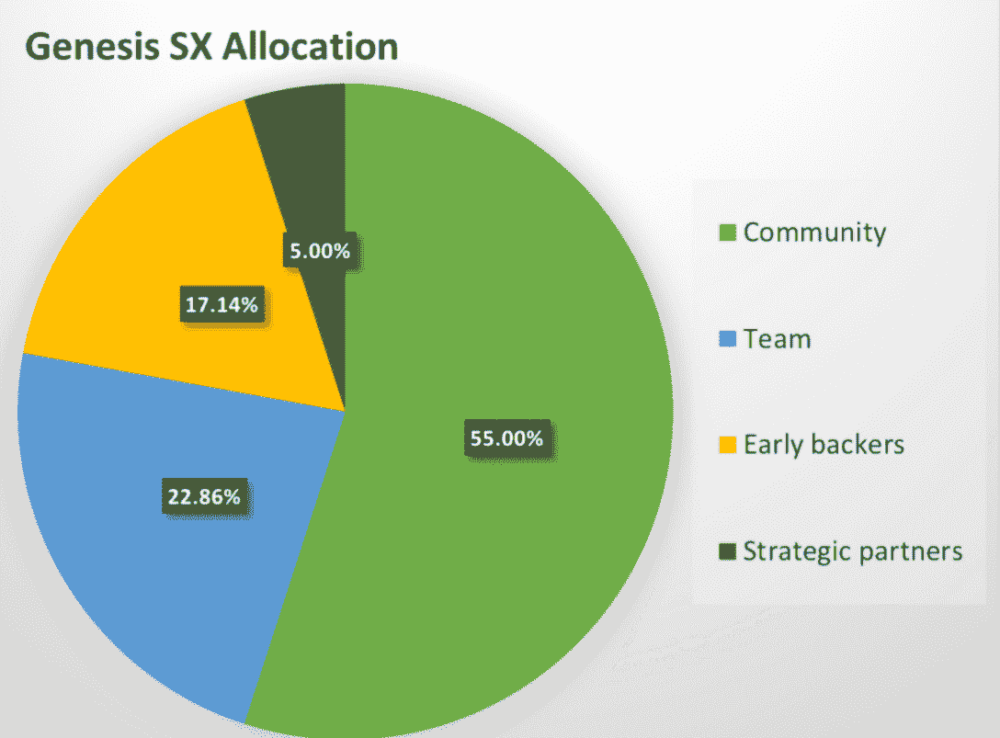

# SX 网络 Dapps 来到 DappRadar

> 原文：<https://web.archive.org/web/https://dappradar.com/blog/sx-network-dapps-coming-to-dappradar>

## 最突出的区块链预测市场生态系统

**DappRadar 很高兴地宣布，它将很快整合 SX 网络及其 dapps 生态系统。SX 网络是具有本地预测市场协议的独立智能合约区块链。它完全是为区块链应用程序开发人员设计的，具有 EVM 兼容性、低成本交易和基于 PoS 的共识模型。在整合发生之前，我们邀请 DappRadar 社区了解更多关于 SX 网络的信息。**

预测市场是一个人们可以交易基于未知未来事件结果支付的合约的市场。例如赌博和对体育和现实世界事件的下注。

SX 网络由三个相互关联的平台组成:

*   **SX 赌注**-全球最大的区块链预测市场 dapp。
*   **SX 协议**–**为所有 SX 预测市场提供便利的开源智能合约协议。**
*   ****SX 区块链**–在多边形边缘上构建的高度可扩展、EVM 兼容的区块链。**

 **SX 令牌是 SX 网络上的本地令牌，它有三个用途:支付交易费用、被验证者用作赌注债券以及增强治理能力。

## 性爱 bt

SX 赌注是一个点对点的赌注交换和网络的领先 dapp，允许用户提供和接受赌注。这不同于传统的体育博彩，在传统的体育博彩中，用户只能接受网站运营公司提供的赌注。这种点对点的赌博模式带来了更好的赔率，并消除了所有者利用用户获利的能力。

这种下注模式也意味着没有下注限制，因为您可以无限制地提供或填写任何可用的报价。最后，像 SX 赌注这样的点对点交易的最大优势之一就是输入你的赔率，从根本上成为庄家。此外，它是一个非托管的前端接口，使任何拥有 Web3 钱包的人都可以使用 SX 协议下注。

SX 每天提供超过 550 个不同的预测市场，随着时间的推移，希望通过将市场创建分散到社区来击败传统的体育博彩。最终目标是，在未来，在 SX 创建一个预测市场将像在社交媒体上创建一条消息一样简单。

## 安全的可扩展性

SX 网络是建立在与多边形和从地面上使用多边形边缘技术。Polygon 是一个构建和连接以太坊兼容的区块链网络的框架。它支持成千上万的区块链应用程序，并保护超过 50 亿美元的资产。

SX 网络利用多边形的边来构建一个高度安全和可扩展的公共区块链。区块链应用程序可以在第一天就部署在 SX 链上，因为它们的安全性和性能已经过实战考验。

SX 网络通过状态检查点的实践探索多边形的安全性。这类似于多边形的功能，但 SX 直接使用多边形作为其主机链。通过这样做，SX 可以利用 Polygon 作为其主网桥，同时仍然连接到其他 EVM 兼容的链，如以太坊、BNB 链、Fantom 等。这使得从其他区块链向 SX 网络转移资产变得容易、快速和安全。它还使 SX 网络能够利用 Polygon 的安全性，同时为开发人员提供超低的交易成本。

## 为什么开发者在 SX 区块链上构建

由于几个核心原因，SX 区块链是分散应用程序开发人员的一个简单选择:

**专业化**–SX 网络代表了一个庞大的区块链预测市场用户群体。这使得 SX 成为区块链开发商在预测市场或游戏领域开发产品的良好选择。他们可以利用一个由预测市场用户和开发者组成的大型社区来发展自己的业务。

**Polygon Native:** 作为第一个上线的 Polygon Edge 区块链，SX 网络为寻求挖掘新的价值来源的 Polygon 开发者做出了坚实的选择。基于 Polygon 的区块链 dapps 可以轻松地将其 DeFi 或 NFT 应用移植到 SX 网络上，并接入一个全新的社区和生态系统，而无需脱离 Polygon。

**治理:** SX 网络正在开创全新的治理原语，应用程序开发人员可以利用这些原语。该团队将很快发布更多关于这些新原语的信息，以及区块链开发者如何使用它来创建新产品。

今年 3 月，SX 网络区块链上线，使其成为第一个多边形边区块链。到目前为止，在预测市场、DeFi 和 NFT 空间部署了超过 [25 个协议和应用](https://web.archive.org/web/20220705003310/https://docs.sx.technology/sx-network-motivation)。

## 关于 SX 网络令牌你需要知道的一切

SX 网络致力于社区主导的增长、所有权和发展。SX 令牌将通过实现令牌持有者的共享社区所有权和分散治理来实现这一目的。

SX 网络使用 SX 作为其内置的本地会计单位。它有双重用途，提供一种支付 SX 网络交易费用的机制。参与者还可以使用令牌作为经济赌注债券，由 SX 网络验证机构提供，以确保网络安全。此外，SX 令牌在生态系统中有三个核心实用程序和三个二级实用程序。点击这里，你可以深入了解赌注、交易费、治理以及 SX 其他[公用事业的细节。](https://web.archive.org/web/20220705003310/https://docs.sx.technology/sx-token/sx-token-overview)

值得注意的是，SX 团队正在与 Polygon Edge 团队合作，引入一种 EIP1559 风格的刻录机制，以便系统在每次 SX 网络区块链交易中刻录一点 SX。此外，来自 SX 计价的预测市场交易的所有协议费用目前都被烧掉了，而不是交给 SX 社区国库。

## 将资产引入 SX

SX 网络可以支持来自利用以太坊虚拟机(EVM)环境的公共区块链的任何资产，例如以太坊、多边形、BNB 链和 Tron。它还支持创建本地 SX 链资产，用户可以将其连接到其他 EVM 区块链。

开发人员和用户可以通过将资产锁定到 Celer Network bridge 中，将资产从其他区块链网络转移到 SX 网络。Celer 网络验证器运行桥接逻辑。此桥接技术验证用户何时将资产锁定到 Celer bridge，然后将资产的副本放入 SX 网络上的用户地址。只有当网络中的其他节点完成包含原始桥接事务的块时，用户才能转移资产。从那里，他们可以在 SX 网络内自由转移资产。

## SX 网络概述

SX 最初部署在以太坊区块链上，2020 年 9 月成为在 Polygon PoS 网络上推出的首批应用程序之一。这种向多边形 PoS 的过渡使得 SX 生态系统得以繁荣。然而，在 2021 年夏天，该团队注意到在 Polygon PoS 上操作的几个长期风险和限制:

*   **多边形成本上升**。Polygon PoS 网络上的天然气价格仍然很低，但自 2021 年 1 月以来，价格已经上涨了 10，000 倍以上。随着时间的推移，Polygon 的持续增长可能会导致规模较小的交易被挤出市场。
*   **区块链主权**。SX 协议目前无法控制网络架构。多边形 PoS 没有像其他通用公共区块链一样定制为支持预测市场等独特用例。
*   **激励调整**。SX 协议可能比多边形 PoS 链中的其他利益相关者具有不同的激励。随着 Polygon 的持续增长，这些不同的利益可能会变得紧张。构建 SX 网络可以整合生态系统中所有利益相关者的利益，为博彩和预测市场创造一个生态系统。

SX 区块链是 SX 协议背后愿景的戏剧性扩展。它将 SX 重新设想为一个独立的公共区块链，能够解决这些限制并减轻这些长期风险。

我们 DappRadar 公司对于将《SX 议定书》整合到我们追踪区块链的生态系统中感到非常兴奋。很快，DappRadar 的所有访问者都可以使用 DappRadar 排名在 SX 发现各种 dapps。敬请期待！

 NewsletterUnsubscribe at any time. [T&Cs](https://web.archive.org/web/20220705003310/https://dappradar.com/terms) and [Privacy Policy](https://web.archive.org/web/20220705003310/https://dappradar.com/privacy-policy)**