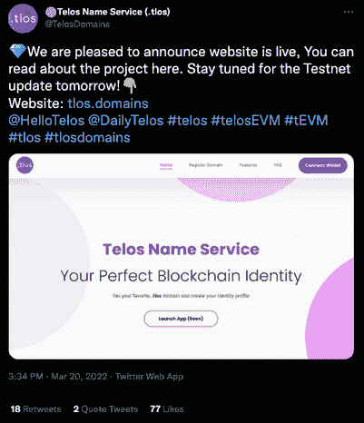
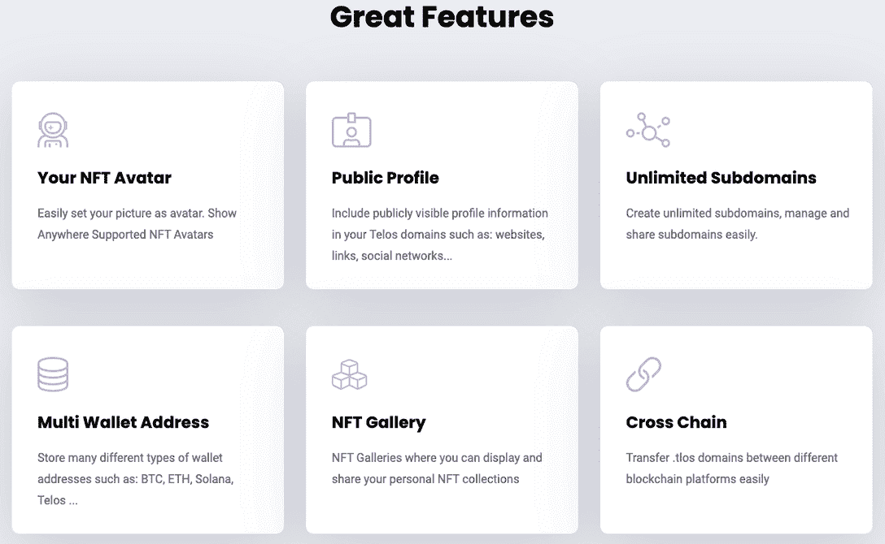
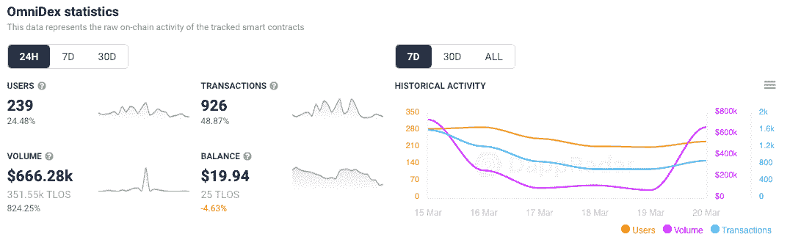
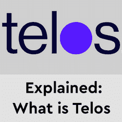
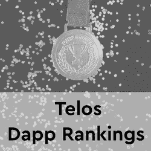

# Telos 推出 Web3 身份域

> 原文：<https://web.archive.org/web/https://dappradar.com/blog/telos-launch-web3-identity-domains>

## 买你最喜欢的。tlos 域并创建您的身份配置文件

**Telos 域名服务公司** [**公布了其网站**](https://web.archive.org/web/20221004131959/https://twitter.com/TelosDomains/status/1505568573036511241) **以及更多关于其 Web3 身份域名的信息。基于 NFT 的域名可以附加到一个用户配置文件，域名持有者可以发送和接收一个独特的和难忘的加密。tlos 名称，可以包括个人资料、头像和社交链接。**

Web3 域名是 NFT 或本质上是真实性的数字证书。用户也可以在 NFT 的市场上进行交易。他们在 2021 年底获得了很多关注，因为[以太坊域名服务](/web/20221004131959/https://dappradar.com/blog/ethereum-name-service-ens-token-claim-now-live/)，区块链以太坊上的一项类似服务，空投了[对 ENS Web3 域名持有者的丰厚奖励](/web/20221004131959/https://dappradar.com/blog/ens-token-drop-draws-attention-to-wallet-naming-services/)，引发了其他 Web3 域名服务可能效仿的传言。

## Telos Web3 域

Web3 域代表区块链上的一个地址，对 Web3 用户的诱惑很简单。例如，如果一个加密用户想要向另一个人发送一些令牌，他们需要一个钱包地址来进行该交易。就像用法定货币执行类似的操作需要银行账户细节一样。

对于接收者来说，说“发送给 winner.tlos”比记忆或读出 42 个字符的代码要容易得多。在许多方面，Web3 域名正试图为 crypto 带来更精简的用户体验，并使入职体验更加顺畅。

此外，持有者可以为企业、家庭成员等添加无限的子域名。同时，公司可以用它们来代表一个安全和品牌化的支付网关。Dapp 构建者可以将 Telos 域集成到他们的 dapps、wallets 和 Web3.0 项目中，使 dapps 更加用户友好，并为用户提供更好的整体用户体验。

## Telos 上的 Dapps

DappRadar 目前[在原生的泰罗斯区块链](https://web.archive.org/web/20221004131959/https://dappradar.com/rankings/protocol/telos)上追踪了 19 个 dapps，涉及几个类别，包括 DeFi、游戏、社交和 NFTs。此外，在 Telos EVM 上跟踪[五个 dapp，solidity 编程语言兼容链并行运行并托管一些](https://web.archive.org/web/20221004131959/https://dappradar.com/rankings/protocol/telosevm) [Telos 的领先 DeFi dapp](https://web.archive.org/web/20221004131959/https://dappradar.com/rankings/protocol/telosevm)。

Last 30-Days

Telos 上领先的 dapps 之一是 APPICS，这是一个社交媒体平台，让用户将他们的活动和喜欢转化为收入。该应用被吹捧为通过分享图片和视频获得 crypto 奖励的最简单方式，每月吸引约 2500 个活动钱包。它奖励 APX 用户的贡献。

[OmniDex 是 Telos EVM 领先的 DeFi 应用程序](https://web.archive.org/web/20221004131959/https://dappradar.com/telosevm/defi/omnidex),提供代币互换、收益农业和流动性供应，目前锁定的总价值约为 520 万美元，每月吸引约 2，000 个活跃钱包。

Telos dapp 生态系统正在成长，并在社交媒体等其他连锁店没有涉足的领域获得牵引力。APPICS 向用户提供内容奖励，[同时，Zeptagram](https://web.archive.org/web/20221004131959/https://dappradar.com/telos/other/zeptagram) 这个奖励艺术家和音乐爱好者创造性表达和对音乐的奉献的平台也受到了关注。

可以说，web3 域将成为用户体验向前发展的关键部分，对于具有社交或更具个性元素的 dapps 来说更是如此。加密价格的暴跌残酷地凸显了一件事，即投资者需要走在曲线的前面，在一个以闪电般速度发展的空间里抓住下一件大事。网络域名虽然不是一个新概念，但作为一项潜在的投资和一种个性化个人网络 3 体验的方式，它确实正在上升到顶端。

 NewsletterUnsubscribe at any time. [T&Cs](https://web.archive.org/web/20221004131959/https://dappradar.com/terms) and [Privacy Policy](https://web.archive.org/web/20221004131959/https://dappradar.com/privacy-policy)

***以上不构成投资建议。此处给出的信息仅供参考。请行使尽职调查，做你的研究。作者持有多种加密货币的头寸，包括 BTC、瑞士法郎和雷达。***

[<picture></picture>](https://web.archive.org/web/20221004131959/https://dappradar.com/blog/what-is-telos-a-simple-explanation)[<picture></picture>](https://web.archive.org/web/20221004131959/https://dappradar.com/rankings/protocol/telos)[<picture></picture>](https://web.archive.org/web/20221004131959/https://dappradar.com/telos/defi/t-swaps)