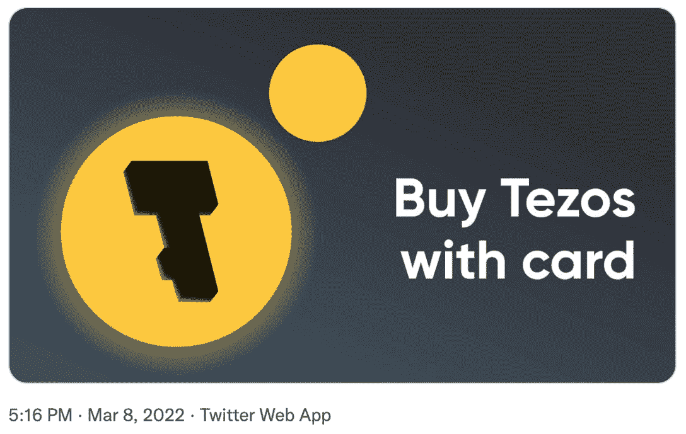

# Temple Wallet 支持菲亚特充值

> 原文：<https://web.archive.org/web/https://dappradar.com/blog/temple-wallet-enables-fiat-top-up>

## 加密货币钱包最终允许用户用借记卡和信用卡给他们的 Tezos 充值

**Temple 是为[泰佐斯·区块链](https://web.archive.org/web/20221007154904/https://dappradar.com/rankings/protocol/tezos)设计的加密货币钱包。该平台于 3 月 8 日宣布，用户现在可以使用银行卡和法定货币补充 Tezos。**

允许用户用他们的银行卡和法定货币为他们的加密货币充值是任何数字钱包的必要阶段。它为更广泛的受众打开了平台，尤其是那些可能不具备在区块链世界航行的技术诀窍的人群。

Temple Wallet Twitter Announcement on March 8th

这一更新可能也会影响泰佐斯区块链和它的本土硬币 XTZ。自从坦普尔宣布之后，这枚硬币已经升值了 9.5%。虽然这种上涨反映了整个加密货币市场的普遍增长，而且 XTZ 的升值不一定与该平台的 [Twitter 帖子](https://web.archive.org/web/20221007154904/https://twitter.com/TempleWallet/status/1501245487554383880)有关，但关注硬币的发展将是有趣的。

## 关于坦普尔的更多信息

Temple 是一个浏览器扩展钱包，用于与 Tezos 区块链互动。该项目始于 2020 年，是开源的。用户可以在一个界面中创建、导入和管理扩展中的多个帐户。

2014 年，亚瑟·布莱特曼和凯瑟琳·布莱特曼首次提出了泰佐斯区块链。非盈利性的 Tezos 基金会位于瑞士的楚格，虽然瑞士货币的符号是 XTZ，但它实际上叫做 tez。其独特的设计特点之一是，区块链是自我修正。这意味着，当一个提案被 XTZ 持有者批准后，它会自动更新，不需要面对面的讨论。

该网络使用一个流动的利害关系证明模型达成共识。这意味着任何在 XTZ 下注的人将获得新铸造的 XTZ，作为在区块链验证区块的奖励。

当 Temple 和 Tezos 发布任何关于升级和更新的进一步公告时，DappRadar 将在这里确保您听到它们。关于区块链游戏和分散应用世界的所有其他新闻，请继续关注 [DappRadar](https://web.archive.org/web/20221007154904/https://dappradar.com/blog/) 并在 [Twitter](https://web.archive.org/web/20221007154904/https://twitter.com/DappRadar) 上关注我们。你也可以参加我们每周四下午 4 点的[不和谐](https://web.archive.org/web/20221007154904/https://discord.com/invite/QMnwjGzrkG)节目。