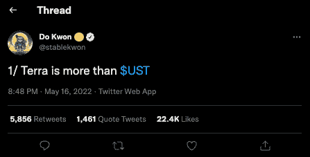
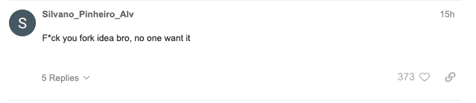
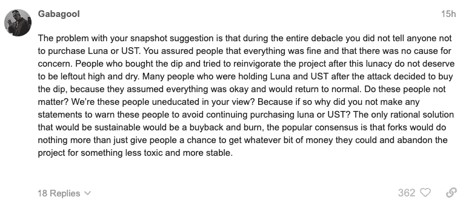
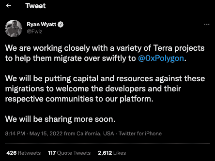
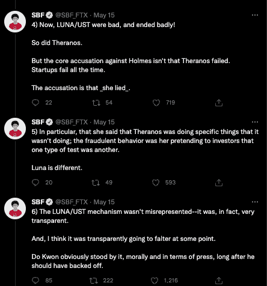
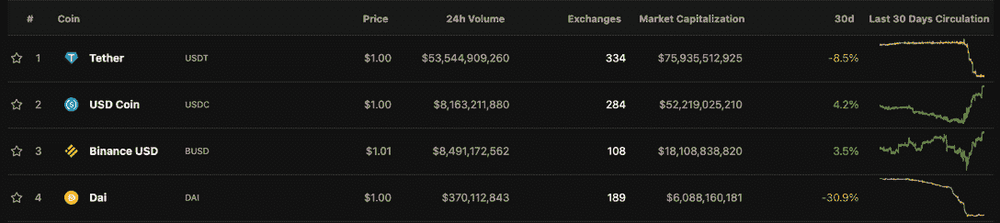

# Terra 生态系统复兴计划招致社区的反对

> 原文：<https://web.archive.org/web/https://dappradar.com/blog/terra-ecosystem-revival-plan-draws-negativity-from-community>

## 加密领域最大的故事——第二部分

**Terra 首席执行官权多在推特上宣布了一项基于分流区块链的生态系统复兴计划，该计划引起了社区的负面关注。叉已经成为 Terra Labs 修复对其运营和品牌造成的巨大损害的主要努力。**

5 月 16 日，权道在推特上宣布,“Terra 不仅仅是 UST ”,他在一篇长文中概述了将目前存在的 Terra 区块链分叉的计划，但没有算法稳定的内容。新的分支将被称为 Terra，它的令牌将是 LUNA，而旧的链将被称为 Terra Classic，并具有 LUNC 令牌。两条链将共存。

上周，特拉区块链的生态系统在几天内恶化了。其原生代币 LUNA 的市值超过 400 亿美元，几乎全部蒸发。与此同时，被认为是与美元挂钩的稳定货币 UST 崩溃了。

Terra LUNA 于 2020 年 8 月在币安上市，开盘价为 0.53 美元，2022 年 4 月达到 119.55 美元的历史高点。随后，该公司在一次崩盘中损失了超过 99%的价值，这次崩盘被比作 Bitconnect 的故事，或者被一些人比作伊丽莎白·霍姆斯实施的 Theranos 骗局。

## 月神经典

上周发生的悲剧事件的后果让地球及其生态系统陷入了完全的混乱。5 月 16 日，权道在推特上宣布,“Terra 不仅仅是 UST ”,他在一篇长文中概述了将目前存在的 Terra 区块链分叉的计划，但没有算法稳定的内容。

#### 提案摘要

*   在没有算法稳定的情况下，将 Terra 链分叉成一个新链。旧链将被称为 Terra Classic(token Luna Classic–LUNC)，新链将被称为 Terra(token Luna–Luna)
*   月神将被空投到月神经典赌注者，月神经典持有者，剩余 UST 持有者，和 Terra 经典的基本应用程序开发者。
*   TFL 的钱包(terra 1 DP 0 Taj 85 RUC 299 rkdvzp 4 z 5 fg 6 z 6 swaed 74 e 6)将从空投的白名单中删除，使 Terra 成为完全社区所有的连锁店
*   分配很大一部分令牌分发，以 1)为现有 Terra dapp 开发者提供紧急跑道，2)将开发者的利益与生态系统的长期成功结合起来
*   令牌膨胀将激励网络安全。每年 7%的目标赌注回报

新的叉将被称为 Terra，其令牌将是 LUNA，旧的链将被称为 Terra Classic，并具有 LUNC 令牌。同样，这两条链条将共存，这一举动让这位作家想起了以太博物馆经典的辩论。据报道，卢娜基金会警卫队也动用了大部分比特币储备来稳定 UST 并恢复其联系汇率。在写作时，UST 的交易价格为 0.09 美元。

该提议收到了来自社区的不同反应，一些人认为这是一个可能的，也许是唯一的解决方案，而其他人则不太高兴，并指出随着故事的展开，Terra 缺乏透明度和沟通。

## 区块链集会

随着 Terra 的崩溃，其他区块链，包括 Polygon、Juno 和 Fantom，都在试图吸引基于 Terra 的 dapp 项目加入他们的网络。多边形工作室(Polygon Studios)的首席执行官瑞安·怀亚特(Ryan Wyatt)在推特上说，他的团队正在与 Terra projects 密切合作，帮助他们迁移到多边形网络。

其他区块链正试图吸引在 Terra 上建造 dapps 的开发商。Juno 是一个专注于互操作性的智能合同网络，它引入了一个新的治理提案[T1，要求批准高达 100 万 JUNO(约 700 万美元)的激励措施，以支持希望迁移 dapps 的 Terra 项目。Juno 的区块链与 Terra 的技术架构有相似之处，因为它们都依赖于 Cosmos SDK。同样，Fantom 区块链也在推特上表示，它为寻找新区块链的 Terra 项目提供拨款、营销和生态系统连接。](https://web.archive.org/web/20220630221546/https://www.mintscan.io/juno/proposals/23)

这一举措看起来是积极的，因为公司似乎来拯救受影响的辛勤工作的开发团队。然而，我们中持怀疑态度的人可能会看到秃鹫在盘旋，寻找从 Terra 生态系统中榨取最好的部分，留下一具腐烂的尸体。也许是两具腐烂的尸体，如果叉子继续下去，事情没有按计划进行。

## 用户错误？

整个星期这个行业都在竭力反对；有的喊庞氏，有的喊欺骗。然而，受人尊敬的行业评论员兼 FTX 交易所首席执行官 Sam Bankman-Fried 说以太坊挑战者 Terra 的失败是由于不准确的营销而不是彻底的欺骗。

在一系列推文中，Sam Bankman-Fried 表示，将 LUNA 及其 stablecoin TerraUSD 的崩溃与 Theranos 或 BitConnect 的崩溃相提并论是不公平的。他进一步表示，Do Kwon 没有欺骗投资者，但承认首席执行官本可以做得更好，让投资者意识到美元并不完全支持 UST。

班克曼-弗里德的关键点是，权斗没有声称 UST 是 1:1 美元支持。他声称有一群不稳定的加密资产支持它，这是正确的。它是

公开表明这些资产可能会下跌，其余的也会跟着下跌。简而言之,《露娜》是一个热情、兴奋、营销和迷因的例子，这些因素促使人们相信一些根据公开信息不可避免会动摇的东西。

## 稳定依旧

上周，人们担心，随着投资者变得愤怒，并开始撤回大量稳定的美元资本，以防出现类似情况，其他领先的美元支持的稳定货币将会动摇。上周，我们报道了领先的 stablecoins 稍微偏离了他们的挂钩，最多偏离了 0.05 美元，但我们看到领先的公司在写作时已经重新控制了他们的算法挂钩。

这场灾难提醒饥渴的投资者，事情转好的同时也可能转坏。此外，看看 Terra 或 Do Kwon 是否有任何计划让那些失去一切的投资者再次完整，这将是有趣的。虽然值得怀疑，但这一举动将充分说明 Terra 及其对用户的承诺。同样，几周前，宇迦实验室将失败的天然气交易退还给那些试图购买 NFT 另一边土地但失败的人，花费了他们 600 多万美元。宇迦和贝克的行动表明，他们希望长期存在，而不仅仅是享受美好时光。Terra 想要什么还不清楚。

 NewsletterUnsubscribe at any time. [T&Cs](https://web.archive.org/web/20220630221546/https://dappradar.com/terms) and [Privacy Policy](https://web.archive.org/web/20220630221546/https://dappradar.com/privacy-policy)

***以上不构成投资建议。此处给出的信息仅供参考。请行使尽职调查，做你的研究。作者持有多种加密货币的头寸，包括 BTC、瑞士法郎和雷达。***