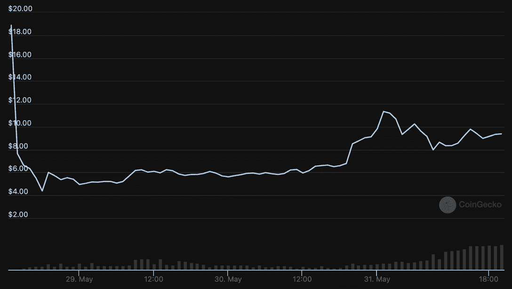
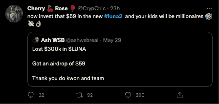
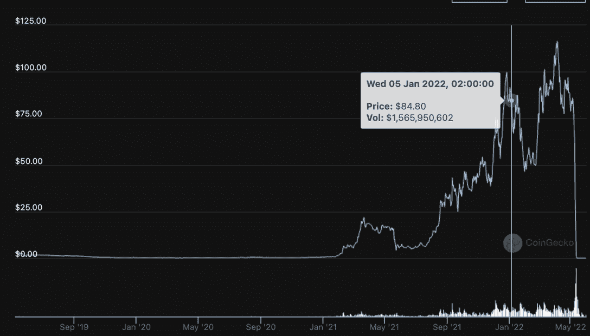

# 跆拳道会在监狱里结束吗？

> 原文：<https://web.archive.org/web/https://dappradar.com/blog/terra-luna-do-kwon-interpol>

## 重启十亿美元的 Terra LUNA 项目

Terra 崩盘后，这位备受争议的首席执行官恢复了这个项目，创建了新的连锁餐厅 Terra Classic (LUNC)。现在，国际刑警组织已经发布了全球跆拳道红色通缉令。 **这对行业意味着什么？让我们来看看 Terra 的传奇。**

Terra 2.0 的到来只能发生在加密空间。还有什么地方能让一家公司在两周内损失超过 400 亿美元，简单地叉开他们的区块链，然后重新启动整个运营，让大家喜忧参半呢？

更有趣的是，尽管最近有韩国要求逮捕权的消息，但在撰写本文时，Terra Luna Classic 的股价已经上涨了 35%。

在 Terra 的崩溃导致数十万投资者损失约 400 亿美元后，韩国当局指控 Kwon 犯有金融欺诈罪。

[Explore Tokens](https://web.archive.org/web/20221127190714/https://dappradar.com/hub/tokens/ethereum/all/1)

## 泰拉怎么了？

Terra 的 LUNA 和 UST 令牌的失败在整个行业引发了恐慌。首先，它加剧了 BTC 价格的下跌，同时也打破了其他稳定货币的钉住汇率制度。此外，[Terra 的垮台](https://web.archive.org/web/20221127190714/https://dappradar.com/blog/terra-validators-pause-network-as-luna-drops-to-zero/)重申了旁观者和投资者对稳定货币资产类别生存能力的担忧。

[Check USDC price](https://web.archive.org/web/20221127190714/https://dappradar.com/hub/token/eth/USDC?from=0xa0b86991c6218b36c1d19d4a2e9eb0ce3606eb48)

DeFi 锁定的总价值从 5 月 1 日的 2240 亿美元下降到撰写时的 545.8 亿美元。许多交易商也已经将 crypto 从 DeFi 协议转移到 USDC 和 USDT 等稳定的国家，并计划用 fiat 赎回 crypto。

[Check USDT price](https://web.archive.org/web/20221127190714/https://dappradar.com/hub/token/eth/USDT?from=0xdac17f958d2ee523a2206206994597c13d831ec7)

此外，它还引发了多米诺骨牌效应，消灭了三箭资本(Three Arrows Capital)等知名加密对冲基金，严重影响了整个行业。

## LUNC 及其首次亮相

新的 LUNA token 于 5 月 28 日首次亮相，售价 18.87 美元，总供应量为十亿。短短六个小时内，股价下跌超过 76%，至 4.39 美元。这种情况的一个主要原因可能是未上市的 LUNA airdrop 接收器集体出售，试图收回一些损失的资金。尘埃落定后，价格攀升，从 4.39 美元的低点几乎翻了一番，三天后达到 9.50 美元左右。

有些人本可以在 2021 年 8 月之前[投资 LUNA，当时价值低于 18 美元，通过提前出售实现盈亏平衡。在爱情和战争中，一切都是公平的。](https://web.archive.org/web/20221127190714/https://www.coingecko.com/en/coins/terra-luna-classic)

LUNA Classic，现在被称为 LUNC，很好地度过了熊市，甚至在其他项目陷入困境时获得了收益。直到事情开始与 UST 分崩离析，Terra 看起来有望保持[在早期成功](/web/20221127190714/https://dappradar.com/blog/2021-dapp-industry-report/)的基础上继续发展。

这就是这里的区别。当然，新的 Terra 2.0 没有 [UST 稳定币](/web/20221127190714/https://dappradar.com/blog/these-are-the-best-stablecoins-you-can-trust/)或任何用于下注的大规模曲线池。

## Terra 2.0 获得支持

新的 LUNA token 在火币、酷币、币安和北海巨妖等主要交易所上市，这表明了更广泛的行业对重启的支持。

## Terra 之后密码产业的未来展望

监管者正在注意如何防止另一场 Terra 崩溃。美国立法者提议禁止类似 UST 的算法稳定积分，这可能会威胁到其他分散的美元替代品，如 MakerDAO 的戴。

[Check DAI price](https://web.archive.org/web/20221127190714/https://dappradar.com/hub/token/eth/DAI?from=0x6b175474e89094c44da98b954eedeac495271d0f)

在世界范围内，[监管者正在拿出他们的锤子](https://web.archive.org/web/20221127190714/https://dappradar.com/blog/guide-to-all-crypto-regulations-worldwide/)，并利用 Terra 崩溃作为为什么加密会威胁全球经济的典型例子。

不幸的是，像这样的案例可能会树立一个不好的先例，很多时候，监管者无法理解技术和更广泛的影响，从而阻碍了创新。

## 随身携带您的 Web3 之旅

使用 DappRadar 移动应用程序，再也不会错过 Web3。查看最受欢迎的 dapps 的性能，并关注您投资组合中的 NFT。您在 DappRadar 上的帐户会与我们的移动应用程序同步，这样您很快就可以选择实时接收提醒。

[Download the DappRadar app now](https://web.archive.org/web/20221127190714/https://dappradar.app.link/blog)[<picture></picture>](https://web.archive.org/web/20221127190714/https://play.google.com/store/apps/details?id=com.portfolio.dappradar) NewsletterUnsubscribe at any time. [T&Cs](https://web.archive.org/web/20221127190714/https://dappradar.com/terms) and [Privacy Policy](https://web.archive.org/web/20221127190714/https://dappradar.com/privacy-policy)

***以上不构成投资建议。此处给出的信息仅供参考。请行使尽职调查，做你的研究。作者持有多种加密货币的头寸，包括 BTC、瑞士法郎和雷达。***