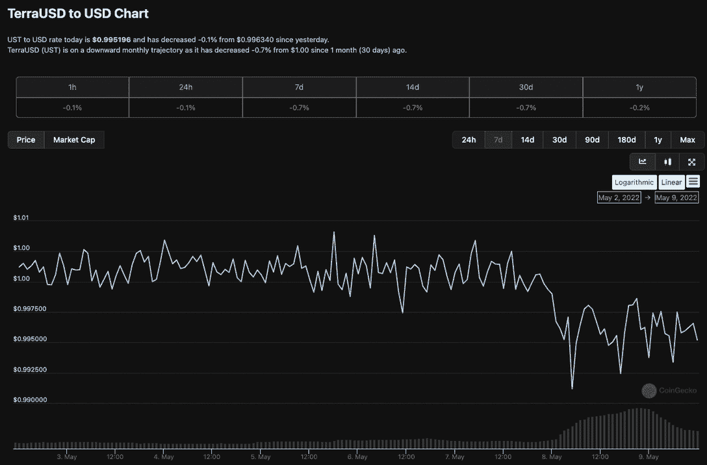
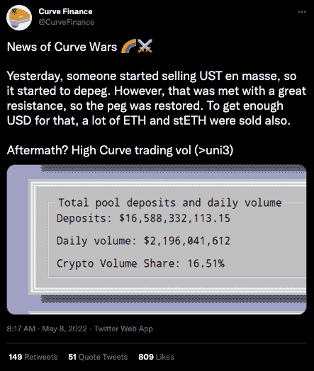
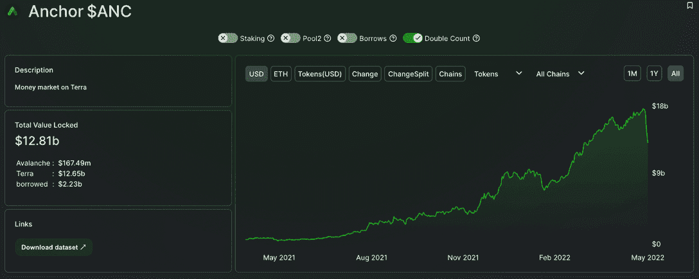
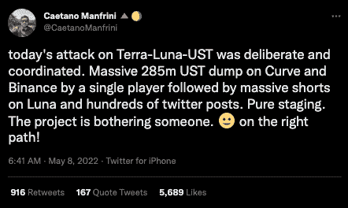
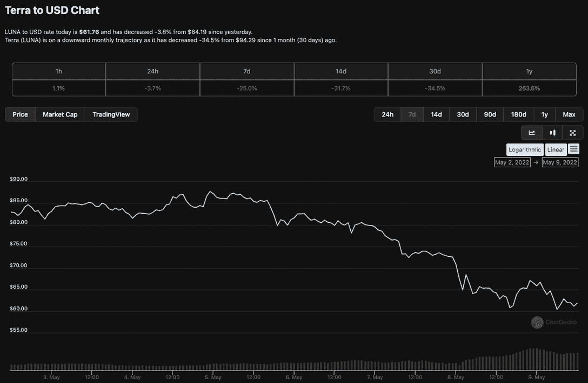
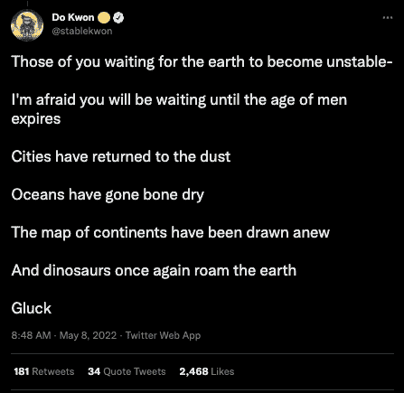
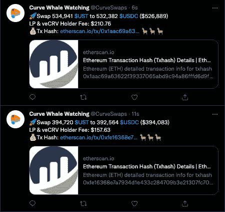

# 由于鲸鱼抛售 2 . 85 亿美元，泰拉美元(UST)失去了与美元挂钩的地位

> 原文：<https://web.archive.org/web/https://dappradar.com/blog/terra-usd-loses-its-dollar-peg-as-whale-dumps-285-million>

## UST 失去了盯住美元的政策，汇率跌至 1 美元兑 0.98 元人民币

本周末，泰拉的本国货币泰拉美元(UST)失去了与美元的挂钩。在一条鲸鱼将价值约 2.85 亿美元的 UST 倾倒在 Curve 和币安后，股价跌至 0.98 美元。虽然动荡保持在最低水平，但 UST 的盯住美元汇率一度恶化至 0.8%，导致 LUNA 在 5 月 7 日至 5 月 8 日期间损失了约 20%的价值，达到 61 美元，为三个月来的最低水平。

## 摘要

*   Whale 卖出了约 2.85 亿美元的 UST
*   UST 供应量的增加导致露娜在 24 小时内损失了 20%的价值
*   UST 低至 0.98 美元
*   关于故意退出坠毁露娜的猜测

美国东部时间 5 月 7 日周六晚上 9 点左右，UST 开始失去盯住美元的汇率政策。与此同时，自 5 月 5 日周四以来，BTC 和 ETH 的股价一直在下跌。美联储主席杰罗姆·鲍威尔(Jerome Powell)在 5 月 4 日的 FOMC 新闻发布会上宣布加息 0.5%，此后恐惧席卷了加密领域。

下跌势头持续到周末，并持续到今天。一些分析师预测，BTC 在本周末将达到 30，000 美元，因为 BTC 和 ETH 现在都比 2021 年 11 月的高点低了近 50%，市场看起来将进入一个极度恐惧的时期。

伴随着这种消极，Terra 的消息在 5 月 8 日开始浮出水面，因为他们遇到了第一次重大的考验。一名鲸鱼持有者在曲线和币安出售了价值约 2.85 亿美元的 UST。尽管波动很小，但 UST 的盯住美元汇率一度恶化至 0.8%。5 月 7 日至 8 日，LUNA 股价下跌约 20%，至 61 美元，为三个月来的最低水平。

## 曲线战争

5 月 8 日，来自官方 [Curve](https://web.archive.org/web/20221007170052/https://dappradar.com/multichain/defi/curve) Twitter 的一条推文证实，有人开始大量出售 UST。进一步的研究表明，许多资金来源于[锚协议](https://web.archive.org/web/20221007170052/https://dappradar.com/hub/token/eth/ANC/ETH?from=0x0f3adc247e91c3c50bc08721355a41037e89bc20)，这是一个基于 Terra 区块链的流行的储蓄、借贷和借款平台。它为储户提供了被动收入的机会，并为借款人提供了获得抵押支持的稳定货币贷款的便利。

[主播](https://web.archive.org/web/20221007170052/https://dappradar.com/hub/token/eth/ANC/ETH?from=0x0f3adc247e91c3c50bc08721355a41037e89bc20)自 2021 年 4 月推出以来，他已经在 TVL 排行榜上快速上升，积累了超过 170 亿美元，占 Terra DeFi 协议锁定的 TVL 总额的一半以上。Anchor 方便交易者在[曲线池](https://web.archive.org/web/20221007170052/https://dappradar.com/multichain/defi/curve)中存取资金。然而，资金的撤出意味着 TVL 的锚现在已经下降到 128 亿美元。

Crypto Twitter 很早就发现了脱钩。一些旁观者很快推测这可能是经过深思熟虑和协调的，抛售同时发生在 T2 曲线金融和币安。这里值得注意的是，这只是推测，除了一条鲸鱼大量出售 UST 之外，没有确凿的证据。

## UST 和露娜有什么联系？

Terra 协议的市场模块总是允许用户用 1 美元的 LUNA 换 1 UST，反之亦然，激励用户维持 LUNA 的价格。同样的原则适用于所有稳定的货币面值。根据 Terra 的弹性货币政策，LUNA 和其他资产一样，是维持 UST 盯住美元政策的抵押品。因此，当 UST 的价值高于 1.00 美元时，Terra 协议激励用户燃烧露娜和薄荷 UST。相反，当 UST 的价格低于 1.00 美元时，该协议奖励用户燃烧 UST 和铸造露娜。

因此，在 UST 供应减少期间，露娜的估值应该会下降。同样，当 UST 的供应量增加时，LUNA 的估值也会增加。倾销如此大量的 UST 对 LUNA 的价格产生了负面影响。然而，我们看到强烈的买入压力，因为 LUNA 现在似乎已经找到了略低于 58 美元的支撑，这将符合 20 周移动平均线。然而，考虑到熊市情绪，我们可以预计在不久的将来会有更多的下跌。

在这种情况下出现了另一个机会。在 Terra 系统中，交易者可以用 1 UST 兑换 1 露娜。当 UST 跌破 1 美元时，套利者下跌，用折价的 UST 交易卢纳，以获取利润。这一机制有助于维持 UST 与美元的挂钩，因为每次交易者买入 UST 并用其交换卢娜，Terra 协议就将该 UST 从流通中移除。UST 的购买压力有助于维持其联系汇率。

## 这一切意味着什么？

首先，它可能与马可道有关，马可道是戴稳定币的幕后组织。几周前，Terra 的首席执行官瞄准了他们，开设了一个新的曲线池，从 DAI 池中吸走流动性。此外，Terra 的成功不言自明。他们目前有两枚硬币排在市值前 10 名，这似乎让一些人感到恼火。撤回如此大量的 UST，投资者肯定知道这会削弱露娜？也可能不是。

更重要的是，尽管在市场承压时，1 美元兑 1 元人民币汇率出现 1%的波动并不罕见。在 UST 的情况下，它已经在 1 美元以下超过 48 小时。

一些分析师表示，这凸显了 UST 稳定币对更广泛的加密货币市场的不利影响。支持 UST 的组织卢纳基金会卫队在 BTC 拥有 35 亿美元，如果需要支持 UST，可以出售。有趣的是，93%的储量在 BTC，3.5%在卢纳，3.5%在阿瓦克斯。

[Curve 是以太坊](https://web.archive.org/web/20221007170052/https://dappradar.com/multichain/defi/curve)上稳定币流动性的主要协议，因其深厚的流动性而被视为 DeFi 中最重要的乐高积木之一。流动性通常有助于交易者在价格影响最小的情况下互换 UST 和 USDC 等稳定货币。因此，由于[曲线](https://web.archive.org/web/20221007170052/https://dappradar.com/multichain/defi/curve)对 [DeFi](https://web.archive.org/web/20221007170052/https://decrypt.co/resources/defi-decentralized-finance-explained-guide-learn) 如此重要，其池中任何不规则的迹象都会引起警报。问问 Terra Do Kwon 的 CEO 是怎么想的；正如他在 5 月 8 日的推特上所展示的，他表现得很冷静。

此外，[曲线池](https://web.archive.org/web/20221007170052/https://dappradar.com/multichain/defi/curve)的结合曲线被设计成能够在价格变动太大之前承受一些不平衡。从流动性池的角度来看，如果该池从未恢复到接近 50/50 的平衡，就可能出现问题。虽然 Curve 的资金池可以吸收这种失衡，但投资者的恐慌似乎导致了对 UST、[的大量抛售，主要是为了购买其他稳定的债券，如 USDC](https://web.archive.org/web/20221007170052/https://twitter.com/CurveSwaps?ref_src=twsrc%5Etfw%7Ctwcamp%5Etweetembed%7Ctwterm%5E1523063668807995392%7Ctwgr%5E%7Ctwcon%5Es2_&ref_url=https%3A%2F%2Fdecrypt.co%2F99704%2Fterras-luna-declines-10-amid-ust-depegging-concern) 。如果这种情况持续下去，Terra 会发现自己面临一个更大的问题。

***以上不构成投资建议。此处给出的信息仅供参考。请行使尽职调查，做你的研究。作者持有多种加密货币的头寸，包括 BTC、瑞士法郎和雷达。***

 NewsletterUnsubscribe at any time. [T&Cs](https://web.archive.org/web/20221007170052/https://dappradar.com/terms) and [Privacy Policy](https://web.archive.org/web/20221007170052/https://dappradar.com/privacy-policy)