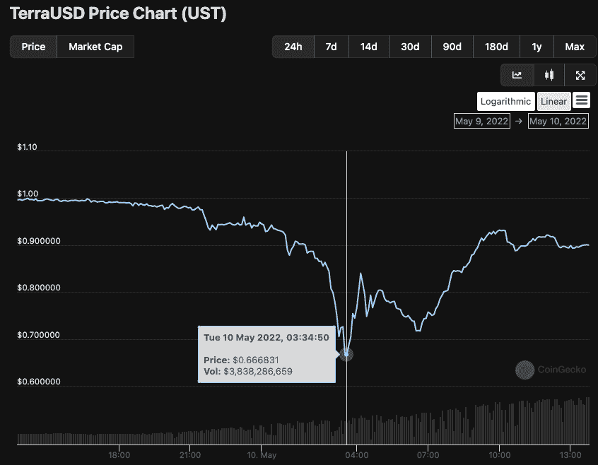
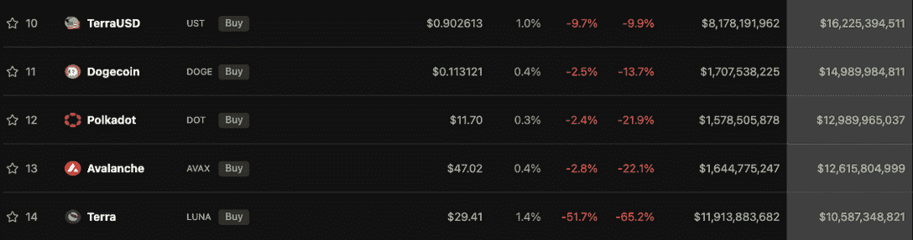
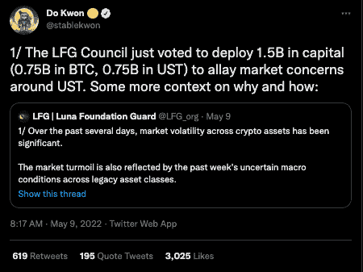
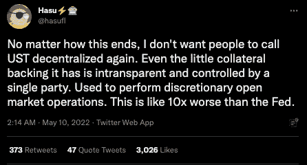

# 随着与美元挂钩的汇率进一步下滑，泰拉 UST 稳定币触及 0.67 美元的低点

> 原文：<https://web.archive.org/web/https://dappradar.com/blog/terra-ust-stablecoin-hits-0-67-low-as-dollar-peg-slips-further>

## 大规模抛售导致 TerraUSD 及其支持货币 LUNA 崩溃

**昨天** [**我们报道了**](https://web.archive.org/web/20221127145638/https://dappradar.com/blog/terra-usd-loses-its-dollar-peg-as-whale-dumps-285-million) **泰拉 UST 稳定币失去了与美元的挂钩，并在 5 月 9 日(星期一)跌至 0.97 美元的低点。LUNA 的抛售压力增加，在过去几天里损失了 60%以上，导致 UST 跌至 0.66 美元，使 Terra 的美元挂钩机制受到严重质疑。**

Terra 的 UST 稳定币是市值第四大的稳定币，似乎处于一个下降的螺旋中，似乎无法抵消 T1 的影响。5 月 10 日周二早盘，人民币汇率跌至 0.66 美元，距离 1.00 美元的挂钩汇率仅差 0.34 美元，这让人民币盯住美元的机制受到严重质疑。现在已经回落到 0.90 美元左右，但这还远远不够理想。

与此同时，Terra 区块链的本地令牌 LUNA 也一直在自由落体，在过去的六天里从 85 美元跌至 29 美元。随着 LUNA 价格的下跌，LUNA 的市值也在下降，这支撑了 UST 的大部分价值。真正的问题是，UST 的市值已经超过 LUNA 约 60 亿美元。如果 LUNA 的市值低于 UST，可以想象 Terra 没有足够的资金来支持稳定币的价值并维持其挂钩。

在撰写本文时，UST 的价格为 0.90 美元，市值为 162 亿美元，而 LUNA 一直处于自由落体状态，暴跌至 29.41 美元。这导致了杠杆头寸的大规模平仓，使其市值降至 123 亿美元。

## BTC·泰拉买的那些东西呢？

Luna Foundation Guard (LFG)负责确保 UST 维持其与美元的挂钩，该机构一直在进行损失控制，以阻止任何进一步的损失，并使稳定的硬币回到正确的 1 美元挂钩。正在使用的一种方法依赖于该基金会购买的逾 16 万 BTC，以及上周五(5 月 6 日)购买的近 3.8 万 BTC。

由于 LUNA 和 UST 挂钩价格变得不稳定，LFG 在 5 月 9 日周一部署了价值 15 亿美元的 BTC，以增加生态系统的流动性。LFG 向贸易公司提供贷款，以保护 UST 盯住美元的政策。然而，时机不可能变得更糟，因为在这一切发生的同时，BTC 股市下跌了 25%。BTC 可以为钉住美元的稳定货币提供支持的想法正被推到极限。此外，LFG 对其 UST 稳定币的持续调整吸引了去中心化最大化主义者不必要的关注，他们现在拒绝认为 Terra 是去中心化的。

其他人很快指出了 stablecoins 的差异和机制，强调了用户的错误而不是任何不当行为。最终，UST 的前路已经分叉。一种方式导致更多的采用和稳定性，而另一种方式导致 UST 与美元脱钩，从而在整个行业引发多米诺骨牌效应，这可能是灾难性的。

随着故事的展开，我们将继续追踪报道。

 NewsletterUnsubscribe at any time. [T&Cs](https://web.archive.org/web/20221127145638/https://dappradar.com/terms) and [Privacy Policy](https://web.archive.org/web/20221127145638/https://dappradar.com/privacy-policy)