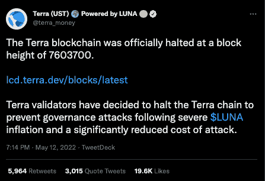
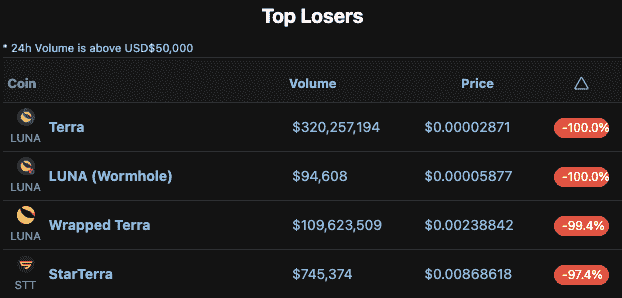
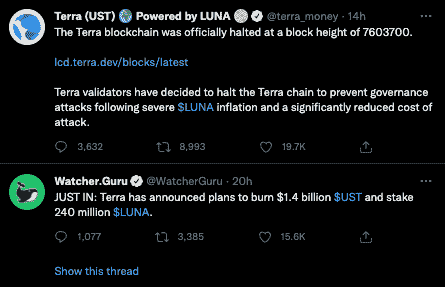
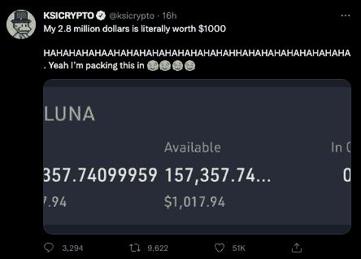
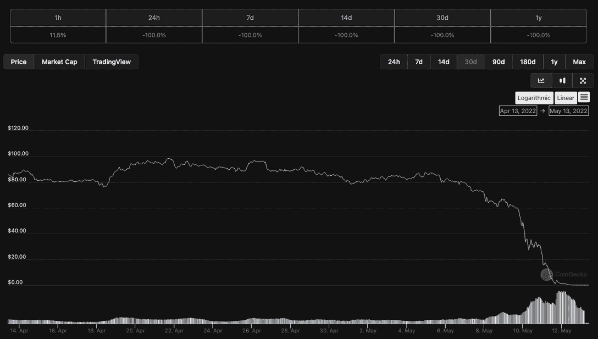
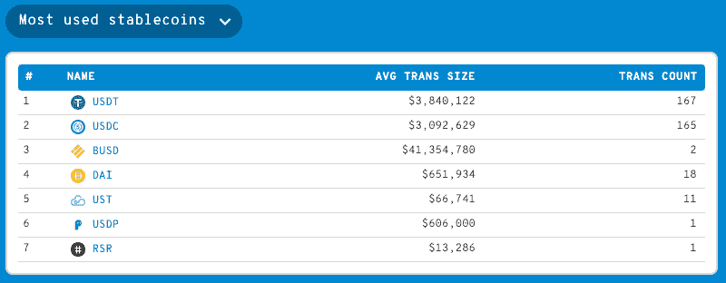
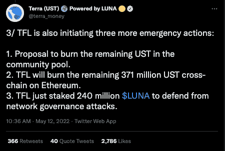

# 当 LUNA 降至零时，Terra 验证器暂停网络

> 原文：<https://web.archive.org/web/https://dappradar.com/blog/terra-validators-pause-network-as-luna-drops-to-zero>

## 揭开加密史上最大的故事

本周早些时候，在大规模抛售导致泰拉的稳定货币 UST 失去与美元挂钩后，该组织的本土货币 LUNA token 也大幅下跌。由于 LUNA 在过去 24 小时内损失了 100%的价值，UST 跌至 0.14 美元，Terra network validators 现已暂停区块链。他们希望应用一个补丁来重启操作并避免潜在的攻击。

Terra 变得更容易受到攻击，因为 LUNA 是网络的统辖标志。由于其难以置信的低价格，不良行为者可能通过以折扣价获得大量 LUNA 令牌并使用它们来影响治理投票，从而控制网络。

## Terra 盖过熊市

BTC 和瑞士联邦理工学院在一周内损失约 20%的价值并不常见，但另一个故事占据了头条。然而，这正是本周发生的事情，因为所有的目光都集中在 Terra 身上。该网络今年早些时候成为头条新闻，以闪电般的速度爬上 TVL 排行榜。Terra 采用加密货币策略来支持其稳定的 UST 货币，这一策略现在受到严重质疑。Terra 停止了其区块链的运营，以降低治理攻击的风险。

在大约 2 小时后的另一条推文中，Terra 开发商宣布区块链继续区块生产，同时他们禁用了网络上的标桩。《月神》和《UST》的创造者 Terraform Labs 也介入并公布了一系列措施，以在《UST》和《月神》以及 Terra 生态系统中的大多数代币崩溃后拯救 Terra 生态系统。

简而言之，Terraform Labs 表示，它将烧毁社区池中任何剩余的 UST，烧毁以太坊上的任何 UST，然后押注价值 2.4 亿美元的 LUNA，以避免可能的治理攻击。用人类的语言来说，他们计划让卢纳的恶性通货膨胀吸收 UST 的不良债务。然而，Twitter 上的一名观众很快指出，随着 LUNA 的价格因恶性通货膨胀而下降，Terra 网络的安全性将会降低，这使得区块链推出这样的行动计划不安全。

## LUNA 损失超过 400 亿美元

很多人会受到这个结果的负面影响，因为 Terra 在以闪电般的速度爬上 TVL 排名后，最近一直在大肆宣传。在外界看来，Terra 似乎正走在通往成功的单行道上。加密货币领域的变化有多快。

LUNA in writing 的价值为 0.00002871 美元，这是一次巨大的下跌，在不到一周的时间里，它的价值从 5 月 1 日周日开始的 80 美元左右下跌。

## 那、、、戴呢？

人们担心其他主要的稳定国家，即 USDT 和 USDC 也会受到影响。本周，两者都偏离了各自盯住美元的政策。USDC 触及 1.05 美元的高点，而 USDT 在 1.00 美元上下波动。MakerDao 的 stablecoin DAI 也受到了影响，其最高价为 1.02 美元，最低价为 0.98 美元。此外，BNB 连锁店的 BUSD 稳定币出现波动，在 5 月 11 日上升到 1.05 美元。重要的是，现在一切都稳定了。

此外，波动被认为是由套利交易引起的，交易员利用两个或更多市场上相同资产之间的微小价格差异进行套利交易。在危机中，我们似乎可以 100%依赖的一件事是密码交易员发现机会的能力。

## 那么泰拉& UST 公司怎么办？

可以肯定地说，我们正处于 crypto 历史上最大的失败的深渊。UST 是第三大与美元脱钩的稳定货币，截至发稿时汇率为 0.14 美元。LUNA 的价值已经完全崩溃，从历史高点下跌了 100%，价值超过 410 亿美元。毫无疑问，这是历史上最重大的财富毁灭事件之一。

Terraform 实验室概述的三项措施包括在社区池中焚烧剩余的 UST，押注 2.4 亿美元 LUNA 以保护该项目免受治理攻击，以及焚烧以太坊上仍然存在的任何 UST。

Terraform Labs 提议在该项目的社区基金中投入约 10 亿 UST，该基金用于资助在区块链土地上建造的不同项目。任何社区成员都可以创建一个治理提案来使用社区池中的令牌。UST 目前的流通供应量为 112 亿欧元，燃烧这个池中的代币将减少约 10%的供应量。第二项措施是试图将 3 . 71 亿 UST 从以太坊转移到 Terra 并烧掉。这将使 UST 供应量再减少 3%。前两项紧急措施将使 UST 的流通供应量减少 11%多一点。

第三个提议建议增加 2 . 4 亿个 LUNA 令牌来保护网络免受治理攻击。如前所述，LUNA 是 Terra 的治理令牌，这意味着它可以用于对生态系统内的提案进行投票。由于第 1164 号提案，卢纳的发行量在过去一周增加到 65 亿，这实质上增加了每块可以铸造的卢纳数量。然而，这些措施能否挽救 UST 的联系汇率制或 LUNA 的价格，还有待观察。

那些想知道这种崩溃在过去七天里是如何发生的人可以阅读我们对最初的[脱钩](/web/20221129074110/https://dappradar.com/blog/terra-usd-loses-its-dollar-peg-as-whale-dumps-285-million/)的报道，它是如何发生的，以及随着价格在过去七天里像铅气球一样下跌的[进一步的问题。一旦我们看到基金会的建议的效果，我们将继续监测这个故事，并提供一个完整的事后分析。](/web/20221129074110/https://dappradar.com/blog/terra-ust-stablecoin-hits-0-67-low-as-dollar-peg-slips-further/)

 NewsletterUnsubscribe at any time. [T&Cs](https://web.archive.org/web/20221129074110/https://dappradar.com/terms) and [Privacy Policy](https://web.archive.org/web/20221129074110/https://dappradar.com/privacy-policy)

***以上不构成投资建议。此处给出的信息仅供参考。请行使尽职调查，做你的研究。作者持有多种加密货币的头寸，包括 BTC、瑞士法郎和雷达。***