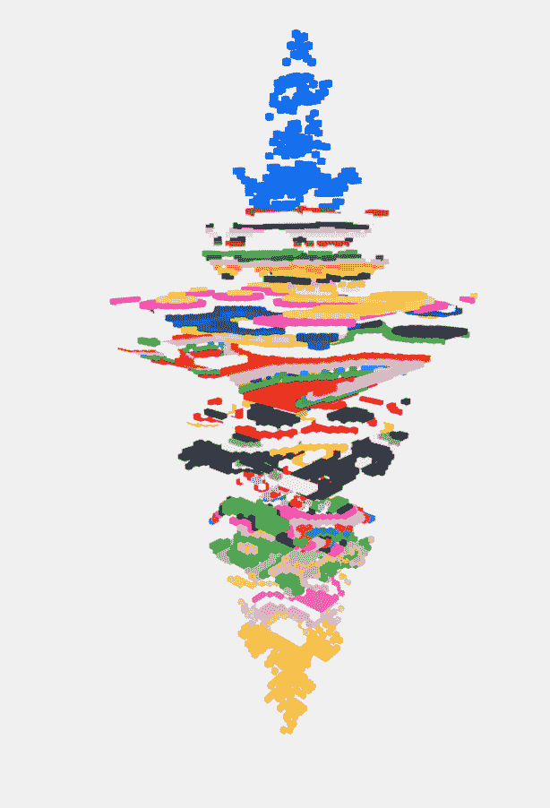
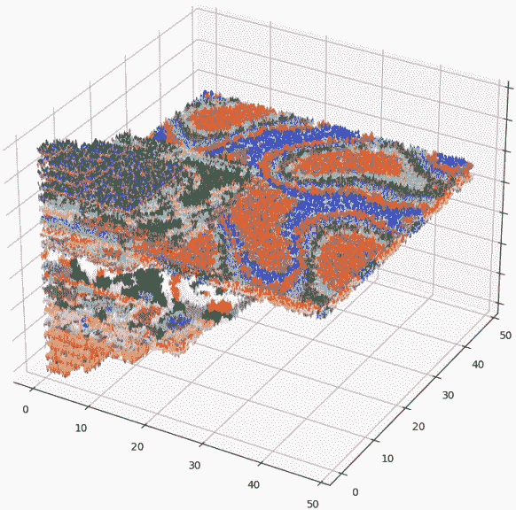
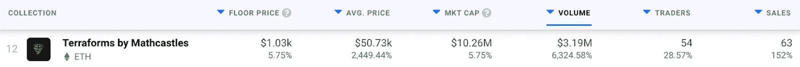

# Terraforms 土地艺术进入顶级 NFT 收藏排行榜

> 原文：<https://web.archive.org/web/https://dappradar.com/blog/terraforms-land-art-enters-top-nft-collections-charts>

## 在过去的七天里，在线土地艺术收藏产生了 319 万美元的交易量

Mathcastles 的 Terraforms 是一个基于以太坊的 NFT 系列，它引入了土地艺术的概念。就表现而言，该系列在过去一周表现出色，过去七天的交易量超过 319 万美元。

Terraforms 引入了一个创新的概念，将链上的土地作为一个生成性的 NFT 艺术品。Terraforms 虚拟世界是一个 20 层的 3D 城堡，由 11.104 个独特的地块 NFTs 创建。有趣的是，这些地块中的每一个都带有 NFT 背后的代码的现场链艺术描绘。这给虚拟土地的概念增加了一个相当有趣的视觉元素。

每个 NFT 的属性和特征是不同的，但是，它们都代表相同大小的地块。有趣的是，level 属性表示城堡中地块的 3D 位置。Mathcastles 的开发者分享了这张图片，作为城堡外观的指南。此外，{x，y}坐标属性表示地块在 2D 空间中的位置。

[Source](https://web.archive.org/web/20221208071159/https://docs.google.com/presentation/d/1v0ccwju6isFD8lIRKFyiPLxbVJhPCSmLLjxF3TBZG4I/edit#slide=id.g109bfa92b01_19_20)

NFTs 的所有其他属性对应于与每个独特地块相关的艺术的不同特征。例如，zone 属性表示每个 NFT 的调色板，而 chroma 属性表示艺术作品的动画速度。

所有这些属性的结合创造了一个充满活力的三维虚拟空间和一个相当有趣的 NFT 艺术收藏。考虑到这一点，Terraforms 收集活动最近一直在蓬勃发展。

Plot of all Terraform levels with colors ([Source](https://web.archive.org/web/20221208071159/https://docs.google.com/presentation/d/1v0ccwju6isFD8lIRKFyiPLxbVJhPCSmLLjxF3TBZG4I/edit#slide=id.g109bfa92b01_19_41))

## 地形风暴 NFT 收藏排行榜

Terraforms 于 12 月 17 日下跌，然而，该系列在过去一周的估值和交易量都有显著增长。NFT 平台的平均价格上涨了 2500%,达到 50.000 美元。此外，该项目产生了 319 万美元的交易量。

价格的大幅上涨将 Terraforms 推上了 NFT 收藏排行榜的首位。令人印象深刻的是，这些土地艺术 NFT 设法超越了 NFT 空间的热门项目，如[涂鸦](https://web.archive.org/web/20221208071159/https://dappradar.com/blog/celebrities-ape-into-doodles-floor-passes-9-eth/)和[后起之秀 LinksDAO](https://web.archive.org/web/20221208071159/https://dappradar.com/blog/linksdao-creates-the-ultimate-country-club-experience) 。

值得注意的一件有趣的事情是，Terraforms 的创建者 Mathcastles 在推广该项目或与社区互动方面并不积极。造币厂发生的官方网站在撰写本文时完全是空的，项目 Discord 中的所有信息都是由社区成员收集的。

尽管缺乏开发者的参与，Terraforms 社区已经有超过 5000 名 Discord 成员。这也可以从 Terraforms 不断上涨的销售价格和快速增长的交易量中看出。

随着虚拟 3D 城堡在 NFT 社区中获得牵引力，DappRadar 将继续监测 Terraforms 集合。如果你也想密切关注这个项目，请查看 [DappRadar PRO](https://web.archive.org/web/20221208071159/https://dappradar.com/token/pro) 。PRO 让你接触到最新的 NFT 销售数据，以及独家[不和谐](https://web.archive.org/web/20221208071159/https://discord.gg/4ybbssrHkm)频道和讨论。

 NewsletterUnsubscribe at any time. [T&Cs](https://web.archive.org/web/20221208071159/https://dappradar.com/terms) and [Privacy Policy](https://web.archive.org/web/20221208071159/https://dappradar.com/privacy-policy)