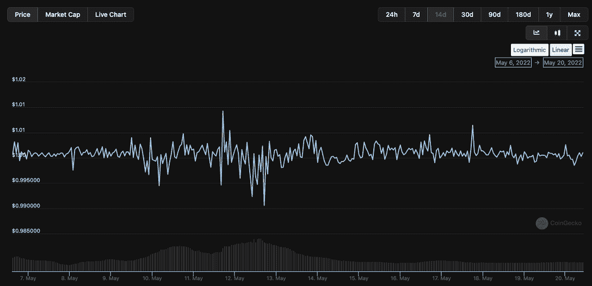

# 用 820 亿美元储备的证据束缚住 USDT 沉默的憎恨者

> 原文：<https://web.archive.org/web/https://dappradar.com/blog/tether-usdt-silence-haters-with-proof-of-82-billion-reserves>

## 审计报告最终显示了什么支持 USDT

USDT 透露了它是如何支持目前流通的约 740 亿美元 USDT 的。Tether 发布了其合并储备 [**报告**](https://web.archive.org/web/20220904152902/https://assets.ctfassets.net/vyse88cgwfbl/1np5dpcwuHrWJ4AgUgI3Vn/07fcaeb1cd7ce6df71ce8f5abb09ddb7/Tether_Assurance_Consolidated_Reserves_Report_2022-03-31__1_.pdf) **，确认该集团的合并资产约为 824 亿美元，超过了其合并负债。**

对于 USDT 的持有者来说，这是一个好消息，因为围绕着一个领先的和最常用的稳定硬币是如何支持自己的，一直存在一些神秘。这主要是由于与美国证券交易委员会(SEC)的摩擦，更糟糕的是，正如 Tether Holdings 在 2021 年底显示的那样，储备中流动性差得多的商业票据的比例很高。

此外，随着 [UST 撞车](/web/20220904152902/https://dappradar.com/blog/terra-usd-loses-its-dollar-peg-as-whale-dumps-285-million/)和[烧伤](/web/20220904152902/https://dappradar.com/blog/terra-ust-stablecoin-hits-0-67-low-as-dollar-peg-slips-further/)这些[持续两周](/web/20220904152902/https://dappradar.com/blog/terra-validators-pause-network-as-luna-drops-to-zero/)，所有的目光都集中在稳定的积分上来证明自己。虽然其他主要稳定资本的支持者、、戴的金融机制和资产是众所周知的，但泰瑟仍然不为人知。

## USDT 大揭秘

最后，在 5 月 19 日，Tether 发布了一份由独立会计师 May 凯曼进行的长达 10 页的合并储备报告。截至 2022 年 3 月 31 日，集团资产如下:

*   合并总资产至少为 82，424，821，101 美元
*   本集团的合并资产超过其合并负债
*   本集团针对已发行数字代币的储备超过赎回代币所需的金额
*   合并资产显示平均到期日显著下降，重点是短期资产

如前所述，估计 USDT 的流通供应量为 740 亿美元，这里我们看到至少 820 亿美元的储备。简而言之，如果 USDT 因为任何原因破产，泰瑟有足够的储备来应对。

虽然过去一周对于一些采用率和流动性低得多的 stablecoin 项目来说是动荡的，但它是 Tether 的实力和弹性的一个极好的例子。在过去的两周内，有几次人民币汇率仅偏离其盯住美元的汇率 0.01 美元，而以 BUSD 为例，[一度偏离 0.05 美元](/web/20220904152902/https://dappradar.com/blog/these-are-the-best-stablecoins-you-can-trust/)。重要的是，这是 BUSD 的暂时情况，在写作回到 1 美元。

## 每个人都挂在嘴边的 1 美元问题

在过去的几周里，与美元挂钩的最大的稳定货币之一泰拉美元的迅速贬值，给这个价值约为 1620 亿美元的行业戴上了一面巨大的放大镜。在 UST 崩溃的余波中，其他稳定债券开始失去各自的挂钩，呼吁对市场进行更广泛的审查，并更深入地了解什么是稳定债券以及它们如何运作。

现在，Tether 终于透露了它是如何支持其 USDT 稳定硬币的，主要硬币看起来比以往任何时候都更加坚固。要了解更多关于主要稳定收入者和他们如何养活自己的信息，我们建议你[看看这篇文章，](https://web.archive.org/web/20220904152902/https://dappradar.com/blog/these-are-the-best-stablecoins-you-can-trust)如果你想更深入，你可以在这里了解更多[。](https://web.archive.org/web/20220904152902/https://dappradar.com/blog/search/?q=stablecoin)

 NewsletterUnsubscribe at any time. [T&Cs](https://web.archive.org/web/20220904152902/https://dappradar.com/terms) and [Privacy Policy](https://web.archive.org/web/20220904152902/https://dappradar.com/privacy-policy)

***以上不构成投资建议。此处给出的信息仅供参考。请行使尽职调查，做你的研究。作者持有多种加密货币的头寸，包括 BTC、瑞士法郎和雷达。***