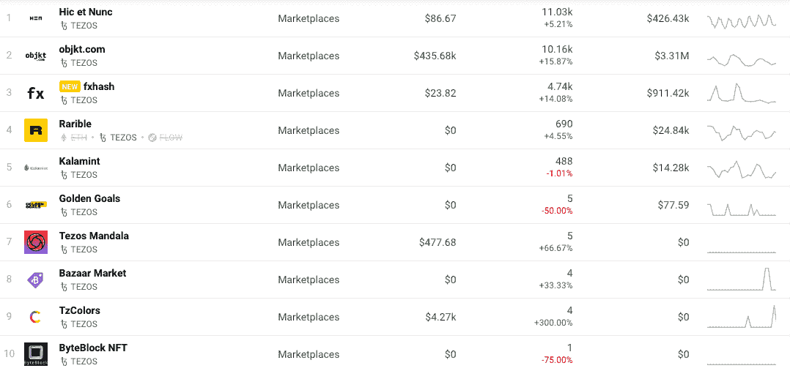
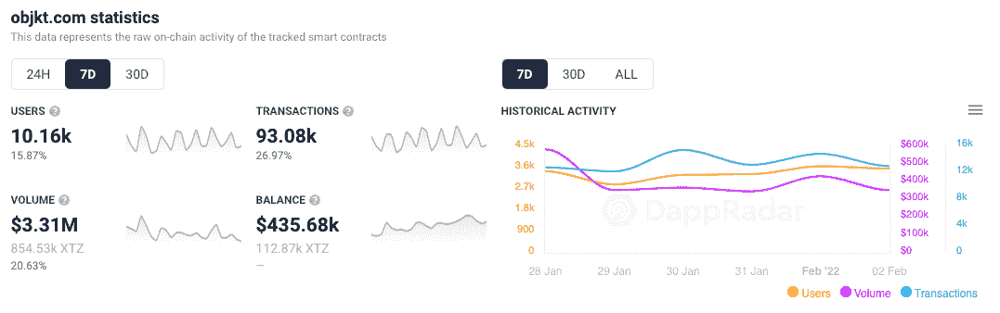
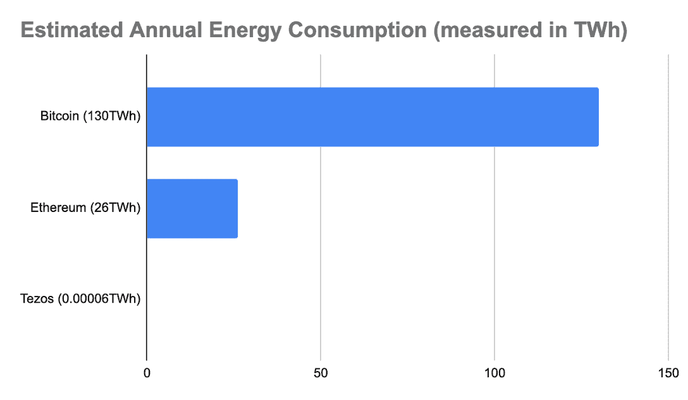
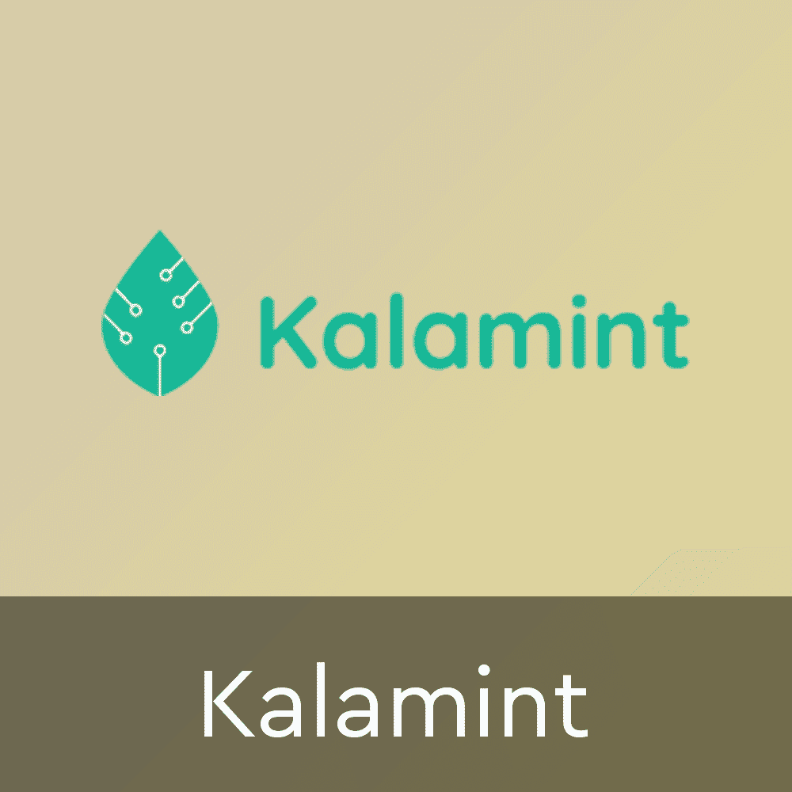
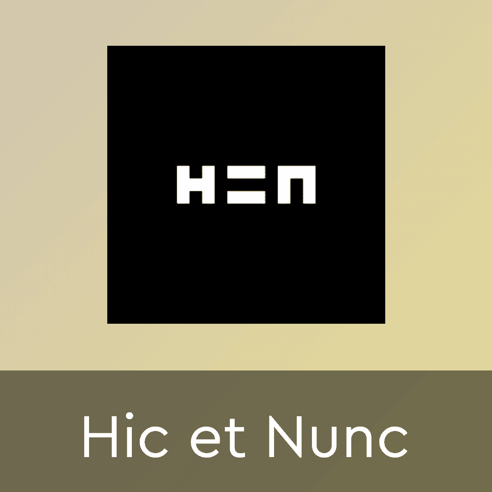
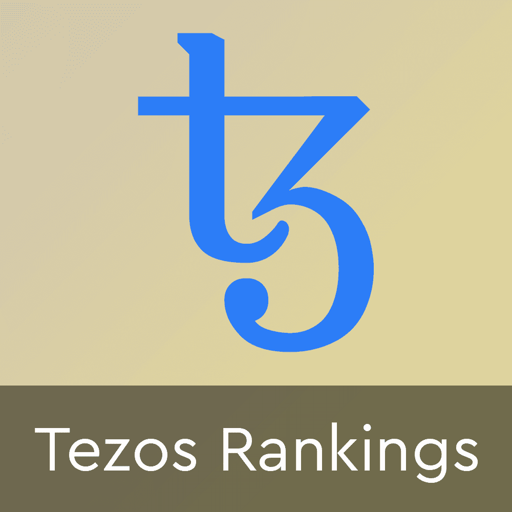

# Tezos“干净”的 NFT 开始受到关注

> 原文：<https://web.archive.org/web/https://dappradar.com/blog/tezos-clean-nfts-start-getting-noticed>

## Tezos 是一种环保的收集 NFT 的方法吗？

随着 2022 年对非功能性数字技术和实际数字所有权的大肆宣传继续冒泡，以太坊的高额燃气费和与非功能性数字技术的创建有关的环境因素也在继续。因为收藏家们开始将目光投向别处，NFT 市场上类似 Tezos 这样的网络，凭借其 [**【清洁】**](https://web.archive.org/web/20230129135001/https://medium.com/tqtezos/clean-nfts-on-tezos-58566b2fdba1) **【区块链】的承诺，正开始找到更多的牵引力。**

DappRadar 追踪的 Tezos 上的十个 NFT 市场显示，这十个市场中有七个的活跃用户显著增加。与此同时，这三个主要市场的活跃钱包连接量和交易量都出现了大幅增长。[外汇散列市场](https://web.archive.org/web/20230129135001/https://dappradar.com/tezos/marketplaces/fxhash)出现了最显著的增长。活跃钱包本周增长超过 14%，接近 5000 个。

与此同时，objkt.com NFT 市场吸引了最多的交易量。该平台吸引了超过 10，000 个活跃钱包，完成了超过 93，000 笔交易，产生了 330 万美元的交易量。

值得注意的是，虽然 Tezos 看到活跃的钱包和交易激增，但当站在以太坊上领先的 [NFT 市场旁边时，这些数字显得微不足道。根据](https://web.archive.org/web/20230129135001/https://dappradar.com/nft/protocol/ethereum)[最新的一月份 Dapp 行业报告](https://web.archive.org/web/20230129135001/https://dappradar.com/blog/dapp-industry-report-january-2022)，仅一月份 NFTs 的交易量就超过了 160 亿美元。然而，这其中很大一部分来自于 LooksRare 上的人为交易。

[https://web.archive.org/web/20230129135001if_/https://www.youtube.com/embed/Ut8RbzDmeCk?feature=oembed](https://web.archive.org/web/20230129135001if_/https://www.youtube.com/embed/Ut8RbzDmeCk?feature=oembed)

尽管如此，仅在一月份，OpenSea 的交易量就超过了 45 亿美元。此外，在 BTC 和 ETH 自 2021 年创下新高以来损失近 50%的背景下，我们正在观察一个乐观的，甚至像[牛市一样的 NFT 市场场景](https://web.archive.org/web/20230129135001/https://dappradar.com/blog/why-are-nfts-sidestepping-the-crypto-crash)。

## 清洁 NFTs？

最近对 NFTs 的生态足迹的兴趣已经放大了 Tezos 相对于其他网络的相关和实质性优势:[显著降低的能耗和更小的环境足迹。](https://web.archive.org/web/20230129135001/https://medium.com/tqtezos/proof-of-work-vs-proof-of-stake-the-ecological-footprint-c58029faee44)

Tezos 网络是一个风险证明区块链，比比特币或以太坊等工作证明网络消耗的能量少 200 多万倍。Tezos 的低碳足迹意味着开发者和用户可以在不损害可持续性的情况下优先考虑创新。Tezos 的自我修正特性使该网络能够在区块链生态系统的不断发展趋势中保持领先，如气体优化和 NFTs。

Source: [Tezos](https://web.archive.org/web/20230129135001/https://medium.com/tqtezos/proof-of-work-vs-proof-of-stake-the-ecological-footprint-c58029faee44)

支持 Tezos 上[NFT 类别增长的进一步证据来自 Coin Metrics。他们观察到，在过去的一年里，Tezos 生态系统中的智能合约活动显著增加，因为它成为了吸引 NFT 活动的磁石。根据他们的网络状况](https://web.archive.org/web/20230129135001/https://dappradar.com/rankings/protocol/tezos)[报告](https://web.archive.org/web/20230129135001/https://coinmetrics.substack.com/p/state-of-the-network-issue-140)，Tezos 上涉及智能合约的交易数量在过去 12 个月里激增。他们的日访问量从 2021 年 1 月的每天不到 1 万人次增加到了 5 万人次。

该报告显示，Tezos 的增长是由 NFT 平台推动的，如生成艺术平台 FX Hash。此外，游戏巨头[育碧也宣布在 2021 年 12 月为游戏 NFTs 提供 Tezos 支持](/web/20230129135001/https://dappradar.com/blog/ubisoft-bringing-ghost-recon-game-nfts-to-tezos/)。

[<picture></picture>](https://web.archive.org/web/20230129135001/https://dappradar.com/tezos/marketplaces/kalamint)[<picture></picture>](https://web.archive.org/web/20230129135001/https://dappradar.com/tezos/marketplaces/hic-et-nunc)[<picture></picture>](https://web.archive.org/web/20230129135001/https://dappradar.com/rankings/protocol/tezos/category/marketplaces)

***以上不构成投资建议。此处给出的信息仅供参考。请行使尽职调查，做你的研究。作者持有 ETH、BTC、AGIX、HEX、LINK、GRT、CRO、OMI、不可变 X、GALA、AVASTR、GMEE、CUBE、RADAR、FLOW、FTM、BNB、SPS、WRLD、ATOM 和 ADA。***