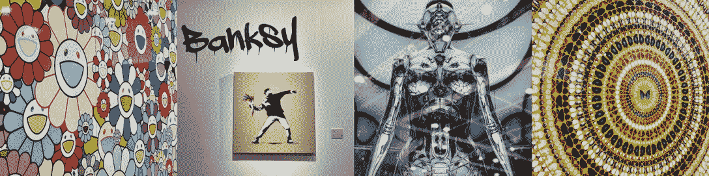
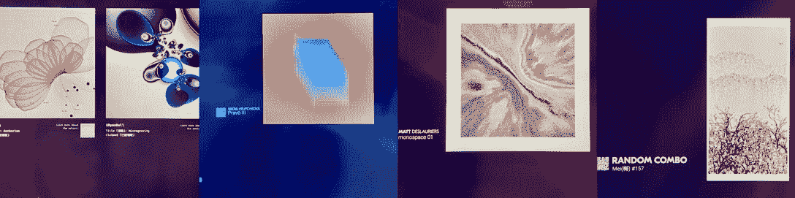
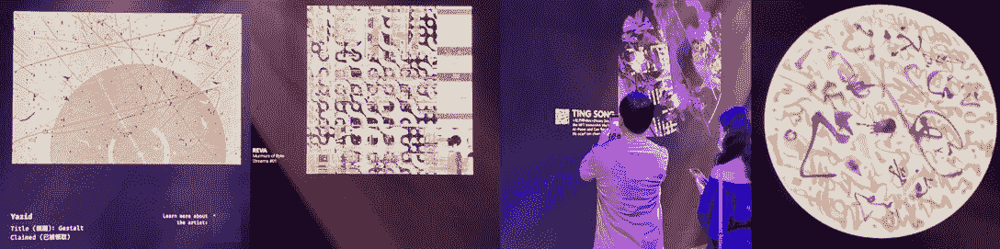
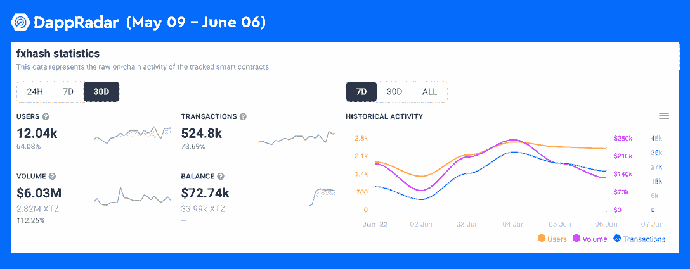

# Tezos 数字 NFT 艺术让公众沉浸在巴塞尔艺术展的 NFTs 中

> 原文：<https://web.archive.org/web/https://dappradar.com/blog/tezos-digital-nft-art-immerses-the-public-on-nfts-at-art-basel>

## Tezos 在香港巴塞尔艺术展上作为展览合作伙伴展示了一场策划的 NFT 艺术体验

[**泰佐斯**](https://web.archive.org/web/20220630224833/https://dappradar.com/rankings/protocol/tezos) **再次向世界证明了其对数字艺术的承诺。用** [**NFT 探索者**](https://web.archive.org/web/20220630224833/https://dappradar.com/hub/nft-explorer?search=tezos) **找到 Tezos 最好的 NFT 收藏和度量。5 月 27 日至 29 日，生态友好的区块链在巴塞尔艺术博览会上举办了一场名为“NFTs +不断发展的艺术世界”的精彩展览。**

**总结**

*   [泰佐斯·NFT](https://web.archive.org/web/20220630224833/https://dappradar.com/nft/protocol/tezos)展是为期三天的艺术博览会的最大亮点之一。
*   互动展览空间展示了与 Tezos 的艺术平台 [fxhash 合作的各种先锋生成艺术家。](https://web.archive.org/web/20220630224833/https://dappradar.com/tezos/marketplaces/fxhash)
*   fxhash 在过去 30 天取得了出色的数据性能，用户增长了 64%，交易量增长了 73 %，交易量增长了 112%。
*   最近，Tezos 推出了一个新的元宇宙项目， [tz1land](https://web.archive.org/web/20220630224833/https://www.tz1and.com/) ，旨在为数字创作者赋权。

每年，巴塞尔艺术博览会都会向公众展示新兴艺术家的新想法、当代杰作和颠覆性的概念，这些概念融合了最新的趋势。所以今年，除了班克斯、[村上隆、](https://web.archive.org/web/20220630224833/https://dappradar.com/blog/new-dapps-report-murakami-flowers-murakami-goes-back-to-his-roots)、达明安·赫斯特和 Hajime Sorayama 等来自旧艺术界的知名大师，最耀眼的亮点应该是由 Tezos 区块链策划的数字艺术体验。

## 泰佐斯·NFT 艺术家共同呈现一场轰动的视觉之旅

生态友好型区块链 Tezos 在今年的亚洲巴塞尔艺术展上首次亮相，为其展览设立了一个名为[“NFTs+不断发展的艺术世界”的独立展厅。](https://web.archive.org/web/20220630224833/https://artbasel.com/hong-kong)

互动展览空间展示了与 Tezos 领先的艺术平台 fxhash 合作的各种先锋生成艺术家。此外，它邀请参观者以先到先得的方式免费制作一件独特的 NFT 艺术作品。令人印象深刻的是，这种免费造币的想法受到了公众的高度欢迎。那些崛起的 NFT 艺术家的 NFT 作品在艺术博览会结束前很快就被抢购一空。这些作品包括 Yazid Azahari、Ryan Bell 和 Aleksandra Jovani 的作品。

备受期待的艺术博览会似乎给了 Tezos 上最受欢迎的 NFT 平台一个很好的推动。令人印象深刻的是，fxhash 吸引了超过 12，000 个独特的钱包与 dapp 互动，增加了 64%。此外，30 天交易和交易量分别达到 524，809 美元和 603 万美元，在撰写本报告时分别增长了 73 %和 112%。考虑到市场情绪已受到持续熊市的沉重打击，这样的成绩令人瞩目。

## 泰佐斯的奉献:数字艺术的下一个前沿？

越来越多的艺术家选择在 Tezos 上制作和销售，因为它的环保性质、较低的汽油费和高度参与的 NFT 社区。由于这些功能，Tezos NFT 的创作者可以专注于内容创作和培养他们的社区。因此，从早期开始，特佐斯的 NFT 生态系统就变得异常活跃。例如， [Hic et Nunc](https://web.archive.org/web/20220630224833/https://dappradar.com/tezos/marketplaces/hic-et-nunc) (HEN)，现已停产的 NFT 平台，进行了一系列激动人心的探索，涉及各种艺术形式。

HEN 让人们看到了 NFT 艺术的多样性。令人印象深刻的是，HEN 的艺术家极大地拓宽了 NFT 格式的范围。他们所取得的成果是将可缩放的矢量图形、3D 建模、程序和其他形式融入到 NFT 创作中，而不仅仅局限于以图片、视频和音频为素材。因此，这些艺术形式丰富了人们在数字世界的体验。

虽然 HEN 已经成为历史，但联合 Tezos 的艺术家们还是不遗余力地将 HEN 的遗产传承下去。Tezos 上出现了一个新的社区市场，名为 [Teia](https://web.archive.org/web/20220630224833/https://dappradar.com/tezos/marketplaces/teia) 。Teia 是一个全球性的，由艺术家运营的空间，NFT 的创作者可以在这里探索和实验 NFT 艺术的范例。在过去的 30 天里，该平台吸引了超过 8000 名独立用户和 82，450 笔交易，为 Tezos 的艺术氛围做出了贡献。

有趣的是，我们还在 Tezos 上另一个流行的 NFT 平台 [Objekt](https://web.archive.org/web/20220630224833/https://dappradar.com/tezos/marketplaces/objkt-com) 中发现了 HEN。在 Objekt，HEN 被改造成了一个 NFT 美术馆，为收藏者提供多达 652，000 件 NFT 收藏品。

Tezos 上也有虚拟世界，比如元宇宙项目 [tz1land](https://web.archive.org/web/20220630224833/https://www.tz1and.com/) 。tz1and 是一个虚拟世界，用户可以在虚拟土地上建造、部署、交易、装饰和展示 3D 艺术。此外，Tezos 上这个新兴的元宇宙支持艺术家社区和独立创意。现在，tz1land 已经成为许多密码艺术家的合作游乐场。

纵观 Tezos 的生态系统，我们可以想象一个充满数字资产的未来，NFT 将释放其无限的潜力，带来各种数字收藏品。为了让用户能够轻松地交易和管理这些数字资产， [DappRadar 为用户提供了一个易于使用的 NFT 交易工具。](https://web.archive.org/web/20220630224833/https://www.youtube.com/watch?v=4lnlrnpQbxE)用户可以在 [DappRadar Portfolio](https://web.archive.org/web/20220630224833/https://dappradar.com/hub/wallet/eth/0x6639c089adfba8bb9968da643c6be208a70d6daa) 页面一键交易各种 NFT，更重要的是，无需额外费用。

## 面向公众的普通教育——“它叫 NFT！”

现在回到巴塞尔艺术展，走在巴塞尔艺术展拥挤的会场里，我听到身后有人喊:“我要去看那些 ntf！”声音来自一位中年父亲。他十几岁的女儿纠正道:“它叫 NFT，爸爸。”

熊市可能让人无法忍受，但它并不总是坏事，因为加密行业并不全是为了钱。这很好，人们终于可以冷静下来，重新发现这样一个事实:在区块链世界，人们可以享受许多不花一分钱的东西，例如，创新的 NFT 艺术和免费的 NFTs 教育。

DappRadar 将继续关注 Tezos、其生态系统以及整个 NFT 油田的最新发展。在 [Twitter](https://web.archive.org/web/20220630224833/https://twitter.com/dappradar) 、 [Discord](https://web.archive.org/web/20220630224833/https://discord.gg/4ybbssrHkm) 和 [Youtube](https://web.archive.org/web/20220630224833/https://www.youtube.com/c/DappRadar) 上关注我们，跟上区块链世界的动态。