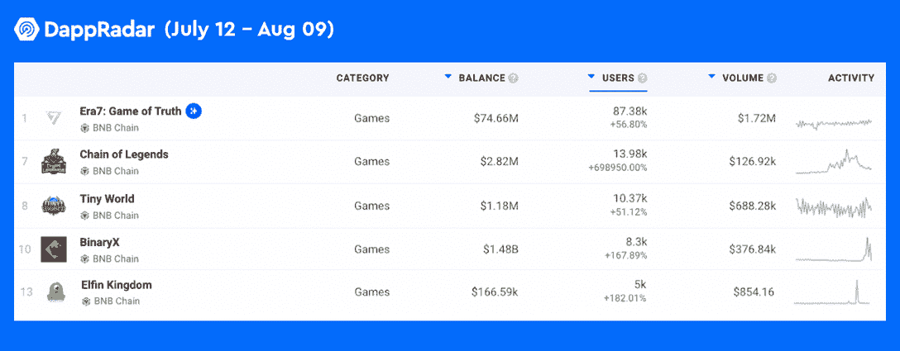
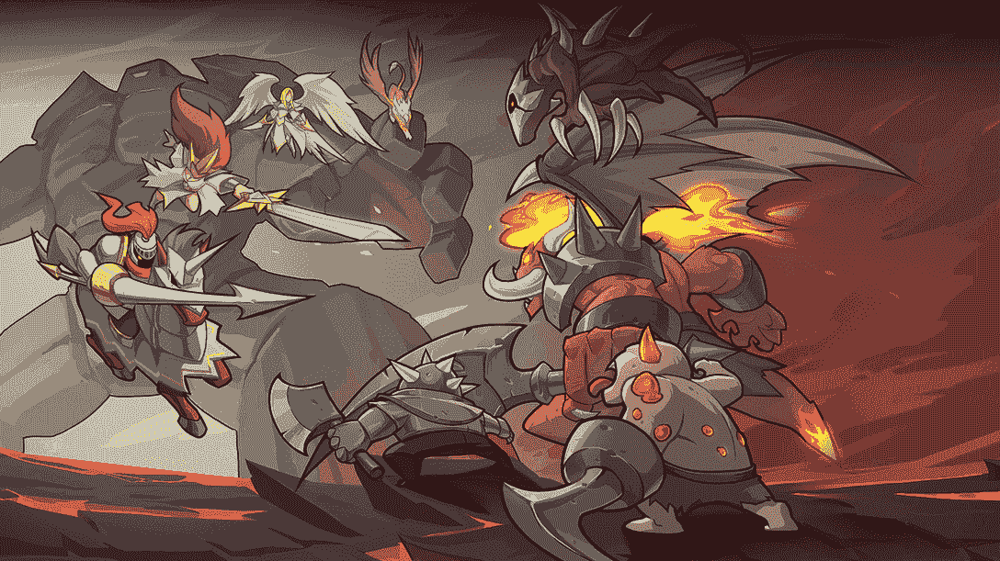
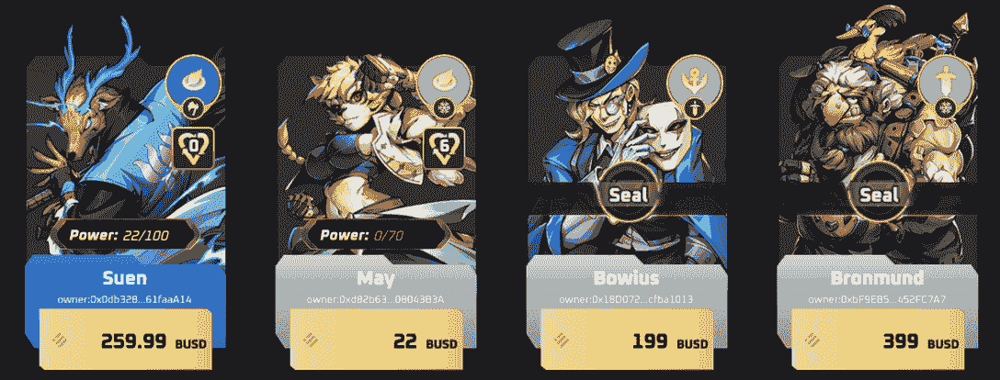

# 你可能错过的 BNB 连锁最热门的 5 个游戏

> 原文：<https://web.archive.org/web/https://dappradar.com/blog/the-5-hottest-games-on-bnb-chain-you-probably-missed>

## 《传奇链》、《BinaryX》和《精灵王国》是 BNB 链上发展最快的游戏。

以下是 BNB 连锁店过去 30 天里最热门的五款游戏。从像 Era7 这样的元宇宙风格的交易卡游戏到像 Elfin Kingdom 这样的 NFT 农场游戏，BNB 链从不缺少令人难以置信的玩赚游戏。

**概要:**

*   [BNB 连锁酒店](https://web.archive.org/web/20221004011433/https://dappradar.com/rankings/protocol/binance-smart-chain)拥有业内最广泛的[区块链博彩生态系统](https://web.archive.org/web/20221004011433/https://dappradar.com/rankings/category/games)。
*   最近，BNB 连锁店的游戏领域进一步繁荣，多个游戏的用户数量激增。
*   获得牵引力的游戏包括 [Era7](https://web.archive.org/web/20221004011433/https://dappradar.com/binance-smart-chain/games/era7-game-of-truth) 、[传奇链](https://web.archive.org/web/20221004011433/https://dappradar.com/binance-smart-chain/games/chain-of-legends)、 [BinaryX](https://web.archive.org/web/20221004011433/https://dappradar.com/binance-smart-chain/games/binaryx) 、[微小世界](https://web.archive.org/web/20221004011433/https://dappradar.com/binance-smart-chain/games/tiny-world)和[小精灵王国](https://web.archive.org/web/20221004011433/https://dappradar.com/binance-smart-chain/games/elfin-kingdom)。
*   DappRadar 拥有一系列工具和报告，让用户能够全面了解 BNB 链的最新状态。

BNB 连锁店现在是第二大 DeFi 连锁店，截止发稿时，TVL 为 70 亿美元。同样值得注意的是，BNB 链，连同[多边形](/web/20221004011433/https://dappradar.com/blog/what-is-polygon-a-simple-explanation/)、[蜡](/web/20221004011433/https://dappradar.com/blog/what-is-wax/)和 Flow，占据了区块链游戏生态系统的重要部分。

[根据 DappRadar BGA 报告 Q2 2022 版](https://web.archive.org/web/20221004011433/https://dappradar.com/blog/dappradar-x-bga-games-report-6)，币安智能链上的每日唯一钱包(UAW)平均数量较上月增长 2%，超过 85000 个。

要全面了解 BNB 链家最近的表现，你可以浏览 [DappRadar 的 BNB 链家 2022 年 Q2 报告](/web/20221004011433/https://dappradar.com/blog/bnb-chain-report-q2-2022/)。如果你不太了解 BNB 连锁，我们的[BNB 连锁终极指南](/web/20221004011433/https://dappradar.com/blog/what-is-bnb-chain-and-how-does-it-work/)可以帮到你。

今天的文章将引导您在 BNB 连锁店的游戏世界中获得最佳体验。所以，事不宜迟，让我们深入列表吧！

## Era7:元宇宙风格的 TCG

Era7:真实游戏是目前 BNB 连锁上玩得最多的游戏，在过去的 30 天里有超过 87，000 名用户参与。这是一款受炉石和魔法启发的 NFT 交易卡游戏:聚会。

Era7 的卡牌分为战斗卡和召唤主卡。而且这些卡牌代表了游戏中不同的种族，可以组成强大的阵容供玩家战斗。此外，七种力量，多达 1000 张卡片，给 Era7 带来了令人难以置信的游戏深度。

下图显示了在 [Era7 的市场](https://web.archive.org/web/20221004011433/https://dappradar.com/binance-smart-chain/games/era7-game-of-truth)上出售的卡片。他们伟大的设计是这款游戏制作精良的有力证明。

Era7 的游戏赚取机制允许玩家通过战斗、参与社区激励和流动性挖掘来获得生态系统令牌。此外，玩家可以在分散和集中交换上用 Era 交换 USDT 或当地菲亚特。

## 传奇链:一款 NFT 采矿游戏

[https://web.archive.org/web/20221004011433if_/https://www.youtube.com/embed/12doZo4-N3s?feature=oembed](https://web.archive.org/web/20221004011433if_/https://www.youtube.com/embed/12doZo4-N3s?feature=oembed)

《传奇链》是 BNB 链上增长最快的游戏，在过去的 30 天里用户增长了 689950%。该游戏的特点是免费玩，代币挖掘，和实时战略游戏。

要开始玩《传奇链》，用户需要购买一块土地，建造一个矿井，然后他们就可以开始赚取游戏代币。值得一提的是，用户可以获得一个免费的矿和土地来立即开始游戏，但他们的采矿速度和能力要低得多。

玩家可以在交换中直接出售代币，或使用代币来提高他们的游戏进度。例如，玩家可以使用代币来扩大他们的帝国，通过创建一个石头矿和一个铁矿来产生宝贵的资源。或者，他们可以建造兵营和训练军队来探索世界，寻找地下城，杀死怪物和收集战利品。

## 微小世界:一个结合了 NFT 和迪菲的游戏世界

[Tiny World](https://web.archive.org/web/20221004011433/https://dappradar.com/binance-smart-chain/games/tiny-world) 的 30 天用户增长了 51%，超过 10，000 名玩家产生了 135，000 笔交易。《微小世界》背后的团队致力于创造一种结合了 NFT、DeFi 和游戏的独特体验。

《微小世界》背后的团队致力于创造一种结合了 NFT、DeFi 和游戏的独特体验。玩家可以收集超过 100 个小英雄 NFT，将他们送上史诗旅程，并在战斗中战斗。

如前所述，微小的世界结合了 NFT 游戏和 DeFi。此外，它还为用户提供了多种在《微小世界》中赚钱的方式，包括但不限于以下机制。

*   小农场资产收益农业。
*   收集微小的 NFT 并在市场上出售。
*   微小 NFT 产生 farming‌.
*   通过游戏和投票获得利益。
*   玩小游戏赢得排行榜大奖。
*   在小游戏中交易物品来赚取利润。

## BinaryX:在线 GameFi 平台

[https://web.archive.org/web/20221004011433if_/https://www.youtube.com/embed/RRx1TTBTfzU?feature=oembed](https://web.archive.org/web/20221004011433if_/https://www.youtube.com/embed/RRx1TTBTfzU?feature=oembed)

BinaryX 是 BNB 链上的一个加密游戏平台。目前，该平台正在运行一款名为 CyberDragon 的游戏，这是我们由 BinaryX 团队从头开始开发的。该游戏平台见证了 30 天用户数量的激增，有 8，000 个独特的钱包与其智能合约交互，增长率超过 160%。

在游戏中，玩家可以招募和升级他们的英雄，挑战地下城，并掠夺稀有物品。最后的挑战是击败终极老大，网络龙。玩 CyberDragon 的第一步是要有一个币安智能链兼容的钱包，如 MetaMask，并且还要有足够的 BNB 来支付汽油费。

如果你是一个密码新手，不熟悉这些术语，也不用担心。这个 DappRadar 指南可以帮助你[了解更多关于 MetaMask](/web/20221004011433/https://dappradar.com/blog/what-is-metamask/) 的信息，下面的视频将教你如何从钱包里得到一些 BNB 代币。

[https://web.archive.org/web/20221004011433if_/https://www.youtube.com/embed/ZHiHfYvNjJU?feature=oembed](https://web.archive.org/web/20221004011433if_/https://www.youtube.com/embed/ZHiHfYvNjJU?feature=oembed)

## 小精灵王国:产量农业、NFT 和电子竞技的融合

[https://web.archive.org/web/20221004011433if_/https://www.youtube.com/embed/ZlXFdGngijo?feature=oembed](https://web.archive.org/web/20221004011433if_/https://www.youtube.com/embed/ZlXFdGngijo?feature=oembed)

小精灵王国是一款受 MMORPG 神奇宝贝启发的元宇宙游戏，任何人都可以通过游戏和耕作赚取代币。这款游戏目前正在 BNB 连锁店流行，一个月内用户增长了 180%。

在精灵王国中，玩家可以选择角色，并与他们可爱的精灵 NFT 一起开始冒险。除了可爱和毛绒绒，这些小精灵是玩家赢得游戏的重要资产。用户可以捕捉并升级它们或使用它们来参加并赢得精灵王国的世界冠军。

此外，精灵王国拥有一个动态的游戏赚取生态系统，允许玩家以各种方式获得奖励。以下只是一些玩游戏和赢游戏的例子。

*   在 PVP 战斗中竞争。
*   完成日常任务。
*   召唤高级精灵并在市场上出售。
*   卖收成卖土地。
*   用精灵代币做赌注。

## 跟上 BNB 连锁店充满活力的生态系统

令人印象深刻的是，BNB 链家在加密熊市中保持了其玩家基础。显然，BNB 连锁店已经在博彩业建立了稳固的地位。但是，最重要的是，这也证明了区块链游戏的市场需求是刚性的，用户渴望高质量的产品。

BNB 链用户可以利用 [DappRadar BNB 链投资组合跟踪器](https://web.archive.org/web/20221004011433/https://dappradar.com/hub/wallet/bsc)随时随地深入了解他们的加密资产。无论你是一个密码新手，区块链爱好者，还是行业领导者，DappRadar 的这些工具和报告可以帮助你全面了解 BNB 链。

*   DappRadar 的终极指南:什么是 BNB 链，它是如何工作的？
*   [达普拉达的 BNB 连锁报告 Q2 2022](/web/20221004011433/https://dappradar.com/blog/bnb-chain-report-q2-2022/)
*   [BNB 连锁超市排名](https://web.archive.org/web/20221004011433/https://dappradar.com/rankings/protocol/binance-smart-chain)
*   [BNB 令牌](https://web.archive.org/web/20221004011433/https://dappradar.com/hub/token/eth/BNB?from=0xb8c77482e45f1f44de1745f52c74426c631bdd52)
*   [追踪 BNB·迪菲·TVL](https://web.archive.org/web/20221004011433/https://dappradar.com/defi/protocol/binance-smart-chain)
*   [BNB 国家森林公园](https://web.archive.org/web/20221004011433/https://dappradar.com/nft/protocol/binance-smart-chain)

DappRadar 将继续监测和报告 BNB 链及其生态系统的演变。在 [Twitter](https://web.archive.org/web/20221004011433/https://twitter.com/dappradar) 、 [Discord](https://web.archive.org/web/20221004011433/https://discord.gg/4ybbssrHkm) 和 [Youtube](https://web.archive.org/web/20221004011433/https://www.youtube.com/c/DappRadar) 上关注我们，跟上区块链世界的动态。