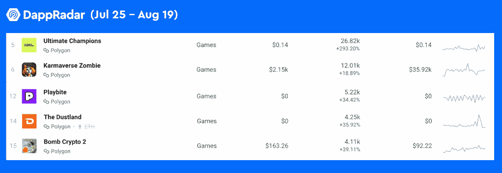
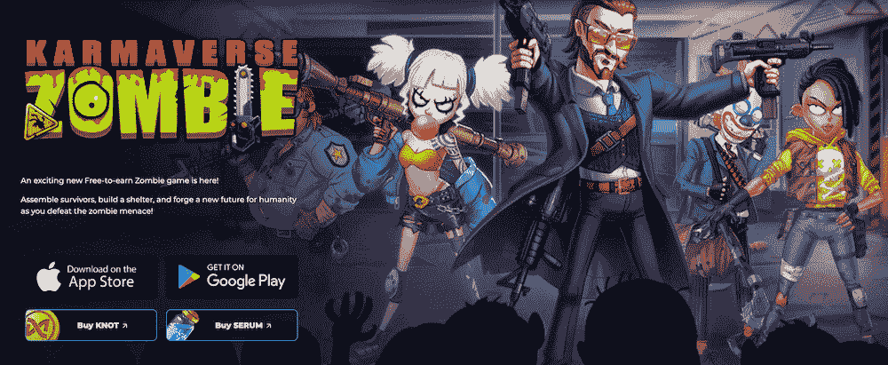
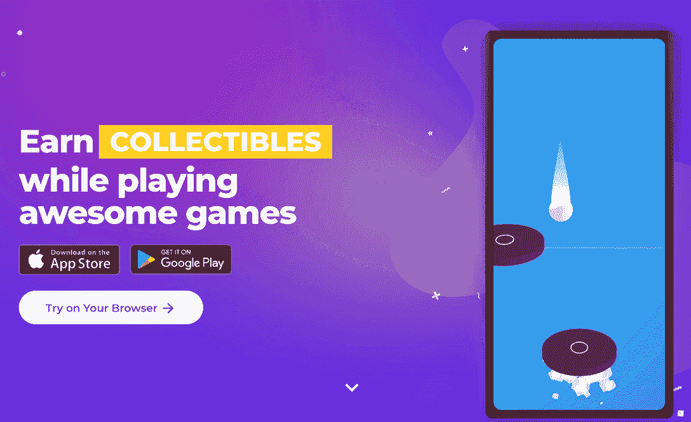

# Polygon 上最受欢迎的 5 款游戏

> 原文：<https://web.archive.org/web/https://dappradar.com/blog/the-5-most-bullish-gaming-dapps-on-polygon>

## 终极冠军、Karmaverse 僵尸、Playbite 是 Polygon 上增长最快的游戏。

以下是过去 30 天多边形链上的五款热门游戏。从像终极冠军这样的梦幻体育游戏到像 Dustland 这样的移动赚钱游戏，Polygon 从来不缺少给用户提供报酬的创意游戏。

**概要:**

*   Polygon 是提供[区块链游戏生态系统](https://web.archive.org/web/20220926001403/https://dappradar.com/rankings/category/games)的最重要参与者之一。
*   多边形网络的游戏空间最近蓬勃发展，多种游戏的用户数量激增。
*   获得关注的游戏包括[终极冠军](https://web.archive.org/web/20220926001403/https://dappradar.com/polygon/games/ultimate-champions)、[卡玛弗斯僵尸](https://web.archive.org/web/20220926001403/https://dappradar.com/polygon/games/karmaverse-zombie)、[play bit](https://web.archive.org/web/20220926001403/https://dappradar.com/polygon/games/playbite)、[尘土之地](https://web.archive.org/web/20220926001403/https://dappradar.com/polygon/games/the-dustland)和[炸弹密码 2](https://web.archive.org/web/20220926001403/https://dappradar.com/polygon/games/bomb-crypto-2) 。
*   DappRadar 有一系列的工具和报告，可以让用户全面了解[多边形](https://web.archive.org/web/20220926001403/https://dappradar.com/rankings/protocol/polygon/category/games)的最新状态。

根据 DappRadar 最新的 BGA 报告，区块链博彩在 7 月份经历了熊市，向区块链生态系统发送了超过 100 万个每日唯一活跃钱包(UAW)。顶级游戏保持着对游戏玩家的吸引力，新的市场参与者正在进入这个领域。

查看 DappRadar 的本周游戏系列，看看哪些游戏 dapps 已经成为用户心目中的最新蓝筹股。这里是最近三期的《每周游戏》和它们的 Dapp 页面。

*   [PlayMining](/web/20220926001403/https://dappradar.com/blog/how-to-play-and-win-playmining/) | [单个 Dapp 页面](https://web.archive.org/web/20220926001403/https://dappradar.com/dep/games/playmining)
*   [向日葵地](/web/20220926001403/https://dappradar.com/blog/how-to-play-and-win-sunflower-land/) | [单曲 Dapp 页面](https://web.archive.org/web/20220926001403/https://dappradar.com/polygon/games/sunflower-land)
*   [Arc8](/web/20220926001403/https://dappradar.com/blog/how-to-play-and-win-arc8-2/) | [单个 Dapp 页面](https://web.archive.org/web/20220926001403/https://dappradar.com/polygon/games/arc8-by-gamee-1)

当我们将目光投向游戏生态系统提供商时，我们发现 [Polygon](https://web.archive.org/web/20220926001403/https://dappradar.com/rankings/protocol/polygon/category/games) 、 [Wax](https://web.archive.org/web/20220926001403/https://dappradar.com/rankings/protocol/wax/category/games) 、 [Flow](https://web.archive.org/web/20220926001403/https://dappradar.com/rankings/protocol/flow/category/games) 和 [BNB Chain](https://web.archive.org/web/20220926001403/https://dappradar.com/rankings/protocol/binance-smart-chain/category/games) 拥有最具活力的区块链游戏生态系统。所以今天，我们就来关注一下 Polygon，看看最近有哪些游戏在它上面起飞了。

## 终极冠军:一款免费的梦幻足球游戏

NFT 空间的 OG 用户一定对 NFT 体育收藏品的超级巨星 dapp——Flow 区块链上的 [NBA TopShot](https://web.archive.org/web/20220926001403/https://dappradar.com/flow/collectibles/nba-topshot) 不陌生。值得注意的是，在足球领域有一颗冉冉升起的新星，[终极冠军](https://web.archive.org/web/20220926001403/https://dappradar.com/polygon/games/ultimate-champions)。

[Source](https://web.archive.org/web/20220926001403/https://beta.ultimate-champions.com/play/leagues/global?gameweek=24)

终极冠军是一款免费的梦幻足球游戏，拥有官方授权的数字收藏卡，以多边形上的[NFTs 的形式出现。](https://web.archive.org/web/20220926001403/https://dappradar.com/nft/protocol/polygon)

在终极冠军赛中，玩家可以利用他们的足球知识每周构建最佳阵容来获得奖励。值得注意的是，这些奖励在终极冠军的开放经济中具有长期价值:卡片(NFT)和代币(MGC 和冠军)。

终极冠军是创新游戏和时尚视觉的完美结合。该项目致力于建立一个迎合主流观众的梦幻体育平台，并通过利用免费游戏机制推动大众采用。结果，这款游戏吸引了超过 26，000 名独立用户，增幅高达 290%。

## Karmaverse 僵尸:一款由 NFT 开发的僵尸启示录游戏

[Source](https://web.archive.org/web/20220926001403/https://www.karmaverse.io/zh/karmaversezombie?utm_source=DappRadar&utm_medium=deeplink&utm_campaign=visit-website)

KARMAVERSE 是一个由区块链技术支持的元宇宙游戏平台。它为用户提供 Karma Games 开发的各种游戏，而 [Karmaverse Zombie](https://web.archive.org/web/20220926001403/https://dappradar.com/polygon/games/karmaverse-zombie) 是第一款登陆 Karmaverse 的 NFT 社交游戏。

在游戏中，玩家可以控制战士，每个战士都由一个独特的 NFT 代表，并创建最强大的战斗俱乐部来抵抗僵尸部落。此外，这些游戏拥有社交元素，因此玩家可以与其他玩家合作或竞争。

就游戏经济而言，Knot 是 Karmaverse 中具有核心价值的主要实用令牌。玩家可以通过参与“玩到赚”(P2E)游戏、下注等方式在 Knot 中获得奖励。

Karmaverse Zombie 见证了过去 30 天 18%的用户增长，产生了超过 143，000 笔交易。

## Playbite:一个让玩家获得真正奖励的街机游戏平台

[Source](https://web.archive.org/web/20220926001403/https://www.playbite.com/?utm_source=DappRadar&utm_medium=deeplink&utm_campaign=visit-website)

Playbite 是一个手机友好的、无广告的游戏平台，为用户提供各种街机游戏并获得真正的奖励。这些奖励包括星巴克礼品卡，Roblox 礼品卡，NFT 收藏品，甚至任天堂 Switch。

玩家在 Playbite 的游戏上花费的每一秒钟都可以为玩家赢得门票。然后用户可以在平台的官方商店花这些票来兑换各种奖励，从电子产品到坐立不安的玩具，礼品卡，或可玩的收藏品。

Playbite 在用户和交易量方面都实现了超过 30%的增长。

## 灰尘之地:一个移动赚取音频健身区块链游戏

[https://web.archive.org/web/20220926001403if_/https://www.youtube.com/embed/rbyfCWLnWK4?start=48&feature=oembed](https://web.archive.org/web/20220926001403if_/https://www.youtube.com/embed/rbyfCWLnWK4?start=48&feature=oembed)

[dust land](https://web.archive.org/web/20220926001403/https://dappradar.com/polygon/games/the-dustland)是 OliveX 健身元宇宙中的热门游戏，奖励现实生活中跑步和骑自行车的玩家。此外，随着故事情节的展开，尘埃地带也在发展。此外，玩家可以边走边听故事。

Dustland 独特的游戏方式允许玩家获得虚拟奖励，包括 NFT 和 DOSE tokens。这些奖励可以用于游戏升级和推进故事情节的进展。

由于其引人入胜的故事情节和促进健康生活方式以造福用户，Dustland 已经成为过去几周 Polygon 上增长最快的游戏之一。在高峰期，它的用户增长率超过了 700%。目前，该游戏保持每月 36%的用户增长。

## 炸弹加密 2:由 P2E 游戏驱动的经典冒险游戏

[https://web.archive.org/web/20220926001403if_/https://www.youtube.com/embed/oCrqBCtFt1U?feature=oembed](https://web.archive.org/web/20220926001403if_/https://www.youtube.com/embed/oCrqBCtFt1U?feature=oembed)

炸弹加密 2 是 Polygon 上的另一款游戏，最近很受欢迎。令人印象深刻的是，炸弹加密 2 记录了 30 天用户增长约 40%，交易量增长约 100%。

冒险 P2E 游戏让玩家管理一群机器人炸弹英雄，寻找炸弹和打怪物。

要开始游戏，玩家需要有一个炸弹英雄 NFT。有三种方法可以收集炸弹英雄:营救英雄，在商店购买，通过市场拍卖获得。一旦玩家的钱包里准备好了一个英雄，他们就可以派这些小战士去体验各种游戏模式，并收获奖励。

## 跟上多边形的动态生态系统

多边形无疑是最主要的加密游戏区块链生态系统之一。DappRadar 提供了强大的工具，让用户全面了解 Polygon 不断扩张的区块链宇宙。

此外，Polygon assets 和 dapps 的用户可以利用[DappRadar Portfolio Tracker](https://web.archive.org/web/20220926001403/https://dappradar.com/hub/wallet/bsc)随时随地了解他们的加密组合。

无论您是密码行业的新手还是经验丰富的 OG，DappRadar 的这些工具和报告都可以帮助您全面了解 BNB 链。

*   [DappRadar 简单指南:什么是多边形？](/web/20220926001403/https://dappradar.com/blog/what-is-polygon-a-simple-explanation/)
*   [多边形 Dapps 排名](https://web.archive.org/web/20220926001403/https://dappradar.com/rankings/protocol/polygon/)
*   [自动令牌](https://web.archive.org/web/20220926001403/https://dappradar.com/hub/token/eth/MATIC?from=0x7d1afa7b718fb893db30a3abc0cfc608aacfebb0)
*   [跟踪多边形定义 TVL](https://web.archive.org/web/20220926001403/https://dappradar.com/defi/protocol/polygon)
*   [多边形 NFTs](https://web.archive.org/web/20220926001403/https://dappradar.com/nft/protocol/polygon)

DappRadar 将继续监测和报告 Polygon 及其生态系统的演变。在 [Twitter](https://web.archive.org/web/20220926001403/https://twitter.com/dappradar) 、 [Discord](https://web.archive.org/web/20220926001403/https://discord.gg/4ybbssrHkm) 和 [Youtube](https://web.archive.org/web/20220926001403/https://www.youtube.com/c/DappRadar) 上关注我们，跟上区块链世界的动态。