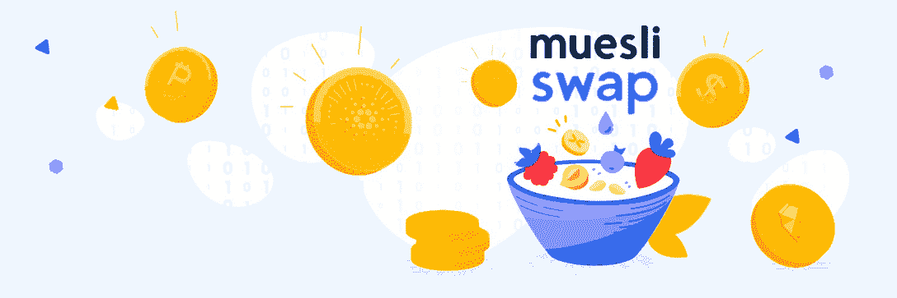
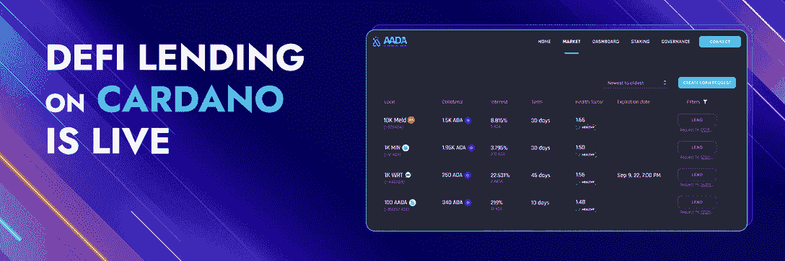

# 卡尔达诺上最好的 DEX 是什么？请参阅顶部定义 Dapps 进行跟踪

> 原文：<https://web.archive.org/web/https://dappradar.com/blog/the-best-dex-on-cardano>

## 发现卡尔达诺的一些最好的分散交易所的潜力

您是否在寻找交易卡达诺资产的最佳方式？区块链是一些伟大的分散交易所(dex)的所在地，适合新手或有经验的密码交易者。但是有哪些顶级的 DeFi dapps 可以使用，为什么卡尔达诺是理想的地方呢？继续阅读，了解更多关于卡尔达诺上最好的 DEX。

## 目录

*   [卡尔达诺上最好的 DEX](https://web.archive.org/web/20230120062736/https://dappradar.com/blog/the-best-dex-on-cardano/#The-best-DEX-on-Cardano)
    *   [Minswap](https://web.archive.org/web/20230120062736/https://dappradar.com/blog/the-best-dex-on-cardano/#Minswap)
    *   [sundaw](https://web.archive.org/web/20230120062736/https://dappradar.com/blog/the-best-dex-on-cardano/#SundaeSwap)
    *   [飞翼骑士](https://web.archive.org/web/20230120062736/https://dappradar.com/blog/the-best-dex-on-cardano/#Wingriders)
    *   [穆尔斯交换](https://web.archive.org/web/20230120062736/https://dappradar.com/blog/the-best-dex-on-cardano/#MuesliSwap)
*   [卡达诺上的 DeFi dapps](https://web.archive.org/web/20230120062736/https://dappradar.com/blog/the-best-dex-on-cardano/#DeFi-dapps-on-Cardano)
    *   [Aada 金融](https://web.archive.org/web/20230120062736/https://dappradar.com/blog/the-best-dex-on-cardano/#Aada-Finance)
*   【DeFi 为什么选择 Cardano？
*   [追踪并了解 Cardano dapps](https://web.archive.org/web/20230120062736/https://dappradar.com/blog/the-best-dex-on-cardano/#Track-and-learn-about-Cardano-dapps)

## 卡尔达诺最好的 DEX

考虑到可扩展性和互操作性，Cardano 已经成为构建分散金融(DeFi)项目(如分散交易所(DEX ))的最佳区块链之一。)

虽然 NFT 市场和游戏在卡尔达诺也很受欢迎，但最近的行业报告指出，DeFi 再次上升。

由于卡尔达诺是该地区最大的存在之一，如果你想更深入地研究金融的未来，你会想了解更多。话不多说，以下是卡尔达诺上最好的分散式交易所:

### 小地图

卡尔达诺最大的 DEX 叫做 [Minswap](https://web.archive.org/web/20230120062736/https://dappradar.com/cardano/defi/minswap) ，在撰写本文时，其 TVL 为 3805 万美元。

[<picture></picture>](https://web.archive.org/web/20230120062736/https://dappradar.com/cardano/defi/minswap)[Visit Minswap](https://web.archive.org/web/20230120062736/https://dappradar.com/cardano/defi/minswap)

其用户友好的界面使得令牌对的无许可交易比它第一次出现时更容易。通过任何人都可以加入的多个流动性池，Minswap 促进了 Cardano 上的互换、流动性提供和产量农业。

***“以最小的成本、最少的时间、最大的便利交换代币。”***

除了 dapp 以社区为中心并提供 30 多种语言外，从多个资金池收取的代币被重新分配给流动性提供者——所有这些都没有私人或风险投资。此外，作为治理策略的一部分，任何拥有 MIN 令牌的人都可以在 DEX 讨论中发表意见。

在过去的 30 天里，dapp 已经注册了超过 13000 名访客——相当于 crypto winter。即便如此，根据 DappRadar 上的数据，这是 Cardano 协议中使用最多的 DeFi 应用程序。

### 周日 wap

SundaeSwap 分散式交易所也致力于在 Cardano 社区实现所有权和利润的民主化。

[<picture></picture>](https://web.archive.org/web/20230120062736/https://dappradar.com/cardano/defi/sundaeswap)[Visit SundaeSwap](https://web.archive.org/web/20230120062736/https://dappradar.com/cardano/defi/sundaeswap)

它是一个自动化做市商(AMM)指数，在一个无许可、分散的卓越系统中拥有多个流动性池。DEX 有自己的名为 SUNDAE 的本机令牌，代表 SundaeSwap DAO 中的投票权。

SundaeSwap 在 Cardano 上的 DeFi dapps 中排名第二，在过去 30 天里有大约 6 千用户。然而，它的 Twitter 账户显示，DEX 有一个强大的社区——在撰写本文时，它的追随者比任何其他 Cardano Defi 项目都多。

### 风行者

Wingriders 是卡尔达诺的另一个 DEX，已经引起了人们的注意——种子轮于今年 3 月结束，但 dapp 已经在我们的排名中排名第三。

[<picture></picture>](https://web.archive.org/web/20230120062736/https://dappradar.com/cardano/defi/wingriders)[Visit Wingriders](https://web.archive.org/web/20230120062736/https://dappradar.com/cardano/defi/wingriders)

这是一款 AMM DEX，在主链上使用了 eUTxO 模型。由于它是卡尔达诺本地的，dapp 也非常快速和安全。

上个月，约有 3000 人使用该指数在其流动性池中进行赌注和收益农业。像上面提到的其他 dapps 一样，Wingriders 也有一个公用事业令牌，WRT，它赋予持有者对项目未来的治理权。

### 牛奶什锦

MuesliSwap 是第一个建立在 Cardano 协议基础上的分散式交换机，它成为使用最广泛的 Cardano DeFi dapps 的顶级产品之一。

[<picture></picture>](https://web.archive.org/web/20230120062736/https://dappradar.com/cardano/defi/muesliswap-1)[Visit MuesliSwap](https://web.archive.org/web/20230120062736/https://dappradar.com/cardano/defi/muesliswap-1)

这是一个领先的 DeFi 生态系统，具有订单交易、流动性池、赌注和 DEX 聚合器，您可以在其中获得被动收入。

他们的公用令牌被称为 MILK，除了对社区提案进行投票外，还授予持有者优先交易权和生态系统中新项目的早期使用权。

如果你对 Cardano 上的分散金融感兴趣，这绝对是一个值得探索的项目。

## 卡尔达诺上的 DeFi dapps

说到 DeFi，还有其他基于 Cardano 协议的 dapps 值得您关注。如果你对 dex 感兴趣，也许你也想知道 Cardano dapps，它可以让你发现其他分散的被动收入提供者。

### Aada 金融

在不可替代令牌(NFT)的支持下， [Aada Finance](https://web.archive.org/web/20230120062736/https://dappradar.com/cardano/defi/aada-finance) 是 Cardano 上的一个去中心化借贷协议。

[<picture></picture>](https://web.archive.org/web/20230120062736/https://dappradar.com/cardano/defi/aada-finance)[Visit Aada Finance](https://web.archive.org/web/20230120062736/https://dappradar.com/cardano/defi/aada-finance)

点对点协议允许你以订单方式借入和借出 Cardano 本地加密货币。

这是一个以社区为中心的协议，你可以轻松地借出资产，给你利息，或者使用 [Cardano NFTs](https://web.archive.org/web/20230120062736/https://dappradar.com/blog/top-nft-marketplaces-for-cardano-compare-choose) 作为抵押提交贷款请求。

该协议的本地令牌 AADA 还允许其持有者参与卡尔达诺最有前途的 DeFi 项目之一的未来决策。

*   **好奇更多？** [在 DappRadar 上查看所有 Cardano DeFi dapps】](https://web.archive.org/web/20230120062736/https://dappradar.com/rankings/protocol/cardano/category/defi)

## DeFi 为什么选择 Cardano？

尽管以太坊区块链上有许多重要和流行的 DeFi 应用程序，但在卡尔达诺上建立索引给它们带来了其他好处。

对于任何使用 Cardano DEX 的人来说，这种体验变得更快、更便宜、更可靠。

ADA 是卡尔达诺生态系统的原生硬币，被许多人视为长期加密货币投资。

此外，卡尔达诺是众所周知的最受欢迎的区块链之一，有一个响亮和支持的社区。

这些和许多其他原因使得 Cardano 成为寻找机会的开发者和用户的可靠选择。

## 跟踪并了解 Cardano dapps

通过 DappRadar 排名，你可以了解 Cardano 上最成功的 dapps 以及他们的表现——访问每日活跃用户、数量和活动。

[See Top Cardano Dapps](https://web.archive.org/web/20230120062736/https://dappradar.com/rankings/protocol/cardano)

如果你想成为卡尔达诺所有方面的专家，你应该从阅读 DappRadar 教育博客开始。知识就是力量，在 Web3 技术不断发展的世界里，你永远也不会嫌不够。

### 有用的链接

*   [什么是卡尔达诺:简单解释](https://web.archive.org/web/20230120062736/https://dappradar.com/blog/what-is-cardano-a-simple-explanation)
*   [卡达诺最好的钱包:比较&选择](https://web.archive.org/web/20230120062736/https://dappradar.com/blog/best-wallets-for-cardano)
*   [你可能错过的热门卡尔达诺游戏](https://web.archive.org/web/20230120062736/https://dappradar.com/blog/trending-cardano-games-you-probably-missed)
*   什么是 DEX，你应该选择哪一个？

## 随身携带您的 Web3 之旅

使用 DappRadar 移动应用程序，再也不会错过 Web3。查看最受欢迎的 dapps 的性能，并关注您投资组合中的 NFT。您在 DappRadar 上的帐户会与我们的移动应用程序同步，这样您很快就可以选择实时接收提醒。

[Download the DappRadar app now](https://web.archive.org/web/20230120062736/https://dappradar.app.link/blog)[<picture></picture>](https://web.archive.org/web/20230120062736/https://play.google.com/store/apps/details?id=com.portfolio.dappradar) NewsletterUnsubscribe at any time. [T&Cs](https://web.archive.org/web/20230120062736/https://dappradar.com/terms) and [Privacy Policy](https://web.archive.org/web/20230120062736/https://dappradar.com/privacy-policy)