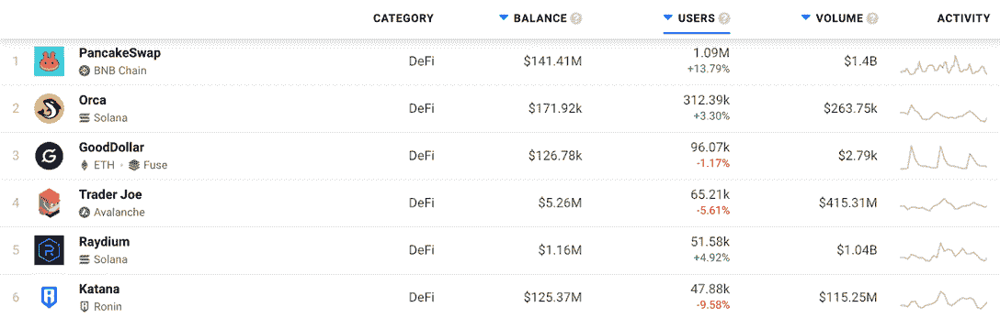
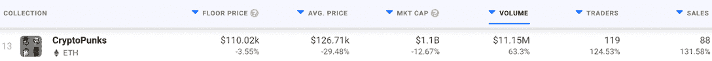
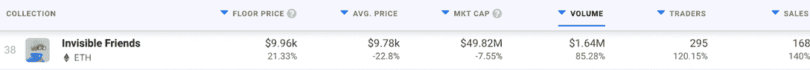
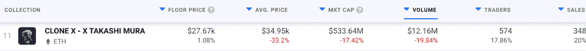
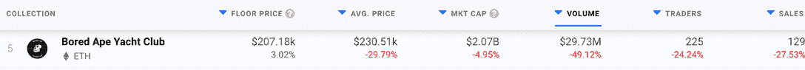
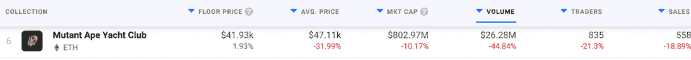
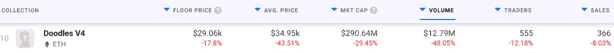
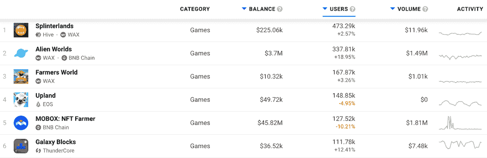
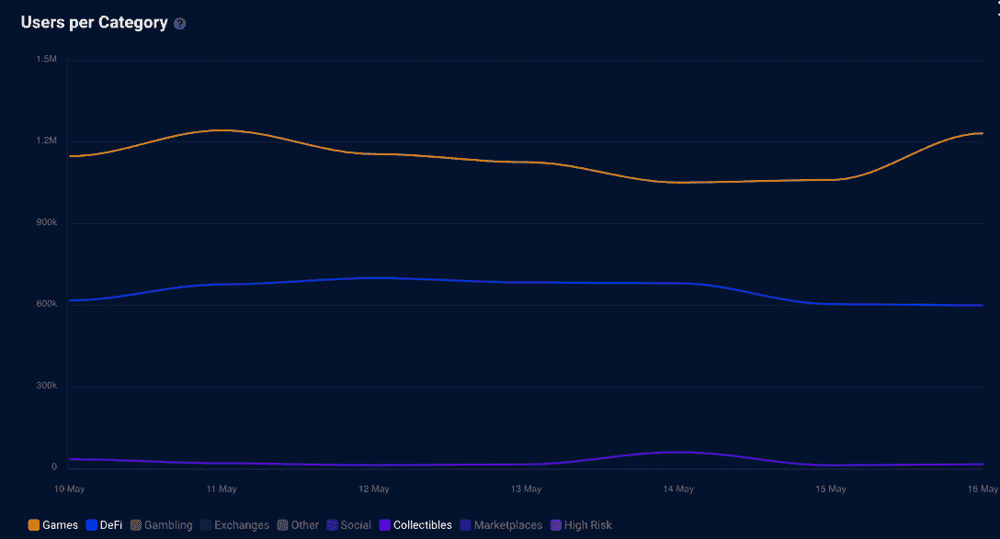

# 加密熊市对 Dapp 用户活动的影响

> 原文：<https://web.archive.org/web/https://dappradar.com/blog/the-crypto-bear-markets-influence-on-dapp-user-activity>

## 找出哪些 dapps 已经设法留在顶部，哪些已经采取了严重的熊市趋势下跌

熊市趋势已经席卷了加密领域，许多 dapps 面临着在这些困难时期生存的挑战。然而，一些项目已经设法超越并提高了它们的性能。在这篇文章中，我们将看看哪些 dapps 增加了用户数量，哪些受到了熊市危机的影响。

## 总结:

*   [DeFi 空间](https://web.archive.org/web/20220705010633/https://dappradar.com/rankings/category/defi)受到的打击最大。该类别中许多 dapps 的基础令牌的估值大幅下降
*   一些 NFT 收藏品设法保持领先地位，并提高了交易量和活跃度。然而，总体趋势表明，非金融资产也受到了熊市的影响
*   游戏玩家是这一群人中最有弹性的。与前一周相比，他们中的许多人吸引了更多的用户，并提高了他们的业绩，尽管游戏代币价值也有所下降
*   尽管担忧加剧，熊市趋势隐现，但 dapp 空间相对稳定

## 秘密熊市如何影响 DeFi dapps？

在 DeFi，并非一切都是悲观的。尽管许多 dapp 代币的估值在过去 7 天里大幅下跌。Terra LUNA 和 UST 的惨败给许多投资者留下了苦涩的印象，这反过来影响了我们在 DappRadar 跟踪的一些 DeFi dapps。看看下面六大 DeFi dapps 的七天表现。

### DeFi 收益者——索拉纳脱颖而出

BSC 领头羊 [PancakeSwap](https://web.archive.org/web/20220705010633/https://dappradar.com/binance-smart-chain/defi/pancakeswap) 设法保持绿色，将其用户基数提高了 13%以上。在过去的七天里，交换和赌注平台吸引了超过一百万个独特的活跃钱包。在此期间，该平台的原生令牌蛋糕损失了 16.2%的价值。

索拉纳的奥卡分散交易所也成功超越了熊市趋势。在过去的七天里，dapp 吸引了 3%的用户，使独立活动钱包的总数超过 30 万。尽管交易量激增，但 Orca 的 native token 的估值在过去一周下跌了 23%以上。

索拉纳的另一位顶级投资者 Raydium 在熊市期间成功抵御了下跌趋势。过去一周，该公司独特的活跃钱包数量超过了 5 万个。虽然这意味着与前一周相比上涨了近 5%，但该交易所的原生 token RAY 的估值却下跌了 18%以上。

### DeFi 失败者——Avalanche 和 Ronin 在苦苦挣扎

当谈到努力跟上下行趋势的 DeFi dapps 时，Avalanche 的 Trader Joe 和 Ronin 的 Katana DEX 似乎是该类别中表现最佳的公司中受影响最大的。

访问量最大的雪崩掉期和农业平台 Trader Joe 与前一周相比，其用户群减少了约 5%。dapp 仍然吸引了超过 60，000 个独特的活动钱包，然而，该连锁店的原生令牌 AVAX 损失了超过 20%的价值，这可能阻止了一些投资者。

Axie Infinity 生态系统自从几个月前的 Ronin bridge 黑客攻击以来一直在挣扎。现在看跌的市场趋势也降低了[武士刀指数](https://web.archive.org/web/20220705010633/https://dappradar.com/ronin/defi/katana)的活动。过去一周，该交易所的独立活跃钱包数量减少了近 10%。此外，SLP 和 AXS 的房价分别大幅下跌 38%和 19%。

作为区块链的后起之秀之一，GoodDollar 在过去的七天里，注册的独立活动钱包数量也略有下降。尽管如此，该平台记录了近 10 万个钱包，这使其成为 Fuse chain 上访问量最大的 dapp。

## 一些 NFT 藏品脱颖而出，成为熊市的秘密避风港

就像其他加密资产一样，NFT 也不是不受加密领域螺旋上升趋势的影响。尽管如此，还是有一些藏品能够经受住下一个神秘冬天的打击。下面我们将考察三个在过去一周有所增长的项目，以及三个尽管处于蓝筹股地位但似乎仍在挣扎的系列。

### NFT 获奖者

[CryptoPunks](https://web.archive.org/web/20220705010633/https://dappradar.com/ethereum/collectibles/cryptopunks) 在过去的七天里，其交易量增长了 63%以上。尽管收藏品的底价略有下降，但即使在熊市期间，OG 以太坊收藏品似乎也保持了它们的价值。在过去的一周里，CryptoPunks 吸引了 135%的销售额和超过 100 个独特的交易者。

《看不见的朋友》也显示出强劲的增长势头。该系列的底价上涨了 21%，接近 1 万美元。更重要的是，隐形朋友在过去的七天里吸引了 140%的销售额和近 300 名独特的交易者。

CloneX 的 NFT 也强烈抵制熊市趋势。虽然该系列的平均售价在下降，但底价却在上升，上周达到了 27670 美元。此外，与该系列互动的交易者增加了 17%，销售额飙升 20%，超过 340 英镑。

### NFT 失败者

无聊猿游艇俱乐部是该领域最大的 NFT 收藏之一，但即使是这种地位也不足以抵挡过去一周的熊市趋势。没错，在过去的几个月里，BAYC 一直处于上升趋势，但现在这种情况似乎已经结束了。在过去的一周里，无聊的猿类吸引了近 50%的交易量，因为该集合的智能合约注册的交易者和销售数量也下降了。

变异猿游艇俱乐部遵循着与其前身 BAYC 大致相同的轨迹。宇迦实验室的第二次收集发现，过去一周与其智能合约互动的交易者减少了 21%。与前一周相比，该项目还产生了近 45%的交易量。这里需要注意的一点是，尽管交易量下降，但 BAYC 和 MAYC 的底价估值都出现了小幅飙升。

最后但同样重要的是， [Doodles](https://web.archive.org/web/20220705010633/https://dappradar.com/ethereum/collectibles/doodles) 似乎也在挣扎。在过去的七天里，Doodles 的底价大幅下降了 17%，而交易量也大幅下降。与前一周相比，该系列产生的交易量减少了 48%，交易者数量也大幅下降。

## 游戏 dapps 的活跃程度正在上升，盖过了消极的熊市趋势

整个区块链的游戏玩家似乎完全不受熊市周期的影响。虽然有 dapps 在过去一周失去了用户活动，但这仍是该领域中显示最绿色箭头的领域。

### 博彩业赢家

[夹板地](https://web.archive.org/web/20220705010633/https://dappradar.com/multichain/games/splinterlands)、[外星世界](https://web.archive.org/web/20220705010633/https://dappradar.com/multichain/games/alien-worlds)、[农夫世界](https://web.archive.org/web/20220705010633/https://dappradar.com/wax/games/farmers-world)和[银河街区](https://web.archive.org/web/20220705010633/https://dappradar.com/thundercore/games/galaxy-blocks)的活动量大幅飙升，与前一周相比吸引了更多用户。Splinterlands 以超过 473，000 个独特的活动钱包领先。与前一周相比，增长了近 3%。农民世界也有类似的增长，吸引了超过 167，800 个独特的活动钱包。

游戏类别中的另一个顶级玩家《异形世界》的用户群增长了 18.9%，令人印象深刻。虽然这还不足以超过领袖夹板地，但《外星世界》吸引了超过 337，000 个独特的活动钱包。

### 游戏失败者

虽然与前一周相比，Mobox 和 T2 高地的用户数量分别减少了 10%和 5%,但这两家应用程序仍然是该领域访问量最大的应用程序。在过去的七天里，Mobox 吸引了超过 127，000 个不同的活动钱包，而 Upland 的表现甚至更好，超过 148，800 个不同的活动钱包。

尽管有红色指标，Mobox 和 Upland 在 DappRadar 的每周顶级游戏排名中频繁出现。不过，Mobox 的原生令牌 MBOX 在过去七天里市值缩水超过 26%。这表明该平台受到了熊市趋势的影响。

## 行业概述

[DappRadar 行业概览](https://web.archive.org/web/20220705010633/https://dappradar.com/industry-overview)证实了上述结论。DeFi 的活动略有下降，然而，该部门是稳定的，用户兴趣没有任何重大下降。当然，围绕着 Terra 和它的两个主要象征露娜和 UST 的严重动荡已经发出了危险信号。

收藏品在过去的七天里也有稳定的表现。5 月 14 日交易量略有上升，但总体而言，NFT 和收藏品市场并未受到代币价格下跌和悲观情绪的影响。

最后但绝对不是最不重要的，似乎游戏 dapps 是不可战胜的。虽然许多区块链游戏平台的本地代币价格暴跌，但该行业的活动却在增加。这是该行业中密码爱好者的兴趣和注意力持续上升的领域之一。如果你想查看完整的行业概况，请查看 DappRadar 上的[专用页面。](https://web.archive.org/web/20220705010633/https://dappradar.com/industry-overview)

DappRadar 将继续监测加密行业所有部门的活动。虽然熊市可能会令人害怕，但数据是最有价值的资源之一，可以帮助你更好地驾驭这个空间。浏览[顶级游戏平台](https://web.archive.org/web/20220705010633/https://dappradar.com/rankings/category/games)、[访问量最大的 DeFi 平台](https://web.archive.org/web/20220705010633/https://dappradar.com/rankings/category/defi)和[最热门的 NFT 收藏品](https://web.archive.org/web/20220705010633/https://dappradar.com/nft/collections/1)，获得最新的见解。此外，你可以在 Twitter[上关注 DappRadar](https://web.archive.org/web/20220705010633/https://twitter.com/dappradar)以首先获得最新的加密新闻。

 NewsletterUnsubscribe at any time. [T&Cs](https://web.archive.org/web/20220705010633/https://dappradar.com/terms) and [Privacy Policy](https://web.archive.org/web/20220705010633/https://dappradar.com/privacy-policy)