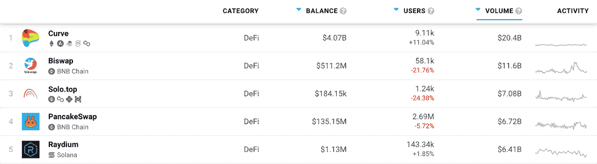
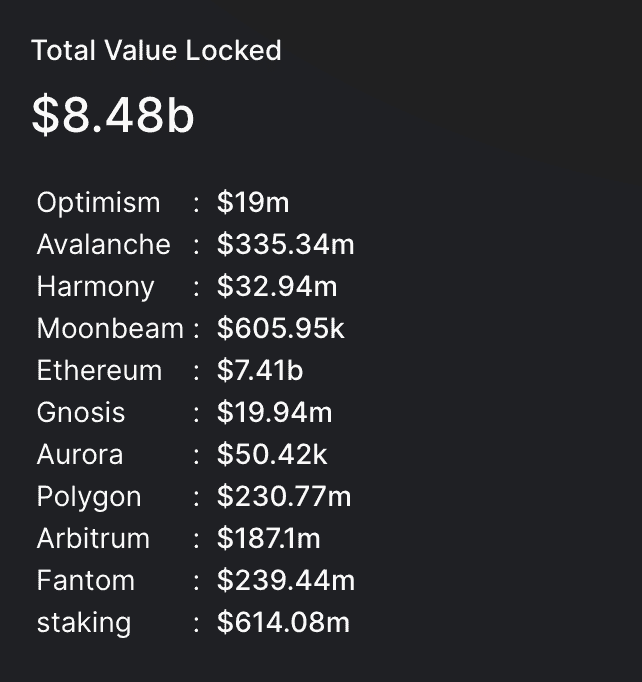
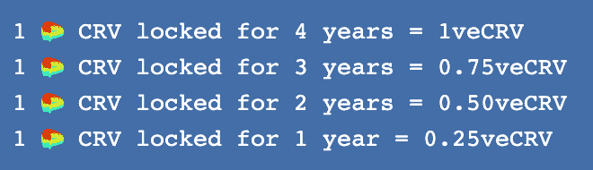
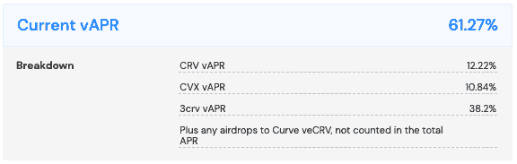

# 曲线战争解释说:当 DeFi 变得咄咄逼人

> 原文：<https://web.archive.org/web/https://dappradar.com/blog/the-curve-wars-explained-when-defi-becomes-aggressive>

## DeFi 中的注意力、权力和金钱之战

曲线战争开始于 2020 年的某个时候，并在最近 Terra USD 试图消灭 MakerDAO 的 DAI stablecoin 时达到了敌对的高潮。在过去的两年里，DeFi 协议已经涌现出来，提供最好的贿赂，希望用户将为他们提供流动性。但是，尽管激励很大，一些人赚了钱，但当集体信心下降，所有人都离开政党时，会发生什么？

**总结**

*   ***[曲线是一种分散式的交易所，专门从事稳定资本的高效交换。该平台提供低水平的滑动和非常低的费用，这使得它对移动大量加密货币的鲸鱼特别有用。](https://web.archive.org/web/20230207101943/https://dappradar.com/blog/the-curve-wars-explained-when-defi-becomes-aggressive/#curve-works)***
*   ***Curve 在各种流动性池中持有超过 84 亿美元。这些是平台成功的关键之一。持有某些[曲线代币](https://web.archive.org/web/20230207101943/https://dappradar.com/hub/token/eth/CRV?from=0xd533a949740bb3306d119cc777fa900ba034cd52)给予持有者如何管理这些资金池的投票权。Convex Finance 想出了一个办法来获得大量的投票权，并开始为自己的利益做出决策。***
*   ***[其他 DeFi 协议已经开发了获取凸令牌的策略，这将赋予他们对凸如何指导 Curve 的流动性池的投票权。](https://web.archive.org/web/20230207101943/https://dappradar.com/blog/the-curve-wars-explained-when-defi-becomes-aggressive/#convex-finance)***
*   ***[泰拉和创客道有过短暂的冲突，进一步点燃了弯道大战。但是 Terra 最近的死亡给这一特殊事件画上了一个句号。](https://web.archive.org/web/20230207101943/https://dappradar.com/blog/the-curve-wars-explained-when-defi-becomes-aggressive/#terra-fits)***
*   迷宫阴谋是曲线战争的基础。有钱可赚，但要小心所有的东西会掉下来。

如果你知道 DeFi，你可能听说过曲线战争。一方面，它们极其复杂，需要大量的研究和时间来理解。在更基本的人类层面上，它们非常简单:人们想要得到一大笔钱。

但是，遵循聪明人制定的路线和方法，以攫取他们的那份奖金，绝非易事。下面是 DeFi 协议如何在另一个平台上构建一个平台的基本概述，以便从无到有中获得一些收益和创造利润。

## 曲线金融如何运作

[曲线](https://web.archive.org/web/20230207101943/https://dappradar.com/multichain/defi/curve)按余额和成交量计算，是 [DeFi](https://web.archive.org/web/20230207101943/https://dappradar.com/rankings/category/defi/1) 最大的分散交易所(DEX)。在过去的 30 天里，价值 204 亿美元的交易经历了曲线。这几乎是排名第二的 [Biswap](https://web.archive.org/web/20230207101943/https://dappradar.com/binance-smart-chain/defi/biswap) 交易额的两倍。Curve 持有的智能合约刚刚超过 40 亿美元，是我们在 DappRadar 跟踪的所有指数中最高的。

[The top DeFi dapps by transaction volume](https://web.archive.org/web/20230207101943/https://dappradar.com/rankings/category/defi/1)

Curve 是一个自动做市商(AMM)，这意味着当人们交易加密资产时没有中介。执行交易的代码在区块链上运行，这些程序被称为智能合约。当人们在 AMMs 上交换加密货币时，他们是在进行点对点交易，而不是点对点交易。使这成为可能的是曲线控制的大型流动性池。

Total value locked in Curve

由于这些深度流动性池，用户可以依靠 Curve 将一种加密货币换成另一种，而不必担心他们想要的东西不够。此外，深度流动性有助于避免价格从一天到另一天大幅下滑的问题。Curve 还提供了一些使其成为成功平台的优势:

*   **低交易费用**–每笔交易价值的 0.04%。这对 DEX 来说太低了。
*   **可组合性**–用户可以在 Curve 上轻松交换来自不同区块链的加密货币。
*   **StableSwap**——平台引入了 stable swap 机制。它使用户能够有效地交换相同价值的代币，对于想要交换大量金钱的鲸鱼来说尤其有用。
*   [**CRV 令牌**](https://web.archive.org/web/20230207101943/https://dappradar.com/hub/token/eth/CRV/ETH?from=0xd533a949740bb3306d119cc777fa900ba034cd52) **奖励**–Curve 为用户提供丰厚的奖励，以增加其密码池中的流动性。

凭借如此多的激励措施，Curve 吸引了大量用户，他们将资产押在该平台上，并帮助创建了深度流动性池。重要的是，Curve 为更长时间提交资产的用户提供了更高的回报。如下图所示，锁定一个 CRV 一年可以获得 0.25 票托管 CRV (veCRV)。到了第四年，赌注者每押一个 CRV 就能赚一个钱。

Curve’s veCRV reward structure

这些奖励是由每笔交易收取的 0.04%的交换费产生的。这些费用的 50%给了加入流动性池的用户，50%给了持有 veCRV 的用户。

此外，veCRV 代币赋予持有者投票权，决定哪些流动性池因押注而获得更多 CRV。简单来说，如果你持有足够多的 veCRV，你就有力量将更多的回报导向自己的方向。

为了获得足够的投票权来影响投票，一个人需要将数十亿美元作为不稳定的加密货币锁定四年。没有多少人有资源或意愿去做这件事。

但如果一个实体能够将所有人的 CRV 集中到一个单一的财政部，并控制足够多的投票权，那么突然之间，这个实体就有能力将巨额资金和资产导向一个单一的目标。

进入[凸金融](https://web.archive.org/web/20230207101943/https://dappradar.com/ethereum/defi/convex-finance)和曲线战争的开始。

## 凸金融做了什么

Convex 认识到，大多数人不想一次把他们的 CRV 锁起来四年。但不这样做意味着人们无法在下注的第四年获得最有利可图的回报。

因此，Convex 创建了一个系统，用户可以在他们的平台上下注 Convex CRV (cvxCRV ),并立即获得最大的 veCRV 收益率，而无需锁定他们的令牌。

Convex 能够实现这一点是因为曲线上的机制，这意味着赌注池奖励随着用户锁定更多 veCRV 而增加。通过聚合每个人的 veCRV，并在整个四年期限内进行投资，Convex 释放了最大收益。Convex 用这些奖励贿赂人们把钱押在凸台上。

为此，Convex 目前控制着 CRV 总供应量的 50%以上，这使其在管理 Curve 的流动性池方面拥有巨大的发言权。持有这一数量的 CRV 还能确保 Convex 自己的储户获得最大的赌注回报。

就目前情况来看，Convex 提供的可变年百分比率(vAPR)为 61.27%。它是可变的，因为它依赖于任何一天的交易活动，并且很容易定期变化。但是，61.27%的 vAPR 意味着有人可以将价值 100 美元的 cvxCRV 存入 Convex，一年可以获得 61.27 美元的利润。

Convex Finance’s reward structure, at the time of writing

为了支撑他们自己的生态系统，并尽可能保持对它的控制，Convex 以 [CVX](https://web.archive.org/web/20230207101943/https://dappradar.com/hub/token/eth/CVX?from=0x4e3fbd56cd56c3e72c1403e103b45db9da5b9d2b) 代币支付其 10.84%的奖励。CVX 代币赋予持有者投票权，让他们决定凸体如何使用其 veCRV。最终，持有 CVX 让你有能力参与流动性池如何支付回报的决策。

获得 61.27%的被动收入——这在今天的传统金融中是闻所未闻的数字——以及获得决定 Curve 如何分配其巨大流动性池回报的投票权，是将钱存入 Convex 的两个巨大激励。

但是，尽管大多数人很高兴从个人层面上受益于这些奖励，但其他 DeFi 协议已经涌现。这些新的竞争者想出了各种方法来控制和分享利润。

## Votium 和 Llama 空军联盟加入党

CVX 的持有者可以将他们的代币作为 Votium 的投票锁定 CVX (vlCVX)，Votium 将选择提供最佳激励的优化赌注选项。实际上，当持有人将他们的 vlCVX 存入 Votium 时，他们就交出了投票权，并获得了回报。

因为 Votium 拥有数学和计算能力来做出最佳选择，即哪个选项将提供最佳回报，他们拿走一小部分奖励，并将剩余部分交给最初的 CVX 持有者。

Votium 策略的问题在于，vlCVX 的投资者可以从所投的流动性池中获得回报。这通常导致奖励是少量的几种加密货币和代币，不值得花那么多钱去获得它们。

这就是美洲驼空军联盟(LAU)的由来。这个协议是为了将一个人的所有 Votium 奖励集中到一个单一的资产中而建立的。通过加入该联盟，“你将你的贿赂奖励转交给 Llama Airforce”，他们集体认领这些奖励，将其转化为 cvxCRV，将其放入自动配料器，并向用户空投他们的利润份额。

## Terra 在故事中的位置

DappRadar 有一篇文章[在这里](https://web.archive.org/web/20230207101943/https://dappradar.com/blog/is-terra-trying-to-kill-maker-daos-dai-stablecoin)详细描述了制造者 DAO 和 Terra 如何创建他们自己的，更具敌意的战场，作为曲线战争中的分裂冲突。

简而言之， [Terra 的 stablecoin](https://web.archive.org/web/20230207101943/https://dappradar.com/blog/terra-ust-stablecoin-hits-0-67-low-as-dollar-peg-slips-further) 在 2021 年 12 月颠覆了制造商道的戴 stablecoin。随后，制造商道的联合创始人开始了一场口水战，他称和 T3 是庞氏骗局。Terra 的首席执行官权道(Do Kwon)对此进行了回击，他引入了一个名为 4pool 的新流动性池，并将戴(音译)排除在外。

此举的目的是从 Curve 最大的资金池 3pool 吸引资金，从而使制造商 DAO 无法获得流动性。最终，如果 Terra 的计划实现了，制造者 DAO 的[戴](https://web.archive.org/web/20230207101943/https://dappradar.com/hub/token/eth/DAI?from=0x6b175474e89094c44da98b954eedeac495271d0f) stablecoin 和它的制造者(token。是道的统治和功利的象征；这是道创客整个 DeFi 生态系统建立的基础。

这都发生在一个月前。从那以后， [Terra 的财富声名狼藉地下降了](https://web.archive.org/web/20230207101943/https://dappradar.com/blog/terra-ust-stablecoin-hits-0-67-low-as-dollar-peg-slips-further)，所以看起来这部分的曲线战争已经结束了。但它确实显示了 DeFi 协议将在这个竞争激烈的行业中生存的水平。

## 曲线战争:一个非常现代的叙事

正如我在本文开头所写的:曲线战争在某种程度上是非常复杂的。支撑整个系统的是大量极其复杂的数学和金融争论。了解每个活动部分如何与整个生态系统互动，是了解赚钱机会在哪里的关键。

但退一步说，整个概念相当简单:人们希望获得 Curve 拥有的大量流动性。他们通过寻找套利机会或可以利用的协议漏洞来做到这一点。复杂的是他们游戏系统的创新方式；终极目标并无新意。这是一个关于金钱、权力和利润的故事，一个和时间一样古老的故事。

 NewsletterUnsubscribe at any time. [T&Cs](https://web.archive.org/web/20230207101943/https://dappradar.com/terms) and [Privacy Policy](https://web.archive.org/web/20230207101943/https://dappradar.com/privacy-policy)