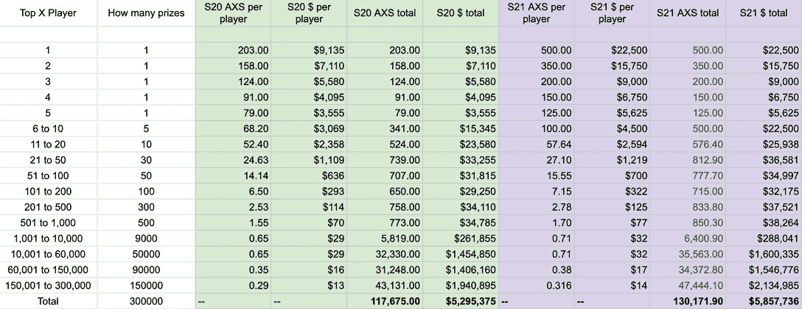

# Axie Infinity 时代的终结:第 21 季直播

> 原文：<https://web.archive.org/web/https://dappradar.com/blog/the-end-of-an-era-for-axie-infinity-season-21-is-live>

## 这将是最终的 Axie Infinity: Classic 赛季，持续到 6 月 24 日

随着 Axie Infinity: Origin 的推出，Sky Mavis 已经将努力转移到了新的游戏玩法上。为了完全做到这一点，工作室推出了 Axie Infinity 的最后一个正式赛季:经典模式。第 21 赛季给顶级玩家带来了更多的奖励，然而，社区对此并不太满意。

总结:

*   Axie Infinity:经典第 21 季将为 30 万玩家带来更多的 AXS 奖励
*   阿谢社区仍然对 SLP 的房价下跌不满
*   [Axie Infinity: Origin](https://web.archive.org/web/20221006034027/https://dappradar.com/blog/the-end-of-an-era-for-axie-infinity-season-21-is-live/#Axie-Infinity:-Origin) 会给现状带来改变吗？

## Axie Infinity 第 21 季

随着最后一个官方经典赛季的推出，Sky Mavis 团队推出了一项特殊的奖励计划。本赛季结束时，30 万名顶级玩家将获得总计 130，171 枚 AXS 代币，价值约为 580 万美元。

根据官方宣布，Axie Infinity 第 21 季将为排行榜上的前 10 名玩家提供大幅奖励。查看下面的对比分析，显示排行榜所有级别的奖金会增加多少。

虽然这对顶级玩家来说是个好消息，但 Axie 社区并没有全心全意地接受这一宣布。一些玩家表示担心第 21 季不会带来任何关于 SLP 燃烧机制和代币贬值的改进。

## SLP 房价下跌引发社会不满

虽然 Sky Mavis 自夸在第 21 季中对顶级球员的奖励有所增加，但普通球员似乎被排除在外。许多玩家期待经典 Axie 游戏的最后一季能为 SLP 带来新的效用机制。不幸的是，游戏内代币的价格几周来一直呈下降趋势。

用 DappRadar Token Explorer 看一下 SLP，显示在过去的三十天里，SLP 损失了超过 30%的价值。在撰写本文时，代币价值约为 0.014 美元。

SLP 是玩家在游戏的冒险模式中获得的主要令牌。玩冒险模式不绑定排行榜排名。这使得在 Axie Infinity 上利用从玩到赚机制变得更加容易，即使你的 NFT 角色不是最强大的。

不幸的是，代币价格的下跌让社区里的许多玩家泄气了。总的来说，天空小牛需要为 SLP 引入更多的实用性，否则许多球员会退出比赛。Axie 社区成员向游戏创始人[吉奥兹](https://web.archive.org/web/20221006034027/https://twitter.com/Jihoz_Axie)呼喊以倾听他们的请求。

第 21 季中缺乏关于 SLP 燃烧的更新在推特上引发了一波不满。官方声明已经吸引了 200 多条评论，其中大部分指出了令人失望的对票房最高的玩家的关注，而不是玩家群体的整体关注。

## Axie Infinity: Origin 给桌面带来了什么？

目前，Sky Mavis 正在全力调整和完善其新发布的 Origin 游戏。许多玩家质疑新的游戏模式是否会为 SLP 燃烧带来更多的水龙头，以及潜在的价格上涨。

目前，情况似乎并非如此。对 Sky Mavis 最大的一个指责是，它把太多的注意力放在了顶级表现者身上。该团队正在增加顶级球员的收入，而普通学者的价值正在下降，因为 SLP 的价格下降。

虽然 Axie Infinity: Origins 仍在开发中，但一些初步的机制已经揭示出来。新版本似乎也更强调排名和排行榜，而不是 SLP 燃烧机制。尽管如此，一个新的机制，浪人精神，将直接影响 SLP 玩家在战斗中的收入。[你可以在 Axie Infinity: Origin 上找到更多关于收入潜力的信息](https://web.archive.org/web/20221006034027/https://dappradar.com/blog/axie-infinity-origin-brings-brand-new-arena-mode)。

尽管有新奇的因素和围绕即将到来的陆地游戏发布的大肆宣传，Axie Infinity 似乎正在经历一段艰难的时期，特别是在今年早些时候的[浪人桥黑客](https://web.archive.org/web/20221006034027/https://dappradar.com/blog/axie-infinity-activity-plummets-after-600-million-ronin-exploit)之后。社区已经表达了他们的担忧，现在该由 Sky Mavis 来解决了。

随着经典版游戏的结束，DappRadar 将继续监控 Axie Infinity 生态系统。Origins 有潜力在社区中带来新的热情火花，因为它仍处于早期发展阶段。要跟踪 Axie Infinity 的所有活动，请查看下面的链接。打开你的 [DappRadar Twitter](https://web.archive.org/web/20221006034027/https://twitter.com/dappradar) 通知，首先获取最新更新。

[<picture></picture>](https://web.archive.org/web/20221006034027/https://dappradar.com/ethereum/games/axie-infinity)[<picture></picture>](https://web.archive.org/web/20221006034027/https://dappradar.com/blog/axie-infinity-biggest-contributor-to-august-game-nft-trading/)[<picture></picture>](https://web.archive.org/web/20221006034027/https://dappradar.com/hub/swap/eth/ETH/AXS?to=0xbb0e17ef65f82ab018d8edd776e8dd940327b28b) NewsletterUnsubscribe at any time. [T&Cs](https://web.archive.org/web/20221006034027/https://dappradar.com/terms) and [Privacy Policy](https://web.archive.org/web/20221006034027/https://dappradar.com/privacy-policy)