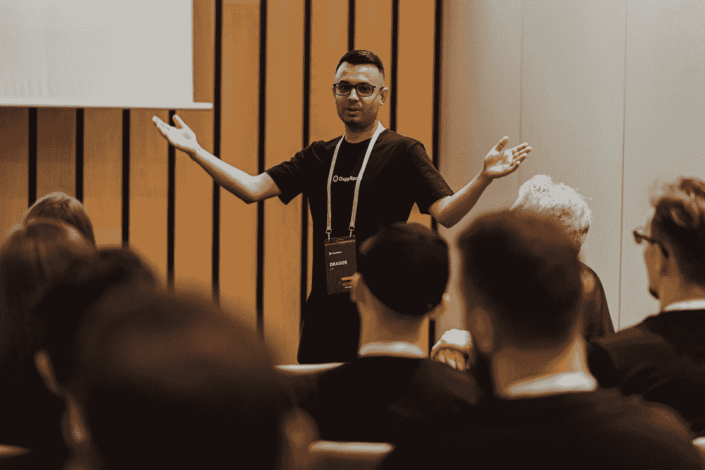

# Web3 的未来需要 DappRadar:你见过 Dragos 吗？

> 原文：<https://web.archive.org/web/https://dappradar.com/blog/the-future-of-web3-needs-dappradar-have-you-met-dragos>

## DappRadar 的联合创始人分享了对该公司光明未来的独家见解。我们是这样做的。

在一个谈论未来越来越多的行业中，DappRadar 通过不断增强的实力再次证明了自己。由 Dragos Dunica 和 Skirmantas Januskas 共同创建，它是在一个无法无天的土地上导航数百个分散应用程序的最佳位置。但是我们如何设法带领一个不断增长的社区走向 Web3 的未来呢？

像任何帝国一样，答案在于领导力。认识一下德拉戈，DappRadar 的联合创始人和 CDO(首席数据官)。在这次采访中，他不慌不忙地分享了他的整个 Web3 之旅，并暗示了 DappRadar 社区在接下来的几年里可以期待看到什么。

## 你能告诉我们一些关于你自己和你职业生涯的事情吗？是你的职业生涯让你走到了今天？

我出生在罗马尼亚的布加勒斯特，毕业后搬到了意大利北部。在过去的四年里，我一直住在立陶宛的考纳斯，那里是 DappRadar 总部的所在地。

我很幸运有支持我的父母，他们在我很小的时候就给我买了一台电脑，尽管那时候电脑并不常见。这给了我一个良好的开端，让我学会了如何编写基本的 HTML 网站代码，并让我爱上了电脑游戏。从那以后，技术极大地影响了我的个人和职业发展。

我曾在游戏行业工作过，也曾是多家公司的软件开发人员。我一直对兼职项目充满热情，但独自工作往往很无聊，与 DappRadar 的另一位联合创始人 Skirmantas 会面，在将这种热情转变为严肃的事情方面发挥了重要作用。

我们还在上学的时候就在网上认识了(我在罗马尼亚，他在立陶宛)，我们在很长一段时间里一直在构建各种辅助项目，直到我们一路上收集的所有知识和经验帮助我们构建了 DappRadar。

## 你是如何进入分散应用程序世界的？

大约在 2013 年，我的一个朋友正在告诉我他是如何使用他的图形卡挖掘比特币的，但我不确定比特币是什么，区块链是如何工作的，所以我花了一段时间才引起了我的兴趣。

快进到 2018 年，我已经拿着一些 BTC，对什么是区块链有了很好的理解， [CryptoKitties](https://web.archive.org/web/20221201124845/https://dappradar.com/ethereum/games/cryptokitties) 取得了巨大的成功，它开始在媒体上无处不在。这让我开始研究智能合同和去中心化应用，研究技术部分和试图解决的问题。

作为一名游戏玩家和技术人员，NFT 和智能合约立即变得有意义，因为我可以看到由 Steam 控制的 CS:GO 的游戏内皮肤如何在公开市场上变成 NFT。

与此同时，智能合约的互操作性和不变性非常有趣，所以这就是寻找 dapps 的开始，这就是 DappRadar 的诞生。

## Web3、区块链和去中心化最让你兴奋的是什么？

我坚信 Web3 能给这个世界的所有行业带来什么，从技术到医学或娱乐，但我们现在仍然只是在建立工具和基础。开放和可互操作的未来将建立一个基础，允许许多行业更快地创新并带来新的想法。

> 我一直觉得在 DappRadar 工作让我将来有机会工作。

我非常兴奋能够为这个行业做出贡献，这个行业将改变数十亿人的生活，为正常人创造公平的竞争环境，并最终触及我们所有的日常生活。

生活在一个“dataverse”成为现实的世界里，大概是我能看到的最激动人心的事情了。我很乐意解释“dataverse”愿景，但我觉得我无法比陶瓷团队做得更好，所以我建议大家阅读 Dataverse 文章中的[。](https://web.archive.org/web/20221201124845/https://blog.ceramic.network/into-the-dataverse/)

## 现在你在 Web3 领域最喜欢的项目是什么？

有很多很棒的项目，但是我总是在和我的非 Web3 朋友交谈时提到的一个 dapp 是 [PoolTogether](https://web.archive.org/web/20221201124845/https://dappradar.com/ethereum/defi/pooltogether) 。每次我告诉某人他们有机会在不丢失“彩票”的情况下赢得彩票，他们都告诉我这里面有猫腻，或者这是一个骗局。

但是现在，我的家人和朋友都在一起使用游泳池。除了游戏，这可能是让新人进入 dapps 世界并向他们展示互操作性和 DeFi 能力的最简单方式之一。

[Explore Dragos’s Favorite Dapp PoolTogether](https://web.archive.org/web/20221201124845/https://dappradar.com/ethereum/defi/pooltogether)

## 你给达普拉达带来了什么？

这是一个很好但很难的问题。我很乐意从我的团队中听到这些。但我会试着说几句话，谈谈我如何看待我给 DappRadar 增加的价值。由于非常接近我们正在构建的产品和我们的用户，我相信我会对我们正在构建的东西带来不同的视角，试图降低准入门槛，提高 UX，并构建让我们的用户满意的正确功能。

我也喜欢了解最新的行业新闻和发展，所以我试图在内部分享我作为 Web3 应用和协议的积极用户所收集的知识。

## 典型的一天工作通常是什么样的？

我与管理、产品、设计和 DAO 团队密切合作。我经常通过不同的渠道与我们的用户保持联系，试图了解他们的需求或他们面临的问题。我在 crypto Twitter 上搜索行业内的最新趋势或讨论，让自己跟上新项目和新技术。

> 我的主要关注点是打造一个伟大的产品，帮助人们满足他们在 dapps 领域的需求，帮助他们做出正确的决定，并在这个复杂的环境中引导他们。

与此同时，我对[RADAR token](https://web.archive.org/web/20221201124845/https://dappradar.com/token/overview)能给 DappRadar 带来什么感到非常兴奋，我与 DAO 团队密切合作，构建并执行 DappRadar 的渐进去中心化路线图。

[Know More About DappRadar DAO](https://web.archive.org/web/20221201124845/https://dappradar.com/token/governance)

## 作为 dapps 行业的专业人士，你面临的主要挑战是什么？

一些主要的挑战是超快的环境和缺乏标准。区块链仍然是一个蛮荒的西部，在那里你每天都能看到创新和进步，这很好，但由于 DappRadar 试图做的事情(索引所有区块链的所有数据并加以理解)，这构成了一个巨大的挑战。

我要说的是，有时，这个行业的一些参与者是有毒的，因为他们唯一的主要目标是赚更多的钱，而不管他们实现目标的方式。

这通常会导致诈骗、拉地毯、愤怒和其他不良行为，主要是受贪婪的驱使。

## 你会给想追随你脚步的人什么建议？

有两件事一直是我生活的一部分:好奇心和持续建设。保持好奇，不要停止学习，不断建设。找到你喜欢的东西，并围绕这个主题建立一些东西。

## 你最近参加了 DevCon。你如何看待未来几年 Web3 行业的发展？

这是一个非常好的问题，我相信我有足够的思想和想法来写一整篇文章。在敌无双引起我注意的主要讨论主题是零知识(ZK)、分散身份(DID)和分散声誉。

> [#DevconVI](https://web.archive.org/web/20221201124845/https://twitter.com/hashtag/DevconVI?src=hash&ref_src=twsrc%5Etfw) 的第一天令人窒息。聪明的人，有趣的讲座和研讨会。很难选择参加哪个讲座。
> 
> 看到这个了不起的社区正在研究和建造的所有东西，我只能感到乐观。为第二天感到兴奋🚀【pic.twitter.com/gsKz6WNDWK 
> 
> — Dragos Dunica (@dragos_dydy) [October 12, 2022](https://web.archive.org/web/20221201124845/https://twitter.com/dragos_dydy/status/1580159751971045377?ref_src=twsrc%5Etfw)

我还对 Web3 中 UX 的重要性感到惊喜，让人们加入 Dao 和监管环境。

> 我相信我们会在钱包和 dapps 如何接纳新用户方面看到很多进展，Web3 行业目前使用的复杂语言将变得更简单，降低新用户的准入门槛。

游戏和分散的社交媒体将在未来几年成为巨大的话题，分散的身份将支持新的应用程序，将 Web3 行业带到一个新的水平。

## 你对 10 年后的 DappRadar 有什么期待？

DappRadar 在未来 10 年将会有很大的改变。Web3 需要一个由生态系统参与者构建和领导的合适的发现平台。现在很明显，Dapp 需要一个不同的发现和分析环境，DappRadar 的愿景是成为世界上的 Dapp 商店。

> DappRadar 目前正在经历一个渐进的权力下放过程，将控制权慢慢地交给核心参与者。

[雷达令牌](https://web.archive.org/web/20221201124845/https://dappradar.com/token/overview)将在这一过程中发挥重要作用，因为它将推动 Contribute2Earn 机制，产生收入并奖励平台的贡献者。与此同时，它将赋予令牌持有者管理权利，以引导平台的未来，并为所有参与者提供在决策过程中拥有发言权的可能性。

Dapp 开发者、贡献者和用户将成为这个新平台的核心，将它变成当前应用商店的自然演变。未来，可互操作的生态系统将战胜封闭和孤立的平台。

10 年后，我想没有人会真的想在封闭的环境中构建自己的应用程序，即使是大公司也不会。发展速度、创造力、创新步伐和开放数据都将强大到无法与之抗衡。

DappRadar 将作为一个开放平台，成为我们将生活在其中的可互操作世界的一部分，将复杂而庞大的数据网络(区块链)转变为用户友好的旅程和界面，并为企业和 dapp 开发者提供易于访问的数据流。

> 这个世界将变得分散和开放、私密和透明，DappRadar 将帮助每个人在这个新世界中导航。

*本文是 [DappRadar 团队采访系列](https://web.archive.org/web/20221201124845/https://dappradar.com/blog/tag/meet-the-team)的一部分——在这里你可以见到世界上 Dapp 商店背后的一些聪明人。* [*在 LinkedIn 上更好地了解我们。*](https://web.archive.org/web/20221201124845/https://www.linkedin.com/company/dappradar/)