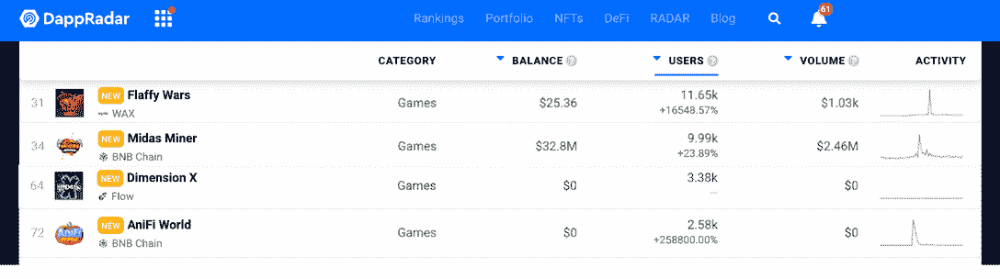
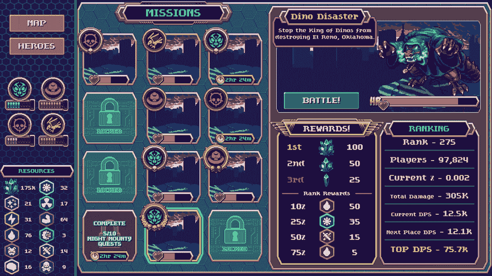
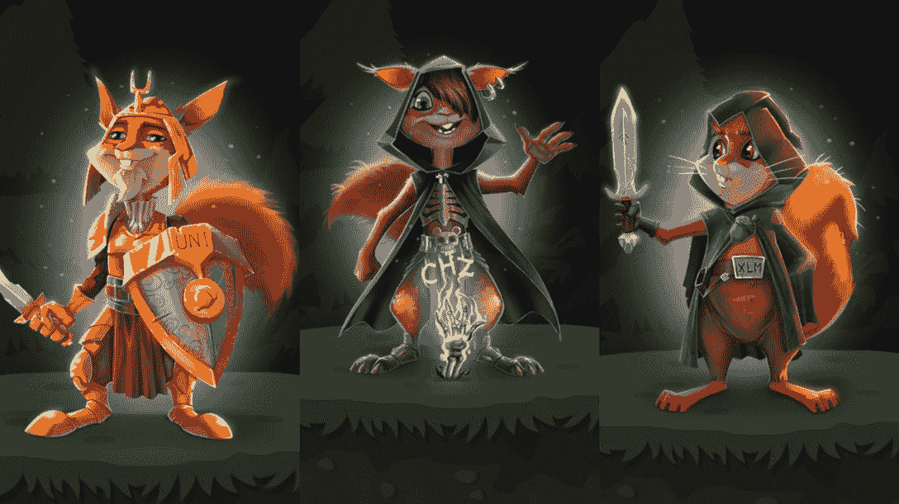
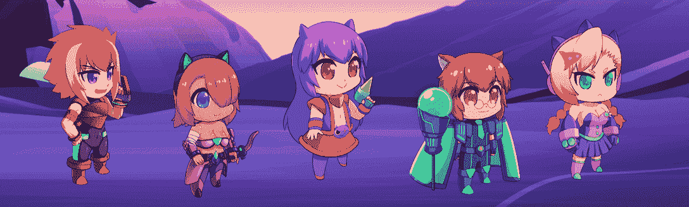
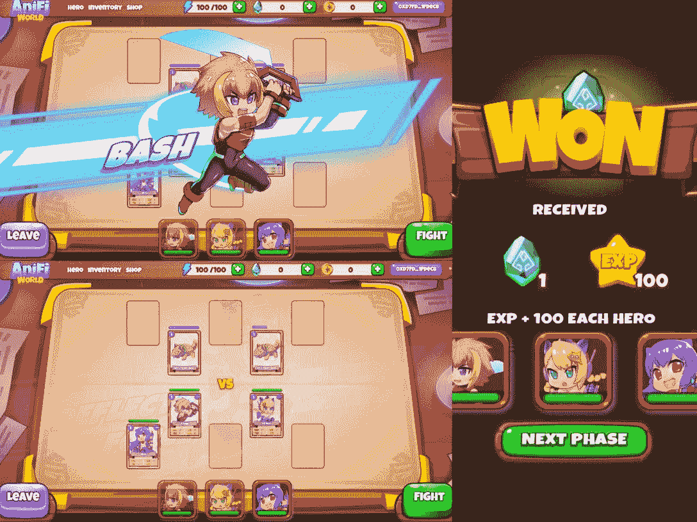

# DappRadar 排行榜上最热门的新游戏

> 原文：<https://web.archive.org/web/https://dappradar.com/blog/the-hottest-new-games-on-dappradar-rankings>

## DappRadar 追踪的新兴游戏列表

**DappRadar 排行榜上有哪些新的热门游戏？以下是新发布的区块链游戏，它们在用户增长方面超过了竞争对手。今天的列表将涵盖几个区块链和多个类别，包括卡，冒险，角色扮演，等等。**

内容:

*   [维度 X——流动中的战略角色扮演](https://web.archive.org/web/20221204093503/https://dappradar.com/blog/the-hottest-new-games-on-dappradar-rankings/#dimensionx)
*   [华丽的战争——激动人心的蜡上冒险](https://web.archive.org/web/20221204093503/https://dappradar.com/blog/the-hottest-new-games-on-dappradar-rankings/#fluffy)
*   [阿尼菲世界——一款充满可爱游戏角色的纸牌游戏](https://web.archive.org/web/20221204093503/https://dappradar.com/blog/the-hottest-new-games-on-dappradar-rankings/#anifi)
*   [Midas Miner——BSC 上的热门矿工游戏](https://web.archive.org/web/20221204093503/https://dappradar.com/blog/the-hottest-new-games-on-dappradar-rankings/#midas)
*   [用 DappRadar 追踪最新的区块链比赛](https://web.archive.org/web/20221204093503/https://dappradar.com/blog/the-hottest-new-games-on-dappradar-rankings/#track)

想玩新游戏吗？在 DappRadar，我们为不断变化的区块链游戏世界提供最好的、最多样的和最新的跟踪。

区块链游戏奖励玩家投入游戏的时间和精力。如果你想让你接下来的几百个小时的游戏时间过得有所值，那就去看看最近刚刚被纳入 [DappRadar 游戏排名](https://web.archive.org/web/20221204093503/https://dappradar.com/rankings/category/games)的游戏吧。此外，他们的数据性能令人印象深刻！

## 维度 X——关于心流的战略角色扮演

随着 [Trickshot Blitz](https://web.archive.org/web/20221204093503/https://dappradar.com/flow/games/trickshot-blitz) 和 [Solitaire Blitz](https://web.archive.org/web/20221204093503/https://dappradar.com/flow/games/solitaire-blitz) 在 DappRadar 的游戏排名中引起轰动，Flow 的游戏场景已经获得了动力。进一步观察 Flow 的游戏领域，Cyrpthulhu 的创意产品 [DimensionX](https://web.archive.org/web/20221204093503/https://dappradar.com/flow/games/dimension-x) 是一颗冉冉升起的新星。

Crypthulhu 工作室是一家创新的 NFT 游戏工作室，致力于为玩家带来快乐和新奇的区块链游戏体验。该工作室最近发布的 Dimension X 是一款一对一的角色扮演游戏，具有英雄般的叙事和复古的视觉效果。

在游戏中，用户可以派遣他们的 NFT 英雄去与恶棍和怪物战斗，升级，并在不断变化的世界中支持他们的派系。最令人兴奋的是，DimensionX 拥有精致的游戏机制，可以让策略游戏狂热者沉浸其中。无论是战斗模式还是任务系统，每一个动作都需要仔细考虑和规划。

现在就加入 [DimensionX](https://web.archive.org/web/20221204093503/https://dappradar.com/flow/games/dimension-x) ，组建您的超级团队，争夺 P2E 代币。

## flaffy Wars–激动人心的蜡上冒险

一个“最热门的 DappRadar 排名”综述如果没有蜡像游戏会是什么？Wax 将自己定位为游戏和 NFT 领域最成熟的区块链，从不缺少杀手级游戏。

当我们在区块链蜡像馆发现一款用户增长超过 16000%的新游戏时，当然，我们必须弄清楚这是怎么回事。这是一款新的 P2E 冒险游戏，在碳中和蜡区块链上进行。

在游戏中，不同家族的松鼠聚集成不同的班级。每一类动物都拥有自己的领地，保卫和建立新的领地。有三种游戏模式，PVP，PVE 和任务。这些活动可以让玩家踏上不同的旅程，获得装备，获得经验，获得奖励。

## 阿尼菲世界——一款充满可爱游戏角色的纸牌游戏

[https://web.archive.org/web/20221204093503if_/https://www.youtube.com/embed/FAvcqe-h2Og?start=27&feature=oembed](https://web.archive.org/web/20221204093503if_/https://www.youtube.com/embed/FAvcqe-h2Og?start=27&feature=oembed)

如果你想尝试休闲类游戏，或者想要简单一点的游戏， [AniFi World](https://web.archive.org/web/20221204093503/https://dappradar.com/binance-smart-chain/games/anifi-world) 是为数不多的容易上手的纸牌游戏之一。如果你不是炉石专家也不用担心。有了 AniFi World，无论你的游戏体验如何，都能拥有流畅沉迷的体验。

阿尼菲世界是一个免费玩，玩到赚卡 GameFi 平台，具有不可抗拒的可爱人物。该游戏建立在币安智能链(BSC)的基础上，允许每个人通过游戏、收集游戏中的物品以及与角色互动来获得奖励。

在阿尼菲世界中，玩家可以召唤和收集各种角色(英雄)，他们可以带着这些角色去冒险和与怪物战斗。这是阿尼菲世界目前 Alpha 测试版的核心玩法，它让玩家赚取阿尼菲(游戏内的代币)作为奖励。

由于阿尼菲世界是一个卡牌游戏，每个角色(英雄)都被表示为一张牌。在当前版本中，AniFi 要求玩家拥有五个英雄来加入乐趣，系统提供三个免费英雄。同样值得一提的是，玩家可以提升他们角色的技能来增加他们的奖励收入能力。

[进入 AniFi World 的 single dapp 页面](https://web.archive.org/web/20221204093503/https://dappradar.com/binance-smart-chain/games/anifi-world)查看其实时行情数据！然后，点击打开 Dapp 按钮，跳转到 AniFi World 官方网站。

## 迈达斯矿工 BSC 上的热门矿工游戏

如果你想利用你的游戏时间赚钱，但不是一个高技能的玩家，采矿游戏可能是一个选择。这类游戏通常玩法简单。只要你知道规则，你就可以在收获回报的同时顺利前进。

[迈达斯矿工](https://web.archive.org/web/20221204093503/https://dappradar.com/binance-smart-chain/games/midas-miner)是 BNB 链上的热门采矿游戏。这是一个玩到赚的游戏，允许玩家赚取代币，包括稳定的硬币。此外，玩家可以利用 NFT 人物和游戏中的工具来挖掘宝藏，如游戏中的令牌 MMI，USDT 和其他专属奖励。

玩家可以用 MMI 代币购买不同的角色。另外值得一提的是，角色的属性和实力各不相同，给玩家带来不同的挖矿能力。此外，随着 Midas 采矿的发展，游戏将引入更多的功能，如雇佣模式，地图等，以增强玩家的体验。

[进入迈达斯矿业单 dapp 页面](https://web.archive.org/web/20221204093503/https://dappradar.com/binance-smart-chain/games/midas-miner)查看其实时行情数据！然后，点击打开 Dapp 按钮，跳转到 Midas Mining 的网站。

## 使用 DappRadar 追踪最新的区块链比赛

对于大多数区块链项目来说，2022 年一直具有挑战性，但游戏行业是个例外。值得注意的是，游戏 dapps 已经在各种网络上发布了一系列新游戏，收获了一波又一波的用户。然而，在最近趋势的海洋中，很容易错过目标。

达普拉达是来帮忙的。在 DappRadar，我们让用户对当前的 GameFi 和 P2E 局势有一个全面和最新的了解。在 [Twitter](https://web.archive.org/web/20221204093503/https://twitter.com/dappradar) 、 [Discord](https://web.archive.org/web/20221204093503/https://discord.gg/4ybbssrHkm) 和 [Youtube](https://web.archive.org/web/20221204093503/https://www.youtube.com/c/DappRadar) 上关注我们，跟上区块链世界的动态。

## 随身携带您的 Web3 之旅

使用 DappRadar 移动应用程序，再也不会错过 Web3。查看最受欢迎的 dapps 的性能，并关注您投资组合中的 NFT。您在 DappRadar 上的帐户会与我们的移动应用程序同步，这样您很快就可以选择实时接收提醒。

[Download the DappRadar app now](https://web.archive.org/web/20221204093503/https://dappradar.app.link/blog)[<picture></picture>](https://web.archive.org/web/20221204093503/https://play.google.com/store/apps/details?id=com.portfolio.dappradar)