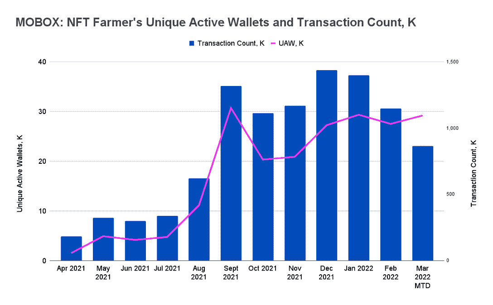
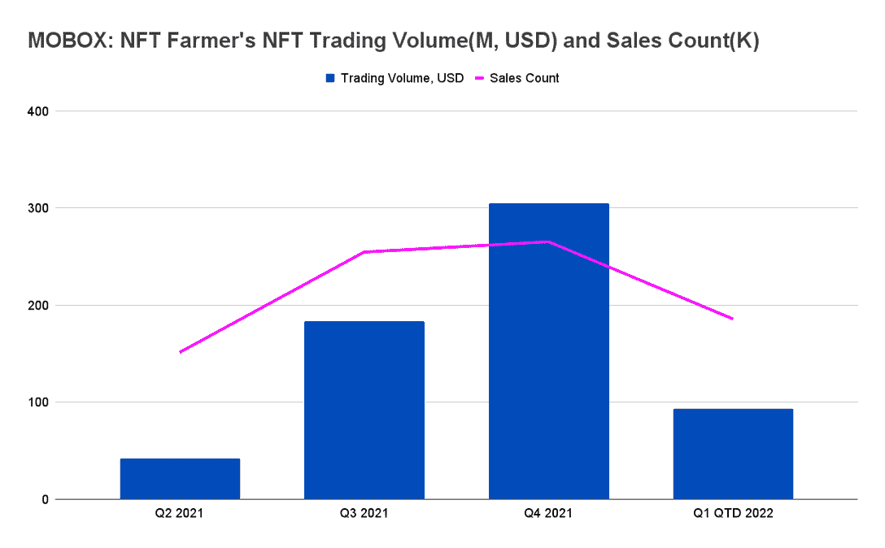
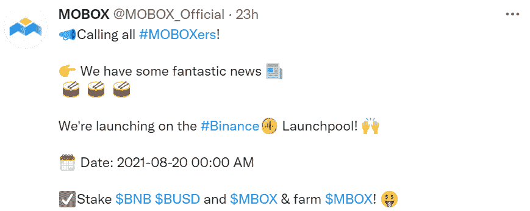
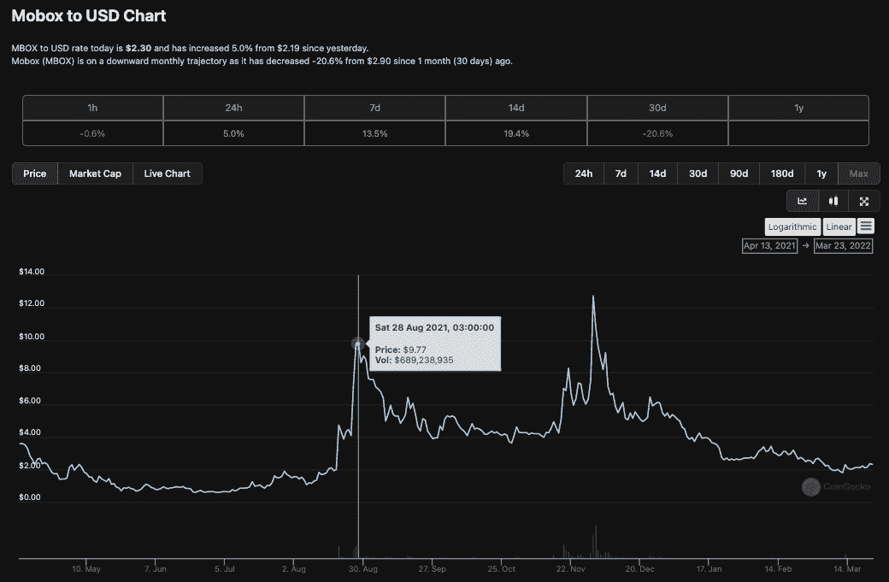
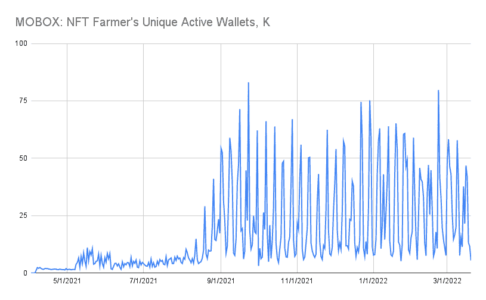
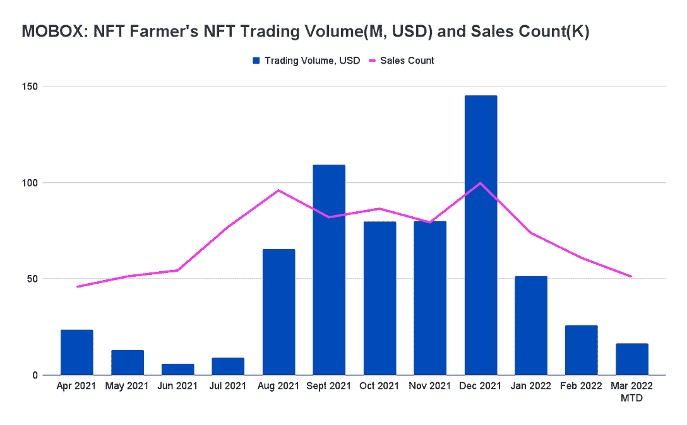
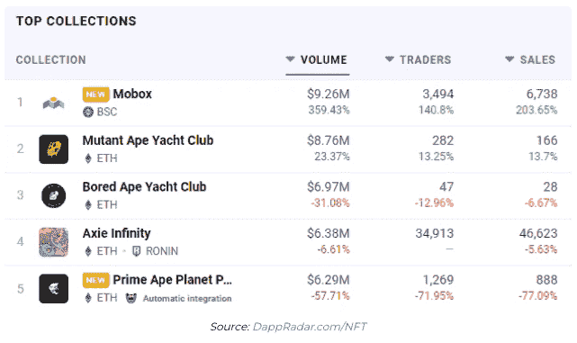
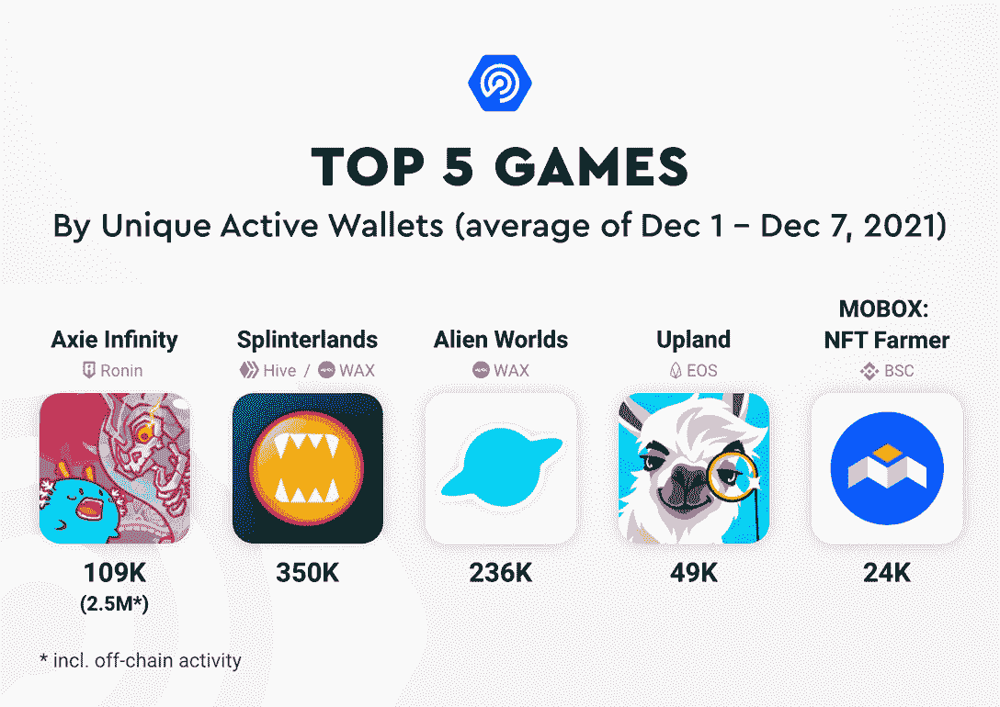
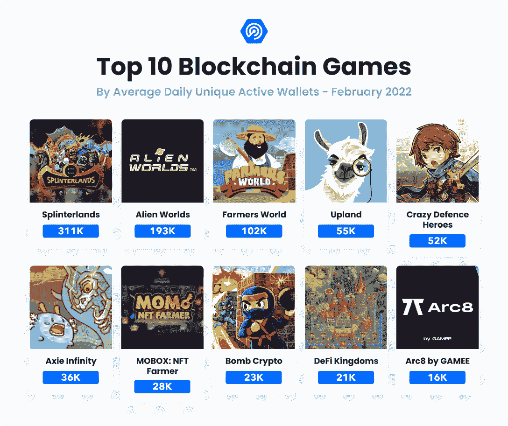

# 移动机器人的不可思议的崛起:NFT 农民

> 原文：<https://web.archive.org/web/https://dappradar.com/blog/the-incredible-rise-of-mobox-nft-farmer>

## 游戏化金融在 BNB 链条上如日中天

**玩赚游戏以及与 DeFi 和 NFT 机制交织在一起的游戏越来越受欢迎，MOBOX NFT·法默就是其中一颗冉冉升起的新星。这些 dapps 吸引了创纪录数量的用户，但它们也吸引了那些不太了解加密和区块链的用户，这些用户想进入 web3。**

MOBOX 已经成为 BNB 连锁和所有网络和类别的 DappRadar 十大排行榜的常客。更清楚地展示了 NFT 注入的即玩即赚 dapp 的实力及其广泛的吸引力。

MOBOX: NFT 农民于 2021 年 4 月初抵达 BNB 链。它将自己描述为一个独特的基础设施，建立在不断增长的 DeFi 生态系统上，并通过 NFTs 将其与游戏相结合。GameFi 基础设施使用流动性池、产量农业和 NFT，为用户找到最佳产量策略，并生成可在多个游戏中使用的独特 NFT。这使得 MOBOX 用户能够免费玩游戏，并在单个过程中获得收入。

此外，MOBOX 是一款游戏 dapp，玩家可以在其中下注流动性提供商(LP)令牌或 stablecoins，以获得称为密钥的产量代币形式的奖励。之后，密钥可用于解锁 NFT，因此可用作 MOBOX 平台中的游戏角色或赌注资产。MOBOX 才是 GameFi 运动的真正代表。NFT 在这个生态系统中扮演着重要的角色，因为用户需要 MoMo NFTs 在 MOBOX 生态系统中变得活跃。

[https://web.archive.org/web/20221002002128if_/https://www.youtube.com/embed/XV-DMke9sG4?feature=oembed](https://web.archive.org/web/20221002002128if_/https://www.youtube.com/embed/XV-DMke9sG4?feature=oembed)

## 移动盒子和 BNB 连锁店

MOBOX: NFT 农民推出 BNB 链，[当时被称为币安智能链](https://web.archive.org/web/20221002002128/https://dappradar.com/blog/binance-chain-and-binance-smart-chain-become-bnb-chain)。作为一个区块链解决方案， [BNB 链适合 MOBOX](https://web.archive.org/web/20221002002128/https://dappradar.com/blog/bsc-report-2021-a-year-in-review) 的需求，并且它与 EVM 兼容，拥有多个共识层和到其他区块链的枢纽。与此同时，本土的 BNB 代币有助于在 BNB 链条上进行廉价而快速的交易。任何区块链游戏成功的两个主要因素。

从根本上来说，MOBOX 背后的团队建立了一个去中心化的交易所和 NFT 市场，在顶部有一个游戏化的层，以吸引那些可能想从去中心化金融的奇迹中受益但不太确定如何受益的用户。在程序中增加一个游戏化的层意味着用户可以通过挑战和有趣的经历，学习投资、收益农业和非功能性耕作的复杂性。

## 在 GameFi 崛起之初

Mobox 于 2021 年 4 月推出，大约在[我们报告](https://web.archive.org/web/20221002002128/https://dappradar.com/blog/dapp-industry-overview-april-2021)区块链行业同比增长 158%的时候，主要受游戏活动的推动，所有连锁店的每日独立活动钱包达到 100 万个。

BNB 连锁店是第二活跃的区块链，在 2021 年 4 月增加了 61%的用户群。此时，DeFi dapps 仍然负责 BNB 链上所有区块链活动的 96%。尽管如此，随着他们自己的 NFT 市场、即玩即赚游戏和 GameFi dapps 的出现，该网络正在采取明确的步骤向 GameFi 和 NFTs 多元化发展。币安智能链上的游戏仍处于起步阶段，但截至 2021 年 Q1 奥运会结束时，它已经从基本为零增长到 1238 个每日活跃钱包。

在这个阶段，情况发生了根本性的变化，MOBOX 和 GameFi 运动的其他部分已经准备好起飞了。特别是受到 NFT 销售活跃以及对象征性公用事业和被动收入机会的渴望的推动。

## 入门指南

在第一个月，MOBOX 吸引了超过 44，000 个独立活动钱包的大量受众，平均每天约 1，500 个，完成了超过 181，000 笔交易，在 2021 年 4 月推动了 2，310 万美元的交易量。

Source: DappRadar

连接到 MOBOX 的唯一活跃钱包在 5 月份攀升至 152，000 个，日均 4，900 个，是 4 月份的三倍多。交易量跃升至超过 1.16 亿美元，几乎是 4 月份的五倍，因为用户开始购买 NFT，并与 DeFi 机制进行更多互动，使他们能够增加流动性池和产量农场，并从 MOBOX 平台上花费的时间中获利。

该平台开始趋于平稳，6 月和 7 月的业绩与前两个月类似。尽管如此，稳定的表现表明 MOBOX 已经找到了吸引和留住用户的正确方法。

## MOBOX 攀升 DappRadar 排名

2021 年 7 月底，我们发布了一份报告[，聚焦 BNB 链](https://web.archive.org/web/20221002002128/https://dappradar.com/blog/binance-smart-chain-growing-as-play-to-earn-games-platform)上的游戏增长。BNB 链上的游戏，提供游戏赚取或财务奖励，变得越来越受欢迎。CryptoBlades、My Defi Pet、Mobox 和 DungeonSwap 的[用户群显著增加](https://web.archive.org/web/20221002002128/https://dappradar.com/blog/binance-smart-chain-growing-as-play-to-earn-games-platform)。 [MOBOX](https://web.archive.org/web/20221002002128/https://dappradar.com/blog/introducing-mobox-nft-yield-farming-with-a-twist) 在那个阶段获得了 DappRadar 周刊排名的第三名。随着独特的活动钱包增长近 30%，NFT 农业游戏平台的用户群稳步增长。

从交易量来看，MOBOX 享受着 NFT 交易的好处，7 月份在 NFT 的交易量接近 1000 万美元。NFTs 和游戏赚取机制的结合是成功的，因为 MOBOX 在其他区块链游戏中稳步保持了它的地位。

Source: DappRadar

然后到了 2021 年 8 月，随着投资者、交易者和更广泛的加密社区争相寻找下一个 Axie Infinity 和可以说是下一个重要的游戏代币，一场从玩到赚和 GameFi 革命的开始了。到 2021 年第三季度末，这一转变将使[平均每天有 154 万 UAW](https://web.archive.org/web/20221002002128/https://dappradar.com/blog/bga-blockchain-game-report-q3-2021)与 dapp 互动，49%的人与区块链游戏互动。大规模采用的道路变得越来越明显，这表明游戏化金融是行业一直在寻找的船只。

MOBOX 定位完美，并有一些锦囊妙计来保持他们在 2021 年 Q2 奥运会上努力争取的势头。如下所示，2021 年第三季度，MOBOX 连接的唯一活跃钱包数量和交易数量翻了一番。这项活动的主要驱动力是 MOBOX 对币安 Launchpool 的官方介绍。

## MOBOX 的大幅增长

我们在 8 月 20 日报道了 MOBOX 在过去 24 小时内独特活动钱包的显著增长。活动增加的主要驱动力之一是 MOBOX 对币安 Launchpool 的官方介绍。声明发布后，MOBOX 吸引了 170%的用户，访客总数超过 28，900 人。

币安 Launchpool 对 MOBOX 来说是一个重要的助推机会，因为它允许用户将他们的 BNB、MBOX 和 BUSD 放入不同的池中，在 30 天内获得 MBOX 令牌。此外，作为币安生态系统提出的最重要的举措之一，MBOX 对 Launchpool 的引入大大增加了尚不熟悉 NFT 游戏的用户的曝光率。

8 月份 MOBOX 用户激增的另一个关键因素是该平台宣布的一系列抽奖活动。抽奖奖品包括独特的陌陌 NFT 作为奖励，随着莱佛士注册截止日期的临近，更多的用户开始与平台互动。

现在，关于 MOBOX 的原生令牌 MBOX，事情开始变得有趣起来。这是由 MBOX 交易活动的增加带来的，随着更多的价值锁定在智能合约中以及该平台的吸引力增加，MBOX 的价格开始受到积极影响。上述活动一推出， [MBOX 令牌价格就从相对温和的起点开始攀升](https://web.archive.org/web/20221002002128/https://www.coingecko.com/en/coins/mobox/usd#panel)。MBOX 从 8 月 18 日的 1.98 美元涨到 8 月 28 日的 9.77 美元。短短十天涨幅超过 393%。现在，随着 BNB 链上游戏社区的增长，投资者开始关注 MOBOX。有趣的是，MBOX 的价格行为与 NFT 抽奖活动有关，因为玩家需要 MBOX 代币才能进入。

所有这一切，再加上对 GameFi 和 BNB 链上“玩到赚”dapps 的整体兴趣激增，为 MOBOX 在 2021 年 9 月进入下一个阶段做好了准备。这是在仅仅五个月前发布以来已经显示出真正的前景之后发生的。然而，真正的挑战是稳定每日用户的数量，并避免引起受激励的活动高峰，从而出现一个变化无常、以奖励为导向的社区。相反，MOBOX 转向更多的游戏机制来吸引和留住用户。

## 这个月一切都变了

日常活跃钱包从 8 月份的平均每天 11，133 个跃升至 9 月份的每天 30，000 多个，增幅达 172%。更重要的是，尽管高峰和低谷更多地是由平台的机制造成的，但与 MOBOX 互动的钱包数量保持稳定，呈更普遍的上升趋势。

Source: DappRadar

在 8 月份创纪录的一个月后，MOBOX 在 NFT 产生了 6540 万美元的交易量。事实证明，9 月份更加成功，该平台的 NFT 交易量几乎翻了一番，超过 1.09 亿美元。

Source: DappRadar

尽管 MOBOX 现在是更广泛的生态系统中使用最多的 dapps 之一，但 GameFi 平台直到 2021 年 12 月底才出现在 NFT 收藏排行榜上。12 月 30 日，[我们报道了](https://web.archive.org/web/20221002002128/https://dappradar.com/blog/gamefi-platform-mobox-ends-year-with-a-bang)在 24 小时内，NFT 交易增加了 359%，达到 926 万美元，比 Axie Infinity 或 Bored Apes 的 NFT 交易量还多，这足以让 MOBOX 在排行榜上获得第一名。

根本原因是 TokenMaster 新赛季开始，邀请玩家使用他们的 MoMo NFTs 来赚取 MBOX 令牌。更有趣的是，玩家可以从 MOBOX NFT 市场租一个 MoMo。这使得新玩家可以加入并体验 MOBOX，而无需高昂的入门费用。由于销量的增长，MOBOX 市场在 2021 年 12 月的表现远远超过了 NFT 其他知名市场，包括 Axie Infinity。

在强势进入、持续发展并于 12 月达到顶峰后，MOBOX 已经稳固地确立了自己和 BNB 链作为 GameFi 平台的地位。BNB 链上的[游戏类别在 2021 年大幅改善，公平地说，2021 年见证了 DeFi 或 GameFi 的游戏化成为币安品牌网络的重要组成部分。此外，MOBOX 确立了自己作为业内玩家最多的游戏平台之一的地位。GameFi dapp 在第四季度平均每天吸引超过 27，000 个 UAW，同时在 NFT 创造了 5.31 亿美元的销售额。](https://web.archive.org/web/20221002002128/https://dappradar.com/rankings/protocol/binance-smart-chain/category/games)

Source: DappRadar

## 2022 年 GameFi 之年？

在经历了游戏和 NFTs 如此强劲的一年后，该行业屏息以待，看看这一趋势是否会持续到 2022 年。与去年 12 月的高点相比，今年 1 月 MOBOX 上的 NFT 交易相当平静。1 月份，NFT 交易量降至 5200 万美元，几乎是 12 月份 1.45 亿美元的三分之一，2 月份进一步降至 2600 万美元，3 月份目前为 1600 万美元。

然而，尽管 2022 年前三个月 NFT 交易量下降，但 2022 年 1 月连接到 MOBOX 的独特活跃钱包数量每天增加超过 2000 个，日均用户从 12 月的 27，000 个增加到约 29，000 个。虽然 NFTs 可能碰壁了，但玩家们仍然在关注 MOBOX 及其机制。

Source: DappRadar

## 更新以创新

2022 年 1 月 25 日，[我们报道了](https://web.archive.org/web/20221002002128/https://dappradar.com/blog/mobox-attracts-142-more-users-with-new-chainz-arena-season)Chainz Arena 的 Mobox 版本第一季的推出，这是一款纸牌交易和战斗游戏，允许玩家创建定制的卡牌并面对对手赢得奖励，随后推动了平台上的活动。

[https://web.archive.org/web/20221002002128if_/https://www.youtube.com/embed/oVuAaj3zyY4?feature=oembed](https://web.archive.org/web/20221002002128if_/https://www.youtube.com/embed/oVuAaj3zyY4?feature=oembed)

一段时间以来，Chainz 竞技场一直是 Momoverse 的一部分。然而，新赛季给奖励带来了本质的变化。从 1 月 25 日开始，第一季 Chainz Arena 的玩家会收到陌陌的游戏优惠券。在 Chainz Arena 消费的每 1 个 MBOX 都会给玩家带来 0.15 的 MBOX 优惠券奖励，优惠券会在下一个赛季计入玩家的账户。此外，新赛季推出了新的人物进入 Chainz 竞技场。在第一季中，有九个新的英雄角色可供玩家选择。

Mobox 社区期待 Chainz Arena Mobox Edition 第一季的推出。为了庆祝，MOBOX 团队决定为初始奖金池额外提供 1，000，000 个 MBOX 代币。这进一步刺激了游戏玩家，他们随后蜂拥而至尝试新赛季。

为了进一步丰富 MOBOX 的产品，该平台还在 2022 年 3 月推出了一种新的游戏模式，名为 Moland Defense。塔防游戏的发布不仅增加了活动，而且还积极影响了原生 MBOX 令牌的价格。通过官方的 MOBOX Twitter 渠道发布的公告没有透露太多，只是通知社区为即将到来的 alpha 测试做好准备，旁边还有一个简短的[先睹为快的视频](https://web.archive.org/web/20221002002128/https://twitter.com/MOBOX_Official/status/1501398712580710400)。

3 月 9 日的声明引起了 MOBOX 平台上的活动高峰，新老玩家都来看看到底是怎么回事。在声明发布后的 24 小时内，连接到 MOBOX 的钱包数量飙升了 120%以上，达到近 24，000 个。这些钱包完成了 32，850 笔交易，通过 dapp 的智能合约推动了超过 39 万美元的交易量。

[https://web.archive.org/web/20221002002128if_/https://www.youtube.com/embed/kdlyVlZLJgc?feature=oembed](https://web.archive.org/web/20221002002128if_/https://www.youtube.com/embed/kdlyVlZLJgc?feature=oembed)

## 世界和宏观事件造成了损失

乌克兰冲突加剧了加密市场的负面趋势，该市场已经从 2021 年 11 月开始经历了三个月的熊市趋势。随着这种情绪，游戏 dapps 在 2 月份的日均使用量下降了 13%。[平均每天有 110 万个独立活跃钱包](https://web.archive.org/web/20221002002128/https://dappradar.com/blog/bga-blockchain-game-report-2021) (UAW)连接到一款区块链游戏，占 2 月份更广泛的区块链行业使用量的 49%。

然而，尽管短期内注意力从区块链游戏转移，但游戏趋势和模式表明这一类别的前景看好，投资于游戏项目和基础设施的 T2 资本数量持续增长。与此同时，不同区块链的顶级“玩到赚”和 GameFi dapps 已经建立了稳定的玩家基础。MOBOX 保持了前十名的位置，并且随着我们进一步进入 2022 年，看起来将与其他 dapps 一决高下。

Source: DappRadar

人们对区块链游戏的兴趣持续上升，2 月份 7 . 2 亿美元的投资就是证明。这样，2022 年这一类别的投资几乎相当于 2021 年全年融资总额的一半。同样的，在[的超级炒作周期](https://web.archive.org/web/20221002002128/https://dappradar.com/blog/virtual-worlds-take-over-the-blockchain-gaming-space/)之后，虚拟世界正在经历一个巩固阶段，进一步巩固这些类型的 dapps 的地位。

## MOBOX: NFT 农民综述

在经历了 2021 年的强劲增长后，游戏赚钱的未来看起来更加光明。筹集到的大量资金无疑为团队提供了额外的弹药来继续开发和增强他们当前的产品。但也许更重要的是，大众开始意识到 NFTs 和游戏赚钱的力量。

MOBOX 已经巩固了其在竞争领域的地位，看看他们如何发展这个平台来留住和吸引用户将是非常有趣的。MOBOX 在 2021 年取得了长足的进步，与 Axie Infinity 和 Splinterlands 等可以说更成熟的 dapps 并肩作战。

另一方面，还有一些具体的挑战需要解决。留住用户对于 MOBOX 的持续扩张至关重要。游戏性需要改进，但 AAA 游戏会有所帮助。传统游戏玩家的抵触也是需要克服的障碍。例如，幽灵侦察 NFTs 的[公告并没有被他们的玩家群体积极接受，这表明在这方面仍然存在阻力。](https://web.archive.org/web/20221002002128/https://dappradar.com/blog/ubisoft-bringing-ghost-recon-game-nfts-to-tezos/)

毫无疑问，2021 年告诉我们，区块链奥运会将会继续存在。“游戏赚钱”运动改变了传统游戏的模式，允许玩家将他们的游戏时间货币化，并成为区块链的主要头条新闻之一。在一个拥有超过 24 亿游戏玩家和不可阻挡的数字社会之路的星球上，GameFi 和 MOBOX 等 dapps 将成为区块链大规模采用的关键因素。

 NewsletterUnsubscribe at any time. [T&Cs](https://web.archive.org/web/20221002002128/https://dappradar.com/terms) and [Privacy Policy](https://web.archive.org/web/20221002002128/https://dappradar.com/privacy-policy)

***以上不构成投资建议。此处给出的信息仅供参考。请行使尽职调查，做你的研究。作者持有多种加密货币的头寸，包括 BTC、瑞士法郎和雷达。***

[<picture></picture>](https://web.archive.org/web/20221002002128/https://dappradar.com/binance-smart-chain/games/cryptoblades-1)[<picture></picture>](https://web.archive.org/web/20221002002128/https://dappradar.com/ethereum/games/axie-infinity)[<picture></picture>](https://web.archive.org/web/20221002002128/https://dappradar.com/wax/games/alien-worlds)