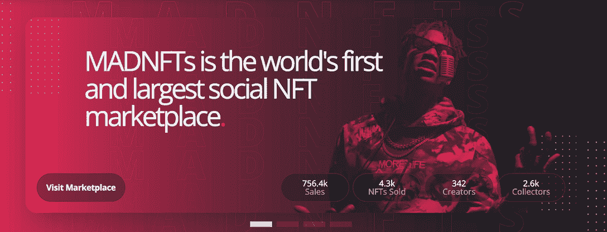
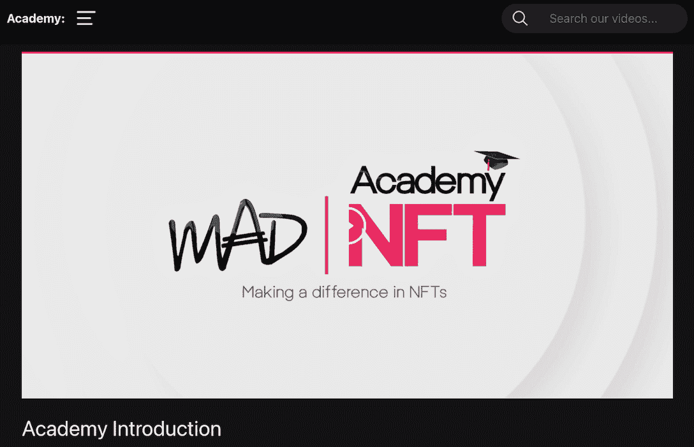
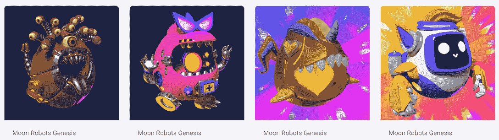
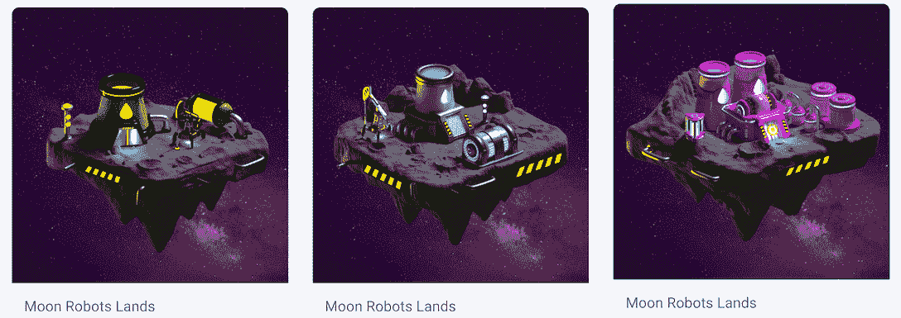

# NFT 关于和谐的最新创新增加了交通流量

> 原文：<https://web.archive.org/web/https://dappradar.com/blog/the-latest-nft-innovations-on-harmony-see-traffic-increase>

## 疯狂 NFT，佐努莱特和月球机器人是和谐的趋势

和声的 NFT 生态系统最近有了新的发展，给区块链带来了很多新的信息。值得注意的是，这些 NFT 项目拥有独特的价值主张，并丰富了与各种新的公用事业和谐相处的用户体验。请继续阅读，了解一些最激动人心的项目。

**内容**

*   [*“疯狂 NFT”——全球第一社交 NFT 市场*](https://web.archive.org/web/20221210121036/https://dappradar.com/blog/the-latest-nft-innovations-on-harmony-see-traffic-increase/#madnft)
*   [*Zonulet——新兴的 NFT 市场*](https://web.archive.org/web/20221210121036/http://zonulet/)
*   [*月球机器人——备受期待的 DeFi 动力战略/RPG*](https://web.archive.org/web/20221210121036/https://dappradar.com/blog/the-latest-nft-innovations-on-harmony-see-traffic-increase/#moonrobots)
*   *[跟上最新的和谐新闻](https://web.archive.org/web/20221210121036/https://dappradar.com/blog/the-latest-nft-innovations-on-harmony-see-traffic-increase/#keep)*

尽管今年加密货币的市场波动很大，但我们看到 NFT 领域的创新仍在继续。更多的 NFT 项目不再只是为了投机而炒作，而是专注于提供以用户为中心的体验和实用工具。

此外，用户正在超越以太坊，进入更广阔的 Web3 生态系统，寻找吸引他们的 NFT 项目。那些引人注目的故事和独特的价值主张正在赢得用户的青睐。今天，我们将在和谐网络上介绍几个最近引起用户关注的 NFT 供电的项目。

## 疯狂 NFT——世界上第一个 NFT 社交市场

MAD NFT 是一个专注于探索 Web3 社交网络和 NFT 用例的项目。通过为粉丝、艺术家、名人和意见领袖提供一个由 NFT 支持的多功能平台，MAD 允许用户在一个透明、分散和高度创造性的空间中进行联系。

MAD NFT 为任何人提供了一整套工具来创建由 NFT 技术支持的环保内容，并策划独一无二的用户体验。这也是一个市场。用户可以在那里发现、查看和收集他们最喜欢的 NFT 收藏品，而这仅仅是疯狂 NFT 用户之旅的开始。

艺术家和创作者可以利用 MAD NFT 通过排名、社会参与和创意活动的影响来创造真正的社区参与。如果你是第一次创作 NFT，不要担心。MAD 有一个学院，为创作者提供一步一步的介绍，让他们熟悉 MAD 平台。一个新的艺术家可以完成学院，并在几堂课内从零知识到原生网络 3。

最重要的是，MAD NFT 正在成为一个无所不包的元宇宙，为任何 Web3 参与者创造、联系和社交提供了一种不同的方式。

[https://web.archive.org/web/20221210121036if_/https://www.youtube.com/embed/BwZ6OpRIDXc?feature=oembed](https://web.archive.org/web/20221210121036if_/https://www.youtube.com/embed/BwZ6OpRIDXc?feature=oembed)

[Check out MAD NFT](https://web.archive.org/web/20221210121036/https://medium.com/harmony-one/mad-launches-on-harmony-b80472a874f8)

## zonulet——新兴的 NFT 市场

Zonulet 是一个去中心化的市场，它利用 IPFS 和 Filecoin 技术来存储用户的 NFTs 文件，并采用 Harmony (ONE)区块链来支持每一项交易。在过去的 30 天里，市场上的独特活动钱包(UAW)增长了 500%以上，交易量增长了 53%。

### 俏皮的 Nafty

下面让我们仔细看看这个平台上一些值得关注的 NFT 项目。

俏皮的 Nafty 是手绘系列 NFT。这些毛绒绒的兔子不是可爱的玩偶；他们是银河系中的猎人，等待他们的收藏家加入他们不可思议的旅程。根据该项目的路线图，持有者可以先睹为快，获得该项目的漫画，访问生态系统中的其他滴滴，折扣等等。

### 维纳里传说

[https://web.archive.org/web/20221210121036if_/https://www.youtube.com/embed/5qn-1wzMVjI?feature=oembed](https://web.archive.org/web/20221210121036if_/https://www.youtube.com/embed/5qn-1wzMVjI?feature=oembed)

《维纳里传奇》是一款创新的区块链游戏，具有梦幻般的视觉元素和探索性的角色扮演游戏。在《维纳里传说》中，玩家可以引诱、驯服和收集维纳里生物，因为它们在玩家驱动的沙盒中争夺领土和稀有资源。

[Explore NFT collections on Zonulet Marketplace](https://web.archive.org/web/20221210121036/https://zonulet.io/)

## 月球机器人——备受期待的 DeFi 动力战略/RPG

期待已久的月球机器人游戏将在几小时后上线。这款游戏已经证明了它的受欢迎程度。在过去的 30 天里，Moon Robots 见证了交易量 256%的增长和独特钱包几乎 100%的增长。

游戏的关键组件包括机器人英雄 NFTs、月球土地 NFTs、物品 NFTs 和石油代币。该游戏是基于网络的，为流畅的桌面和移动用户体验而定制。玩家可以使用他们的机器人和土地来赚取石油，并用这些代币交换和谐区块链上的任何其他密码。

[Check out Moon Robots](https://web.archive.org/web/20221210121036/https://app.moonrobots.one/)

## 跟上最新的和谐新闻

我们将不时向您介绍和谐区块链的趋势和前景。此外，使用达普拉达尔的以下跟踪工具可以帮助您实时了解和谐区块链的最新发展。

*   在 Harmony 上流行流行音乐让你发现最流行的流行音乐
*   [使用令牌浏览器跟踪并交换一个令牌](https://web.archive.org/web/20221210121036/https://dappradar.com/hub/token/eth/ONE?from=0x68ac1affe00cf64ebc71e7e835a6871a379c5587)
*   最新[新闻](https://web.archive.org/web/20221210121036/https://dappradar.com/blog/tag/harmony)为您带来和谐的最新消息

了解更多关于和谐的信息。

*   [网站](https://web.archive.org/web/20221210121036/https://www.harmony.one/)
*   [白皮书](https://web.archive.org/web/20221210121036/https://harmony.one/whitepaper.pdf)
*   [推特](https://web.archive.org/web/20221210121036/https://twitter.com/harmonyprotocol)

**免责声明** —这是一篇赞助文章。DappRadar 不认可本页面上的任何内容或产品。DappRadar 旨在提供准确的信息，但读者应该在采取行动之前总是自己做研究。DappRadar 的文章不能被认为是投资建议。