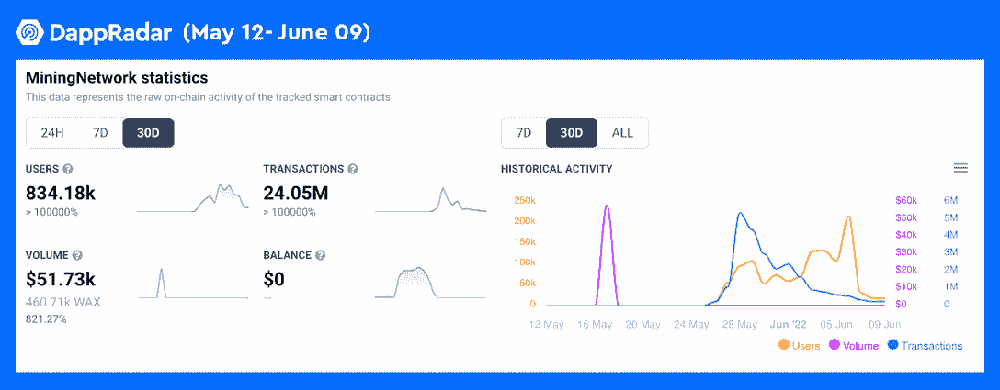
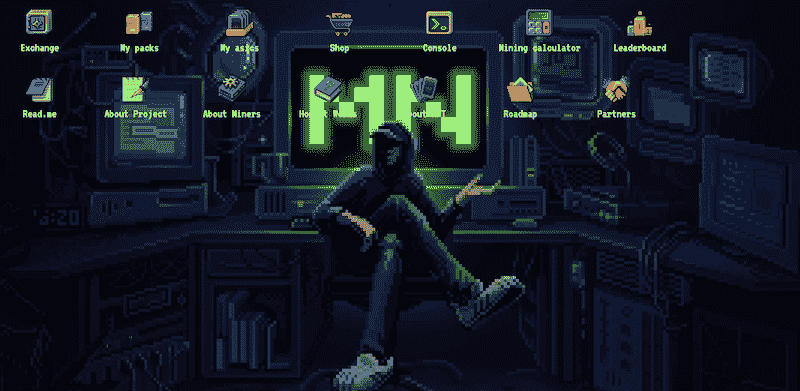
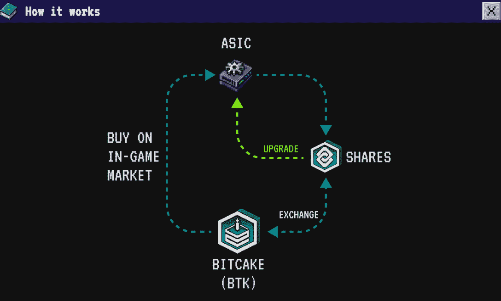
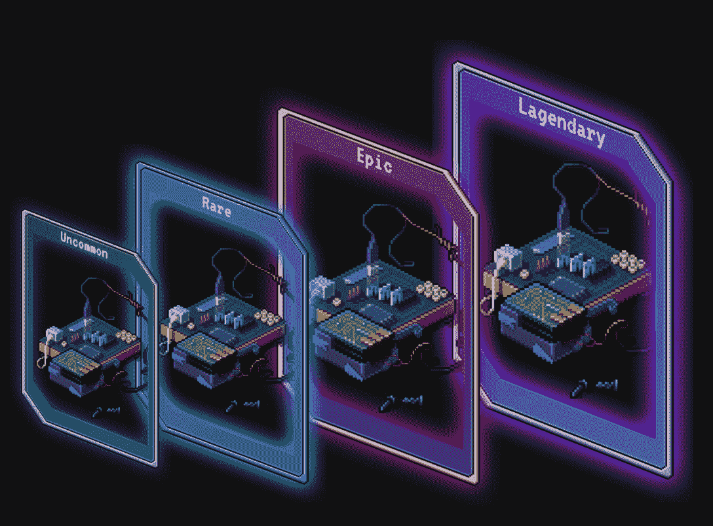
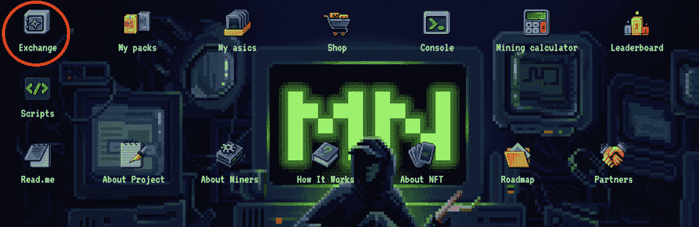
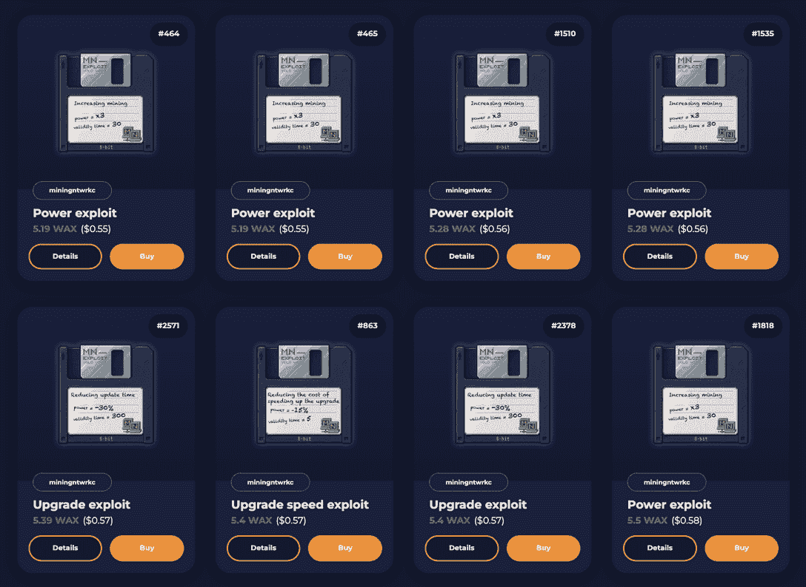

# 什么是挖掘网络，为什么它吸引了创纪录数量的用户

> 原文：<https://web.archive.org/web/https://dappradar.com/blog/the-miningnetwork-game-on-wax-attracted-more-than-800k-users-within-30-days>

## 学习一切你需要知道的关于采矿网络的终极指南

****“采矿网”是一款生活在区块链的 NFT 即玩即赚采矿游戏。在推出后不久，采矿网络在 DappRadar 排名板上排名前 3，成为从 5 月 12 日到 09 年 6 月蜡生态系统中玩得最多的 NFT 游戏之一。****

目前密码行业的熊市趋势可能会持续一段时间。或许，沉浸在游戏中是一种更好的麻木痛苦的方式，尤其是当它给玩家带来利润的时候。

**内容:**

*   [什么是挖矿网？](https://web.archive.org/web/20221003183025/https://dappradar.com/blog/the-miningnetwork-game-on-wax-attracted-more-than-800k-users-within-30-days/#what-is)
    *   [独特的经济模式](https://web.archive.org/web/20221003183025/https://dappradar.com/blog/the-miningnetwork-game-on-wax-attracted-more-than-800k-users-within-30-days/#unique-model)
*   [如何开始玩矿网？](https://web.archive.org/web/20221003183025/https://dappradar.com/blog/the-miningnetwork-game-on-wax-attracted-more-than-800k-users-within-30-days/#how-to-start)
    *   [准备好你的蜡钱包，登录游戏。](https://web.archive.org/web/20221003183025/https://dappradar.com/blog/the-miningnetwork-game-on-wax-attracted-more-than-800k-users-within-30-days/#get-wax-wallet)
*   [游戏赚取机制是如何运作的？](https://web.archive.org/web/20221003183025/https://dappradar.com/blog/the-miningnetwork-game-on-wax-attracted-more-than-800k-users-within-30-days/#mechanism)
*   [如何提升矿力，获得更多奖励？](https://web.archive.org/web/20221003183025/https://dappradar.com/blog/the-miningnetwork-game-on-wax-attracted-more-than-800k-users-within-30-days/#boost-mining-power)
*   [如何皈依 BTK 教？](https://web.archive.org/web/20221003183025/https://dappradar.com/blog/the-miningnetwork-game-on-wax-attracted-more-than-800k-users-within-30-days/#convert-btk)
*   [挖矿网有哪些最新更新？](https://web.archive.org/web/20221003183025/https://dappradar.com/blog/the-miningnetwork-game-on-wax-attracted-more-than-800k-users-within-30-days/#latest-updates)
    *   黑客辅助 NFT 被添加为采矿助推器。
    *   为资金分配引入了加密银行。

## 什么是挖矿网？

[挖矿网](https://web.archive.org/web/20221003183025/https://dappradar.com/wax/games/miningnetwork)是 t 上的 NFT 游戏[他蜡区块链](https://web.archive.org/web/20221003183025/https://dappradar.com/rankings/protocol/wax)，一个[充满活力的 NFT 和游戏生态系统](/web/20221003183025/https://dappradar.com/blog/introducing-the-new-wax-tokenomic-model/)。该游戏于 5 月下旬推出，用户数量急剧增加，从 5 月中旬到 6 月中旬，恢复了超过 80 万个独特的钱包。该游戏目前在 Wax 上排名前 5，与[外星世界](https://web.archive.org/web/20221003183025/https://dappradar.com/multichain/games/alien-worlds)、[农民世界](https://web.archive.org/web/20221003183025/https://dappradar.com/wax/games/farmers-world)、[袋熊地下城主](https://web.archive.org/web/20221003183025/https://dappradar.com/wax/games/wombat-dungeon-master)和[探矿者](https://web.archive.org/web/20221003183025/https://dappradar.com/wax/games/prospectors)并列。

### 独特的经济模式

矿业网络拥有独特的经济模式。在游戏中，玩家必须使用采矿设备来获取游戏资源；也就是股份。之后，玩家可以将股份兑换成游戏的原生代币。值得一提的是，抽取的游戏资源量并不等于代币的发放数量。

份额会随着玩家数量的增加而增加。相反，游戏代币的发行会不断减少。这种设计保证了代币价格不断上涨，同时避免了游戏资源的膨胀。

## 如何开始玩矿网？

采矿网络的游戏相当简单明了，但它可以变得相当上瘾。本质上，挖矿网是一款模仿挖矿机挖矿过程的游戏，用户获取 ASIC 开始挖掘游戏内奖励。

对于那些不熟悉加密挖掘的人来说，ASIC 代表专用集成电路挖掘器。它们是明确设计用于挖掘加密货币的计算机，广泛用于比特币挖掘。在采矿网络的情况下，它们是 ASIC NFTs。

该游戏的免费机制授予每个用户一个免费的 NFT，登录后即可开始游戏并获得奖励。由于游戏在蜡上，用户需要用他们的蜡钱包登录。

### 准备好你的蜡钱包，登录游戏

对于那些还没有创建一个蜡钱包的人，下面的分步视频教程将指导用户完成这个过程。

[https://web.archive.org/web/20221003183025if_/https://www.youtube.com/embed/0U1VTx8owbQ?feature=oembed](https://web.archive.org/web/20221003183025if_/https://www.youtube.com/embed/0U1VTx8owbQ?feature=oembed)

最重要的是，拥有一个 Wax 钱包还可以让用户在 Wax 上探索各种各样的游戏，如[外星人世界](https://web.archive.org/web/20221003183025/https://dappradar.com/multichain/games/alien-worlds)、[农民世界](https://web.archive.org/web/20221003183025/https://dappradar.com/wax/games/farmers-world)和[区块链格斗家](https://web.archive.org/web/20221003183025/https://dappradar.com/wax/games/blockchain-brawlers)。

## “玩到赚”机制是如何工作的？

现在，让我们更仔细地看看“玩到赚”部分。这个游戏的首要目标是收集尽可能多的奖励。要开始采矿，玩家需要至少一个 ASIC NFT，并且可以简单地使用采矿网络丢弃的免费 ASIC。

接下来，用户单击“Stake”按钮，批准交易，挖掘将立即开始。几分钟后，玩家可以看到股份分配到他们的帐户。就这么简单？是啊！

一旦玩家获得了相当数量的股份，他们可以将这些股份出售给“比特蛋糕”(BTK)，这是采矿网络的游戏内代币。用户可以花一些 btk 从游戏内市场获得更多的 ASIC，或者升级 ASIC 以获得更高的采矿能力。

BTK 已经在 Alcor 交易所上市，这意味着用户可以出售它们来换取蜡。

## 如何提升矿力，获得更多奖励

为了获得更大的份额，玩家需要提升 ASICs 的等级和采矿能力。怎么做呢？用户可以花一些 btk 来升级他们的 ASICs，以达到更高水平的挖矿能力。此外，通过直接从 Wax 的 NFT 市场购买更多的 ASICs， [AtomicHub](https://web.archive.org/web/20221003183025/https://dappradar.com/wax/other/atomicassets) 也可以获得采矿能力。这种方法旨在扩大开采规模。

## 如何皈依 BTK 教

要将股份转换为 btk，用户需要点击界面左上角的“交换”按钮。用户将看到“出售 SH”和“购买 SH”。成功将 SH 转换为 BTK 后，用户可以在 Alcor Exchange 上出售 BTK 来换取 WAX。

## 来自采矿网络的最新更新

在矿业网络的最初狂热之后，该团队继续向游戏中添加新元素，以丰富其可玩性。

### 黑客辅助 NFT 被添加为采矿助推器

黑客辅助 NFT 是给玩家暂时好处的工具。它们有助于提高一定时期的开采率，并减少更新时间和成本。有两种类型的 NFT。“Exploit”只能使用一次，“Scripts”可以在一定期限内无限次使用。用户可以在 AtomicHub 上找到它们。

### 引入加密银行用于资金分配

加密银行是社区筹集和分发的工具

资金。启动后，该团队将通过各种方式使用收到的资金，以增强生态系统的可持续性。其中包括增加 BTK 的流动性，从市场上回购游戏内资产，向社区进行空投。

## 最后的想法

挖矿网的人气迅速上升，很可能是因为它的免费机制，让每个人都可以几乎零成本开始赚钱。此外，易于理解的游戏玩法主要降低了用户的准入门槛，潜在地允许游戏扩展到更广泛的受众。

DappRadar 将继续监测[采矿网络](https://web.archive.org/web/20221003183025/https://dappradar.com/wax/games/miningnetwork)、[蜡](https://web.archive.org/web/20221003183025/https://dappradar.com/rankings/protocol/wax)和[游戏赚取领域](https://web.archive.org/web/20221003183025/https://dappradar.com/blog/tag/play-to-earn)的最新发展。在 [Twitter](https://web.archive.org/web/20221003183025/https://twitter.com/dappradar) 、 [Discord](https://web.archive.org/web/20221003183025/https://discord.gg/4ybbssrHkm) 和 [Youtube](https://web.archive.org/web/20221003183025/https://www.youtube.com/c/DappRadar) 上关注我们，跟上动态的区块链世界。

了解更多关于 Wax 的信息:

[网站](https://web.archive.org/web/20221003183025/https://wdny.io/carbon-offset-virls/) [推特](https://web.archive.org/web/20221003183025/https://twitter.com/WAX_io) [不和](https://web.archive.org/web/20221003183025/https://go.wax.io/Discord)

**免责声明** —这是一篇赞助文章。DappRadar 不认可本页面上的任何内容或产品。DappRadar 旨在提供准确的信息，但读者应该在采取行动之前总是自己做研究。DappRadar 的文章不能被认为是投资建议。