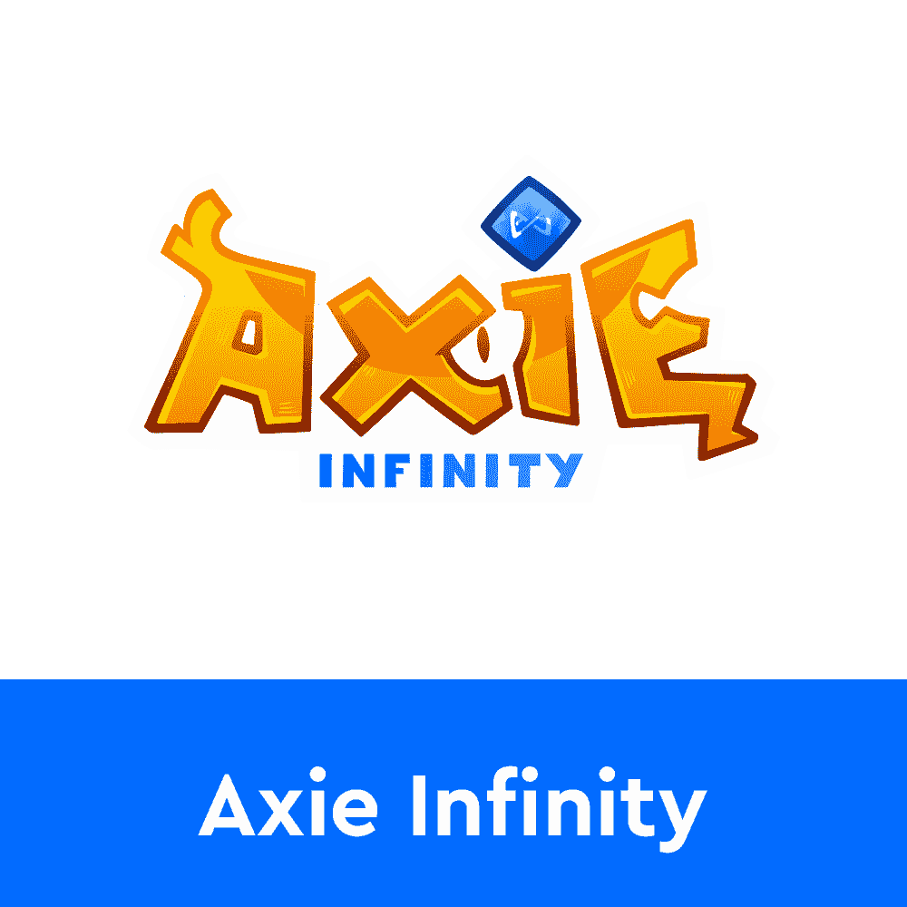
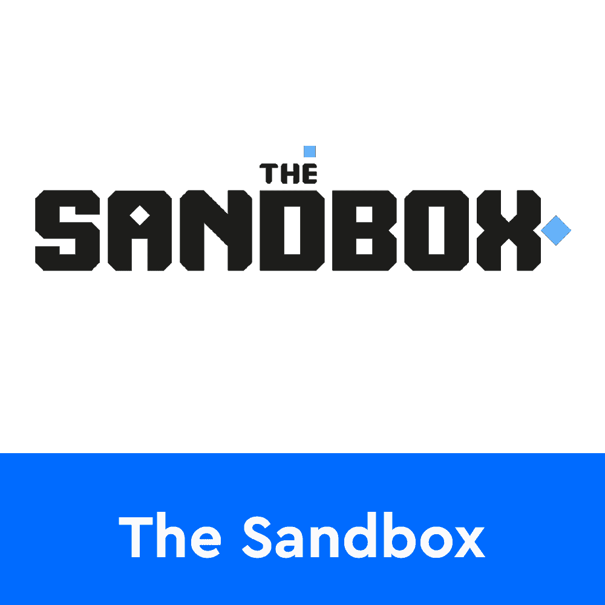
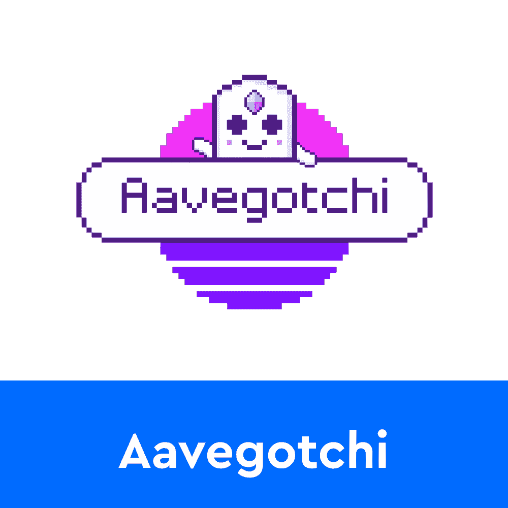
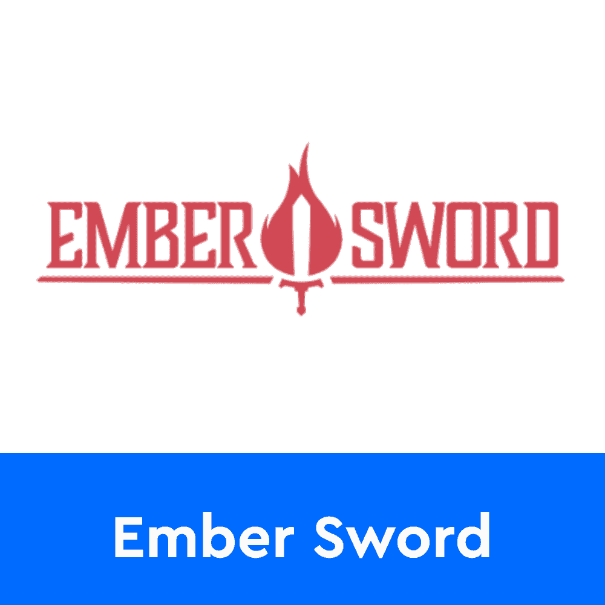
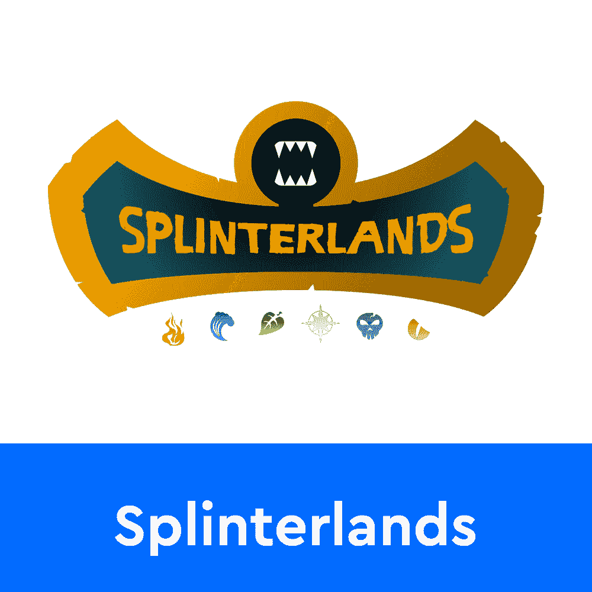
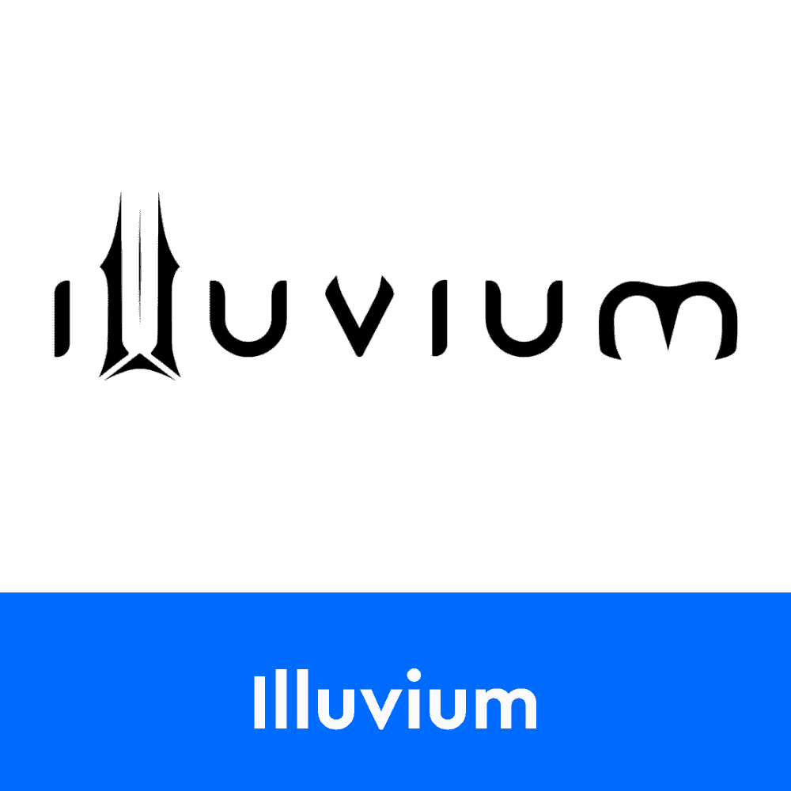
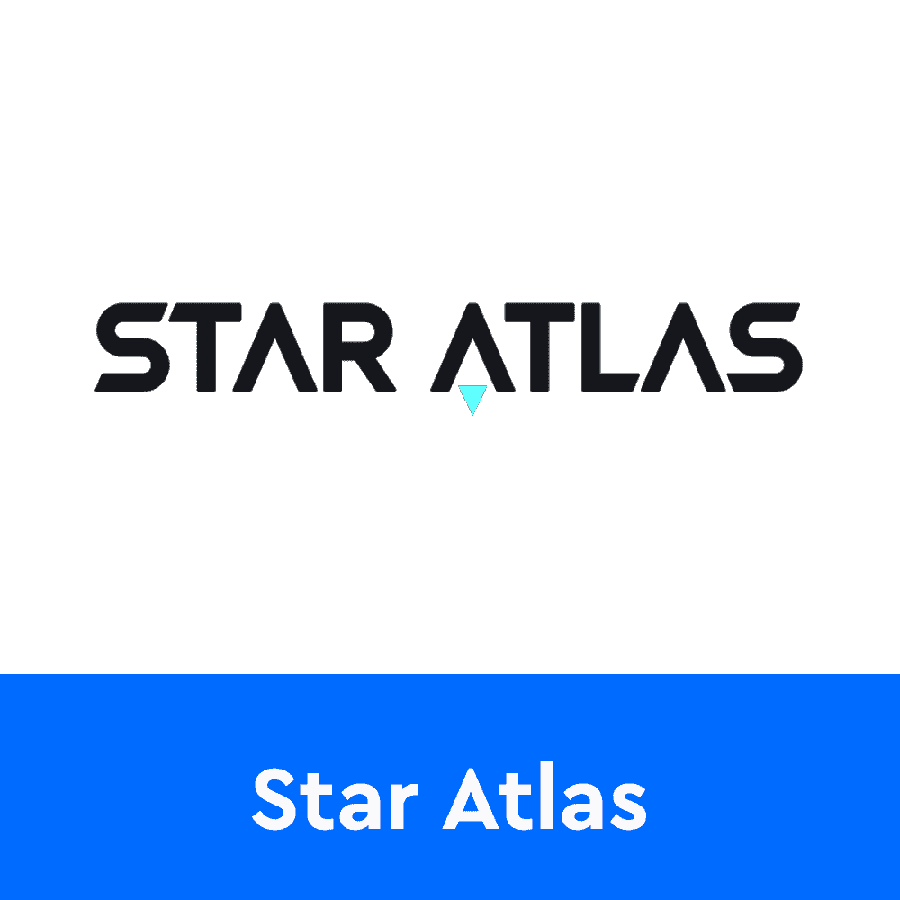
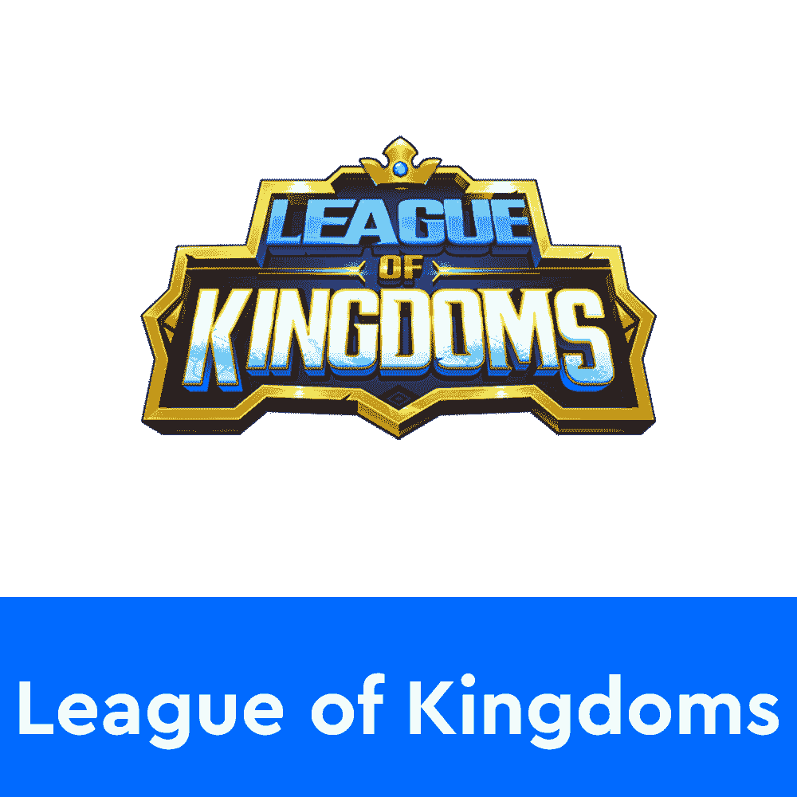
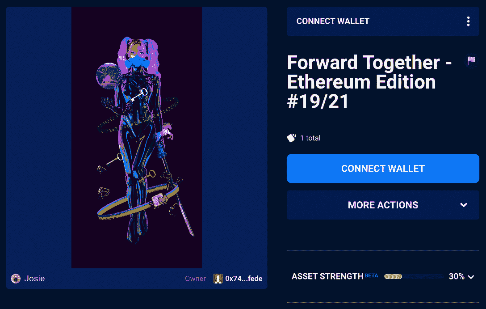

# DAO 的力量和 Gabby Dizon 的区块链游戏

> 原文：<https://web.archive.org/web/https://dappradar.com/blog/the-power-of-the-dao-and-blockchain-gaming-with-gabby-dizon>

## 达普拉达采访了 Yield Guild Games 的联合创始人加贝·迪松

**欢迎来到新的 DappRadar Crypto Influencer 系列，从 DAO、gaming 和领跑者 Gabby Dizon 的力量开始。这个项目旨在向您介绍密码行业的杰出人物，并揭示他们的项目和方法对整个区块链空间的影响。**

本周，我们很荣幸地选择了 Gabby Dizon 的大脑，他是区块链游戏的先驱，也是一位狂热的 NFT 收藏家。他还是区块链游戏领域最大的公会社区 Yield Guild Games[的联合创始人。](https://web.archive.org/web/20221206171122/https://yieldguild.io/)

## 快速常见问题

1.  **姓名:**饶舌迪宗
2.  **推特账号:**【https://twitter.com/gabusch】T2
3.  推特关注者:85600 人
4.  **钱包地址:** [公文包](https://web.archive.org/web/20221206171122/https://dappradar.com/hub/wallet/eth/0x7405fe24003a50e4f4117d35e9b5a9f5e512fede)
5.  **最高值 NFT:** [CloneX #14119](https://web.archive.org/web/20221206171122/https://dappradar.com/hub/assets/eth/0x49cf6f5d44e70224e2e23fdcdd2c053f30ada28b/17789)
6.  **最心爱的 NFT:** [YGG 创始人币](https://web.archive.org/web/20221206171122/https://dappradar.com/hub/assets/eth/0xd07dc4262bcdbf85190c01c996b4c06a461d2430/119180)和[一起向前——以太坊版#19/21](https://web.archive.org/web/20221206171122/https://dappradar.com/hub/assets/eth/0x3d9b128ce781a4a9c1057f785d97131a6357ca38/4700030019)
7.  **最喜欢的 NFT 收藏:** [CloneX](https://web.archive.org/web/20221206171122/https://dappradar.com/ethereum/collectibles/clone-x-x-takashi-murakami)
8.  **最喜欢的区块链游戏:** [Axie Infinity](https://web.archive.org/web/20221206171122/https://dappradar.com/multichain/games/axie-infinity)
9.  **最大加密中奖:**参加 Axie 2019 卖地
10.  最大的加密失败:为 6 个 ETH 出售一个双神秘轴

## 加密的第一步，开发者的自由

Gabby Dizon 是一个视频和网络游戏迷。大约 20 年前，他作为一名游戏开发人员开始了自己的职业生涯，但区块链的空间很快吸引了他。2003 年，他成为制作第一款来自菲律宾的游戏的团队成员。

2014 年，他与人合作创办了一家名为 Altitude Games 的手机游戏工作室，并开始为 iOS 和 Android 设备制作游戏。最后，在 2017 年，关于区块链和以太坊的消息，以及智能合约和可编程货币的概念进入了 Dizon 的视野。

从那以后，他一直是游戏和 NFT 社区的活跃成员，探索这个领域的新领域。最重要的是，Gabby Dizon 共同创立了 Yield Guild Games，这是迄今为止最大的游戏公会之一。据加贝说，吸引他进入区块链理工大学的最大因素是它为开发者提供的自由。他在传统游戏领域的经历让他意识到，在大型游戏工作室中，创造力和创新往往会被扼杀，而在区块链制作的游戏为这个行业的未来提供了一个全新的视角。

> 当我了解到区块链和以太坊时，我立刻想到这将会改变游戏产业。起初，我在寻找一种技术，它将颠覆这个行业，重新创造公平的竞争环境，但我在密码领域的时间里发现，它不仅会创造公平的竞争环境，而且还会以一种给人们带来独立性的方式做到这一点。想要创作独立游戏的个人创作者和团队都有机会这样做。”

## 战斗赛车、屈服公会游戏和 Axie Infinity

Gabby Dizon 第一次进军区块链游戏领域是推出《战斗赛车》。该游戏是分散式生态系统的一部分，允许玩家在虚拟世界中驾驶他们最喜欢的 NFT 赛车。 [Battle Racers 现已停产](https://web.archive.org/web/20221206171122/https://dappradar.com/blog/battle-racers-shuts-down-what-about-these-5-alternatives/)。然而，这为 Gabby 开始积极探索区块链游戏奠定了坚实的基础。

2018 年，他加入了 [Axie Infinity](https://web.archive.org/web/20221206171122/https://dappradar.com/multichain/games/axie-infinity) 社区，这将激励他开始从事 Yield Guild 游戏的工作。作为 Axie 平台的早期采用者，Gabby 很快与游戏的创始成员建立了友谊。根据他的说法，Axie Infinity 社区是该领域最受欢迎的社区之一，这帮助该游戏飙升至游戏排行榜的首位。

在这种热烈欢迎的基础上，Gabby Dizon 受到启发，创建了一个平台，可以帮助世界各地的玩家加入奖学金计划和公会。这是 Yield Guild Games 的开始，它现在已经成为全球最大的游戏社区之一。

> “Axie 一直是最受欢迎的社区，我一直很欣赏他们在游戏中加入 DeFi 元素的方式。”

## 道的力量与地方社会

Yield Guild Games 是一个游戏公会，聚集了全球玩家社区。重要的是，该平台允许玩家组建团队和管理结构。YGG 通过围绕不同的“玩赚”项目的各种锦标赛和活动，培养了数百个“玩赚”团队。

Yield Guild 游戏平台的一个最重要的方面是，它作为一个分散的自治组织或 DAO 发挥作用。社区成员对 DAO 拥有独占控制权。这允许每个人都参与到项目的治理中。重要的是，Gabby Dizon 认识到了 DAO 为该社区的成员创造领导角色的力量。

Yield Guild Games 建立了一个复杂的子联盟网络。这使得当地社区能够创建内部结构，更有效地帮助成员。Gabby Dizon 为 Yield Guild 游戏感到自豪的一个伟大时刻是，该平台给了真实的人一个在他们热爱的事情上超越他人的机会。该平台最大的目标和成就之一是在 Yield Guild 游戏社区的各个方面培养人才和领导力。

> 我们在东南亚(YGG 海)、印度(IndiGG)和拉丁美洲(OLA GG)设有分部。看到每个玩家群体的成长令人惊叹，每个人都是独一无二的，但他们在做自己喜欢的事情、从中获得回报以及寻找机会改善自己和周围人的生活方面是多么团结。”

## Gabby Dizon 最喜欢的区块链游戏

作为一个以游戏为中心的平台，Yield Guild Games 已经将其影响力扩展到众多区块链游戏项目。迄今为止，YGG 已经建立了超过 28 个成功的合作伙伴关系，帮助各个项目的社区实现其目标。

在整个旅程中， [Gabby Dizon](/web/20221206171122/https://dappradar.com/cdn-cgi/l/email-protection#d0b7b1b2b2a990a9b9b5bcb4b7a5b9bcb4feb7b1bdb5a3) 选择了不止一两个令人兴奋的项目添加到他的最爱列表中。你可以在下面看看他的一些最佳选择。令人印象深刻的是，他并没有将自己局限于某一种游戏。名单是多种多样的，包括赛车游戏，交易卡游戏，以及各种各样的游戏赚取项目。

[<picture></picture>](https://web.archive.org/web/20221206171122/https://dappradar.com/multichain/games/axie-infinity)[<picture></picture>](https://web.archive.org/web/20221206171122/https://dappradar.com/ethereum/games/the-sandbox)[<picture></picture>](https://web.archive.org/web/20221206171122/https://dappradar.com/polygon/games/aavegotchi)[<picture></picture>](https://web.archive.org/web/20221206171122/https://dappradar.com/polygon/games/ember-sword)[<picture></picture>](https://web.archive.org/web/20221206171122/https://dappradar.com/multichain/games/splinterlands)[<picture></picture>](https://web.archive.org/web/20221206171122/https://dappradar.com/ethereum/games/illuvium)[<picture></picture>](https://web.archive.org/web/20221206171122/https://dappradar.com/solana/games/star-atlas)[<picture></picture>](https://web.archive.org/web/20221206171122/https://dappradar.com/multichain/games/league-of-kingdoms)[<picture></picture>](https://web.archive.org/web/20221206171122/https://yieldguild.games/)

Gabby Dizon 也在积极关注游戏领域的后起之秀，这些后起之秀可以成为公会游戏合作伙伴名单的重要补充。据他说，最近吸引他眼球的项目之一是 CyBall，这是一款刚刚推出的以足球为主题的区块链游戏。

> CyBall 有不同的模式，以有趣的游戏流程吸引休闲玩家和竞技玩家。YGG 开始在 CyBall 中加入学者，我们正在不断增加更多资产以满足学者的需求。”

## NFTs 上的 Gabby Dizon

区块链游戏通常会在游戏中加入不可替代的令牌，即 NFT。这是一个很好的方式，让玩家可以完全拥有游戏中的资产。Axie Infinity 是这种方法的先驱平台，这引发了 Gabby Dizon 的兴趣。Axie NFTs 是迄今为止区块链最大的游戏资产集合。

Gabby 认为更大的成就是 Axie Infinity 继续创新。该项目将很快允许玩家充分利用他们对自己的 Axies 拥有的知识产权。从这个意义上说，Axie Infinity NFT 不仅是游戏中的一个可玩角色，也是玩家释放创意和使用 Axie 作为基础的机会。

Axie Infinity 引发了 Dizon 对 NFTs 的兴趣，但这种热情已经超越了游戏中的物品。目前，Gabby 最喜欢的收藏是 CloneX。这是一个由 RTFKT 工作室创作的阿凡达 NFT 项目，他持有其中的七个。他还使用 [CloneX #184](https://web.archive.org/web/20221206171122/https://dappradar.com/hub/assets/eth/0x49cf6f5d44e70224e2e23fdcdd2c053f30ada28b/14691) 作为他的 Twitter 个人资料图片。令人印象深刻的是，在[的投资组合](https://web.archive.org/web/20221206171122/https://dappradar.com/hub/wallet/eth/0x7405fe24003a50e4f4117d35e9b5a9f5e512fede/nfts)中，超过 2000 个独特的 NFT 中，最昂贵的一个 [CloneX #14119](https://web.archive.org/web/20221206171122/https://dappradar.com/hub/assets/eth/0x49cf6f5d44e70224e2e23fdcdd2c053f30ada28b/17789) ，也属于令人垂涎的 RTFKT 项目。

有趣的是，Gabby 最喜欢的 NFT 不属于 CloneX 系列。 [YGG 创始人币](https://web.archive.org/web/20221206171122/https://dappradar.com/hub/assets/eth/0xd07dc4262bcdbf85190c01c996b4c06a461d2430/119180)和[一起向前——以太坊版#19/21](https://web.archive.org/web/20221206171122/https://dappradar.com/hub/assets/eth/0x3d9b128ce781a4a9c1057f785d97131a6357ca38/4700030019) 都对 Yield 公会游戏联合创始人有感情价值。 [YGG 创始人硬币](https://web.archive.org/web/20221206171122/https://dappradar.com/hub/assets/eth/0xd07dc4262bcdbf85190c01c996b4c06a461d2430/119180)纪念屈服公会游戏项目的开始。另一方面，[一起向前](https://web.archive.org/web/20221206171122/https://dappradar.com/hub/assets/eth/0x3d9b128ce781a4a9c1057f785d97131a6357ca38/4700030019)是他对整个区块链空间及其优点的看法的一种表现。

> *“为数不多的我绝对不会卖的 NFT 是”* [*一起向前*](https://web.archive.org/web/20221206171122/https://dappradar.com/hub/assets/eth/0x3d9b128ce781a4a9c1057f785d97131a6357ca38/4700030019) *”乔西·贝里尼。我收集的第一件加密艺术品来自她，这代表了以太坊空间，技术的进步，以及以太坊如何以分散的方式与 DeFi，NFTs 和文化一起前进。”*

## NFT 艺术与建筑作品集

NFT 空间是区块链空间中增长最快的部分之一。它为人们提供了收集和建立令人印象深刻的投资组合的机会，并通过翻转收藏品获得令人印象深刻的收益。这通常是 NFT 收集的两个方面，你要么是一个鳍状肢，要么是一个霍德勒。

加贝·迪松称自己为霍德勒。他建立了一个令人印象深刻的投资组合，目前价值超过 180 万美元。你可以用 DappRadar 投资组合跟踪器浏览他的收藏。

作为一名 NFT 收藏家，Gabby Dizon 的一些数据令人印象深刻:

*   他总共拥有 2055 辆 NFT
*   他是一个狂热的 Avastars 收藏家，收藏了 44 件 Avastars NFTs

Gabby 也是一个狂热的秘密艺术收藏家。他最喜欢的艺术家之一是乔西·贝里尼，她最近推出了她的第一个头像 NFT 系列。除了[贝利尼的项目](https://web.archive.org/web/20221206171122/https://dappradar.com/hub/wallet/eth/0x7405fe24003a50e4f4117d35e9b5a9f5e512fede/nfts/1/josie)，迪宗还拥有 [10 个生成性艺术板块](https://web.archive.org/web/20221206171122/https://dappradar.com/hub/wallet/eth/0x7405fe24003a50e4f4117d35e9b5a9f5e512fede/nfts/1/art-blocks-curated)。他另一个最喜欢的艺术家是雪莉·索内亚。

虽然 Gabby Dizon 已经建立了令人印象深刻的收藏，但他并不反对出售 NFT 来获利。尽管如此，他最大的密码失误之一是以 6 ETH 的价格出售了一个双神秘的 Axie NFT。这些债券去年曾创下逾 20 ETH 的最低价格。

> “与其说我是一个收藏家，不如说我是一个收藏家，但同时，我也意识到要创造流动性，而不是在我需要钱的时候被困在一个流动性差的 JPEG 收藏中。所以我确实会时不时地获利，但我不会真的日内交易 NFTs，因为这不是我当初买入 NFTs 的原因。”

## 区块链空间将何去何从？

尽管比特币在 10 多年前就已问世，但区块链领域仍处于起步阶段。用例与应用的生态系统还处于早期发展阶段。根据 Gabby Dizon 的说法，未来五年将见证区块链游戏空间的繁荣。他在 Yield Guild Games 的工作向他表明，对奖学金的需求是无穷无尽的，每天都有更多的玩家在寻找进入游戏赚钱空间的方法。

他预测，到 2022 年底，将有超过 1000 万个独立的活动钱包与一款基于区块链的游戏互动。作为背景，根据 2021 年 12 月版的 [DappRadar 和 BGA Games 报告](https://web.archive.org/web/20221206171122/https://dappradar.com/blog/bga-blockchain-game-report-2021)，2021 年每天有超过 140 万个独特的活动钱包与游戏 dapps 互动。

当涉及到生产公会游戏时，该项目计划让数百万人进入元宇宙和加密经济。尤其是那些无力预先购买自己的 NFT 或加密资产的人。该公司的主要目标之一将是实现元宇宙的民主化。为了做到这一点，YGG 将再次依靠刀的力量。该项目将继续通过分区域将业务扩展到新的区域。此外，Gabby Dizon 的团队将把重点放在专注于 Yield Guild 游戏中特定游戏社区的游戏特定子 Dao 上。一些已经存在的游戏特定子部门的例子包括 YGGLOK ( [王国联盟](https://web.archive.org/web/20221206171122/https://dappradar.com/multichain/games/league-of-kingdoms))和 YGGSPL ( [夹板地](https://web.archive.org/web/20221206171122/https://dappradar.com/multichain/games/splinterlands))。

在 NFTs 的话题上，Gabby Dizon 预测基于 NFT 的平台将会更加开放。尤其是允许开发商利用他们在 NFT 的资产，创建新的衍生项目。重要的是，这将使 NFTs 成为基础资产，而不仅仅是游戏中的一个元素。

> “我认为，随着一些平台不断增值(例如 Axie Infinity)，我们将会在 Axie 或 CloneX 等非常受欢迎的 NFT 项目的基础上开发更多的应用程序。获得最大价值的资产成为自己的平台，因为在 crypto 中，应用和体验是建立在这些资产之上的，而不是相反。”

## 谢谢你，加贝·迪宗！

非常感谢 Gabby Dizon 为 DappRadar Crypto Influencer 系列提供了一个如此好的开端。如果你喜欢阅读这篇采访，请在 Twitter 上关注 DappRadar，首先获得最新消息和更新。

> “我很高兴 Web3 能为全世界的人们提供加班的机会，并消除人们已经习惯的地理界限。”

像 Gabby 一样，我们对 web3 革命感到兴奋。随着新项目和有影响力的知名人士成为焦点，我们将继续关注这一领域。要了解更多关于加贝·迪松和他的区块链项目的信息，请在推特上关注他，并查看《T2》的收益公会游戏。

 NewsletterUnsubscribe at any time. [T&Cs](https://web.archive.org/web/20221206171122/https://dappradar.com/terms) and [Privacy Policy](https://web.archive.org/web/20221206171122/https://dappradar.com/privacy-policy)