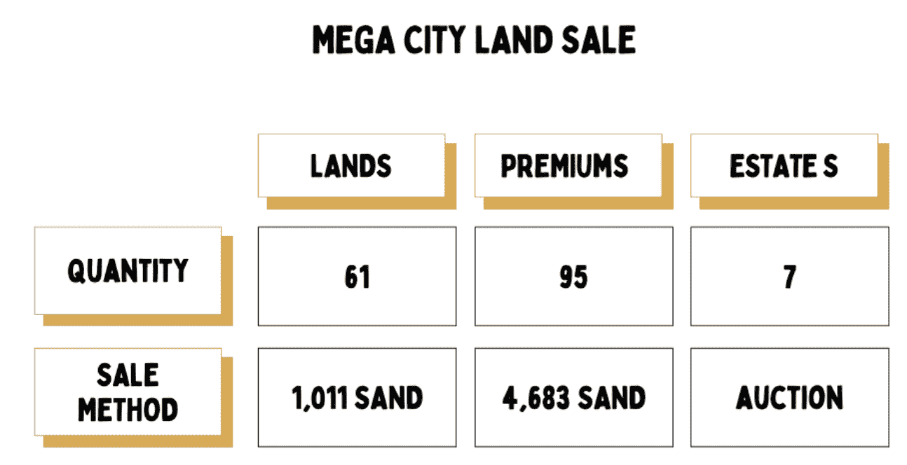

# 沙盒宣布特大城市土地出售

> 原文：<https://web.archive.org/web/https://dappradar.com/blog/the-sandbox-announces-mega-city-land-sale>

## 新社区将于 1 月 13 日推出

沙盒是目前最受欢迎的虚拟世界之一，它宣布一个名为 Mega City 的新社区将于 1 月 13 日上线。根据官方声明，新的区域将成为来自香港的多个合作伙伴的空间。 **这些人包括来自电影、音乐、娱乐、表演、金融、房地产和游戏行业的明星**。

沙盒中新的大城市社区将由许多不同大小和价格的地块组成。为了参与销售，游戏玩家和投资者将需要沙子代币来购买土地和 ETH 来支付他们购买的汽油费。

在已经承诺在大城市地区积累经验的合作伙伴中，我们发现了像企业家 Adrian Cheng 这样的名字。此外，沙盒还吸引了娱乐明星冯德伦和舒淇。

除了获得元宇宙的一块优质土地之外，这些地块还获得了许多 NFT 奖励。优质地块将提供六个额外的 NFT 之一。从冯德伦和舒淇的猫到巨美的反派角色 NFT 的头像。

[https://web.archive.org/web/20221129082722if_/https://www.youtube.com/embed/hhaj31Huc1s?start=1&feature=oembed](https://web.archive.org/web/20221129082722if_/https://www.youtube.com/embed/hhaj31Huc1s?start=1&feature=oembed)

## 对沙坑土地的需求激增

根据最近 DappRadar 对虚拟世界的分析，沙盒是目前元宇宙最热门的空间之一。平台上对虚拟土地的需求正在稳步增长，地块售价过高。例如，去年 11 月，雅达利庄园旁边的一块土地以 44 ETH 的价格售出，约合 191.190 美元。你可以看看下面其他一些令人印象深刻的地块销售。

随着人们对虚拟世界土地的兴趣持续增长，预计沙盒这样的平台将继续提供地块出售。这一过程是不可避免的，因为越来越多的人想拥有一片元宇宙。

DappRadar 将继续监测元宇宙，因为它正在成为下一个世界性的现象。要了解更多关于沙盒和虚拟世界的知识，请查看下面有用的链接。你也可以在社交媒体上关注 DappRadar。或者，你可以加入独家 [DappRadar PRO](https://web.archive.org/web/20221129082722/https://dappradar.com/token/pro) Discord 频道，寻找最新的 NFT 销售数据。

[<picture></picture>](https://web.archive.org/web/20221129082722/https://dappradar.com/ethereum/games/the-sandbox)[<picture></picture>](https://web.archive.org/web/20221129082722/https://dappradar.com/hub/token/eth?to=0x3845badade8e6dff049820680d1f14bd3903a5d0)[<picture></picture>](https://web.archive.org/web/20221129082722/https://dappradar.com/blog/the-sandbox-land-valuation-report) NewsletterUnsubscribe at any time. [T&Cs](https://web.archive.org/web/20221129082722/https://dappradar.com/terms) and [Privacy Policy](https://web.archive.org/web/20221129082722/https://dappradar.com/privacy-policy)