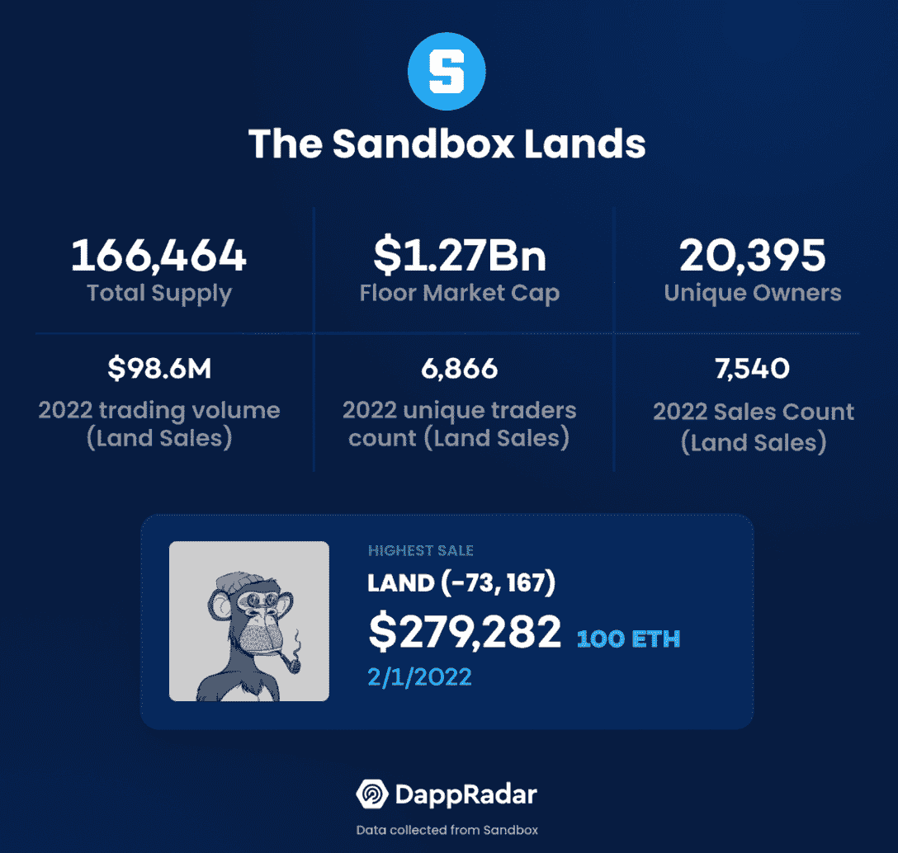
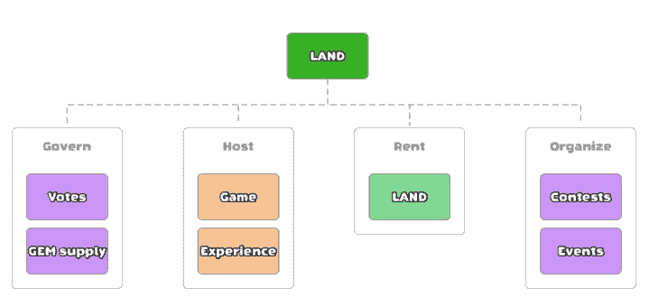
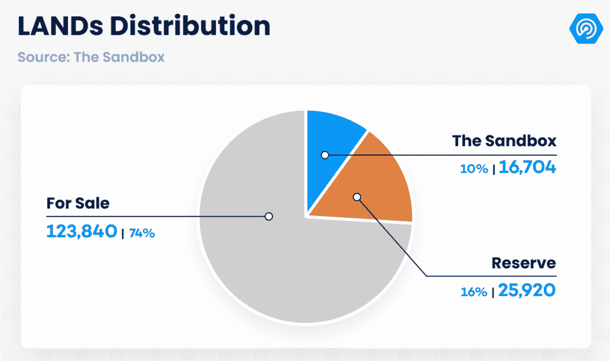
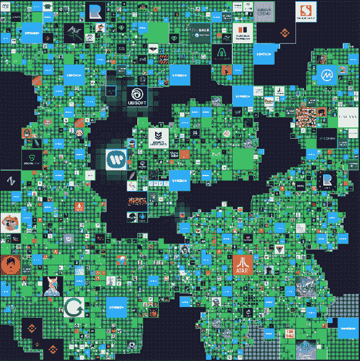
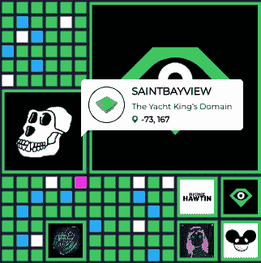
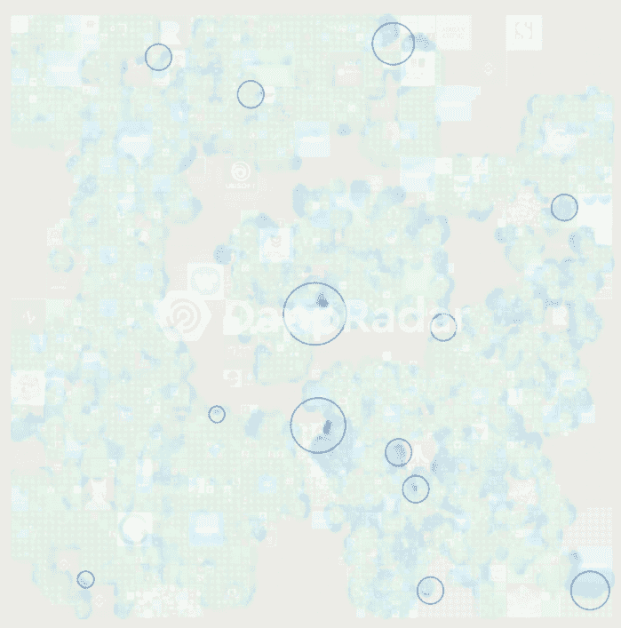
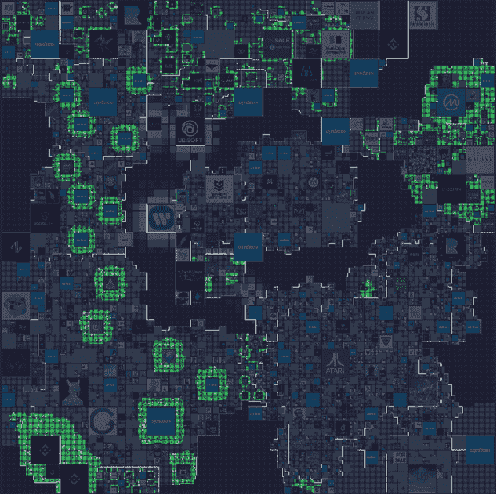
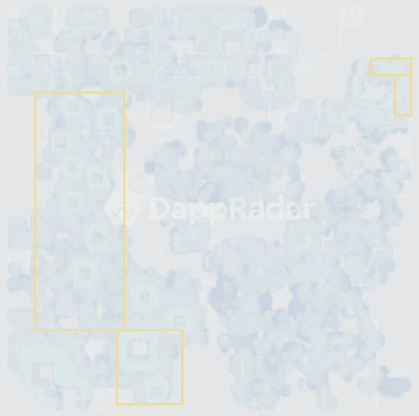
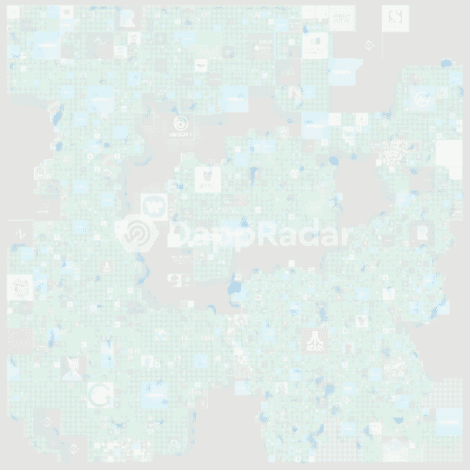
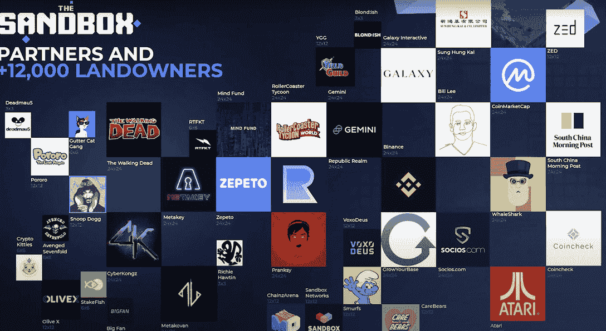

# 沙盒土地——估价报告

> 原文：<https://web.archive.org/web/https://dappradar.com/blog/the-sandbox-land-valuation-report>

## 如何对沙盒中的土地进行估值，是什么推动了价格？

与实体房地产类似，在区块链的虚拟世界中，代表一块数字土地的 NFT 已被证明是可以存储价值的资产。自 Meta 去年 10 月宣布以来，对这些虚拟土地 NFT 的需求激增，推动其价格上涨。

[沙盒](https://web.archive.org/web/20220930102439/https://dappradar.com/ethereum/games/the-sandbox)已经在领先的元宇宙区块链项目中确立了自己的地位。它由 166，464 个 ERC-721 代币组成，代表数字地块，创作者可以在这里建立游戏、活动或派对等货币化体验，供玩家免费或付费在沙滩上享受。

通过 Sandobox 的免费原生构建工具 Sandbox Game Maker，该项目使艺术家和创作者能够构建用户生成的内容。虽然这种方法可以在传统的元宇宙游戏如《我的世界》中找到，但这里的土地、头像和任何其他游戏资产都由 NFTs 表示，从而确定了元宇宙一部分的真正数字所有权。

本报告旨在剖析沙盒内土地的估价过程。在这个虚拟世界中，哪些因素在评估数字包裹的价格中发挥了作用？是否有土地价格过高或过低？在财务、稀缺性和合作方面，沙盒与其他元宇宙项目相比如何？

## 目录

*   [理解沙盒里的土地](https://web.archive.org/web/20220930102439/https://dappradar.com/blog/the-sandbox-land-valuation-report/#understanding)
*   [如何评估沙盒土地？](https://web.archive.org/web/20220930102439/https://dappradar.com/blog/the-sandbox-land-valuation-report/#value)
*   [与其他虚拟世界的比较](https://web.archive.org/web/20220930102439/https://dappradar.com/blog/the-sandbox-land-valuation-report/#comparison)
*   [总结](https://web.archive.org/web/20220930102439/https://dappradar.com/blog/the-sandbox-land-valuation-report/#summary)

## 理解沙盒里的土地

当脸书宣布更名为 Meta 时，人们对元宇宙相关项目的兴趣飙升。从那以后，对包括沙盒在内的虚拟世界项目的需求直线上升。沙盒土地的底价已经从 2021 年第三季度的不到 1 ETH 上升到 1 月份的历史高点 5 ETH，并在撰写时达到 3 ETH 的综合水平。目前的地板价格使沙盒土地的地板市值达到 12.7 亿美元。

但是沙盒里的土地到底是什么？一片土地实际上是一个 NFT，充当着一块数字化的不动产，创作者可以在上面构建体验。每块土地都有预定义的地形，宽 96 米，长 96 米，高 128 米。它的主人可以建造和修改包裹或者出租给其他玩家发布自己的经历。

除了货币化体验，沙盒中的土地还有其他用例，包括赌注产生被动收入和治理投票权。

Source: The Sandbox

在令牌分配方面，总土地供应中的 10% (16，704 块土地)将留在沙盒手中，以举办特别活动和推出独家游戏。另外 16%或 25，920 块土地将作为储备，作为奖励分配给合作伙伴、创作者和玩家。剩余的 123，000 块土地(74%)正在出售，在编写本报告时，81%或 100，054 块土地已经有人出价。

既然已经介绍了沙盒中的土地，那么是时候了解在评估元宇宙中的一块土地时哪些因素起作用了。

## 沙盒地如何估值？

沙盒中的土地估价遵循与现实世界中的房地产相同的基本原理。价格由两个主要变量决定:位置和大小。虽然结构设计或土地功能等其他因素最终会发挥作用，但地块的位置和大小决定了它们的价格，尤其是要记住，这个元宇宙仍处于早期阶段，体验才刚刚开始创造。

我们分析了 2021 年 8 月至 2022 年 3 月 16 日期间超过 25，000 宗沙盒土地销售，以确定对上述两个变量提供额外见解的趋势。该分析仅考虑 1×1 地块，因为较大的地块大多通过拍卖出售，二级市场由于价格限制较高而不具有代表性。

The world of The Sandbox (Source: The Sandbox)

相邻的 1×1 地块可以在沙盒中分组，以形成不同大小的地产。相邻焊盘的最大尺寸(XL)为 24×24，包括 576 个焊盘。总共有 35 块 XL 地，其中 13 块为沙盒所有。这种规模的土地覆盖了超过 12%的沙盒地图，并拥有著名的持有者名称，包括雅达利、Pranksy、赛博 Kongz、币安(3)、育碧、Socios、TWD、双子星、Coinmarketcap、Meta Key、Republic Realm (2)、华纳音乐集团和南华早报。

12×12 大小的庄园包含 144 个相邻的土地，由阿迪达斯、Snoop Dogg、CryptoKitties、Ultra、Smurfs、Care Bears 和 GuildFi 等知名品牌拥有。最后，中小地块是最容易获得的拥有地产的机会，可以公开出售。作为参考，在最近的 Metavex 销售中，Metavex Medium 土地的中标价格为 215，000 SAND 或约 630，000 美元，而小型地产的拍卖价格为 45，000 SAND 或 130，000 美元。

Source: The Sandbox

该平台的地理定位模型将邻居关系提升到了一个新的水平，增加了相邻地块的重要性。虽然土地面积与价格有内在联系，但其位置在评估过程中起着至关重要的作用。

任何 1×1 土地的最高销售额说明了这个前提。[游艇国王领地](https://web.archive.org/web/20220930102439/https://dappradar.com/hub/wallet/eth/0xb3ee5011a7965905cde351ea4905ff4725189a3b/nfts/1/the-sandbox)拥有的 151499 号土地，毗邻一个中型 BAYC 地块和一个名为 LooksRare 的大型 Dingaling 地块，以 100 ETH 的价格售出。这块土地的价格超过了小型二级房地产的价格，比如以 71 ETH 出售的 Crypto Lifestyle。

Source: The Sandbox

### 在沙盒中，位置是王道

知名品牌和个人在元宇宙拥有几处房产。这些虚拟包裹的目的是建立游戏或社交中心等体验来吸引人群。这些主要合作伙伴周围的高客流量增加了邻近地块将游客引向他们自己的体验的可能性，潜在地增加了他们的收入流。

一个例子是 Snoopverse，一个由音乐传奇 Snoop Dogg 拥有的大地产。这个 NFT 周围的土地非常令人垂涎，因为这个大型庄园将成为独家体验的家园，包括游戏、音乐会以及与邻居史蒂夫·青木和 SupDucks 的合作。作为 Snoopverse 第二波公开拍卖的一部分，五个小庄园以平均 78，200 桑德或大约 23 万美元的价格拍卖。

对于 Atari、CyberKongz 或 Sandbox 拥有的地块等主要合作伙伴来说，情况也是如此。后者将在游戏赚取平台中发挥关键作用。这些地块中的几个将成为连接虚拟世界的门户，允许玩家在游戏之间长距离旅行或休闲区放松和社交。

1×1 lands avg. sale price heatmap

上面的热图显示了与较高销售价格相关的热点。将它叠加在沙盒地图的顶部使我们能够识别最令人垂涎的区域，如 Snoopverse、中部和东南部 XL 沙盒地产、中北部 Meta Key 区域(也包括沙盒拥有的土地)以及地图西北部的 CyberKongz 和 Republic 区域。

遵循定位具有高交通潜力的区域的相同逻辑，沙盒将几块土地标记为“优质”——主要品牌合作伙伴或沙盒本身拥有的大型或 X-大型地产附近的地块。

Premium lands in The Sandbox (Source: The Sandbox)

突出优质区域的沙盒地图视图显示了优质土地是如何围绕公认的大型地产形成的。然而，将价格热图叠加在沙盒溢价图上显示，存在高价值的非溢价区域，以及标记为溢价的区域，其净销售价格低于平均水平。

1×1 lands avg. sale price heatmap on top of Premium lands

像东北角这样的地区有很好的销售，但 CoinMarketCap XL 地产周围的地区比最初想象的更容易进入。同样，西部地区包括 7 个大型沙盒地块以及 Care Bears、Atari 和 Ultra 拥有的地产，似乎也是一个可进入的优质区。

地图的中心部分引起了数字房地产投资者的注意。XL Warner 庄园或中央 XL Sandbox 庄园周围的区域已经获得了大约 15 至 20 ETH 的高销售价格。

另一个要考虑的方面是对某些区域的需求。分析 1×1 土地销售计数的热图表明，地图的中西部和西北部是土地交易频繁的区域。同样，Snoopverse 以北的 XL 沙盒庄园也被认为是热点；靠近 CoinMarketCap XL 地产和其他沙盒土地的东北部地区也很活跃。

*1×1 lands trading activity heatmap*

重要的是要明白，随着该平台发展成为一个更成熟的游戏赚钱元宇宙，这些区域需求的增加可能会推高附近地块的价格。

总而言之，虽然土地的大小与价格直接相关，但在这个早期阶段，位置起着至关重要的作用。随着游戏的成熟，其他方面，如土地的具体用途，其中的设计，或体验的类型，无疑将变得更加重要。然而，就目前而言，位置是沙盒中的王道。

## 将沙盒与其他虚拟世界进行比较

虽然土地已经在大小和位置的范围内进行了分析，但其他因素会影响沙盒土地作为平台的价格，并且可以用作与其他虚拟世界进行比较的基准。

*   效用是沙盒中最重要的价值主张之一。除了完整的游戏赚取和社会经验，沙盒主机通过允许业主出租他们的财产和股份沙里面一个完整的元经济。它还授予对治理投票的访问权，以塑造平台的未来。像分散土地这样的项目与这些经验竞争，但缺乏经济收益。与此同时，其他项目，如 NFT 世界，可能有坚实的被动收入机制，但缺乏卓越的沉浸式体验。

*   从财务上来说，这种“玩到赚”的 dapp 也具有竞争优势。沙盒土地产生了超过 5.3 亿美元的历史交易量，仅次于分散土地。到 2022 年为止，沙盒已经成为领先的虚拟世界平台，交易量超过 9800 万美元，吸引了超过 6800 名独特的交易者。仅全球范围内的韦伯虚拟世界今年就有近 6000 名交易员。

*   土地底价在 3 ETH 左右巩固，低于分散土地或 NFT 世界等较小的虚拟世界，但几乎是元宇宙同行项目如 CryptoVoxels，Webbland 或 Treeverse 的两倍。这一底价使沙盒土地的底价市值达到 12.7 亿美元，比分散土地高出 36%。

*   尽管超过 166，000 块土地看起来是一个相当大的数字，但供应是有限的，这给沙盒增加了一个稀缺因素。像 CryptoVoxels 这样的项目供应要少得多，但可以随时添加土地来自由放大其地图。

*   伙伴关系是沙盒最重要的产品之一。该项目得到了著名的 web3 投资机构 Animoca Brands 的全力支持。与来自各种传统行业和 web3 项目的名人和大品牌的合作进一步加强了这一点，最近的一次是与汇丰银行的合作，汇丰银行成为第一家在这个虚拟世界中拥有土地的银行。

*   Twitter 上有近 900，000 名粉丝，Discord 中有超过 280，000 名成员，Sandbox 拥有 Web3 中最大的社区之一。在像这样的游戏赚钱平台上获得相关性的东西。客观地说，分散的土地拥有 560，000 名 Twitter 追随者和 160，000 名 Discord 成员。对这两个项目来说都不错，但是沙盒社区的规模是一个非常积极的指标。

## 摘要

Meta 的声明发布后，虚拟土地的价值飙升，从此一蹶不振。随着元宇宙故事从传统和 web3 机构获得兴趣和动力，投资于这一领域的人们应该认识到这种类型的非功能性交易的价值。数字房地产不仅将成为化身社交和享受社区建设的体验的地方，而且这些虚拟土地中的一些具有被动收入特征，这增强了它们作为投资机会的地位。

当谈论元宇宙类型的项目时，沙盒土地应该是话题的一部分。这种从游戏到收入的 dapp 赋予创作者权力，并形成了一群令人印象深刻的合作伙伴，以构建这一领先平台的未来。此外，土地所有者的标桩机制和治理使沙盒土地成为最受欢迎的虚拟土地。

当在沙盒中讨论土地估价时，两个主要变量开始起作用。尽管如此，尽管规模本身会影响土地价格，但位置在价值等式中扮演着更为关键的角色。事实证明，一个位置好的 1×1 地块可以比一些 3×3 地块获得更高的销售价格。

此外，地理空间模型增加了邻近土地的重要性。像 Snoop Dogg 这样的知名邻居或沙盒本身可以在这些土地上建立的游戏的流量、游戏性和可见性方面产生经济影响，将它们定位为“优质”资产。

尽管如此，游戏赚钱平台仍处于非常早期的阶段。目前的价值更多的是一个名字，而不是这些品牌实际在打造什么。阿尔法第二季于两周前开始，将有 35 种游戏体验供人们在这个虚拟现实中加入和游戏。最终，这些土地的价值将会波动，因为某些经验将变得对评估他们邻居土地的高层更有吸引力。我们将在以后重新讨论如何评估沙盒，但现在，你可以将这份报告视为识别沙盒虚拟世界中潜在机会的指南。