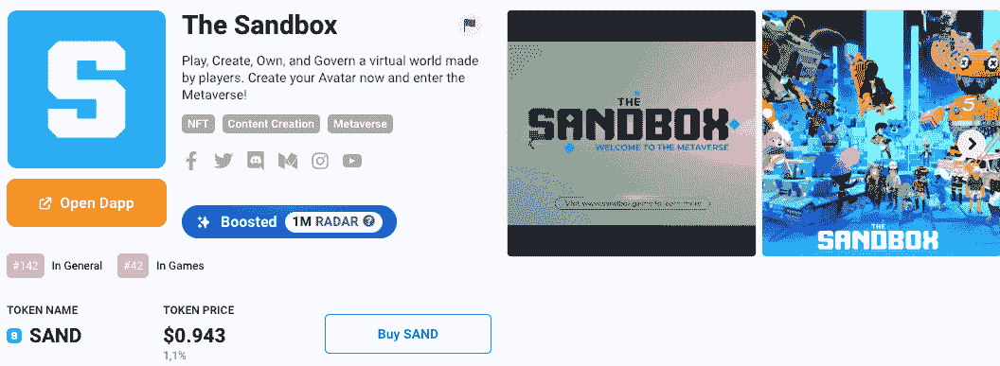

# 沙盒 AMA–亮点

> 原文：<https://web.archive.org/web/https://dappradar.com/blog/the-sandbox-season-3-ama-highlights>

## 第三季，沉浸式互操作性，使土地所有者能够发布他们土地上的体验等。

9 月 1 日，DappRadar 采访了元宇宙最先进、最成功的平台之一 Sandbox 的首席运营官 Sebastien Borget。

在创作者经济中，沙盒正在塑造新一代区块链游戏，用户可以使用平台的主要实用令牌 [NFTs](https://web.archive.org/web/20220929044836/https://dappradar.com/hub/nft-explorer/collection/the-sandbox) 和 [SAND](https://web.archive.org/web/20220929044836/https://dappradar.com/hub/token/eth/SAND?from=0x3845badade8e6dff049820680d1f14bd3903a5d0) 来构建、拥有和货币化他们的资产。

像史努比·道格、T2·史蒂夫·青木、华纳兄弟这样的名人，以及更多的人都尝试过这部激动人心的《T4·元宇宙》和《T5》。第三季开放了十周，充满了体验和内容，每个人都可以免费使用他们创建的化身或他们从外部项目中使用的化身。

[<picture></picture>](https://web.archive.org/web/20220929044836/https://dappradar.com/multichain/games/the-sandbox)

## 你对沙盒有什么看法？

> 我们的愿景一直是让玩家成为创造者。在 CryptoKitties 爆炸之后，我们看到了 NFT 的潜力，使任何人都可以创建自己的 NFT，将它们用作游戏资产，并能够以他们想要的方式将其货币化。
> 
> 我们花了 4 年时间扩展我们的视野，今天我们有 400 多万注册钱包的用户。沙盒是最先进的元宇宙平台之一，真正推动建立一个开放的元宇宙
> 
> Sebastien Borget

## 沙盒如何赋能创作者和艺术家？

> 沙盒将用户生成的内容和 NFTs 结合在一个平台中，该平台由区块链提供免费编辑器、marketpkace 和无代码游戏制作程序，因此任何人都可以在其上制作 3d 内容、游戏和体验。他们可以以自己选择的方式将自己的作品货币化，用户可以通过他们的虚拟形象获得这些体验，四处玩耍，社交，完成任务并获得奖励。
> 
> 即使我们的 DNA 是游戏，它也不止于此，我们希望将元宇宙建成一个有趣的游戏，允许用户表达自己，并将超出我们想象的世界带入生活。体素就像数字乐高，你不需要用户手册就可以开始玩它。
> 
> Sebastien Borget

## 关于路线图你能透露些什么？

> 我们将不断升级沙盒的不同工具，通过添加许多令人惊叹的视觉效果和前所未见的元素来增加游戏功能。我们专注于让用户能够发布他们自己的音乐内容，虚拟音乐会，允许土地所有者发布他们土地上的体验，并整体移动化，使其更广泛，更容易从任何地方访问…
> 
> Sebastien Borget

观看 AMA，了解更多关于沙盒的精彩路线图！

[https://web.archive.org/web/20220929044836if_/https://www.youtube.com/embed/ppQjD0R6piI?feature=oembed](https://web.archive.org/web/20220929044836if_/https://www.youtube.com/embed/ppQjD0R6piI?feature=oembed)

## **时间戳**

[00:00](https://web.archive.org/web/20220929044836/https://www.youtube.com/watch?v=ppQjD0R6piI)–DappRadar 玩沙盒第三季(视频预告片)

[04:02](https://web.archive.org/web/20220929044836/https://www.youtube.com/watch?v=ppQjD0R6piI)–你对沙盒有什么看法？

[08:04](https://web.archive.org/web/20220929044836/https://www.youtube.com/watch?v=ppQjD0R6piI)–沙盒如何赋能创作者和艺术家？

[12:34](https://web.archive.org/web/20220929044836/https://www.youtube.com/watch?v=ppQjD0R6piI)–你如何看待《我的世界》对非功能性食物的禁令？

[17:38](https://web.archive.org/web/20220929044836/https://www.youtube.com/watch?v=ppQjD0R6piI)–未来会有更多的游戏平台引入 KYC 吗？

[21:02](https://web.archive.org/web/20220929044836/https://www.youtube.com/watch?v=ppQjD0R6piI)–你对“玩即赚”和“玩即赚”有什么看法？

[23:51](https://web.archive.org/web/20220929044836/https://www.youtube.com/watch?v=ppQjD0R6piI)–你如何改善入职体验？

[26:54](https://web.archive.org/web/20220929044836/https://www.youtube.com/watch?v=ppQjD0R6piI)–沙盒带来了哪些新的指标来帮助我们更好地了解你们的经济？

[30:05](https://web.archive.org/web/20220929044836/https://www.youtube.com/watch?v=ppQjD0R6piI)–我们能看到人们在使用什么样的头像和收藏吗？

第三季中的互操作性和角色

[35:05](https://web.archive.org/web/20220929044836/https://www.youtube.com/watch?v=ppQjD0R6piI)–路线图

## 感兴趣的链接

[什么是沙盒&如何加入元宇宙](https://web.archive.org/web/20220929044836/https://dappradar.com/blog/what-is-the-sandbox-how-to-join-the-metaverse)

[沙盒第三季值得炒作的 3 个理由](https://web.archive.org/web/20220929044836/https://dappradar.com/blog/3-reasons-why-the-sandbox-alpha-season-3-deserves-the-hype)

[解释:沙令牌](https://web.archive.org/web/20220929044836/https://dappradar.com/blog/explained-the-sandbox-sand-token)

沙盒第三季:NFT 化身准备好了！

 NewsletterUnsubscribe at any time. [T&Cs](https://web.archive.org/web/20220929044836/https://dappradar.com/terms) and [Privacy Policy](https://web.archive.org/web/20220929044836/https://dappradar.com/privacy-policy)