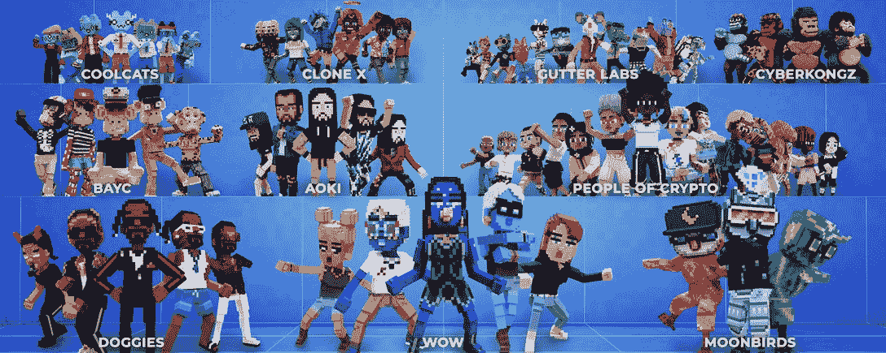
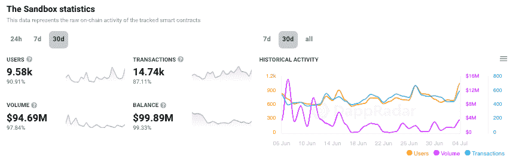

# 沙盒第三季:NFT 化身准备好了！

> 原文：<https://web.archive.org/web/https://dappradar.com/blog/the-sandbox-season-3-nft-avatars-at-the-ready>

## 第三季报名已经开始了！

排名靠前的虚拟世界游戏《沙盒》宣布了 2022 年第三个“玩赚阿尔法”赛季的计划，其中一些令人兴奋的 NFT 化身功能尚未完全披露。第三季报名已经[开始](https://web.archive.org/web/20220923175157/https://www.sandbox.game/en/)。

与第二季不同，玩家不需要阿尔法通行证就可以玩第三季，它对所有人开放。阿尔法通行证只需要在赛季末领取奖励。关于这方面的更多细节将很快公布，请确保[在 Twitter](https://web.archive.org/web/20220923175157/https://twitter.com/borgetsebastien) 上关注沙盒的联合创始人和首席运营官的定期更新。

虚拟世界平台沙盒被广泛认为是元宇宙和区块链游戏的领导者，与 Snoop Dog、Atari 和 Adidas 等品牌有合作关系。

最近，他们宣布了与 TIMEPieces 的合作，这是《时代》杂志的一个 NFT 社区项目。这两家公司将合作建造“时代广场”，这是《时代》杂志受纽约市启发而在元宇宙的首个目的地。

关于沙盒 Alpha 第三季的细节和日期仍未公布，但 2022 年有望成为游戏虚拟世界的重要一年。要注册第三季，只需登录沙盒网站，连接区块链钱包，输入电子邮件，然后等待。

[https://web.archive.org/web/20220923175157if_/https://www.youtube.com/embed/K0S1UTAZwsg?feature=oembed](https://web.archive.org/web/20220923175157if_/https://www.youtube.com/embed/K0S1UTAZwsg?feature=oembed)

**沙盒中的 NFT 替身**

《沙盒》的联合创始人和首席运营官，塞巴斯蒂安·博格特[在推特](https://web.archive.org/web/20220923175157/https://twitter.com/borgetsebastien/status/1538270042260922370)上透露了一些线索，比如第三季可能会包括什么，以及可能会增加什么新功能。包括号召 NFT 头像持有者准备好把他们的头像带进沙盒。

首席运营官[还在 Twitter 帖子中抨击了 Meta](https://web.archive.org/web/20220923175157/https://twitter.com/borgetsebastien/status/1538270042260922370) ,称 Meta 关于反映一个人真实世界自我的化身的想法与元宇宙化身的想法相反。

沙盒已经与世界妇女 NFT 集合合作，让那些 NFT 的持有者将他们的角色带入沙盒和其他领先的集合。

虽然将更多的 NFT 头像集成到沙盒中令人兴奋，但该平台对从知名收藏中购买高价值的 NFT 也并不陌生。去年，他们以超过 290 万美元的价格购买了一只金色无聊猿 NFT。

那个特别的 NFT 后来成为公司虚拟博物馆的展品。后来，购买月鸟#2642 符合同样的叙事，将宝贵的 NFT 文化带入沙盒。

沙盒拥有的 NFT 收藏包含了各种项目的可收集资产，包括 31 只无聊的猿，21 只变异的猿，30 个女人的世界，8 个 CyberKongz，7 个涂鸦，这个列表还在继续。在撰写本文时，达普拉达尔估计这个钱包的价值约为 1280 万美元，其中 NFT 的资产超过 600 万美元。

Source: [Dappradar](https://web.archive.org/web/20220923175157/http://www.dappradar.com/)

*潜入 DappRadar 上的沙盒钱包*

## 元宇宙和游戏违背市场趋势

[沙盒表现良好](https://web.archive.org/web/20220923175157/https://dappradar.com/multichain/games/the-sandbox)随着加密市场继续进一步陷入萧条，游戏玩家似乎没有被熊市吓倒，而是利用他们的代币和游戏内资产来找乐子。

发现新推出的和即将推出的 NFT 系列，并使用超级先进的 [NFT 浏览器](https://web.archive.org/web/20220923175157/https://dappradar.com/hub/nft-explorer)根据机器学习算法、历史销售和元数据获得估计的 NFT 价值！

[<picture></picture>](https://web.archive.org/web/20220923175157/https://dappradar.com/hub/nft-explorer)

在过去的 30 天里，连接到沙盒的唯一活动钱包的[数量增加了 90%以上，达到约 9500 个。与此同时，交易量猛增了 87%,超过了 14，500 笔。这说明玩家在和沙盒连接互动。](https://web.archive.org/web/20220923175157/https://dappradar.com/multichain/games/the-sandbox)

Source: [DappRadar](https://web.archive.org/web/20220923175157/http://www.dappradar.com/)

dapp 行业正在经历一个漫长的熊市，严重影响了加密市场。加密货币的市值自 2020 年以来首次跌破 1 万亿美元。同样，dapp 行业的活动降至去年 9 月以来的最低点，[每天注册 222 万个独立活跃钱包](https://web.archive.org/web/20220923175157/https://dappradar.com/blog/category/reports) (UAW)。

[逆熊市之势](https://web.archive.org/web/20220923175157/https://dappradar.com/blog/dappradar-crypto-games-report-5-blockchain-games-continue-to-defy-the-bear-market)，5 月份区块链游戏日均互动 UAW 115 万，环比仅下降 5%。

区块链游戏证实了它们作为区块链垂直行业的地位，为度过[熊市](https://web.archive.org/web/20220923175157/https://dappradar.com/blog/category/reports)做了更好的准备。第三季的发布肯定会进一步增加用户数量，并帮助沙盒巩固其在不断发展的区块链游戏领域的地位。

 NewsletterUnsubscribe at any time. [T&Cs](https://web.archive.org/web/20220923175157/https://dappradar.com/terms) and [Privacy Policy](https://web.archive.org/web/20220923175157/https://dappradar.com/privacy-policy)