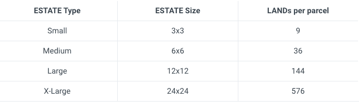
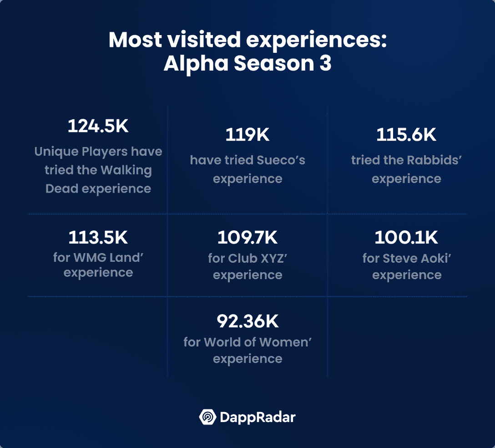
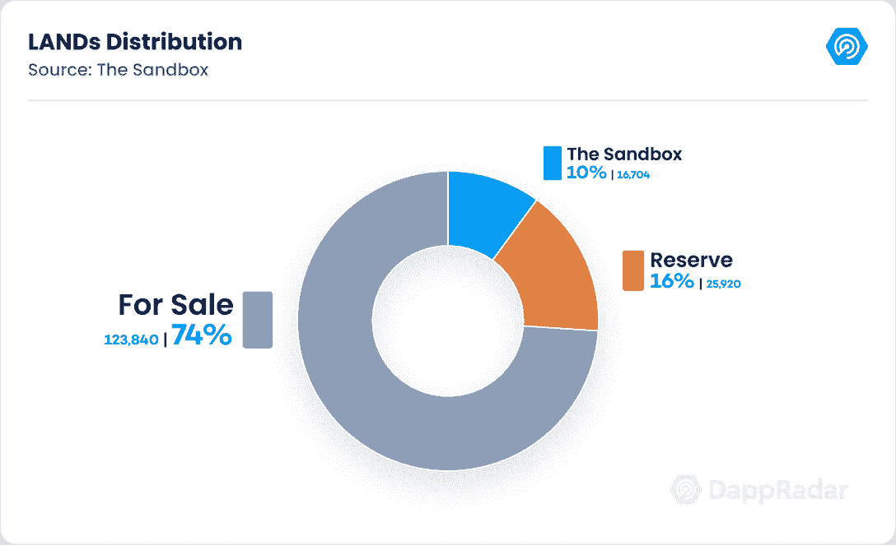
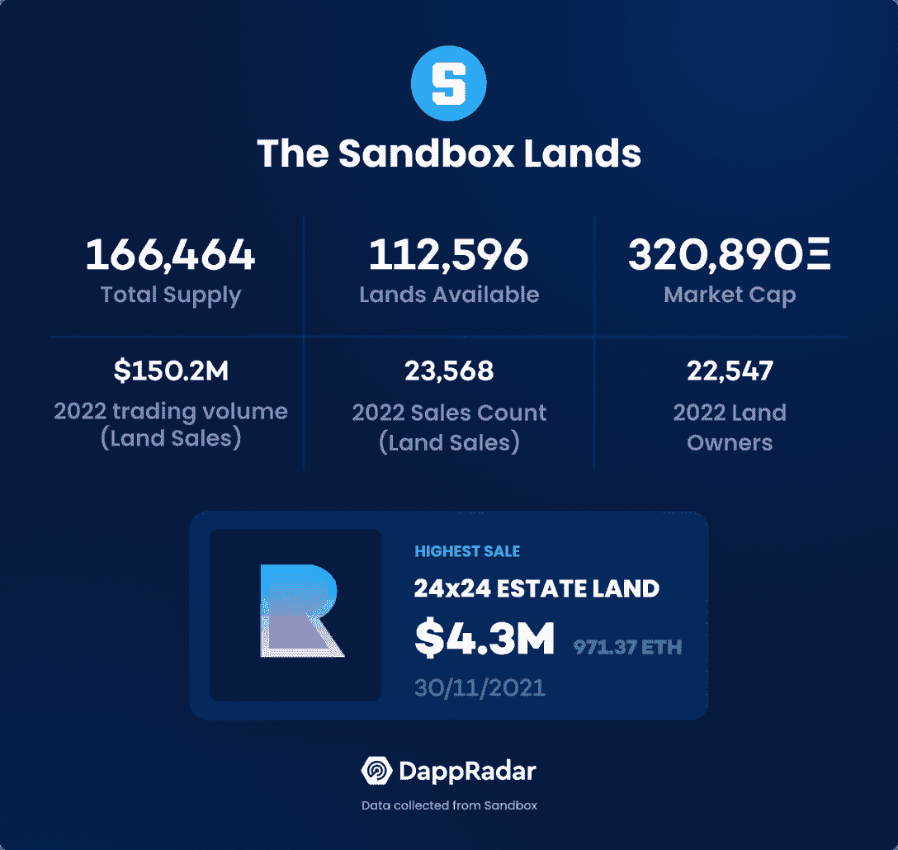
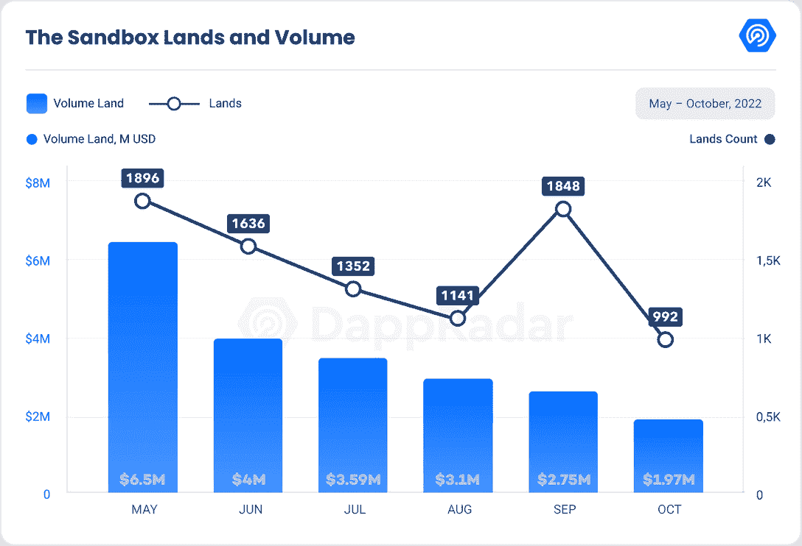
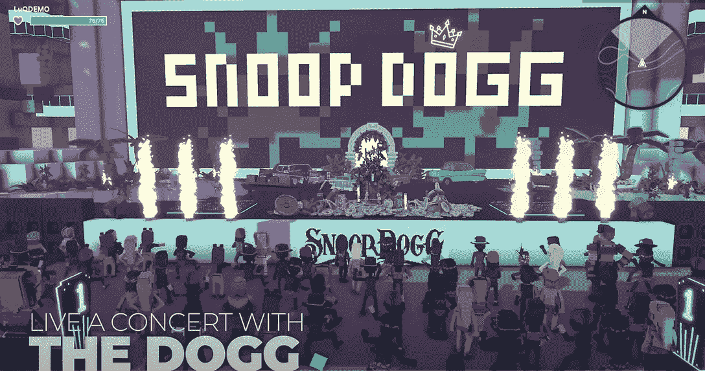
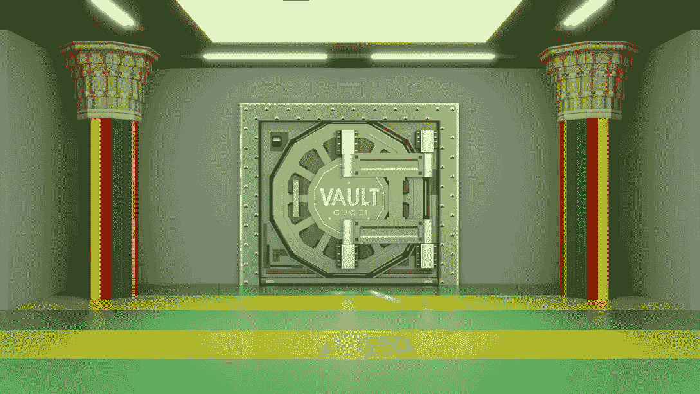
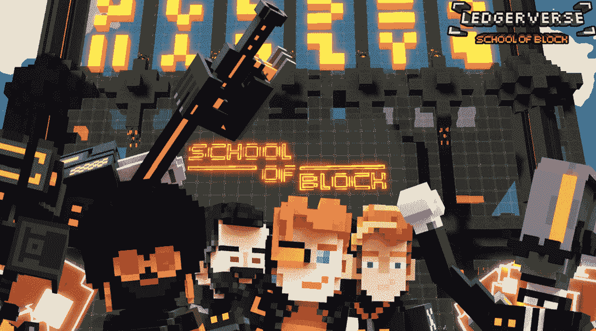
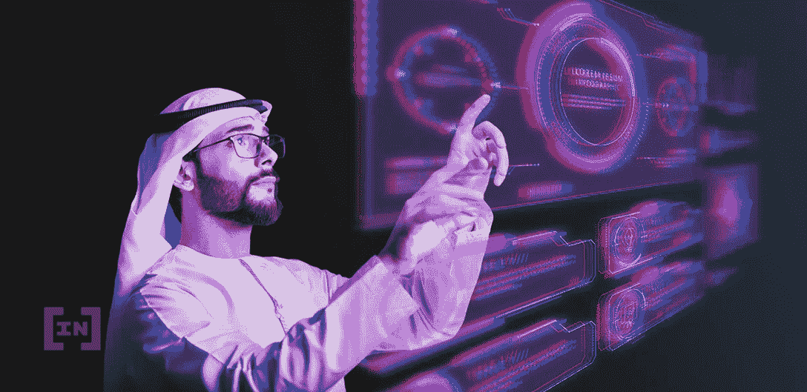
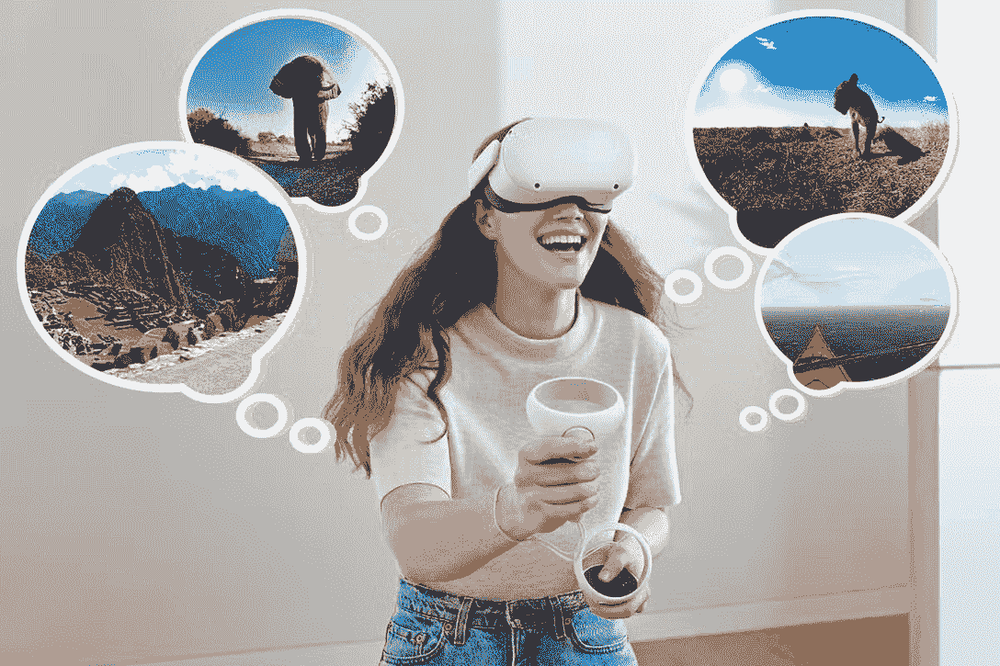

# 沙盒特别报告:了解土地潜力

> 原文：<https://web.archive.org/web/https://dappradar.com/blog/the-sandbox-special-report-understanding-lands-potential>

## 在成功的 Alpha 第三季之后，这个领先的元宇宙下一步会做什么？

**[沙盒](https://web.archive.org/web/20221130143002/https://dappradar.com/ethereum/games/the-sandbox) (TSB)是一个虚拟世界，用户可以在这里创造赚钱的游戏和社交体验。该平台在 Polygon 上运行，继承了 sidechain 的低气体和可持续特性。此外，游戏的免费构建工具 Game Maker 和 VoxEdit 允许开发者和内容创作者参与、创建和开发互动内容。**

11 月 2 日，沙盒的 Alpha 第三季结束。在 68 天的时间里，该活动吸引了 353，000 名不同用户，带来了 98 种全新的品牌体验。第一次，游戏玩家可以利用其他 Web3 品牌的化身，展示了沙盒对互操作性的高度关注。沙盒挑战了过去几个月在独特的活跃钱包和交易量方面公布的正数。

本报告旨在对沙盒的当前状态提供一个总体视角，并对虚拟世界中与土地相关的概念进行回顾。

## 内容

*   [理解沙盒里的土地](https://web.archive.org/web/20221130143002/https://dappradar.com/blog/the-sandbox-special-report-understanding-lands-potential/#Understanding-LANDs-inside-The-Sandbox)
*   [优质土地](https://web.archive.org/web/20221130143002/https://dappradar.com/blog/the-sandbox-special-report-understanding-lands-potential/#Premium-LANDs)
*   [土地分配](https://web.archive.org/web/20221130143002/https://dappradar.com/blog/the-sandbox-special-report-understanding-lands-potential/#LAND-Distribution)
*   [沙盒挑战阿尔法第三季背后的熊市](https://web.archive.org/web/20221130143002/https://dappradar.com/blog/the-sandbox-special-report-understanding-lands-potential/#The-Sandbox-defies-the-bear-market-behind-Alpha-Season-3)
*   [如何将沙盒中的土地货币化？](https://web.archive.org/web/20221130143002/https://dappradar.com/blog/the-sandbox-special-report-understanding-lands-potential/#How-to-monetize-LAND-in-the-Sandbox?)
*   [解剖沙盒的土地潜力](https://web.archive.org/web/20221130143002/https://dappradar.com/blog/the-sandbox-special-report-understanding-lands-potential/#Dissecting-The-Sandbox’s-LAND-potential) [–元宇宙互通](https://web.archive.org/web/20221130143002/https://dappradar.com/blog/the-sandbox-special-report-understanding-lands-potential/#Metaverse-interoperability) [–塑造创作者经济](https://web.archive.org/web/20221130143002/https://dappradar.com/blog/the-sandbox-special-report-understanding-lands-potential/#Shaping-the-creator-economy) [–赋能虚拟自由职业者](https://web.archive.org/web/20221130143002/https://dappradar.com/blog/the-sandbox-special-report-understanding-lands-potential/#Empowering-virtual-freelancers) [–音乐和娱乐的未来](https://web.archive.org/web/20221130143002/https://dappradar.com/blog/the-sandbox-special-report-understanding-lands-potential/#The-future-of-music-and-entertainment) [–沉浸式电商体验](https://web.archive.org/web/20221130143002/https://dappradar.com/blog/the-sandbox-special-report-understanding-lands-potential/#Immersive-e-commerce-experience) [–体验完全沉浸式的学习](https://web.archive.org/web/20221130143002/https://dappradar.com/blog/the-sandbox-special-report-understanding-lands-potential/#Experience-of-learning-that-is-completely-immersive) [–政府采用的兴起](https://web.archive.org/web/20221130143002/https://dappradar.com/blog/the-sandbox-special-report-understanding-lands-potential/#Rising-government-adoption) [–虚拟旅行【虚拟旅行】](https://web.archive.org/web/20221130143002/https://dappradar.com/blog/the-sandbox-special-report-understanding-lands-potential/#Virtual-travels)
*   [关闭](https://web.archive.org/web/20221130143002/https://dappradar.com/blog/the-sandbox-special-report-understanding-lands-potential/#Closing)

## 理解沙盒里的土地

沙盒中的土地是一个 ERC-721 令牌，作为一个数字房地产，创作者可以在那里建立体素元宇宙体验。沙箱由代表虚拟地块的 166，464 个 NFT 组成。每块 1×1 的土地都有一个预定义的地形，宽 96 米，长 96 米，高 128 米。

相邻的 1×1 地块可以在沙盒中分组，以形成不同大小的地产。相邻焊盘的最大尺寸(XL)为 24×24，包括 576 个焊盘。这种大小的包裹覆盖了超过 12%的沙盒地图，并拥有知名的持有者名称，包括雅达利、Pranksy、Cyber Kongz、币安、育碧、Socios、The Walking Dead、Gemini、CoinMarketCap、MetaKey、Republic Realm、华纳音乐集团和南华早报。

Source: The Sandbox

12×12 大小的大型庄园包含 144 个相邻的土地，由阿迪达斯、史努比狗狗、CryptoKitties、Yield Guild Games、Ultra、蓝精灵、Care Bears 和 GuildFi 等 Web3 名人拥有。

最后，中小地块是拥有沙盒土地最容易获得的机会，可以公开出售。作为参考，在 2 月份的 Metavex 销售中，Metavex Medium 土地的中标价格为 215，000 SAND，约合 630，000 美元，而小型地产的拍卖价格达到 45，000 SAND，约合 130，000 美元。

[Button for LAND valuation](https://web.archive.org/web/20221130143002/https://dappradar.com/blog/the-sandbox-land-valuation-report)

### 优质土地

除了庄园的大小，土地可以根据它们在地图上的位置进行分类。优质土地是主要合作伙伴或社交中心周围的区域。这些场地因其战略位置而拥有较高的用户流量。品牌体验吸引了许多用户，而玩家通过社交中心的门户加入虚拟世界，将会向外输送探索流量。

随着这些地区货币化机会的增加，高交通水平评估了相邻地块的价值。例如,《行尸走肉》、《Sueco》、《育碧的兔子》和《史蒂夫·青木的经历》在 Alpha 第三季中注册了超过 10 万的独立用户。因此，高级地产中的广告、租金和付费游戏费用变得更加昂贵。

**source: The Sandbox**

优质土地的主要或初始销售带有被视为优质资产的独家、限时资产。由于其稀有性，优质资产的价值高于普通 TSB 资产。

值得注意的是，溢价资产仅在造币时附在溢价土地上。在二级市场购买优质土地时，卖方有权将优质资产打包作为交易的一部分。

### 土地分配

从总土地供应中，10% (16，704 块土地)将留在沙盒的控制范围内，以举办特殊活动和特色专属游戏。另外 16%或 25，920 块土地将作为储备分配给战略合作伙伴或作为奖励发放给创作者和游戏玩家。然而，剩余的 123，000 块土地向公众出售。在撰写本文时，这些可供公开出售的土地中有 80%以上已经售出。

Source: The Sandbox

## 沙盒挑战阿尔法第三季背后的熊市

在过去的八个月里，加密行业陷入了熊市。每种加密货币的价格都低于一年前的历史高点。与此同时，NFT 交易量处于 2021 年 6 月以来的最低水平。然而，尽管市场条件充满挑战，沙盒凭借其成功的 Alpha 第三季和其路线图中最近达到的里程碑避开了崩溃。

沙盒阿尔法第三季运行了近 70 天，向阿尔法玩家开放了来自知名品牌的多种体验。在活动期间，超过 220 000 名独立用户访问了元宇宙，超过 160 万名独立用户访问了官方网站。区块链或链上数据证实了这种宣传，因为超过 10，800 个独特的活跃钱包(UAW)与沙盒游戏和市场合同互动，比 8 月底增长了 23%。

随着《行尸走肉》、《史蒂夫·青木》和《苏科》成为热门景点，对沙盒土地的需求明显增加。在写作时，有超过 22，500 个独特的土地所有者，创下历史新高，尽管沙盒自 8 月 Alpha 开始以来没有发布新的土地。

此外，沙盒土地的 NFT 指标显示略有复苏，打破了自今年 Q1 以来一直暴跌的整体虚拟世界市场趋势。自 8 月份以来，沙盒土地已从近 3，900 宗土地销售中产生了超过 610 万美元的收入。这两项指标在当时都是业内第二好的，仅落后于另一方。

虽然阿尔法第三季沉浸式游戏体验推动了最近土地需求的激增，但通过打桩分布的大量沙子提醒我们沙盒土地的另一个有影响的特征:打桩。

## 沙盒里的土地如何货币化？

在土地上下注的能力是沙盒虚拟地产最吸引人的方面之一。那些把他们的土地从以太坊连接到多边形的人可以参加 9 月 22 日开始的新的沙堆项目。在这场赌注运动中，持有人可以在每块土地上投资 500 沙，产生以沙代币支付的被动收入。一个人拥有的土地越多，他们被允许赌的沙子就越多。

沙是沙盒生态系统的治理令牌。在沙地上赚取赌注回报增加了土地 NFT 效用，同时也起到了社区催化剂的作用。

除了提供被动收入和增加治理投票权，沙盒土地还有巨大的货币化潜力，这些机会有不同的形式:

*   托管沉浸式体验
*   出租土地
*   主办竞赛和赠品
*   出售资产 NFT
*   出售土地

让我们来讨论一下这些机会。

**托管沉浸式体验**

沙盒上的土地的主要功能是使用户能够拥有游戏和社交体验。所有者可以使用该平台的游戏制作工具来创建沉浸式空间，如游戏、美术馆、商店、立体布景、互动教育等。这些作品被发布在虚拟土地上，所有者可以向有兴趣尝试它们的用户收取费用。

**出租土地**

与现实世界一样，元宇宙允许虚拟土地所有者在数字现实中租赁他们的房产。在沙盒中，土地所有者可以通过将他们的土地出租给其他热衷于在该地块上建立任何体验的用户来赚钱。随着元宇宙的采用继续其不可阻挡的进展，数字房地产经纪人可能会变得更受欢迎。

通过租赁土地，错过首批销售的游戏设计师和开发工作室将能够设计他们自己的体验。通过这种方式，沙盒遵循了一个开放的经济，促成了 p2p 房地产市场。

**主持竞赛&赠品**

在土地上，可以组织竞赛和赠品，吸引大量付费消费者访问该土地，参与竞赛或赠品。或者，土地所有者可以有偿允许其他人在他们的土地上组织竞赛或免费赠送，为自己做广告。

**出售资产净值**

当土地所有者发布一个经验时，他们也将能够施加准入条件并收取价格。他们可以强加的一个进入条件是，游戏玩家必须事先拥有特定的资产 NFT。例如，为了玩他们在陆地上发布的虚张声势的海盗游戏，玩家可能被迫从他们也在市场上列出的 NFT 剑收藏中购买剑。

**出售土地**

将土地货币化最直接的方法是将其转手，在二级市场上出售。

## 剖析沙盒的土地潜力

到 2030 年，元宇宙预计值多少钱？数字就像试图预测未来的分析师射向镖靶的飞镖一样随机。麦肯锡称，7500 亿美元来自弗洛斯特、沙利文和 T2。而[花旗甚至宣称 13 万亿美元](https://web.archive.org/web/20221130143002/https://www.citifirst.com.hk/home/upload/citi_research/AZRC7.pdf)。这三种说法可能正确，也可能不正确，这取决于特定的经济模式、技术进步和客户偏好。

不管确切的数字是多少，元宇宙允许企业进入数十亿美元的市场，如果不是数万亿美元的市场的话。NFTs、区块链技术和元宇宙平台的指数级增长为眼光敏锐的专家创造了新的机会。尽管熊市，风险资本资金的增加支持了一个活跃的社区，该社区寻求接触新的客户、企业和观众。

### 元宇宙互操作性

互操作性是元宇宙路线图上最大的挑战之一。可互操作的元宇宙意味着一个平台上的用户可以与另一个平台上的用户进行通信、交互以及共享数据和内容。

对于用户来说，一个可互操作的元宇宙意味着他们能够在不同的世界之间移动，而无需切换头像、钱包或资产。可互操作的头像等功能将吸引观众建立和定制他们的虚拟身份，在可互操作的元宇宙中进一步定义所有权、个人表达和社会互动。

Source: [LeewayHertz](https://web.archive.org/web/20221130143002/https://www.leewayhertz.com/metaverse-interoperability/#What-is-Metaverse-Interoperability?)

就互操作性而言，沙盒应该被认为是领导者之一。Alpha Season 3 是迄今为止最重要的互操作性用例之一，NFT 所有者可以使用 Web3 品牌的数字化身，如 Bored Ape Yacht Club、Doggies、World of Women、CoolCats 和 Clone X。此外，Sandbox 还与 200 多个品牌和影响者合作，以塑造其虚拟景观。

### 塑造创造者经济

据 Patreon 的首席执行官称，这种蓬勃发展的经济已经繁荣了多年，目前估计有 200 亿美元的市场价值。尽管 Instagram 和抖音等社交平台迅速扩张，但必须认识到，这些公司只有在内容制作者和受众的帮助下才有意义。

在过去的五年里，主要社交平台上的影响者营销增加了 50%，这表明了由影响者和内容创作者推动的消费者品牌营销的趋势。

这一举措有利于元宇宙的扩张，因为相当大一部分新的有趣的体验可能来自作为用户加入的内容创作者。它呼应了 Web2 社交媒体开创的趋势，但用数字所有权和个人品牌丰富了它。

本质上，对元宇宙的持续研究促进了创造者经济的发展。对于密码集成和分散平台来说尤其如此，它们给创作者提供了一种赚钱的方式。随着开发人员在这些分散的架构上构建项目，独立制作人将有更多机会加入元宇宙社区并分享他们的内容。

对于各种有影响力的人和艺术家，对于任何有动力和能力成为内容创作者的人来说，元宇宙将是一个赋权的机会。沙盒擅长为开发者和内容创作者提供工具来发挥他们的全部潜力。

### 授权虚拟自由职业者

在过去的十年里，数字化创造了全新的经济领域。像优步和 Lyft 这样的公司以及像 Upwork 和 Fiverr 这样的网站为全球零工经济的出现做出了贡献。现在，元宇宙平台正在激增，为零工经济工作者提供了无数赚钱的机会。

例如，沙盒知道它必须激励和吸引大量的艺术家和开发者来复制它的 Web2 前辈的成功。因此，它提供了许多从内容创建、开发和参与中获利的机会。

从数字活动策划到 DJ 虚拟活动，将有许多机会将零工的能力货币化。在各种现实世界行业中看到的功能，如娱乐、商业、社交和商业服务，将在沙盒提供的生态系统中占有一席之地。

NFT 已经极大地影响了零工经济，几乎三分之二的自由职业者在 Fiverr 等零工网站上寻找 NFT 行业内的零工。这可能是由于对创意和专业人士的需求，以协助扩大和增长新的 web3 和元宇宙风险投资。

对于元宇宙的临时工来说，我们只是刚刚开始触及表面的可能性。数百个新的元宇宙支持的虚拟世界正在工作中，为所有希望参与和发展的人提供创收选择。

### 音乐和娱乐的未来

在过去两年左右的时间里，虚拟活动获得了巨大的吸引力。元宇宙的创新将为现在和未来的虚拟赛事升级提供必要的帮助。Deadmau5 和 Snoop Dogg 在过去一年举办了成熟的虚拟音乐会，后者拥有沙盒中最受欢迎的体验之一。

Source: [YouTube](https://web.archive.org/web/20221130143002/https://www.youtube.com/watch?v=WD38OueA5zk&feature=youtu.be&ab_channel=TheSandboxGame)

从今年开始，华纳音乐和沙盒开始合作，打造一个全是音乐的元宇宙世界。华纳音乐艺术家将在这个世界上进行现场音乐会和其他音乐体验。

美国另类金属乐队 Slipknot 于 4 月 19 日宣布与沙盒合作建立“Knotverse”，这是一个沙盒中的新世界，将为用户提供身临其境的体验。此外,《沙盒阿尔法》第三季有苏可、史蒂夫·青木、帕丽斯·希尔顿等的各种音乐表演。

一场虚拟音乐会的出席人数高达数千万，正如堡垒之夜的 Travis Scott 音乐会一样，活动的可及性和可扩展性是元宇宙音乐会的主要优势之一。几乎地球上的任何人都可以购买虚拟活动的门票，因为位置不再是一个考虑因素。

### 沉浸式电子商务体验

电子商务的持续增长和普及使得在线商店成为任何组织战略的重要组成部分。零售业已成为元宇宙商业潜力的下一个主要试验场。

沉浸式购物体验对零售企业来说是有利的。此外，元宇宙将是引进新产品、商品和服务的理想环境。

在 3D 沉浸式虚拟环境中浏览阿里巴巴、古驰、Zara、巴黎世家、耐克和 Alo Yoga 等数字零售商的能力将把互联网购物体验提升到一个全新的水平。

Source: [Forbes](https://web.archive.org/web/20221130143002/https://www.forbes.com/sites/kaleighmoore/2022/10/28/gucci-vault-opens-in-the-sandbox-bringing-luxury-fashion-into-the-metaverse/?sh=5f007a51e87c)

元宇宙的沉浸式购物体验将使用户能够以更接近真实世界的方式虚拟试穿服装、鞋子和珠宝。此外，因为你的数字化身是你自己的延伸，你会觉得与在线产品和购买体验联系更紧密，从而弥合了传统电子商务和现实世界购物之间的差距。

在投资实物产品之前，已经在元宇宙站稳脚跟的公司可以利用它作为推出新产品和获得直接客户反馈的平台。通过在元宇宙与那些致力于你的品牌或产品的人建立良好的关系，你扩大了你的受众，并给你的公司更多的机会通过身临其境的体验试验来做市场研究。

### 完全沉浸式的学习体验

元宇宙使沉浸式体验成为可能，可以转移到医学教育、高等教育、军事应用和许多其他可以受益于沉浸式学习的应用中。重要的是，组织不需要创建新的基础设施来促进沉浸式学习，因为它可以通过元宇宙虚拟地获得。

元宇宙的教育应用将涉及虚拟现实环境的使用，以及使用虚拟现实耳机将数字信息叠加到现实世界中。因此，虚拟现实学习将是必不可少的，因为它可以让学生更有效地与信息概念和想法进行互动。此外，元宇宙的沉浸式教育可以帮助发现学生的错误，并使教育工作者更容易更新课程。

在沙盒中，任何人都可以创建和共享虚拟世界，这些虚拟世界可以在虚拟或物理上同时发生，这可能导致虚拟教室的开发和部署。在这里，参与者不受地理位置或物理空间的限制。此外，通过笔记本电脑的安全性和便利性，教师可以带学生进行身临其境的历史场景或科学实验。

Source: The Sandbox

4 月，加密硬件钱包的领导者 Ledger 与 Sandbox 合作。

最初，它只是一个概念。现在这已经成为现实。在元宇宙机构和联合创始人 Swipe Back 的帮助下，莱杰在沙盒中开设了商店，并开发了一所受《我的世界》启发的学校，将游戏与比特币教学相结合。玩家可以在了解区块链及其风险的同时获得 NFT，并且他们不需要加密货币钱包来开始。

关于在元宇宙学习的可及性，最重要的一点是教育领域的任何商业前景都将提供任何语言的沉浸式学习体验，没有翻译障碍。更重要的是，我们离启动下一个大趋势——学会赚钱——只差一个成功的学习模式了。

### 政府采用率上升

自上季度初以来，我们已经看到政府采用的增加，这在亚洲经济体中最为显著。几个元宇宙项目将从韩国获得超过 1771 亿韩元(1288 亿美元)的投资。这笔钱将首先用于开发一个大都市级别的元宇宙平台，为各种政府项目和服务提供数字接入。

此后，北京市政府发布了为期两年的元宇宙创新发展战略。该项目致力于促进元宇宙相关行业的发展，帮助北京成为数字经济城市的典范。

在过去的几个月里，中国的两个主要城市已经发布了以元宇宙和非传统林业为重点的多年行动计划。在北京之前，上海也将元宇宙纳入其五年增长计划，发誓要在 2025 年底前建立价值 3500 亿元人民币(约 510 亿美元)的元宇宙业务。

此外，人工智能生态系统多元宇宙实验室(Multiverse Labs)在阿拉伯联合酋长国(UAE)创建了一个新的元宇宙城市，阿联酋认为此举将促进该地区的旅游业。

Source: [beincrypto](https://web.archive.org/web/20221130143002/https://beincrypto.com/dubai-ramps-up-digital-infrastructure-to-become-top-metaverse-economy/)

多元宇宙实验室将沙迦宇宙定义为一个“逼真的、物理精确的”元宇宙，涵盖了这个酋长国 1000 平方英里的表面区域。虚拟城市将推动当地的旅游经济，并可能在元宇宙创造新的就业机会，这与邻近的迪拜酋长国今年推出的举措相吻合。

总之，元宇宙是 2022 年最近一次世界经济论坛(WEF)3 的主要议题之一，专家们在论坛上讨论了政府如何利用它来加强各个领域。对于医疗和救援行动来说尤其如此，在这种情况下，更有可能出现的情况是，人类在物理上不可能执行任务，而虚拟环境将会有很大的帮助。

### 虚拟旅行

到著名的度假胜地旅游和远足是世界上大多数人都喜欢经历的活动。然而，大多数时候，人们的旅行选择受到经济或身体条件的限制。

然而，元宇宙没有实际边界；将虚拟世界无穷无尽的旅行能力与富有的旅游业结合起来，具有多种经济潜力。

Source: [Evening Standard](https://web.archive.org/web/20221130143002/https://www.standard.co.uk/escapist/travel/vr-travel-oculus-quest-2-virtual-tours-b901159.html)

虚拟旅游公司将消费者与现实世界中千载难逢的旅游体验联系起来的能力是一个显著的特征。旅行社可以为用户安排一生一次的元宇宙之旅，否则他们将负担不起，因为没有边界或高昂的旅行费用。

鼓舞人心的真实世界旅行是虚拟旅游部门的另一个优势，因为观看有吸引力的网站会增加人们亲自参观它们的欲望，从而提高乘客的满意度。

还有可能增强预订体验，即潜在的客人可以在到达之前参观酒店并预览目的地景点。总之，元宇宙带来的预订量的增加带来了更全面的旅行体验。

### 无障碍和赋权

元宇宙的巨大扩张和无边界的性质有潜力帮助新兴和前沿经济体。互联网已经促进了劳动力的全球扩张，使发展中国家的个人能够为西方公司工作并提高他们的经济地位。

现在，元宇宙可以让更多的工人参与以前无法获得的工作和教育机会，改善以前选择有限的个人的前景。

此外，这种赋权还延伸到了需要增强无障碍性的其他社区。元宇宙的主要目标之一是创建沉浸式虚拟世界，模拟真实世界的连接体验。这可以使互联网，从而使元宇宙的可能性，更容易为那些由于神经多样性、残疾或其他限制而被剥夺权利的人所利用。

这为技术平台及其合作伙伴创造了一个创新和标准化更易访问的用户体验元素的绝佳机会，使更广阔的市场能够塑造一个新的数字连接和理解时代。

这一普遍性的基本原则立即转化为新技术，并为企业提供了走在创新前沿的机会。而生产无障碍技术的普遍性将增加残疾人或发展中社区的人获得无障碍技术的机会。

将这些概念应用到元宇宙的设计中肯定会为所有用户创造更吸引人的体验。

## 关闭

自从脸书更名为 Meta 以来，人们对虚拟房地产的兴趣激增，在今年年初达到了炒作周期的顶峰。2012 年作为传统视频游戏推出的沙盒已经成为 web3 元宇宙竞赛的领导者之一。社区驱动的方法允许艺术家、游戏玩家和创作者开发、交换和分发数字资产，并且已经成为行业的标准。

此外，沙盒土地不是典型的元宇宙地块。土地所有者可以以不同的方式将他们的非土地交易货币化，使其成为最具吸引力的元宇宙平台之一。此外，许多合作伙伴关系，包括一些世界上最大的品牌，只是沙盒的高天花板的最新提醒。

生态系统潜力的最新证明是阿尔法第三季，这是一个成功的活动，吸引了超过 220，000 名独特的游客参加身临其境的体验。在其领先的游戏产品和完整的加密生态系统背后，沙盒仍然是未来几年的热门品牌之一。