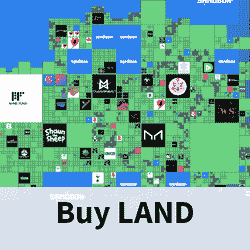

# 沙盒将要求土地购买者通过 KYC 验证

> 原文：<https://web.archive.org/web/https://dappradar.com/blog/the-sandbox-will-ask-land-buyers-to-pass-kyc-verification>

## 一个新的土地所有者路线图承诺大量的沙子空投和新的买家要求

沙盒是元宇宙最受欢迎的虚拟世界之一，它将引入 KYC 验证和销售抽奖流程，以实现更好的土地所有者分配。元宇宙政纲发布了这些计划，作为详细列出重要里程碑的新土地所有者路线图的一部分。

## 总结:

*   新的抽奖和 [KYC 验证](https://web.archive.org/web/20220705004344/https://dappradar.com/blog/the-sandbox-will-ask-land-buyers-to-pass-kyc-verification/#Sandbox)过程将为[沙盒](https://web.archive.org/web/20220705004344/https://dappradar.com/multichain/games/the-sandbox)的土地销售系统带来更多的安全性和更好的分配
*   沙盒计划在 2022 年向土地所有者空投价值数百万的沙子
*   土地所有者将会对现有的[沙场和专属养殖池](https://web.archive.org/web/20220705004344/https://dappradar.com/blog/the-sandbox-will-ask-land-buyers-to-pass-kyc-verification/#farming)进行大量改进

## 沙盒宣布 KYC 和抽彩土地销售系统

了解你的客户或 KYC 验证在加密领域是一个棘手的问题。许多加密爱好者认为，这违背了加密货币和区块链技术的初衷。然而，大公司开始更多地依赖 KYC 验证作为清除机器人和恶意行为者的工具。宇迦实验室要求另一边的土地购买者通过 KYC。Animoca Brands 推动 KYC 验证疯狂防御英雄奖励申领流程。

沙盒还宣布将引入 KYC 验证，用于未来的土地销售。这里需要注意的是，Animoca Brands 是沙盒的母公司。可以肯定地说，这家区块链博彩巨头的目标是为其投资组合中的更多产品引入 KYC。

新的沙盒土地所有者路线图规定，他们将通过抽奖系统为 KYC 认证的销售参与者分配土地。虽然，就目前而言，没有关于过程本身的细节，但这是沙盒将带来新的土地所有者的方式的重大变化。

## 2022 年向土地所有者空投沙子

除了销售结构的变化，沙盒 2022 路线图还为土地所有者提供了大量的沙地空投。该平台在 1 月份已经分发了超过 250 万个沙子代币，5 月份的空投预算增加到了 500 万个沙子。

更重要的是，沙盒计划为该平台自推出以来的第 1000 天进行一次庆祝性的空投。这次空投将根据土地所有者持有土地的时间来奖励他们。

## 沙盒带来了沙漠饥饿和农业增长

新的土地所有者路线图也为沙地所有者带来了一些利润丰厚的增加。五月将会带来这方面的最新消息。ETH 和 MATIC 赌注池都将受益于乘数效应。不过乘数数值还没有公布。

此外，沙盒土地所有者将能够受益于两个独家养殖池-一个用于 CATALYST，一个用于 GEM。这些养殖池将于 6 月启动。土地 NFT 所有者的另一个独家机会将于 7 月推出，价值 1000 万英镑的砂养殖池。

总的来说，沙盒正在为一个非常繁忙的 2022 年做准备。该平台将引入土地销售机制的全面改革，同时允许持有者从众多空投和农业机会中受益。

DappRadar 将继续监测沙盒虚拟世界，因为它推出了新的功能和发展。要想第一时间获得最新的元宇宙新闻，请在 Twitter 上关注 DappRadar 并打开你的通知！

[<picture></picture>](https://web.archive.org/web/20220705004344/https://dappradar.com/ethereum/games/the-sandbox)[<picture></picture>](https://web.archive.org/web/20220705004344/https://dappradar.com/hub/token/eth?to=0x3845badade8e6dff049820680d1f14bd3903a5d0) NewsletterUnsubscribe at any time. [T&Cs](https://web.archive.org/web/20220705004344/https://dappradar.com/terms) and [Privacy Policy](https://web.archive.org/web/20220705004344/https://dappradar.com/privacy-policy)