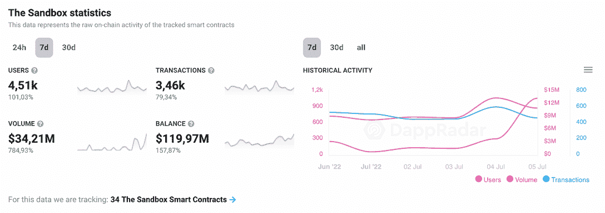

# 沙盒将与 dayz 一起扩大其在巴西的元宇宙

> 原文：<https://web.archive.org/web/https://dappradar.com/blog/the-sandbox-will-expand-its-metaverse-in-brazil-with-bayz>

## 该合作伙伴关系鼓励元宇宙在拉丁美洲的扩展和加密应用

Sandbox 向拓展其在巴西的元宇宙体验又迈进了一步。通过与 Web3 游戏公司 BAYZ 合作，区块链游戏遵循了其在 2022 年初宣布的增长计划。此举的重点将是巴西市场本身，这是世界上最开放的采用加密游戏的市场之一。

根据[新闻稿](https://web.archive.org/web/20220913145718/https://www.sandbox.game/en/blog/the-sandbox-partners-with-bayz-to-grow-the-metaverse-in-brazil/)，巴西刀 [BAYZ](https://web.archive.org/web/20220913145718/https://bayz.gg/) 将带领沙盒进入巴西玩家的世界。

该公司将开展战略合作伙伴关系，以加强品牌，正如沙盒(Sandbox)的联合创始人塞巴斯蒂安·博杰特(Sebastian Borget)在 T2 所说，“帮助我们将巴西的文化和多样性融入元宇宙。”

这种伙伴关系象征着，这将不仅仅是巴西元素的出口，而是将当地观众与游戏本身的娱乐和媒体联系起来。

这已经是沙盒宣布的第二个涉及南美国家的合作伙伴关系。2022 年 2 月，巴西 Web3 游戏工作室[寄居蟹](https://web.archive.org/web/20220913145718/http://www.hermitcrabstudio.com/)加入元宇宙。目标是创造一个受巴西元素启发的游戏城市，尤其是里约热内卢。

[https://web.archive.org/web/20220913145718if_/https://www.youtube.com/embed/xcHvC8XIS5E](https://web.archive.org/web/20220913145718if_/https://www.youtube.com/embed/xcHvC8XIS5E)

同样，巴西的体育是另一个非常受欢迎的领域，成功地连接到该国的区块链。

《沙盒》是当今区块链销量最高的游戏之一，如 [DappRadar 游戏排名](https://web.archive.org/web/20220913145718/https://dappradar.com/rankings/category/games)所示。

## 玩家能做什么

在[元宇宙](https://web.archive.org/web/20220913145718/https://dappradar.com/blog/what-is-the-metaverse)的玩家可以在 166，464 块可用土地中的一块建立自己的虚拟世界。他们建造的任何东西都可以与他人分享。

他们还可以在游戏内市场上将用户生成的内容作为 NFT 资产进行交易，让游戏玩家从游戏中获得奖励。怎么会？通过赢得游戏代币[和](https://web.archive.org/web/20220913145718/https://dappradar.com/hub/token/eth/SAND?from=0x3845badade8e6dff049820680d1f14bd3903a5d0)，如果需要的话，这些代币可以兑换成任何法定货币(真实世界)。

过去一周，代币的表现一直不错。活跃用户数量翻了一番，智能合约交易额增长了约 79%。这是一个值得关注的很好的标志，你可以在我们的[详细的沙子分析](https://web.archive.org/web/20220913145718/https://dappradar.com/blog/sand-was-trending-are-the-fundamentals-still-strong)中读到。你也可以用 [DappRadar 的统计数据](https://web.archive.org/web/20220913145718/https://dappradar.com/multichain/games/the-sandbox)来追踪沙盒。

DappRadar 社区的成员可以每周参加激动人心的加密令牌空投和赠品活动。创建一个帐户，并查看哪些[免费加密空投](https://web.archive.org/web/20220913145718/https://dappradar.com/hub/airdrops)正在进行！

[<picture></picture>](https://web.archive.org/web/20220913145718/https://dappradar.com/hub/airdrops)

## 巴西人是采用加密技术的先锋

如 [DappRadar 行为报告](https://web.archive.org/web/20220913145718/https://dappradar.com/blog/behavior-report-macroeconomic-events-accelerate-crypto-adoption-and-regulations)所示，巴西是世界上第 12 个拥有加密资产投资人口比例最高的国家。

在通货膨胀和政治动荡的情况下，2021 年约有 1000 万巴西人拥有 crypto。这相当于美洲最有影响力的国家之一人口的 4.88%。当然，广泛采用之后是政治。

2022 年 4 月，[巴西参议院一致批准了所谓的“比特币法”](https://web.archive.org/web/20220913145718/https://dappradar.com/blog/guide-to-all-crypto-regulations-worldwide/#Brazil)，规范加密货币交易。这代表着一个对加密更加友好的巴西的开始。

当然，这是一个有利于加密投资的环境，正如今年在巴西举行的 web3 游戏初创公司和区块链会议不可阻挡的场景中可以看到的那样。

## NFT 奥运会引领潮流

尽管加密货币处于熊市，但巴西有着自己独立的现实。在那里，对 NFT 和区块链游戏的需求仍然很高。事实上， [DappRadar 的 NFT 交通排名](https://web.archive.org/web/20220913145718/https://dappradar.com/blog/blockchain-user-behavior-report-nfts-games-less-sensitive-to-global-crypto-trends)显示该国在全球排名第三。

作为足球之国，巴西市场已经熟悉了加密技术，这要归功于 PSG 球员小内马尔和他对 T2 BAYC NFTs 的收购。更不用说巴西的大型足球队与各种 web3 游戏项目合作了。

甚至第一场在分散的元宇宙举行的婚礼也在巴西举行。

对于巴西人来说，这是忙碌的一年，但他们似乎很容易就在他们的文化中传播了加密货币的复杂概念。

## 最后的想法

巴西目前的各种因素结合在一起，使它变成了一个具有爆炸潜力的沙盒。作为一个不平等但具有企业家精神的地方，巴西是从分散金融中获益最多的国家之一。

和世界上任何地方一样，首先使“秘密谈话”成为可能的是娱乐。

使元宇宙成为社区的固有部分是使其真正成为巴西一部分的关键。因此，这是在所有拉美国家推广 Metaverses 的一个至关重要的举措。

我们 DappRadar 将密切关注我们平台上沙盒的发展。

此外，如果你想跟上最新的采用和区块链游戏新闻，请确保阅读我们的[博客](https://web.archive.org/web/20220913145718/https://dappradar.com/blog/)并在[推特](https://web.archive.org/web/20220913145718/https://twitter.com/DappRadar)上关注 DappRadar！

 NewsletterUnsubscribe at any time. [T&Cs](https://web.archive.org/web/20220913145718/https://dappradar.com/terms) and [Privacy Policy](https://web.archive.org/web/20220913145718/https://dappradar.com/privacy-policy)