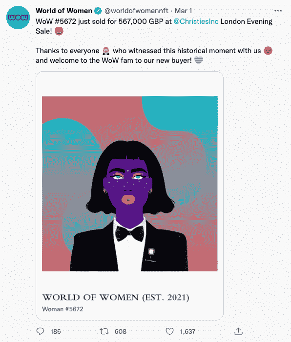

# 女性的沙盒 x 世界携手赋予女性权力

> 原文：<https://web.archive.org/web/https://dappradar.com/blog/the-sandbox-x-world-of-women-partner-up-to-empower-women>

## 沙盒继续向前迈进

[**沙盒**](https://web.archive.org/web/20221215220624/https://dappradar.com/ethereum/games/the-sandbox) **和** [**世界女性**](https://web.archive.org/web/20221215220624/https://dappradar.com/ethereum/collectibles/world-of-women) **宣布合作，将 NFT 集体带入沙盒。此举被视为促进元宇宙包容性和平等的努力。**

在 DappRadar 关于 Billboard 和 WoW 合作的[报告](https://web.archive.org/web/20221215220624/https://dappradar.com/blog/billboard-x-world-of-women-collab-celebrates-women-in-music)之后，Sandbox 与 WoW 合作，让元宇宙成为一个任何人，无论性别，都能感受到欢迎的空间。 [Animoca Brands](https://web.archive.org/web/20221215220624/https://dappradar.com/blog/animoca-brands-places-a-bet-on-solana-virtual-world-dropp) (沙盒的母公司)的这一举动并不是他们第一次敏锐地看到元宇宙潜在的商业机会。

通过让新的区块链市场尽可能地欢迎女性，它打开了一个全新的销售对象。当你可以卖给所有人的时候，为什么要卖给半个世界？

这一伙伴关系将确保:

*   WoW 基金会的创立。该基金会将获得 2500 万美元的赠款，用于在分散的网络空间促进妇女的发展。
*   合作伙伴共同努力，在致力于以妇女为中心的事业的沙盒内策划一个互动的世界。
*   一个建在 2×2 土地上的 WoW 博物馆和一个 WoW 大学，它将提供如何开始 web3 的指导和教程。

The Sandbox purchased Aurora, formerly known as WoW #6025

Animoca Brands 现在也能够利用它与 WoW 的新关系，并有可能让女权主义者 NFT 社区参与更多的其他区块链平台。

## 沙盒中的阿尔法第二季

沙盒和 WoW 合作伙伴关系的宣布恰逢该游戏于 3 月 3 日推出 Alpha 第二季。

现在拥有 200 万注册用户和一长串商业和内容合作伙伴，该平台已经朝着全面推出迈出了下一步，预计将在今年晚些时候推出。

所有注册用户，以及那些在为期四周的阿尔法第二季中注册的用户，将免费获得超过 35 个在区块链世界中策划的互动体验。

为了赢得免费的 Alpha 通行证，玩家可以在第二季的游戏任务中进行竞争，以赢取奖券。有超过 200 个这样的任务，总共会有 10，000 张赛季阿尔法通行证。赢得阿尔法通行证将使持有者有机会赢得多达 1，000 粒沙子(沙盒的本地令牌)。

[https://web.archive.org/web/20221215220624if_/https://www.youtube.com/embed/qPVumlluz_4?feature=oembed](https://web.archive.org/web/20221215220624if_/https://www.youtube.com/embed/qPVumlluz_4?feature=oembed)

Alpha Season 2 Trailer

有关区块链游戏和分散应用世界的更多新闻，请继续关注 [DappRadar](https://web.archive.org/web/20221215220624/https://dappradar.com/blog/) 并在 [Twitter](https://web.archive.org/web/20221215220624/https://twitter.com/DappRadar) 上关注我们。你也可以参加我们每周四下午 4 点的[不和谐](https://web.archive.org/web/20221215220624/https://discord.com/invite/QMnwjGzrkG)节目。