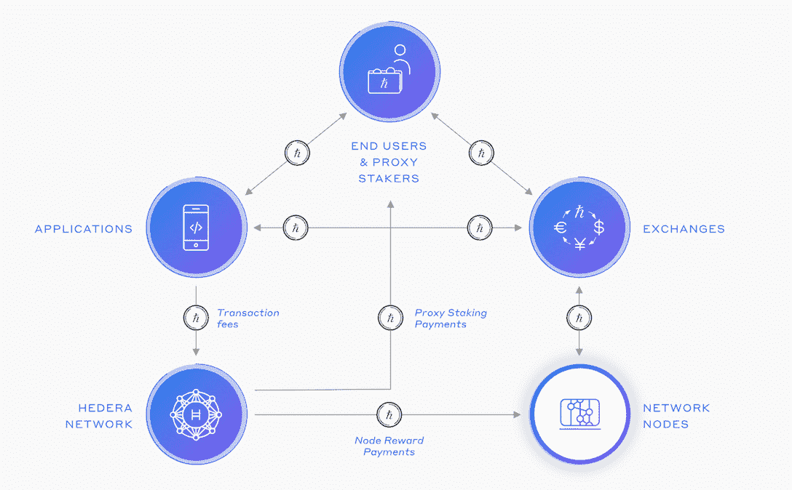
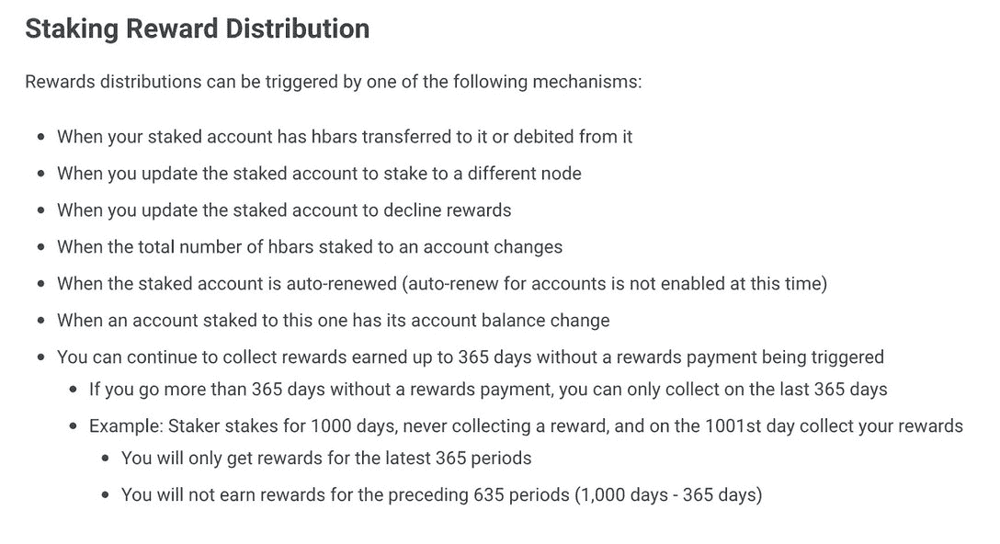
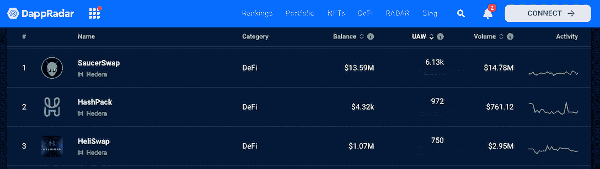

# 海德拉星球上的星际酒吧终极指南

> 原文：<https://web.archive.org/web/https://dappradar.com/blog/the-ultimate-guide-to-staking-hbar-on-hedera>

## 自 10 月 21 日以来，HBAR 本地用户竞拍已经上线。

**HBAR 是 Hedera 网络的本地生态友好型加密货币。HBARs 用于支付交易费用，并通过利益证明保护网络免受攻击。任何帐户都可以选择向一个节点或另一个帐户下注并获得奖励。这篇文章将带你了解如何参与 Hedera 网络赌注。**

**内容:**

*   [为什么赌注很重要？](https://web.archive.org/web/20221202120634/https://dappradar.com/blog/the-ultimate-guide-to-staking-hbar-on-hedera/#why)
*   [Hedera 打桩的主要特点](https://web.archive.org/web/20221202120634/https://dappradar.com/blog/the-ultimate-guide-to-staking-hbar-on-hedera/#key)
*   HBAR 奖励是如何计算和分配的？
*   [如何在海德拉身上下注](https://web.archive.org/web/20221202120634/https://dappradar.com/blog/the-ultimate-guide-to-staking-hbar-on-hedera/#how)
*   [支持 Hedera 充满活力的生态系统](https://web.archive.org/web/20221202120634/https://dappradar.com/blog/the-ultimate-guide-to-staking-hbar-on-hedera/#support)
*   [有用的链接](https://web.archive.org/web/20221202120634/https://dappradar.com/blog/the-ultimate-guide-to-staking-hbar-on-hedera/#links)

## 为什么赌注很重要？

与工作证明(PoW)相比，利益证明(PoS)提供了许多优势，例如更快的交易速度、更高的能效和更高的可扩展性。因此，许多分散的网络现在利用利害关系证明共识机制。

最重要的是，利害关系证明为用户提供了赚取更多加密资产的机会。在 PoS 下，想要验证新交易并在区块链上添加新区块的网络参与者必须“入股”本地加密货币。

作为一个利益相关网络的证明，Hedera 要求 HBAR 作为 Hashgraph 共识算法的核心功能被加入到网络中。此外，本地桩进一步分散和保护网络，并代表了走向完全分散的旅程中的一个重要里程碑。

自 10 月 21 日上午 12:00(UTC)开始，HBAR 本地用户竞猜活动已经开始。第一笔奖励在 24 小时后(UTC 10 月 22 日上午 12:00)支付给所有合格帐户的用户。

通过押注 HBAR，用户可以获得 6.5%的 APY。请继续阅读，了解如何参与其中。

## Hedera 打桩的主要特点

### 没有结合或砍杀

原生 HBAR 赌注的特点是没有绑定，这意味着没有锁定期，用户可以随时下注和解约。也没有砍杀。斜线是对利益相关者/节点行为不当的惩罚，比如在提交之前重新安排/重新排序事务。

缺少斜线是因为 Hashgraph 算法确保了公平排序，这是一个网络特性，意味着任何参与者都不可能通过设计来改变事务顺序。

用户可以与网络互动，并在下注时花费 HBAR，这不会影响奖励资格。

*   示例:我正在 UTC 时间上午 12:00 主动向 LG 节点下注 100 HBAR。我可以和 dapps 互动，花我的 HBAR，存更多的 HBAR 等等。无论 24 小时后我的钱包里有多少 HBAR，**我仍然会收到开天辟地之初我钱包里的 100 HBAR 的奖励。**

 **然而，**、**如果用户在 24 小时内的任何时间点更改其赌注委托(更改节点)、停止赌注或开始拒绝奖励，他们将没有资格在下一个分发点获得奖励。

### 帐户对帐户的赌注

用户可以下注到另一个帐户来促成共识，而不是直接下注到一个节点。在这种情况下，奖励将直接支付到下注到节点的钱包中。

*   示例:帐户 A 被绑定到 LG 节点。帐户 B 与帐户 a 的利害关系。HBAR 在两个帐户中的总权重将在奖励分配中计算，奖励分配将全部支付给帐户 a

这使得生态系统更加灵活，允许参与者之间的博弈和互动。

*   例如:访问+所有权。一个元宇宙项目需要你在账户 A 上投入一些 HBAR 来访问这个平台。如果你直接在一个节点下注，他们仍然会为你提供相同的奖励，但现在所有游戏中的数字资产都可以直接转移到你的帐户，而不是放在中央钱包中。

## HBAR 奖励是如何计算和分配的？

要获得奖励资格，用户必须在 UTC 时间任意一天的上午 12:00 之后的整个 24 小时内积极下注于管理委员会节点之一，奖励将在该天结束时分发。

UTC 时间每天中午 12:00，我们会拍摄每个积极下注的钱包的快照，以及他们为共识贡献的 HBAR 金额。

假设一个钱包在快照后的 24 小时内一直处于活跃状态，奖励将从奖励账户(mainnet 上的账户 ID 为 0.0.800)根据他们以 6.5%的 APY 下注的 HBAR 金额分配到相应的钱包。

钱包必须执行一个特定的“动作”来领取它们的奖励。你可以参考下面触发分发的机制。

[Staking – Hedera](https://web.archive.org/web/20221202120634/https://docs.hedera.com/guides/core-concepts/staking#staking-reward-distribution)

值得注意的是，即使钱包没有执行这些活动中的任何一项，奖励仍将最多累积 365 天。

*   例如:如果我下注 100 HBAR，并且 10 天没有与我的钱包互动，那么执行上面详述的操作之一，我将收到所有前 10 天的集体奖励。

## 如何下注

用户有三种方式参与本地锁定，如下所示。

1.  原生星际用什么钱包

*   [HashPack](https://web.archive.org/web/20221202120634/https://www.hashpack.app/)
*   [刀锋钱包](https://web.archive.org/web/20221202120634/https://www.bladewallet.io/)
*   [寨漏](https://web.archive.org/web/20221202120634/https://wallawallet.com/)
*   [Yamgo 应用](https://web.archive.org/web/20221202120634/https://yamgo.com/)

2.  集成赌注的交易所:

*   OKX

3.  用户也可以使用 HashPack 通过 Hedera 网络浏览器 **HashScan.io** 访问 staking。

## 支持 Hedera 充满活力的生态系统

目前，有 295 亿 HBAR 代币押在网络上。这充分证明了用户对 Hedera 区块链及其生态系统的信心。

Hedera 作为一个托管 dapps 的分散式网络的崛起不言自明。该网络已经发展成为一个包罗万象的平台，各种 dapps 在所有部门蓬勃发展。

例如，HeliSwap 是一个开源的去中心化交换(DEX)平台，支持 Hedera 生态系统内的令牌，在过去 30 天内，独特的活动钱包增长了 220%。NFT 板块的情况看起来也很好，Hbar Punks 的交易量在 30 天内上升了 124%。

[Check out trending dapps on Hedera](https://web.archive.org/web/20221202120634/https://dappradar.com/rankings/protocol/hedera)

如果你也看好 Hedera 的未来，请点击下面的按钮，立即参与 HBAR 赌注。

[Join staking](https://web.archive.org/web/20221202120634/https://docs.hedera.com/guides/core-concepts/staking#staking-reward-distribution)

## 有用的链接:

*   [海德拉打桩文件](https://web.archive.org/web/20221202120634/https://docs.hedera.com/guides/core-concepts/staking)
*   [李蒙·贝尔德谈赌注](https://web.archive.org/web/20221202120634/https://hedera.com/podcast?wchannelid=ms1vo20k45&wmediaid=gthr1cfm1v)
*   [去哪里买 HBAR](https://web.archive.org/web/20221202120634/https://hedera.com/exchanges)

**免责声明** —这是一篇赞助文章。DappRadar 不认可本页面上的任何内容或产品。DappRadar 旨在提供准确的信息，但读者应该在采取行动之前总是自己做研究。DappRadar 的文章不能被认为是投资建议。**