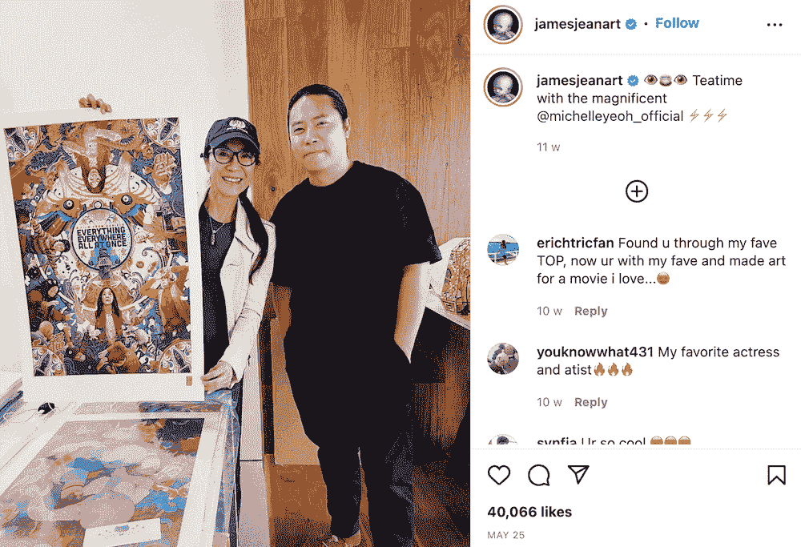
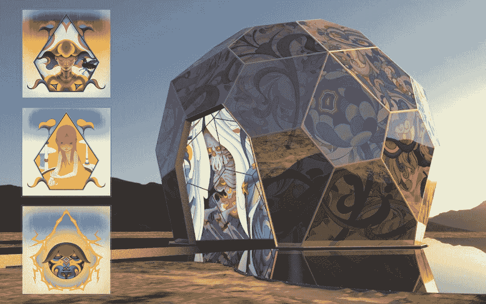
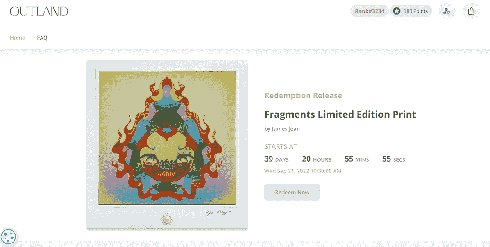
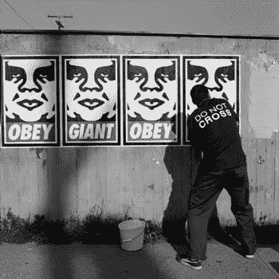
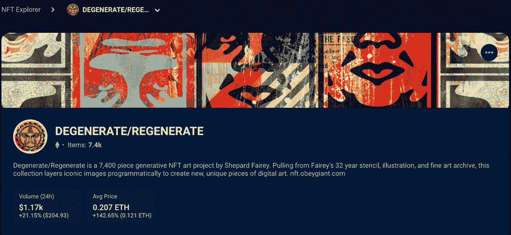
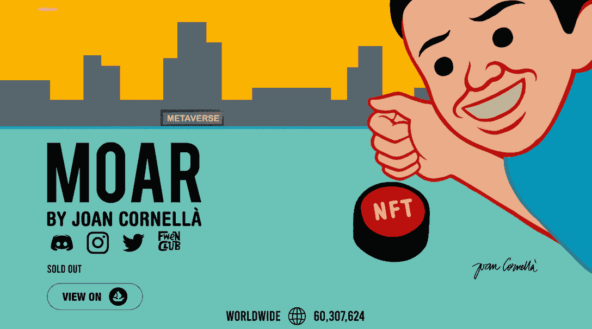

# 世界上最知名的艺术家正在使用 NFTs 来真正造福他们的粉丝

> 原文：<https://web.archive.org/web/https://dappradar.com/blog/the-worlds-most-visible-artists-are-using-nfts-to-truly-benefit-their-fans>

## NFT 允许收藏家以可承受的价格拥有世界上最著名的艺术家的艺术品。

像 James Jean、observe Giant 和 Joan Cornella 这样的超级艺术家正在进军 NFT 领域。他们正在利用这一新兴技术，通过消除艺术行业固有的第三方，让他们忠诚的赞助人受益，并与粉丝建立更密切的关系。

总结:

*   今天的文章将分享各种 [NFT 项目](https://web.archive.org/web/20221004010401/https://dappradar.com/nft)让艺术爱好者以合理的价格收集著名艺术家的艺术作品。
*   外域艺术让詹姆斯·简的[碎片](https://web.archive.org/web/20221004010401/https://dappradar.com/ethereum/collectibles/fragments-by-james-jean) NFT 持有者赎回艺术家的实物艺术品。
*   服从巨人的[退化/再生](https://web.archive.org/web/20221004010401/https://dappradar.com/hub/nft-explorer/collection/degenerate-regenerate) NFT 持有者可以获得服从令牌掉落。
*   Joan Cornella 的《MOAR》为社区成员提供了一个了解其他已建立的 NFT 项目的途径。
*   此外，用户可以通过 [DappRadar NFT 探索者](https://web.archive.org/web/20221004010401/https://dappradar.com/nft)找到关于数千个 NFT 项目的深刻信息。
*   敬请关注 DappRadar 上即将到来的对 NFT 艺术家和收藏家的采访。

NFTs 的世界从来不缺“传奇”。有趣的是，许多不知从哪里冒出来的 NFT 藏品都设法把底价提到了天上。但是，不幸的是，当谈到这些非功能性词汇的美学时，可能需要更多的努力来欣赏它们。

NFT 收藏品很酷，在很多情况下很有用。但也许让真正的专家做他们擅长的事情更好，比如制作艺术品。

阅读这篇文章，了解 NFT 领域的前 20 位新兴艺术家。

因此，如果你不是为了盈利而创办非传统艺术，只是单纯地欣赏流行文化和艺术潮流，那么有许多由知名艺术家策划的 NFT 项目，它们都有令人难以置信的额外津贴。它们旨在以实惠的价格为您带来独特的艺术收藏体验。

## 詹姆斯·简·x·外域:一次收集所有的东西，无论在哪里

美国视觉艺术家詹姆斯·吉恩是目前世界上最受欢迎的艺术家之一。詹姆斯·让以其超风格化的审美而闻名，他注入各种元素来构建他的世界——从东方卷轴画到现代流行文化，如动漫和漫画。

[Source](https://web.archive.org/web/20221004010401/https://www.instagram.com/p/Cd92v1LLXHx/)

他的艺术版画总是以多重复杂的增强为特色，将图像提升到深不可测的维度。所以很自然地，他的作品通常在发行后几分钟内就销售一空。

今年，除了为热门电影*创作独特的海报外，詹姆斯·吉恩还与外域艺术合作，推出了名为[片段的 NFT 艺术作品集。](https://web.archive.org/web/20221004010401/https://dappradar.com/ethereum/collectibles/fragments-by-james-jean)该系列以 7，000 张手绘 NFT 的版本尺寸铸造，以反映 2023 年推出的实体雕塑。*

多亏了 Outland Merch 平台，Fragments 已经为其社区成员提供了一些令人兴奋的额外津贴。

外域艺术是一个利用 NFTs 将人们对艺术的热情转化为回报的平台。为此，该平台引入了一个名为积分的系统，允许 NFT 持有者兑换世界上最著名艺术家的作品。

让我们以碎片 NFT 为例来阐述这个系统是如何工作的。所以如果你的钱包里有一个碎片 NFT，并且已经有了一个外域账户，系统会每天自动给你的账户分配积分。

最近，Outland 与 James Jean 合作，让用户使用他们的积分兑换这位艺术家广受喜爱的版画。该机制听起来类似于 staking，但没有所有令人困惑的术语和界面。你需要做的就是:拿着一个 NFT，自动收集积分，之后免费获得一张漂亮的实物打印。

## 服从巨人:最著名的街头艺术家解码 Web3 粉丝经济

许多人可能没有听说过 Shepard Fairey，但他们可能在街道、路人的帽子和 t 恤上看到过标志性的 OBEY 标志或可识别的面孔。

[Source](https://web.archive.org/web/20221004010401/http://www.thegiant.org/wiki/index.php/Obey_Giant)

世界上最受欢迎的街头艺术家谢泼德·费尔雷(Shepard Fairey)或“服从巨人”(Obey Giant)相信“审视一切”。永远不要做假设”。因此，在权衡利弊后，Obey 进入了 NFT 的世界，并利用 cryptos 将粉丝经济发挥到了极致。

艺术家最大的 NFT 项目是[退化/再生](https://web.archive.org/web/20221004010401/https://dappradar.com/hub/nft-explorer/collection/degenerate-regenerate)，总体积 1,286 ETH。根据[达普拉达尔 NFT 探险家](https://web.archive.org/web/20221004010401/https://dappradar.com/hub/nft-explorer)的说法，尽管该项目于去年年底推出，但它仍保持着对收藏家群体的吸引力，在过去 24 小时内销售额增长了 21%。

Obey 的加密社区由两个主要部分组成:NFTs 和 [OBEY 社交令牌。](https://web.archive.org/web/20221004010401/https://obeygiant.com/nft/obey-token/)

OBEY 是 Obey Giant web3 社区中的一个标志，用于独特的体验和早期访问创意作品。目前，OBEY 还不能购买，偶尔会通过其他社区活动分发给现有的 NFT 持有者。

## 琼·科尼拉:从纸一直到元宇宙

Joan Cornellà Vázquez 以其强大的黑色幽默而闻名，无疑是当今最受欢迎的漫画家和插画家之一。粉丝们喜欢 Joan Cornellà对人性阴暗面的诙谐讽刺的评论。即使他通常处理不愉快的话题，他对简单的视觉语言和欢快的调色板的天才使用使观众轻松愉快。

今年 4 月，Joan Cornellà启动了他的第一个 NFT 项目——MOAR，一座位于元宇宙的豪宅，里面住着 5555 只 NFT 生物。MOAR 是一个虚拟空间，用户可以在这里找到商店、游戏和虚拟展览。

从社区的参与度可以看出这个项目的受欢迎程度。令人印象深刻的是，MOAR 的 Discord 每天有超过 20 万名成员分享他们对各种事情的热情。MOAR 的持有者今年已经收到了许多时髦的礼物。未来，他们将有机会参观 Joan Cornellà的实体和虚拟展览。

但真正吸引许多社区成员的是，MOAR 已经建立了一个广泛的网络，有许多有前途的 NFT 项目。MOAR 会员已经获得了许多 NFT 著名项目的白名单机会，包括 OpenSea 上排名前十的 NFT 艺术收藏[超级酷世界](https://web.archive.org/web/20221004010401/https://dappradar.com/hub/nft-explorer/collection/nina-s-super-cool-world)。

## 使用 DappRadar 跟踪产品深入了解 NFT 项目

举办这些知名艺术家的 NFT 项目，除了欣赏他们的视觉效果，还有什么其他好处？

首先，与市场上的蓝筹 NFT 项目相比，这些由艺术家主导的项目即使在熊市中也能保持相对稳定的底价。这对那些不是快速致富者的真正艺术爱好者来说是完美的。

此外，这种 NFT 的价值是由艺术家的创造力支持的，而不是过度承诺的路线图。更重要的是，这些项目遇到拉地毯的机会非常低。

但我们仍然必须提醒用户在购买任何 NFT 之前做一个全面的研究。使用 [DappRadar 的 NFT 跟踪](https://web.archive.org/web/20221004010401/https://dappradar.com/nft)工具了解这些项目的交易历史和定期绩效。

让我们不要忘记提及 DappRadar 将[采访](https://web.archive.org/web/20221004010401/https://dappradar.com/blog/tag/interview)来自不同背景的 NFT 艺术家和收藏家，分享他们对热门话题和市场趋势的看法。所以，通过[推特](https://web.archive.org/web/20221004010401/https://twitter.com/dappradar)和[不和](https://web.archive.org/web/20221004010401/https://discord.gg/4ybbssrHkm)让我们知道你最想听谁的故事。

最后，当准备好获得一些 NFT 时，你可以简单地使用 [DappRadar 的投资组合管理工具](https://web.archive.org/web/20221004010401/https://dappradar.com/hub/wallet/)进行交易。查看下面的视频，了解如何从中受益。

[https://web.archive.org/web/20221004010401if_/https://www.youtube.com/embed/4lnlrnpQbxE?feature=oembed](https://web.archive.org/web/20221004010401if_/https://www.youtube.com/embed/4lnlrnpQbxE?feature=oembed)

DappRadar 将继续监测 NFT 油田的最新发展。在 [Twitter](https://web.archive.org/web/20221004010401/https://twitter.com/dappradar) 、 [Discord](https://web.archive.org/web/20221004010401/https://discord.gg/4ybbssrHkm) 和 [Youtube](https://web.archive.org/web/20221004010401/https://www.youtube.com/c/DappRadar) 上关注我们，跟上区块链世界的动态。