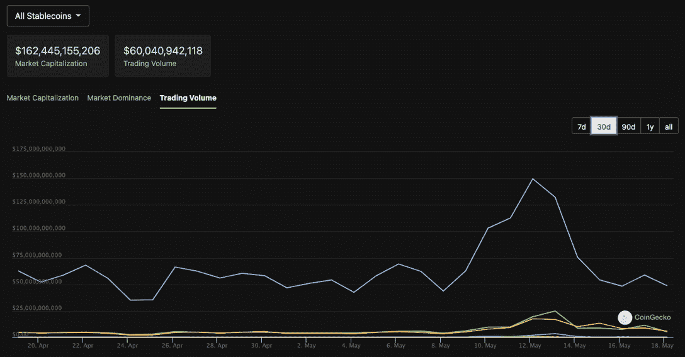

# 这些是你能信任的最好的稳定的硬币

> 原文：<https://web.archive.org/web/https://dappradar.com/blog/these-are-the-best-stablecoins-you-can-trust>

## 每个人都挂在嘴边的 1 美元问题

尽管加密技术不景气，但仍有稳定的加密技术提供安全保障，并享有值得信赖的声誉。尽管如此，stablecoins 的声誉受到了严重影响，可以说，Terra USD 的垮台推动了分散融资在几年前的大规模采用。

根据 CoinGecko 的数据，目前有 84 种稳定的硬币在流通中，总市值超过 1630 亿美元。大多数加密货币与美元挂钩，与其他加密货币一样，需要被视为投资，它们有可能失败。即使你有信心不会损失你的投资，也要做好损失你投入的任何资金的准备。此外，这篇文章的重点是确定具有坚实基础和最少失败机会的稳定公司。

## 为什么我们需要谈论稳定的硬币

在过去的几周里，与美元挂钩的最大的稳定货币之一——泰拉美元的迅速贬值，为一个价值约为 1620 亿美元的行业领域的稳定性带来了光明。在 UST 崩溃的余波中，其他稳定债券开始失去各自的挂钩，呼吁对市场进行更广泛的审查，并更深入地了解什么是稳定债券以及它们如何运作。

UST 最近的事件告诉我们，一些稳定的资本是有限制的。Terra 的本地令牌 LUNA 是市场上最有价值的资产之一，在网络的稳定货币 TerraUSD (UST)失去美元价值后，在 24 小时内暴跌 99%，于 5 月 12 日暴跌至接近零。这引发了一场秘密银行挤兑，在此期间，由于担心崩溃，用户大量抛售 LUNA。现在，UST 的价值不到 0.10 美元，而 LUNA 在一周内损失了 99.99%的价值。

## 稳定的加入是如何运作的

稳定币是数字货币，旨在与更稳定的基础资产保持一对一的联系，如国家货币——市场上最受欢迎的一些稳定币与美元挂钩。此外，稳定的密码有助于管理密码市场的波动性并保持其价值。

它们在 2020 年 DeFi 夏季期间变得越来越受欢迎和实用，因为 stablecoins 允许市场参与者轻松进出加密交易，提高了波动性加密货币的可用性，并在加密市场创造了更多的流动性。与更稳定的资产直接挂钩允许市场参与者在加密价格波动变得难以预测时使用稳定的货币。

不同类型的 stablecoins 根据其潜在的抵押品设计进行标记，包括法定支持、加密支持、商品支持或算法支持。泰拉美元或 UST 是众所周知的算法稳定币。与 USDT、BUSD 和 USDC 持有法定资产作为其代币的储备不同，UST 依靠一套复杂的代码和一个 LUNA 代币来平衡供需和稳定价格。

从本质上说，UST 是一个实验，以测试使用加密资产支持稳定硬币的有效性。实验失败了，但它不应该引起对其他以不同方式支持的领先 stablecoin 项目的更广泛关注。

## 哪些 stablecoins 值得信赖？

我们可以看看主要稳定银行的结构和资金支持。这有助于投资者更深入地理解风险，因为我们可以认为，与加密资产支持的债券相比，受监管政府资产支持的稳定债券是更安全的选择。在这方面，透明度至关重要，可以说，USDC 是最透明的，因为它每月都会发布支持稳定欧元的外汇储备状况报告。

**USDC** 完全由现金和短期美国政府债券支持，因此其美元兑换比例始终为 1:1。每个月，他们都会公布均富出具的关于支持 USDC 的储备余额的证明报告。

USDT(Tether)是一种与美元挂钩的加密货币稳定币，根据其网站，“100%由 Tether 的储备支持”。虽然这一点已经公开辩论过，但仍然没有证据证明泰瑟公司没有它声称的支持 USDT 的储备。

**戴**是以太坊上运行的分散式稳定币，试图维持 1.00 美元的价值。与中央银行不同，戴的银行账户中没有美元作为支持。相反，它是由绿洲 DeFi 平台上的抵押品支持的，该平台是由创客和戴项目背后的同一批人构思的。

BUSD 100%由受保美国银行的专用综合账户中的法定现金和美国短期国库券中的一种或两种形式的储备支持。这还将包括回购协议和投资于美国国债的货币市场基金。

## 稳定的市场份额

查看市值排名前十的稳定公司是一个很好的起点。你会放大那些使用率最高、在最多交易所交易的稳定硬币。如图所示，USDT 有 335 家交易所交易，而 USDC 有 284 家交易所交易。在这条线以下，我们只看到和戴在 100 多家交易所交易。交易所相信这四种稳定的硬币，下面看到的每种硬币的交易量证实了交易者更信任这些稳定的硬币。

5 月 11 日那些显著的峰值源于 UST 的余波，当时投资者受到惊吓，开始将大量稳定的货币资产转移出市场。另一方面，过去一周，机会主义者试图从稳定的铜币之间的微小差异中获利，进行了大量套利交易，推高了交易量。尽管如此，stablecoin 的大量使用在很大程度上依赖于这四种货币，并且在它们各自的生态系统中有大量的流动性。

## 为什么重要？

首先，超过 150 亿美元的价值因卢娜和 UST 的死亡而消失，而卢娜持有者的推文和报告不断传来，谈论自残和储蓄被抹去。许多人在这次崩溃中遭受了经济损失。此外，它并不局限于地球生态系统。一些 UST 和卢娜的持有者可能被迫清算其他持股以弥补亏空，导致抛售压力，并可能导致整个市场下跌。

第二，也是这篇文章的原因，该事件引发了对其他 stablecoins 的质疑。UST 不同寻常，因为它是一个算法稳定的硬币，不像 USDT 和 USDC。但是，如果 UST 遭到攻击，那么现在可能存在一个蓝图来追踪其他算法上固定的稳定点。事实上，戴在 2020 年也经历过类似的失败，但其社区的力量和流动性帮助它度过了难关。

最后，也是最重要的，有几个原因取决于你对监管的看法。UST 的崩溃引起了政治家、监管者和行业旁观者的关注。当 BTC 和瑞士联邦理工学院的股价在本周大幅下跌时，头条新闻都是关于 Terra 的。周二，财政部长珍妮特·耶伦说，UST 的脱钩“只是说明稳定的货币是一种快速增长的产品，风险也在快速增长。”

## 马厩的未来

可以相当有把握地说，监管将是 2022 年稳定资本的一个重要主题。和其他加密货币一样，stablecoins 在美国金融体系之外运作，官员们一再强调对加密资产逃过监管漏洞的担忧。

除其他外，联邦当局主要关注稳定硬币，因为它们最有可能在未来被日常顾客和购物者用来买东西，这是一件非常积极的事情，尽管许多人害怕监管。它将清理空间，让投资者更加透明。此外，这将使一个价值数十亿美元的行业进一步合法化，并有可能使其走出阴影。

熊市中成熟的开发领域寻求增加价值，最重要的是，以比传统服务更低的成本提供服务。想想 NFT 活动门票、推动品牌互动的 NFT 式营销活动、使用 stablecoins 的销售点基础设施等等。正因为如此，预计今年将会看到和听到关于稳定货币监管甚至可能是立法的持续讨论。

老话“你必须打破一些鸡蛋来做蛋糕”用在这里很合适。许多人忘记了 DeFi 作为一个行业只有三年多一点的历史。我们中的一些人可能穿运动鞋的时间更长。工作模型来了又去，自从 Compound 在 2020 年引入了他们的 DeFi 治理令牌以来，可以说 DeFi 应该迎来另一波创新。尽管有很多负面的和散布恐惧的言论，我们 DappRadar 人真的很兴奋能在一个关键时刻见证 dapps 及其潜在机制的演变。

 NewsletterUnsubscribe at any time. [T&Cs](https://web.archive.org/web/20220810165721/https://dappradar.com/terms) and [Privacy Policy](https://web.archive.org/web/20220810165721/https://dappradar.com/privacy-policy)