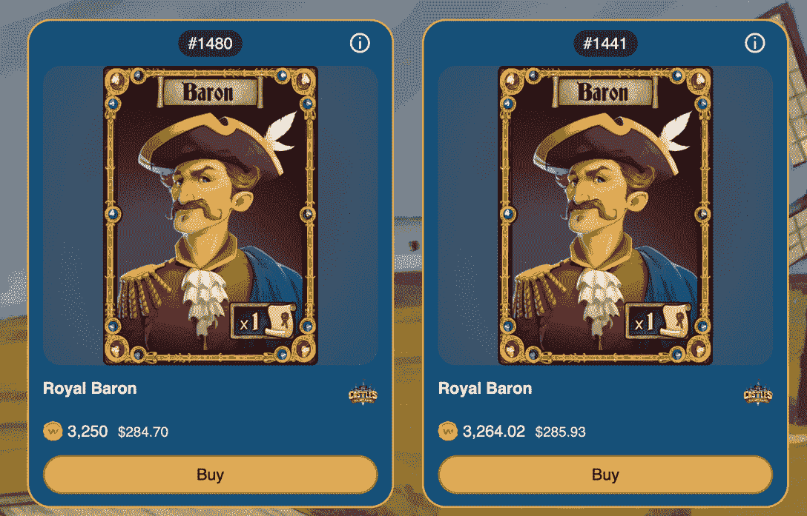
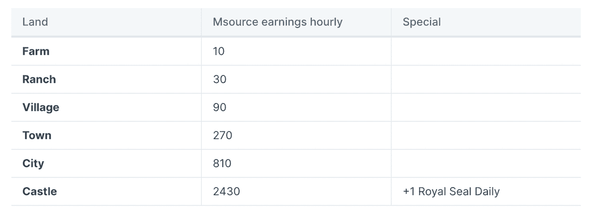
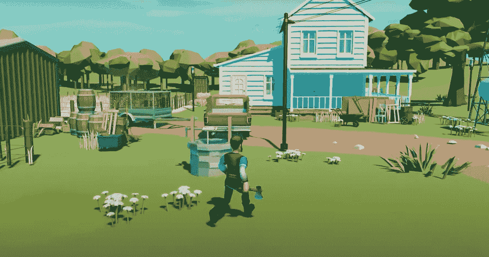
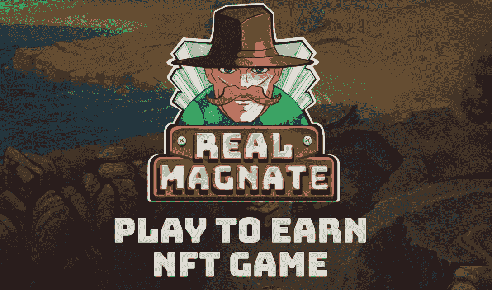
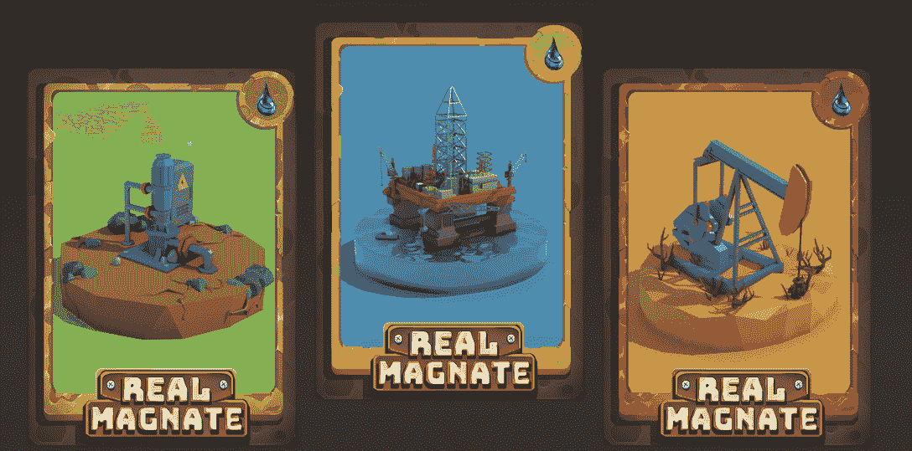
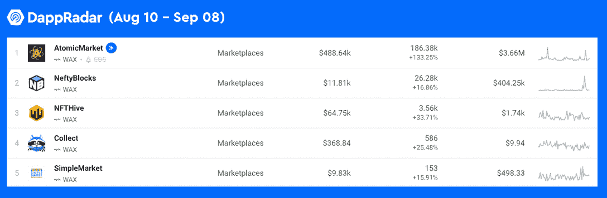

# Wax 上的这些游戏在 30 天内用户增长了 1000%以上

> 原文：<https://web.archive.org/web/https://dappradar.com/blog/these-games-on-wax-hit-1000-user-growth-in-30-days>

## 《NFT 城堡》、《真正的大亨》和《动物世界》是最新的畅销书。

【时间】最近，区块链蜡像馆的游戏费用再次大幅上涨。值得注意的是，一些新游戏出现在 Wax 游戏的畅销书排行榜上。此外，有几款游戏的用户增长速度在过去 30 天甚至超过了 1000%。

**概要:**

*   [蜡像区块链上的游戏](https://web.archive.org/web/20220926004400/https://dappradar.com/rankings/protocol/wax/category/games)最近发布了另一项令人印象深刻的数据表现。
*   增长最快的游戏是[城堡 NFT](https://web.archive.org/web/20220926004400/https://dappradar.com/wax/games/castles-the-nft-game) 、[动物世界](https://web.archive.org/web/20220926004400/https://dappradar.com/wax/games/animal-world)和[皇家大亨。](https://web.archive.org/web/20220926004400/https://dappradar.com/wax/games/real-magnate)
*   博彩业的繁荣也积极促进了 NFT 蜡像馆的发展，原子蜡像馆、T2 蜡像馆和 T4 蜡像馆都呈上升趋势。

根据 DappRadar 8 月份的行业报告，游戏部门仍然保持着区块链行业的领跑者地位，尽管其主导地位从 57.30%下降到 50.51%。

放大区块链博彩业， [Wax network 在激烈的竞争中大放异彩](https://web.archive.org/web/20220926004400/https://dappradar.com/rankings/protocol/wax/category/games)。几款蜡像游戏在短短一个月内就见证了超过 1000%的增长。由于 NFT 为这些游戏提供了动力，它们也极大地推动了 NFT 的蜡市场。

随着新游戏如雨后春笋般涌现，很难跟上最新的趋势。但是不用担心！ [DappRadar 蜡像游戏排名](https://web.archive.org/web/20220926004400/https://dappradar.com/rankings/protocol/wax/category/games)轻松找到当下最受欢迎的游戏。今天的文章还特别介绍了一个月内用户激增的蜡像游戏。

一头扎进去，看看是什么让它们如此吸引人！

## 城堡 NFTs 在中世纪的幻想环境中创造财富和荣耀。

由 Metasource Games 开发的城堡是一款 NFT 驱动的战略游戏，它将资产制造游戏与中世纪幻想背景完美融合。在游戏中，用户的最终目标是获得 Msource 代币，这是可以在 [Alcor 交易所交易的重要游戏资产。](https://web.archive.org/web/20220926004400/https://dappradar.com/wax/exchanges/alcor-exchange)除了在交易所将 Msource 转换成 Wax，玩家还可以用它来制作新的游戏内资产，并解锁元资源游戏的新体验。

那么用户如何赚取 Msource 呢？

用户可以通过像 NFT 城堡这样的数字游戏资产被动地赚取 Msource。但是要开始铸造地，玩家需要男爵 NFT，有两种方法可以获得它们。

元资源游戏团队不时向社区出售 Baron NFTs。除此之外，玩家还可以从 Wax 的 NFT 官方市场 [Atomic Hub](https://web.archive.org/web/20220926004400/https://dappradar.com/wax/other/atomicassets) 购买。

这里值得一提的是，NFT 土地有不同的等级。级别越高，利润就越丰厚。要升级你的地，只需根据游戏规则合并同等级的地。

下图显示了不同级别土地的盈利能力。

兴奋还不止于此。如果用户的土地一直升级到城堡，他们将有机会解锁一个类似于赌注的游戏机制。这将授予玩家直接获得蜡令牌的特权。

在过去的 30 天里，NFT 城堡的独立用户增长了 1759%。请立即查看 NFT 城堡的单个 dapp 页面，了解更多信息。点击[打开 Dapp 按钮](https://web.archive.org/web/20220926004400/https://dappradar.com/wax/games/castles-the-nft-game)将允许你直接跳转到 NFT 城堡的登陆页面。

## 动物世界——身临其境的 3D 农业游戏

[https://web.archive.org/web/20220926004400if_/https://www.youtube.com/embed/MvCEEzdbCgs?feature=oembed](https://web.archive.org/web/20220926004400if_/https://www.youtube.com/embed/MvCEEzdbCgs?feature=oembed)

如果你是《小镇》和《块状农场》等农业游戏的粉丝，你可能会发现《动物世界》也很吸引人。不仅如此，由 Unity 支持的动物世界独特的 3D 视觉效果为用户提供了身临其境的体验。仅仅是独自探索农场世界就带来了很多乐趣。

与大多数相对静态的游戏不同，[动物世界](https://web.archive.org/web/20220926004400/https://dappradar.com/wax/games/animal-world)要求玩家更加活跃，但要以一种令人愉快的方式进行。最重要的是，这些行为在动物世界的游戏赚钱机制中是必不可少的。

在[动物世界](https://web.archive.org/web/20220926004400/https://dappradar.com/wax/games/animal-world)中，玩家可以通过完成每天的市场订单，即一份养殖任务清单来获得被动收入。这些包括种植树木收获水果，饲养动物生产农产品，等等。

动物世界的元宇宙农场不仅仅是享受虚拟的乡村生活。所有这些活动都能给用户带来很多奖励，比如 AWC 代币和 NFT 空投惊喜。

《动物世界》是蜡像区块链上增长最快的游戏之一，30 天内激增 2500%。[亲自来体验《动物世界》，](https://web.archive.org/web/20220926004400/https://dappradar.com/wax/games/animal-world)然后你会被游戏精良的制作和精心设计的激励机制所折服。

## 真正的大亨——为铁杆大亨游戏迷提供的采矿游戏

[Real Magnate](https://web.archive.org/web/20220926004400/https://dappradar.com/wax/games/real-magnate) 是一款在蜡像区块链上玩到赚的采矿游戏。游戏允许用户在不同的矿坑中赚取资源，并找到最佳时机进行交易以获取利润。值得注意的是，在过去的 30 天里，这款游戏的用户数量有了惊人的增长，独特钱包的数量增长了 155660%。

Real Magnate 的玩法一点也不复杂。[在 Real Magnate](https://web.archive.org/web/20220926004400/https://dappradar.com/wax/games/real-magnate) 中，玩家使用 NFT 工具开采三种类型的游戏内资源，石油(RMO)、黄金(RMG)和铁(RMI)，它们都是公用事业代币。

需要注意的是，每个 NFT 工具只能开采一种资源。因此，玩家需要聪明地发挥才能最大限度地发挥生产力。此外，用户可以花费他们挖掘的代币来升级他们的工具，从而增加他们的挖掘能力。

Real Magnate 刚刚推出，并在用户中获得了很大的吸引力。[查看此链接](https://web.archive.org/web/20220926004400/https://dappradar.com/wax/games/real-magnate)如果你也想参与这个大亨游戏和你自己的工业帝国。

## Wax 的 NFT 市场因游戏繁荣而加速发展

那些 NFT 的蜡市场是蜡游戏热潮的直接受益者。在撰写本文时，区块链蜡像馆前五大 NFT 市场均呈现正增长。例如，AtomicMarket 的用户增长率超过了 100%，在过去 30 天里有超过 186，000 名独立用户参与了交易。

如果你不想错过蜡区块链上不断变化的趋势，你可以利用检查达普拉达蜡排名。DappRadar 将继续监测 Wax 及其生态系统的最新发展。在 [Twitter](https://web.archive.org/web/20220926004400/https://twitter.com/dappradar) 、 [Discord](https://web.archive.org/web/20220926004400/https://discord.gg/4ybbssrHkm) 和 [Youtube](https://web.archive.org/web/20220926004400/https://www.youtube.com/c/DappRadar) 上关注我们，跟上区块链世界的动态。

了解更多关于蜡的信息。

[网站](https://web.archive.org/web/20220926004400/https://wdny.io/carbon-offset-virls/)

[推特](https://web.archive.org/web/20220926004400/https://twitter.com/WAX_io)

[不和](https://web.archive.org/web/20220926004400/https://go.wax.io/Discord)

## 随身携带您的 Web3 之旅

有了 DappRadar 移动应用程序，再也不要错过 Web3。查看最受欢迎的 dapps 的性能，并关注您投资组合中的 NFT。您在 DappRadar 上的帐户与我们的移动应用程序同步，很快您就可以选择实时接收提醒！

[<picture></picture>](https://web.archive.org/web/20220926004400/https://play.google.com/store/apps/details?id=com.portfolio.dappradar)[Download for Android](https://web.archive.org/web/20220926004400/https://play.google.com/store/apps/details?id=com.portfolio.dappradar)

**免责声明** —这是一篇赞助文章。DappRadar 不认可本页面上的任何内容或产品。DappRadar 旨在提供准确的信息，但读者应该在采取行动之前总是自己做研究。DappRadar 的文章不能被认为是投资建议。