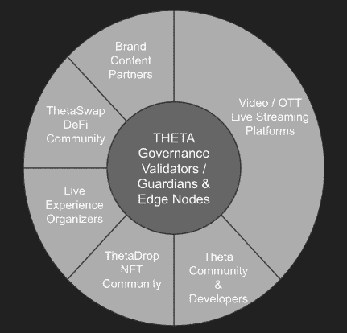

# Theta 正在演变成一个动态的、可持续的、多样化的生态系统

> 原文：<https://web.archive.org/web/https://dappradar.com/blog/theta-is-evolving-into-a-dynamic-sustainable-and-diverse-ecosystem>

## Theta Network 的媒体生态系统正在蓬勃发展

随着各种有前途的区块链项目的启动，Theta 正在发展成为一个面向媒体和娱乐行业的高度动态、可持续和多样化的生态系统。各种项目有助于推动 Theta 向前发展，包括视频跟踪工具 Replay 和面向社区的 Thetaboard。

Theta Network 通过提供支持区块链的视频传输基础设施，彻底改变了媒体和娱乐行业。具体来说，Theta 的基础设施使现有的视频和媒体平台能够产生增量收入并降低内容交付成本。此外，它还奖励用户在数字设备上共享他们的备用存储和/或带宽。

Theta 区块链旨在将媒体和娱乐业带入 Web 3.0 时代。Theta Network 运行在一种快速、廉价且资源高效的利益证明(PoS)共识机制上。此外，Theta 支持完全兼容以太坊的图灵完全智能合约。因此，它为希望通过区块链技术升级的项目打开了大门。值得注意的是，在过去的一年里，Theta 的技术基础设施已经显著成熟。Theta 团队现在将重点转向构建 Theta 生态系统，并加速将 Theta 作为领先的媒体和娱乐平台。

随着 2022 年雄心勃勃的路线图的勾勒，Theta 已经开展了各种杰出的项目。

## 带回放的视频跟踪

[Replay](https://web.archive.org/web/20221007154102/http://imaginereplay.com/) 是一个基于 Theta 区块链技术的视频追踪和支付平台。Replay 旨在为参与视频制作和分发的每个人促进信任、透明、速度和平等机会。因此，无论你是内容创作者、发行者还是消费者，你都可以从 Replay 的创新中受益。

Replay 跟踪播放时的内容使用情况，并将所有数据记录在分布式分类帐中。它使内容创作者能够获得内容许可，并实时获得内容报酬，从而使他们受益。你可以把重播想象成内容消费和付费平台的“万能计量器”。

对于内容分发商来说，无论你的业务模式是什么，无论你是销售订阅、投放广告，还是提供租赁或 PPV，Replay 都可以帮助你发现和访问广泛的内容，从而实现分发和盈利。

作为消费者，你可以享受无限的免费内容，包括好莱坞大片，优质电影，连续剧，纪录片，独立电影，以及来自全球成千上万创作者的内容。此外，观众可以解锁基于 NFT 的内容，并支持他们最喜爱的创作者。Replay 的原生令牌 RPLAY 将促进生态系统在这个充满活力的创作者经济中充当支付方式。此外，创作者还可以在 RPLAY 中获得收入。

## 使用 Bullit 保护电子邮件

几十年来，安全的电子邮件和安全的文件传输并没有太大的发展，尤其是在隐私和安全方面。 [Bullit](https://web.archive.org/web/20221007154102/https://bullit.app/) 提出了一种新的解决方案，将安全文件传输、安全电子邮件和安全数据存储整合到一个易于使用的应用程序中。

有了 Bullit，接收者将是唯一可以打开它的人，而不是任何恶意的第三方。此外，进一步增强的安全特征可以允许接收者仅在接受 T&Cs 之后才打开。除此之外，Bullit 的内容和文件可以转换成 NFT，以确保绝对的所有权，真实性和出处。

## 作为一个完整的仪表板服务

[仪表板](https://web.archive.org/web/20221007154102/https://thetaboard.io/)是一个仪表板，显示与用户 Theta 钱包相关的数据。此外，仪表板为用户提供了一个直观的界面，以了解他们的资产组合表现和其他有用的数字，如 Theta 的市场价格。飞船将自己定位为任何对 Theta 生态系统感兴趣的人的首选目的地。用户可以通过三种方法访问平台功能:使用他们的钱包地址、Theta 钱包 Chrome 扩展或通过 Theta 域。

该项目的最大成就是通过创建一个用户会经常访问的接触点，为 Theta 社区带来价值。因此，每当用户需要检查其资产的最新表现时，这总是最方便的地方，是最终用户进入 Theta 经济的门户。

## 使用 OpenTheta 实现 NFTs 和更多功能

另一个加速 Theta Network 扩张的项目是 OpenTheta NFT 市场。它旨在顺利装备创作者在西塔区块链推出他们的 NFT。OpenTheta 提供市场所需的基础设施，并处理 NFT 发布的所有技术问题。OpenTheta 仍处于早期阶段。该项目的下一步是为市场带来更复杂的功能，并丰富 NFT 在 Theta Network 上的铸造和交易体验。

## Theta 网络的未来

Theta 的生态系统围绕其核心技术展开。生态系统中的利益相关者包括:

1.直播流、顶级媒体服务和视频平台

2.Theta 社区和开发者

3.NFT 社区

4.现场体验和活动组织者

5.ThetaSwap DeFi/DEX 社区

6.品牌和内容合作伙伴

当 Theta 的生态系统正在成形时，Theta 团队正在朝着它的目标稳步前进。一方面，团队在技术方面力求完美。另一方面，Theta 积极促进与重要视频行业团队的业务合作。许多正在进行的与全球视频和 over-the-top 平台的战略讨论已经开始。Theta 将帮助这些来自传统视频行业的公司利用 NFTs 和数字收藏品作为新的收入来源。这些公司将受益于 Theta 的分散式流媒体和视频传输网络。Theta 正稳步发展成为一个更有用、更动态、更可自我持续的内容交付平台。

**关于 Theta 的更多信息**

[网站](https://web.archive.org/web/20221007154102/https://www.thetatoken.org/)
[Theta.tv](https://web.archive.org/web/20221007154102/https://www.theta.tv/)
[不和](https://web.archive.org/web/20221007154102/https://discord.com/invite/vCXJd5YKDt)
[推特](https://web.archive.org/web/20221007154102/https://twitter.com/Theta_Network)