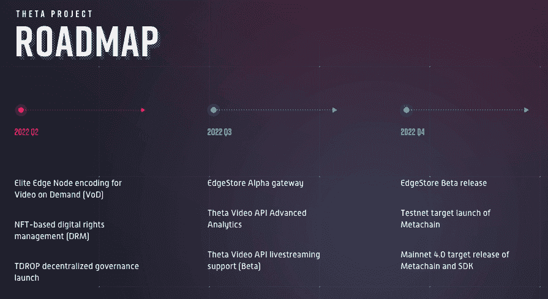
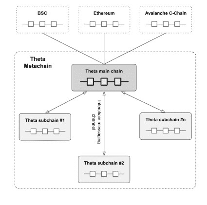
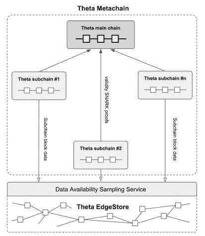
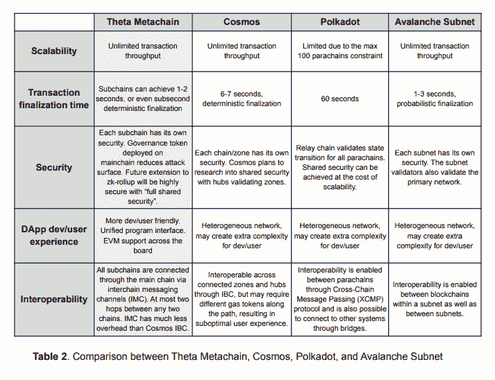

# Theta 元链将于 2022 年底上线

> 原文：<https://web.archive.org/web/https://dappradar.com/blog/theta-metachain-will-be-live-by-end-of-2022>

## 旨在扩展以满足 Web3 业务的需求

4 月 9 日星期六，Theta 网络团队通过 Twitter 发布消息称，其 mainnet 4.0 将于 2022 年最后一个季度上线，名为 Theta Metachain。Theta 元链是一个相互连接的区块链，被描述为“链中链”这允许θ区块链的无许可水平缩放，以实现潜在的无限事务吞吐量和超快速块终结。

## 摘要

*   Theta Network [Mainnet 4.0 被称为元链](https://web.archive.org/web/20221007170332/https://assets.thetatoken.org/theta-mainnet-4-whitepaper.pdf)，将于 2022 年第四季度推出
*   [元链是一个互联的区块链](https://web.archive.org/web/20221007170332/https://dappradar.com/blog/theta-metachain-will-be-live-by-end-of-2022/#Metachain-under-the-hood-)，被描述为“链中的链”
*   θ元链由一条主链和无限数量的子链组成。
*   [Theta 和 Metachain 旨在满足视频平台、票务公司、metaverses 和其他企业向分散模式发展的需求](https://web.archive.org/web/20221007170332/https://dappradar.com/blog/theta-metachain-will-be-live-by-end-of-2022/#Metachain-in-summary)

θ一直是新区块链创新的早期先锋。这始于 2018 年部署其面向第二层资源的链外小额支付池。例如，随后在 2019 年推出了利益验证 Theta mainnet，最近在 2021 年实现了与 EVM 的完全兼容。

## 一种尺寸不适合所有人

Theta 明白，对于需要自己定制区块链环境的大型娱乐平台来说，一刀切的格式是行不通的。Theta 元链希望为 dapps 提供一个可扩展、灵活和可定制的环境，以应对希望采用 web3 的公司所面临的挑战。

Theta 和 Metachain 的目标是建立一个区块链互联网络，允许 Theta 区块链网络的无许可水平扩展。以实现潜在的无限事务吞吐量，以及 1 到 2 秒，甚至亚秒的块终结时间。你可以说 Theta 的元链将与 Polkadot 和 Cosmos 等竞争，建立一个伞状生态系统。

## 引擎盖下的 Metachain

θ元链由一条主链和无限数量的子链组成。主链是指现有的 Theta mainnet。Theta 将提供一个易于使用的 SDK，开发人员可以快速使用它来启动子链并将其插入主链。

每个子链可以独立执行事务，这提供了扩展元链处理能力的途径。创建子链是没有权限的，这意味着任何人都可以注册和启动子链。不需要西塔实验室的批准。下图显示了元链的原始形式，支持主链和子链以及外部区块链(如 BNB 链、以太坊和雪崩 C 链)之间的跨链资产转移。

熟悉 rollup 扩展技术的人可能会注意到，上面的 Theta 元链图类似于一个基于 rollup 的以太坊可伸缩性解决方案，其中主链扮演以太坊第 1 层链的角色，子链对应于一个单独的 roll up 网络。他们以这样一种方式设计元链，它有可能在未来演变成类似 zk-rollup 的架构。

尽管元链的最初版本可能没有 SNARK-proof 和数据可用性增强，但 Theta 认为 zk-rollup 扩展是元链未来可能的发展方向，因为零知识证明技术变得更加成熟。

## EVM 兼容可控气费

统一性是 Metachain 的核心，主链和子链都是 EVM 兼容的。正因为如此，所有 dapp 构建者和团队都享受统一的编程接口。此外，两个令牌驱动每个子链，一个 gas 令牌和一个 governance 令牌。

在每个子链上，人们将使用 TFUEL 作为汽油令牌，而汽油费用结构将变得可为每个子链定制。这意味着子链上的气体成本可以大大低于(或高于)主链。

每个子链还将有一个治理令牌，它可以实现一个膨胀模型，例如激励验证器来保护子链。子链治理令牌并不作为子链上的本机令牌存在，而是作为 Theta mainnet 上的 TNT20 令牌存在。这将有助于提高整体安全性。

子链和θ主链概念的引入不会以任何方式改变θ区块链的现有表征组学。子链增加了θ和 t 燃料的效用和需求。开发者需要 THETA 令牌作为任何子链的抵押品。此外，子链最终依赖于主链来维护它们的安全性和完整性，这使得主链上的 THETA staked 比以往任何时候都更重要。此外，用户将需要 TFUEL 作为所有链上交易的 gas 令牌，无论是在主链还是子链上。针对子链的 TNT20 治理令牌的任何发布仅用于该特定子链，并且不会与 THETA 或 TFUEL 重叠使用。

更重要的是，这个框架没有规定子链共识机制的确切设计。Theta 认为，这种灵活性允许为特定用例定制不同的共识协议。例如，一个子链可以采用无许可的基于利害关系证明的共识算法，而另一个子链运行更适合于公司环境的许可的授权证明共识协议。

Theta 并不是唯一一个承诺这种特性的链，每个链都必须做出一些权衡，总结如下。虽然 Metachain 仍然是理论上的，但其他人已经交付了他们的 MVP。感兴趣的人应该查看 Theta 元链白皮书，以获得更详细的关于[元链的概述。](https://web.archive.org/web/20221007170332/https://assets.thetatoken.org/theta-mainnet-4-whitepaper.pdf)

## 摘要中的元链

随着应用和业务向 Web3 过渡，它们将需要可定制的高性能区块链，以支持新的业务模式和工具来创造价值。Metachain 旨在满足视频平台、票务公司、元宇宙世界和其他企业的需求，因为它们正在向分散模式发展，将价值和数据所有权放回用户手中。通过实现潜在的无限事务吞吐量和亚秒级块终结，Theta 将能够满足每天有数百万用户和事务的应用的需求。

真正的亮点来自于 Theta 的无限数量子链的方法。这些为每个平台或 Web3 业务提供了一个高度可定制的子链，它具有公共区块链的透明度、安全性和可信度。媒体和娱乐公司可以通过 Theta Video API、EdgeStore 和基于 NFT 的 DRM，使用视频、计算和存储所需的所有 Web3 工具来实现他们的专用子链。

从 2022 年 12 月开始，Theta MetaChain 的愿景是使媒体、娱乐和元宇宙的新兴 Web3 业务能够扩展到今天平台的 10 倍。虽然这些说法很大胆，但 Theta 之前提到的在 Web3 中的跟踪记录意味着投资者和投机者都在等着看 Theta 是否能按时实现他们雄心勃勃的计划。

 NewsletterUnsubscribe at any time. [T&Cs](https://web.archive.org/web/20221007170332/https://dappradar.com/terms) and [Privacy Policy](https://web.archive.org/web/20221007170332/https://dappradar.com/privacy-policy)

***以上不构成投资建议。此处给出的信息仅供参考。请行使尽职调查，做你的研究。作者持有多种加密货币的头寸，包括 BTC、瑞士法郎和雷达。***