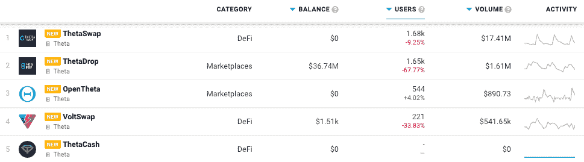

# Theta 网络 Dapps 现在在 DappRadar 上

> 原文：<https://web.archive.org/web/https://dappradar.com/blog/theta-network-dapps-now-on-dappradar>

## 视频和娱乐区块链，由用户提供动力

**DappRadar 很兴奋地宣布** [**整合了 Theta Network**](https://web.archive.org/web/20221127153437/https://dappradar.com/rankings/protocol/theta) **及其 dapps 生态系统。DappRadar 每月 100 万的网站访客现在可以通过** [**Theta dapp 排名**](https://web.archive.org/web/20221127153437/https://dappradar.com/rankings/protocol/theta) **分析哪些 dapp 吸引了最多的交易量、唯一的用户钱包，或者处理了最多的交易。这样，每个人都可以了解哪些 dapps 和令牌在 Theta 上建立了稳固的社区和价值。**

Theta 的区块链网络基于点对点协议，参与者可以通过内容分发获得报酬。顾问委员会包括 Twitch 联合创始人贾斯汀·卡纳、YouTube 联合创始人陈士骏和几位威瑞森高管，他们为 Theta 带来了丰富的在线内容和直播经验。

直播是地球上增长最快的行业之一，据估计，其价值已从 2016 年的约 300 亿美元增长到 2021 年底的 700 亿美元。在线观众通过 YouTube、Spotify、网飞和其他几个平台消费越来越多的视频内容，包括直播和预先录制的内容。可以说，在线流媒体的下一个前沿是奖励社区的视频交付平台，由区块链如 Theta 提供支持。

## 达达上的 Theta Dapps

在发布时，DappRadar 将[在 Theta 网络](https://web.archive.org/web/20221127153437/https://dappradar.com/rankings/protocol/theta)上跟踪 DeFi 和 Marketplace 类别的五个 dapp，未来还会有更多 dapp。 [ThetaSwap 是网络的本地交换](https://web.archive.org/web/20221127153437/https://dappradar.com/theta/defi/thetaswap)和令牌交换平台。使用基于类似于 UniSwap 的逻辑的开源智能合同系统。它允许用户以一种不可信、非托管的方式交换他们新创建的基于西塔区块链的 TNT20 令牌。

[Explore Theta Network Dapps](https://web.archive.org/web/20221127153437/https://dappradar.com/rankings/protocol/theta)

[滴滴出行是该网络领先的 NFT 市场](https://web.archive.org/web/20221127153437/https://dappradar.com/theta/marketplaces/thetadrop)，它在 2022 年 2 月初放弃了其[的滴滴代币](https://web.archive.org/web/20221127153437/https://medium.com/theta-network/everything-you-need-to-know-about-the-february-1st-tdrop-launch-vip-benefits-staking-and-cdbfcc430f09)。TDROP 奖励在 TDROP NFT 市场上的活动，并为 t drop 提供去中心化的管理，以及用 t drop 令牌奖励来奖励赌注者。此外，该平台刚刚宣布[与拉斯韦加斯的度假世界](https://web.archive.org/web/20221127153437/https://medium.com/theta-network/resorts-world-las-vegas-to-launch-utility-nfts-on-theta-network-the-first-ever-from-a-major-las-4dbf7ff97917)合作推出公用事业 NFTs [和三星](https://web.archive.org/web/20221127153437/https://medium.com/theta-network/theta-labs-partners-with-samsung-to-offer-nft-digital-collectibles-to-all-korean-pre-orders-for-75428d6e18b7)为所有韩国三星 Galaxy S22 和 Galaxy Tab S8 预购者提供 NFT 数字收藏品。我们鼓励 DappRadar 社区探索 DappRadar 追踪的所有 [Theta 网络 dapps。](https://web.archive.org/web/20221127153437/https://dappradar.com/rankings/protocol/theta)

## 开发商的 Theta

θ网络是由θ区块链和θ边网络组成的对偶网络。Theta 区块链提供支付、奖励和智能合约功能，而 edge 网络负责存储和交付图像和视频等媒体资产。

Theta 支持图灵完全智能合约，并与以太坊完全兼容，使广泛的 dapps 能够在 Theta 上蓬勃发展。此外，智能合约开发人员可以通过移植现有的基于以太坊的合约，快速跳转到 Theta 之上。此外，从去年开始，Theta 支持类似于币安智能链和多边形网络的以太坊 RPC API。Theta 利用[利害关系证明](https://web.archive.org/web/20221127153437/https://forkast.news/what-is-proof-of-stake/)共识机制，这意味着参与者锁定大量 THETA 令牌以获得处理交易块的权利。

[https://web.archive.org/web/20221127153437if_/https://www.youtube.com/embed/OQR7GVoV-24?feature=oembed](https://web.archive.org/web/20221127153437if_/https://www.youtube.com/embed/OQR7GVoV-24?feature=oembed)

## 总结中的θ

由于服务器位置限制了视频流平台和内容分发网络，普通的内容分发网络需要付费才能向最终用户提供视频内容，但集中式服务器根本无法满足不断增长的需求。

Theta 鼓励全球用户网络创建和支持完全分散的视频流平台。通过使其全球用户网络能够利用其计算能力和空闲带宽转播视频，弥合流媒体质量和速度之间的差距。

网络上活跃的用户越多，视频流可用的带宽就越多，每个新节点都会提高流速度和质量。此外，Theta 可以让内容创作者对他们的内容和盈利技术进行更多的控制。

了解更多关于 Theta 的信息，并访问 dapp 排名。

*   [白皮书](https://web.archive.org/web/20221127153437/https://docs.thetatoken.org/docs/whitepapers)
*   [文档](https://web.archive.org/web/20221127153437/https://docs.thetatoken.org/)
*   [推特](https://web.archive.org/web/20221127153437/https://twitter.com/Theta_Network)
*   [网站](https://web.archive.org/web/20221127153437/https://www.thetatoken.org/)
*   [不和](https://web.archive.org/web/20221127153437/https://discord.com/invite/nC8mCkgEmV)

 NewsletterUnsubscribe at any time. [T&Cs](https://web.archive.org/web/20221127153437/https://dappradar.com/terms) and [Privacy Policy](https://web.archive.org/web/20221127153437/https://dappradar.com/privacy-policy)