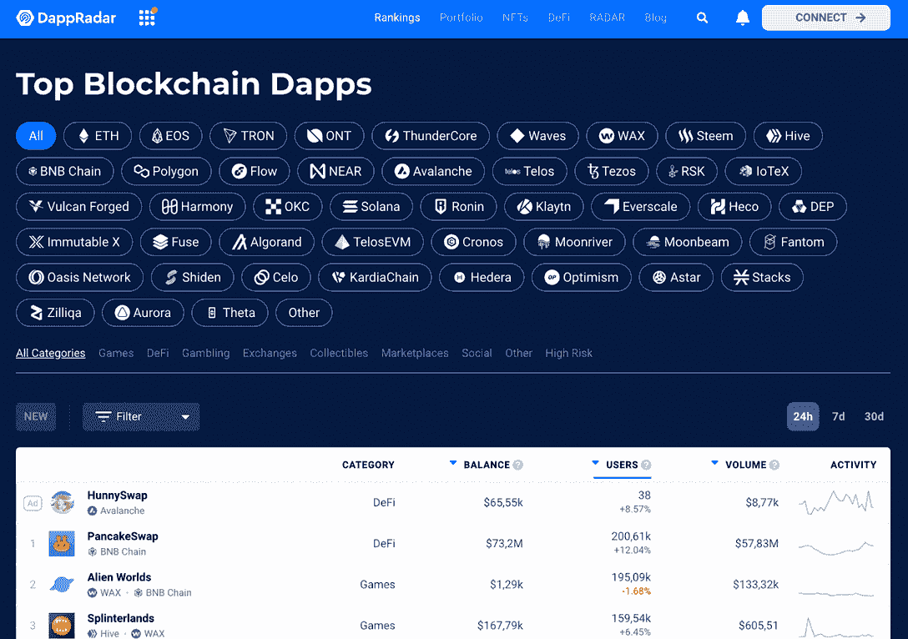
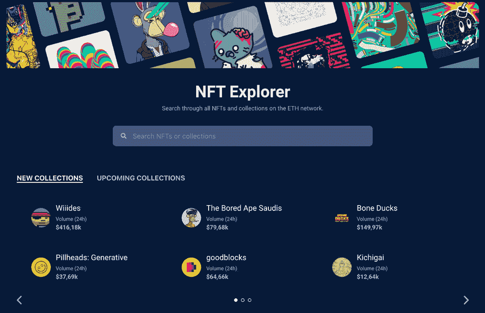
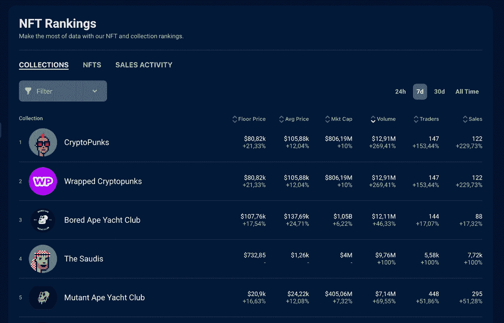
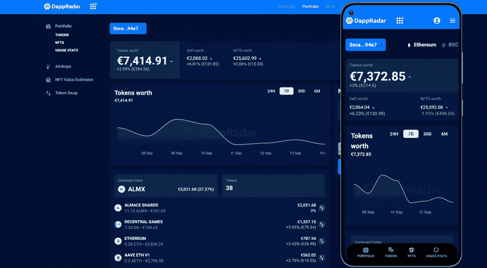
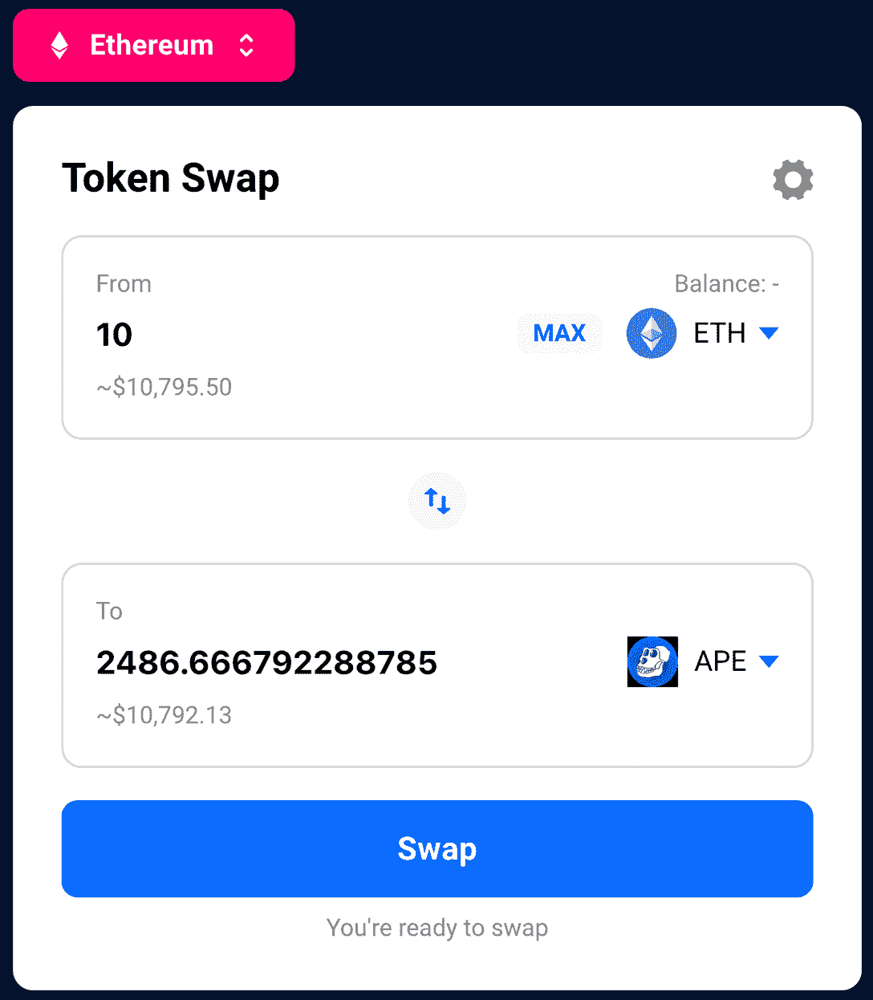

# 用 DappRadar 可以做的 5 件事

> 原文：<https://web.archive.org/web/https://dappradar.com/blog/things-you-can-do-with-dappradar>

## 以下是你如何利用世界上的 dapp 商店

在 2018 年以来跟随去中心化应用的旅程中，DappRadar 是密码界最突出的参考文献之一。该平台拥有渴望了解最大的 web3 项目的全球受众。

虽然我们有聪明的头脑来使高质量信息的访问民主化，但我们很容易迷失在 DappRadar 的许多工具中。

了解 DappRadar 可以帮助您做出快速、数据驱动的投资决策的 5 大事项。

## 用 DappRadar 可以做的 5 件事

### 1.在我们的排名中追踪 Dapps

DappRadar 的第一个也是主要的特性对于接触加密的人来说是必不可少的。在 [DappRadar 排名](https://web.archive.org/web/20220813201853/https://dappradar.com/rankings)中，你可以实时关注来自 40 多个区块链的数千个 dapps。

每天都有新的 dapps(去中心化应用)出现，了解最新的项目和市场价值以知道何时以及是否投资是至关重要的。

您还可以按类别过滤 dapps，并在游戏、赌博、交易、市场、收藏品等领域变得更加精通。此外，DappRadar 提供涵盖整个加密行业的前沿报告，包括各个项目的专用统计数据和信息。

后者适用于 [PRO 会员](https://web.archive.org/web/20220813201853/https://dappradar.com/blog/thanks-to-the-radar-airdrop-you-got-dappradar-pro-what-does-it-do)。这些是为真正专注的用户寻找合格的市场分析和全面深入的分析。

如果您想访问我们的专业功能、社区等，请加入我们并获得您的 [DappRadar 专业会员资格](https://web.archive.org/web/20220813201853/https://dappradar.com/token/pro)。

### 2.寻找最好的 NFT 收藏

于 2022 年 6 月推出的 [DappRadar 的 NFT 收藏浏览器](https://web.archive.org/web/20220813201853/https://dappradar.com/hub/nft-explorer)扩展了我们社区中数字资产收藏者的体验。它可以让你在一个地方跟踪这些独特而有价值的物品的所有活动。

在那里你可以找到最受欢迎的 NFT 的信息，它们的价格，收藏的演变，以及这些 NFT 的创造者和销售者的数据。通过实时的高级可操作洞察保持领先。

这个工具可以让你按时间对成千上万的收藏进行排序，并按数量、交易者和销售额进行过滤。另外值得一提的是，DappRadar Pro 成员可以访问增强的数据。

此外，我们的 NFT 排名还让您了解值得关注的活动和项目。

对于想要了解 NFT 空间流行趋势的收藏者来说，这是一个非常棒的工具——到目前为止，只在以太坊网络上。

更进一步，DappRadar 还拥有一个 [NFT 价值估计器](https://web.archive.org/web/20220813201853/https://dappradar.com/hub/nft-value-estimator)，它使用一种机器学习算法，结合各种来源的当前价格和历史价格来提供估计。

### 3.管理您的投资组合

现在你知道如何用 DappRadar 分析 dapps 和 NFT，你也必须小心管理你的钱包。这时[达普拉达的投资组合](https://web.archive.org/web/20220813201853/https://dappradar.com/hub/wallet/)出现了。

这个工具结合了你可以用 DappRadar 做的所有事情。它允许用户通过我们的数据从不同的区块链监督和管理他们的数字资产。

一旦你连接上你的 [web3 钱包](https://web.archive.org/web/20220813201853/https://dappradar.com/blog/best-cryptocurrency-wallets-for-2022)，你就可以在你的桌面和移动设备上查看你的投资组合。存储在该钱包地址中的所有加密和 NFT 资产都将被跟踪，你将看到一段时间内你的投资组合价值的变化。

您可以看到您的加密令牌和注册到您的钱包的 NFT 的摘要。

在撰写本文时，DappRadar 的投资组合跟踪器支持以太坊、BNB 链和多边形协议钱包。

### 4.探索、交换和下注代币

说到跟踪你的令牌，你可以用 DappRadar 做的另一件大事是使用我们的[令牌浏览器](https://web.archive.org/web/20220813201853/https://dappradar.com/hub/tokens/ethereum/all/1)。

在这个页面上，您可以跟踪以太坊、BNB 链和多边形上的最新令牌价格，并对市场进行概述。新的代币也可用于发现，您可以过滤代币类型的排名，如游戏、DeFi 和交换。

此外，您甚至可以使用我们的[代币交换](https://web.archive.org/web/20220813201853/https://dappradar.com/hub/swap/eth)功能在 DappRadar 以最优惠的价格交换代币。还有一个功能，你可以直接从你的菲亚特信用卡购买加密。

它使用 0x 协议在多个分散的交易所中搜索可能的最佳交易机会。由于这是一个复杂的主题，如果你有兴趣与 DappRadar 交换硬币，请先阅读我们的[常见问题解答](https://web.archive.org/web/20220813201853/https://dappradar.com/blog/faq-token-swap-on-dappradar/)。

但不止于此！我们不能忘记提及 DappRadar 的最新产品，即[雷达令牌](https://web.archive.org/web/20220813201853/https://dappradar.com/token/overview/)。自 2021 年 12 月推出原生令牌扩展我们的生态系统以来，已经吸引了很多关注。

雷达是 DappRadar 未来分散化的开始。然而，已经可以通过我们的网站对货币进行下注了。

### 5.获取新闻和教育内容

如果不深入了解该领域的知识，就不可能深入研究区块链的项目——或者至少应该是这样。

DappRadar 博客充满了在加密货币的世界中指导你的基本内容。除了完整的初学者教程，我们还涵盖了你需要知道的重要新闻，以明智地投资。所有这些都是简单的英语，所以任何人都可以加入这个运动。

当然，DappRadar 产品的数据和统计数据提供了对行业的深刻见解。但是所有这些信息的基础是我们每天创造的内容。

不仅仅是在我们的博客上，还有我们在 YouTube 上的视频。在那里，你可以找到从简单易懂的教程到市场报告，以及关于不容错过的播客的最佳观点。

## 你准备好加入 DappRadar 社区了吗？

这些只是用 DappRadar 做的一些最好的事情。我们甚至没有提到令人敬畏的每周[空投](https://web.archive.org/web/20220813201853/https://dappradar.com/hub/airdrops)，名人钱包，以及可用的 [DeFi 功能](https://web.archive.org/web/20220813201853/https://dappradar.com/defi)。您可以也应该探索我们的平台，因为我们一直在寻找新的方法来改善您的体验。

通过加入我们的社区，你将会被一群聪明的人为区块链科技的明智投资而工作。

这超出了使用我们的产品或跟踪我们的内容。分散式应用的世界就是为了增长而连接。

我们知道 web3 是一个不断变化的空间，DappRadar 团队很乐意在您的旅程中陪伴您。

现在你知道你可以用 DappRadar 做的最好的事情了。我们将继续努力促进这个美丽新世界的发展，并希望在未来再次见到您。

 NewsletterUnsubscribe at any time. [T&Cs](https://web.archive.org/web/20220813201853/https://dappradar.com/terms) and [Privacy Policy](https://web.archive.org/web/20220813201853/https://dappradar.com/privacy-policy)