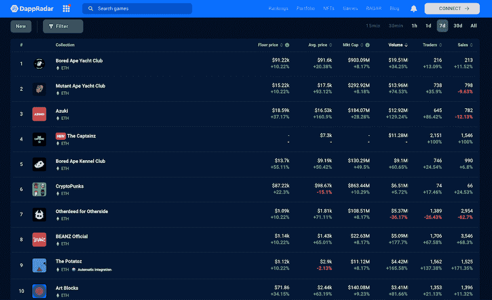
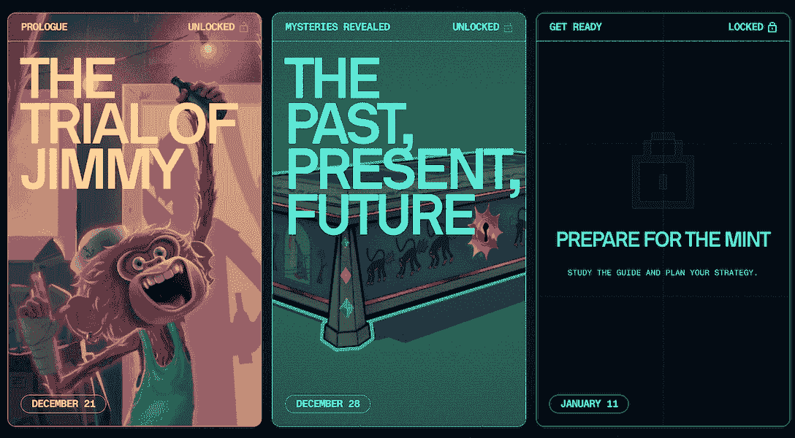
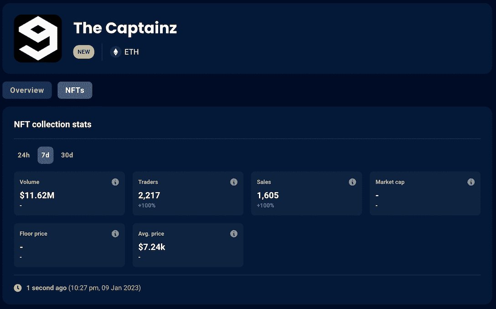

# 随着蓝筹股 NFT 保持稳定势头，这一名词出现了增长

> 原文：<https://web.archive.org/web/https://dappradar.com/blog/this-is-nouns-saw-growth-as-blue-chip-nfts-held-steady-momentum>

## 查看 2023 年 1 月 3 日至 9 日期间的 NFT 销售亮点排名

“这是名词”为 NFT 空间开启了强劲的一周，在 1 月的头几天，交易量接近 100 万美元。过去一周，一些蓝筹 NFT 藏品的排名也大幅上升。无聊猿、变异猿和志那都红豆骄傲地站在前三名。Captainz，一个新来者，已经势不可挡。

## 这是名词证明了社区的力量

这是名词是过去一周的增长冠军，在首周交易量超过 100 万美元。

从名字就可以看出，这是名词是 NounsDAO 批准的项目。该提案提出了一种更有效、更有趣的方式向每个人解释名词项目。

结果就是下面这个烙印视频，一个普通民间制作的动画。

[https://web.archive.org/web/20230119044156if_/https://www.youtube.com/embed/lOzCA7bZG_k?feature=oembed](https://web.archive.org/web/20230119044156if_/https://www.youtube.com/embed/lOzCA7bZG_k?feature=oembed)

该视频以定时公开版的形式发布，包含 3526 个单元，每个单元的价格为 0.05 ETH。出售所得在《名词》(60%)和视频制作工作室《普通人》(40%)之间平分。

简而言之，名词社区通过自下而上的提案和通过 NFTs 的众筹为项目带来了一场高度可见的营销活动。值得注意的是，该视频在 Youtube 上被观看了 4，000 次，嵌入视频的推文被观看了 22，500 次。

该项目还没有透露用户将从持有这个 NFT 视频片段中获得什么好处。但有了众筹所得的 60%，NounsDAO 很有可能会想出一些好主意来花这笔钱并回馈社区。就像他们对上面这个有趣的视频所做的一样。

[View more stats about This is Nouns](https://web.archive.org/web/20230119044156/https://dappradar.com/ethereum/collectibles/this-is-nouns)[Learn more about Nouns](https://web.archive.org/web/20230119044156/https://dappradar.com/ethereum/collectibles/nouns)

## 十大 NFT 系列畅游在绿色的海洋中

*Data source:* [*DappRadar NFT Rankings*](https://web.archive.org/web/20230119044156/https://dappradar.com/nft/collections)

随着我们进入新年的第二周，NFT 世界正引人注目地卷土重来。根据 DappRadar NFT 探险家，前 10 个集合显示了几乎一致的 7 天指标的增长。

### 宇迦实验室项目名列榜首

看上面的图表，宇迦实验室的所有项目在数量上都有强劲的增长。另一边，宇迦实验室生态系统中的元宇宙游戏项目，在过去几周发布了一系列关于其最新薄荷的互动线索。

这无疑让社区兴奋不已，并使无聊猿和突变猿的底价分别上涨了 10.22%，无聊狗舍的底价上涨了 55.11%。

[View more stats about BAYC](https://web.archive.org/web/20230119044156/https://dappradar.com/ethereum/collectibles/bored-ape-yacht-club)[View more stats about MAYC](https://web.archive.org/web/20230119044156/https://dappradar.com/ethereum/collectibles/mutant-ape-yacht-club)[See more stats about BAKC](https://web.archive.org/web/20230119044156/https://dappradar.com/ethereum/collectibles/bored-ape-kennel-club)

### 志那都红豆紧随其后

同样令人印象深刻的是志那都红豆的表现，它是 Web3 时尚和文化的蓝筹系列。该项目楼面价上涨 37%，交易量跃升 129%，至 1292 万美元。

志那都红豆继续为其项目构建引人注目的叙事，同时通过行业内外的众多合作创造更多有形的公用事业。这些努力包括与品牌设计师合作生产服装，为其 IPs 开发故事，以及加入中国最大的图片社交网络，等等。

阅读下面的 Twitter 帖子，了解志那都红豆社区的最新消息。

> 🚨爆炸性新闻🚨[@ azuki official](https://web.archive.org/web/20230119044156/https://twitter.com/AzukiOfficial?ref_src=twsrc%5Etfw)nfts pumping:
> 
> ⬆️底价涨 8%至 1.5 万美元
> ⬆️市值涨 5% 1.52 亿美元
> ⬆️24 小时交易量涨 120%至 550 万美元
> 
> 为何突然暴涨？[@ dapcharlie](https://web.archive.org/web/20230119044156/https://twitter.com/DappCharlie?ref_src=twsrc%5Etfw)下面有答案🧵
> 
> 1️⃣
> 
> — DappRadar (@DappRadar) [January 5, 2023](https://web.archive.org/web/20230119044156/https://twitter.com/DappRadar/status/1611082624491044864?ref_src=twsrc%5Etfw)

[View more stats about Azuki](https://web.archive.org/web/20230119044156/https://dappradar.com/ethereum/collectibles/azuki)

### Captainz，10 强中的新面孔

Captainz 是 Memeland 生态系统的最新成员。铸造开始于 1 月 7 日，该系列目前以 1128 万美元的成交量在我们上面的图表中排名第四。

根据官方网站的说法，这个 9999 的海盗收藏将对用户开始他们在 Memeland 的冒险起到至关重要的作用。此外，Captainz 允许用户参与未来的令牌和土地相关的奖励。

你可能不知道 Memeland，但你肯定听说过 9gag。这家社交媒体公司每月有 1.5 亿访客，每天都是许多人的笑点。

总部位于香港的 9gag 成立于 2008 年，长期以来一直试图进军博彩业。该团队现在正积极利用 Web3 战略来实现进军游戏业务的目标。

[View more stats about The Captainz](https://web.archive.org/web/20230119044156/https://dappradar.com/ethereum/collectibles/the-captainz)

## 查看 NFT 销售亮点列表

*注意:出售时给出的美元价值是正确的。*

每周，DappRadar 不仅会重点报道 NFT 最昂贵的[销售](https://web.archive.org/web/20230119044156/https://dappradar.com/nft/sales)，还会报道过去七天中最有趣的销售。虽然庞大的数字肯定会占据头条，但突出新兴趋势并让 DappRadar 社区保持领先也是至关重要的。

*   [BAYC # 4743](https://web.archive.org/web/20230119044156/https://dappradar.com/hub/assets/eth/0xbc4ca0eda7647a8ab7c2061c2e118a18a936f13d/4743)-$ 375，430/300 ETH-[车主的钱包](https://web.archive.org/web/20230119044156/https://dappradar.com/hub/wallet/eth/0xb7ef760f30d139097ba547bd6f0dfaecbf148452)
*   [志那都红豆# 7257](https://web.archive.org/web/20230119044156/https://dappradar.com/hub/assets/eth/0xed5af388653567af2f388e6224dc7c4b3241c544/7257)-360，810 美元/ 288.69 瑞士法郎-[车主的钱包](https://web.archive.org/web/20230119044156/https://dappradar.com/hub/wallet/eth/0x572d6f0628ef555061932f85687c9f8f85505ed1)
*   [crypto punk # 4609](https://web.archive.org/web/20230119044156/https://dappradar.com/hub/assets/eth/0xb47e3cd837ddf8e4c57f05d70ab865de6e193bbb/4609)-$ 248520/199 ETH-[主人的钱包](https://web.archive.org/web/20230119044156/https://dappradar.com/hub/wallet/eth/0xf30fbf7a57812a698832f4f900690fe7e92e151e)
*   [fiden za # 828](https://web.archive.org/web/20230119044156/https://dappradar.com/hub/assets/eth/0xa7d8d9ef8d8ce8992df33d8b8cf4aebabd5bd270/78000828)-22.86 万美元/180 ETH-[车主的钱包](https://web.archive.org/web/20230119044156/https://dappradar.com/hub/wallet/eth/0x08a4aabec361e622598ec8ffe30181ac0e004a1a)
*   [chrome Squiggle # 7997](https://web.archive.org/web/20230119044156/https://dappradar.com/hub/assets/eth/0x059edd72cd353df5106d2b9cc5ab83a52287ac3a/7997)-170，120 美元/134 ETH-[车主的钱包](https://web.archive.org/web/20230119044156/https://dappradar.com/hub/wallet/eth/0xe41b5a80bb047b9a7ec5ae9dadcf13c87f627281)
*   [Axie Infinity Land (-17，-30)](https://web.archive.org/web/20230119044156/https://dappradar.com/multichain/games/axie-infinity)–$ 138900/110 ETH——[业主的钱包](https://web.archive.org/web/20230119044156/https://explorer.roninchain.com/address/0xb0b07a0e021788b70d04035648f13964d3e9f970/txs)
*   [XCOPY 的《凡人》# 4/10](https://web.archive.org/web/20230119044156/https://dappradar.com/hub/assets/eth/0xd652d2633cdbfd5f27f50cddb098e708fa8433f3/4300010004)—$ 126，210/100 ETH—[车主的钱包](https://web.archive.org/web/20230119044156/https://dappradar.com/hub/wallet/eth/0xc68092e6a9fcf32b1e1e3bba0e9132b6005599a1)

[Check out all the NFT market trends](https://web.archive.org/web/20230119044156/https://dappradar.com/nft/sales)

## 随身携带您的 Web3 之旅

使用 DappRadar 移动应用程序，再也不会错过 Web3。查看最受欢迎的 dapps 的性能，并关注您投资组合中的 NFT。您在 DappRadar 上的帐户会与我们的移动应用程序同步，这样您很快就可以选择实时接收提醒。

[Download the DappRadar app now](https://web.archive.org/web/20230119044156/https://dappradar.app.link/blog)[<picture></picture>](https://web.archive.org/web/20230119044156/https://play.google.com/store/apps/details?id=com.portfolio.dappradar)