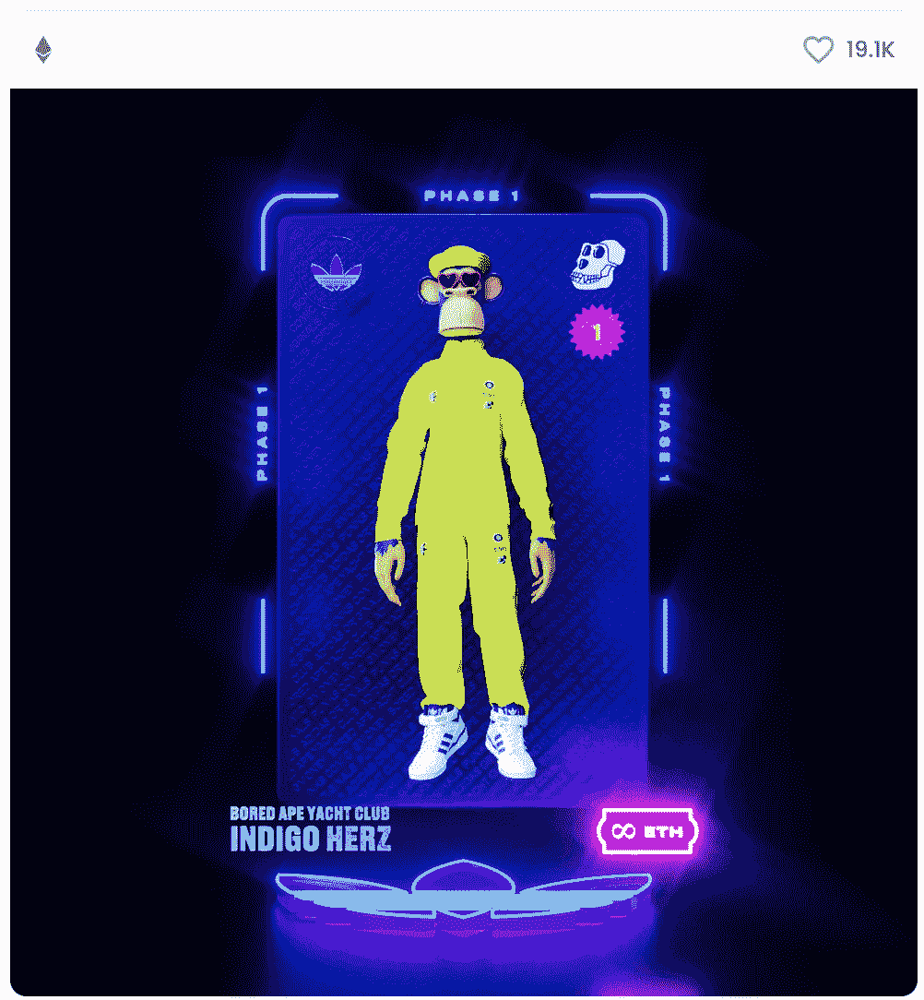
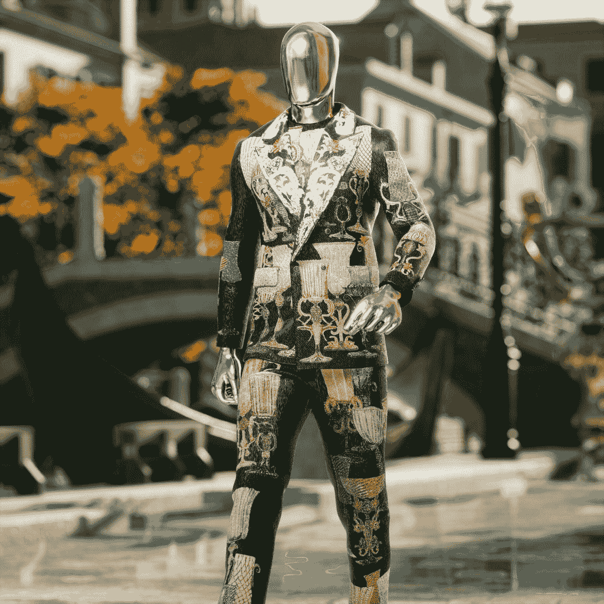
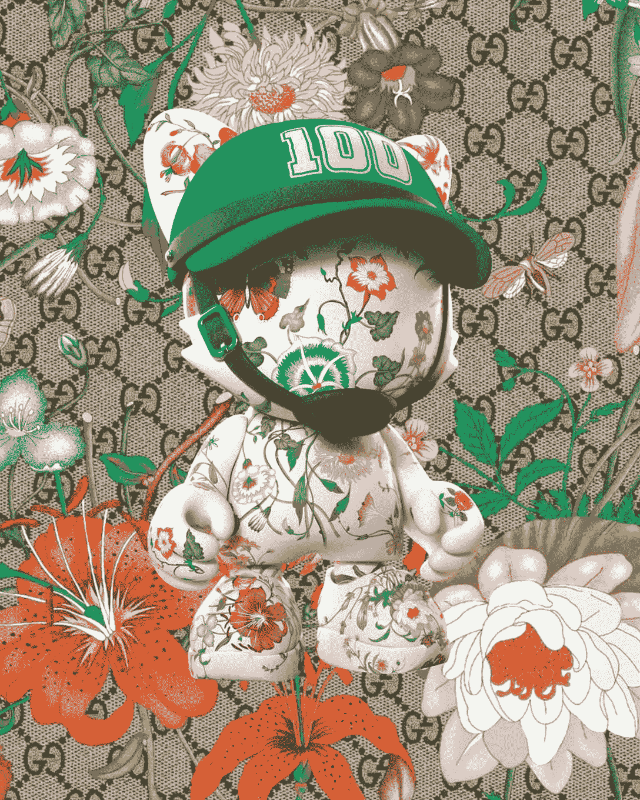

# 三个 NFT 时装系列在三个月内创收 1.375 亿美元

> 原文：<https://web.archive.org/web/https://dappradar.com/blog/three-fashion-nft-collections-generate-137-5-million-in-three-months>

## 时尚品牌正在利用元宇宙在世界范围内推广他们的品牌

在过去的六个月里，高街品牌和奢侈时装公司都一头扎进了非传统时装市场。就在今年，[阿迪达斯](https://web.archive.org/web/20221006051714/https://dappradar.com/ethereum/collectibles/adidas-originals-into-the-metaverse?source=dappradar-dashboard&medium=portfolio&campaign=clickout)、[耐克](https://web.archive.org/web/20221006051714/https://dappradar.com/blog/tag/nike)和[古驰](https://web.archive.org/web/20221006051714/https://dappradar.com/blog/gucci-launches-10-exclusive-supergucci-nfts)已经在 NFT 创造了 1.375 亿美元的销售额。Dolce & Gabbana 的数字拍卖一项就赚了 600 万美元。就时装业的总营业额而言，这些数字可能算不了什么。但它们可能只是现实世界和区块链技术越来越紧密结合的第一个迹象。

为什么*时尚界已经在 NFTs 上全力以赴了？起初，这两个领域似乎没有自然重叠。时尚是由具体化的东西组成的，比如服装、时装秀和超模。另一方面，NFT 以电子方式存储在由一百万台计算机组成的区块链上，这些计算机通过卫星和电缆相互通信。*

但是当你听说名人以 290 万美元购买虚拟岛屿时，你会意识到奢侈的财富展示市场并不仅仅局限于现实世界。当我们转向 web3 时，支配 web2 上人们生活的社会规范——炫耀、自我营销和贪图关注——将依然存在。

这就是时尚品牌的用武之地。从古驰和路易威登到耐克和阿迪达斯，NFT 图标和可穿戴设备的市场正在蓬勃发展。但是，这个市场是建立在投机基础上的吗？当人们转向下一件事情时，这个市场一定会崩溃吗？还是时尚品牌已经在规划一个不同的未来？

## 跟着钱走

看待时尚 NFT 的一个有用方法是，不要把它们视为数字可穿戴设备，而是另一种营销流，品牌可以利用它把自己的产品展示给付费观众。
阿迪达斯最近[通过加入沙盒进入了元宇宙](https://web.archive.org/web/20221006051714/https://dappradar.com/blog/adidas-enters-the-metaverse-joins-the-sandbox)。服装公司在平台上有自己的区域，叫做 AdiVerse。该品牌于去年 12 月推出了 NFT 系列，并很快铸造了全部 3 万件。现在可以在[开放海域](https://web.archive.org/web/20221006051714/https://opensea.io/assets/0x28472a58a490c5e09a238847f66a68a47cc76f0f/0)花 3100 美元(1.125 ETH)买一个。

Indigo Herz adidas Originals NFT

看看智能合约数据，我们可以看到，自 2021 年 12 月 13 日开始的一周推出 NFT 以来，其整体交易量刚刚超过 9300 万美元。下图显示，超过 50%的交易量来自于发布后的前两周。但即使在上周，这幅 NFT 的交易中也有大约 160 万美元易手。

Trading volumes for adidas Originals: Into the Metaverse NFT

2021 年 9 月，意大利时装品牌杜嘉班纳(Dolce & Gabbana)与 UNXD 合作，以不到 600 万美元的价格拍卖了其 NFT 系列。这套由多米尼克·多尔茨和斯蒂芬诺·嘉班纳自己设计的玻璃套装拍出了超过 100 万美元的高价。这是杜嘉班纳卖出的最贵的西装，互联网上对此写了数千英寸的专栏。

The Glass Suit

去年 12 月，耐克收购了 NFT 工作室 RTFKT。今年 2 月，该合作组织发布了一个名为 MNLTH 的系列。作为这个系列的一部分，一个神秘的品牌盒子被空投给了[克隆 X](https://web.archive.org/web/20221006051714/https://dappradar.com/ethereum/collectibles/clone-x-x-takashi-murakami)NFT 的持有者。克隆 X 是由 RTFKT 和日本当代艺术家 Taskashi Murakami 设计的 NFT 系列。空投的盒子，其内容未知，是[目前在 OpenSea](https://web.archive.org/web/20221006051714/https://opensea.io/assets/0x86825dfca7a6224cfbd2da48e85df2fc3aa7c4b1/1) 上出售，售价 12325 美元(4.5 ETH)。粉丝们急切地讨论着里面会有什么。与此同时，耐克接受免费营销。

Nike x RTKFT MNLTH box

古驰 x 超塑合作是另一个突显时尚品牌目前通过 NFTs 创造的巨额资金的系列。品牌 SUPERGUCCI，合作创造了“一个由三部分组成的超限量 NFT 系列”。这家合伙企业生产了 500 个这样的玩具熊，在二级市场上的底价是 6.75 瑞士法郎(18487 美元)。在美国东部时间 5 月 25 日下午 4:20-5:20 举行 NFT 的人将收到一个真实的手工陶瓷雕塑。这是一个很好的例子，体现了世界和数字世界的交叉，更多的公司可能会考虑将其用于营销目的。

SUPERGUCCI NFT

上面的四个例子是合伙关系，这是恰当的。它们是一个新的、充满活力的工作室和一个老牌公司之间的合作，希望将自己的产品叠加到一些象征着年轻和创造力的东西上。但最终，他们是大品牌，利用他们庞大的资源向孩子们出售运动鞋。

## 这会导致什么结果呢？

最终，当我们知道可穿戴和时尚 NFT 是否只是最新的炒作时，这个问题就会得到回答。它们现在很流行，因此很贵。但是，当下一个灵活的机会冲击市场时，时装业中的非技术人员的未来会是什么样的呢？

一个值得关注的地方是游戏世界，在这里头像皮肤是大生意。堡垒之夜[无意中透露](https://web.archive.org/web/20221006051714/https://www.forbes.com/sites/paultassi/2021/05/11/epic-reveals-it-made-50-million-from-one-set-of-fortnite-skins/)仅 NFL 品牌的一个系列就赚了 5000 万美元。《英雄联盟》通过出售游戏内资产、皮肤和礼品袋赚了很多钱，[据报道在 2020 年赚了 17.5 亿美元。随着在线游戏社区在 2021 年达到](https://web.archive.org/web/20221006051714/https://www.dbltap.com/posts/how-much-money-did-league-of-legends-make-in-2021-01fr6hfexgdt)[32.4 亿](https://web.archive.org/web/20221006051714/https://www.statista.com/statistics/293304/number-video-gamers/)人，精品和知名 NFT 时装设计师将进入这个市场。

然而，时尚品牌利用元宇宙的主要方式是在其中占据突出和普遍的地位。这个行业一直都是关于广告的。很快，没有比通过虚拟现实护目镜和[奇点](https://web.archive.org/web/20221006051714/https://www.kurzweilai.net/futurism-ray-kurzweil-claims-singularity-will-happen-by-2045)-桥接 [Neuralink 大脑芯片](https://web.archive.org/web/20221006051714/https://nypost.com/2021/03/06/rockets-brain-chips-is-elon-musk-superhero-or-supervillain/)直达我们大脑更好的广告方式了。NFT 只是营销计划中的一小步。