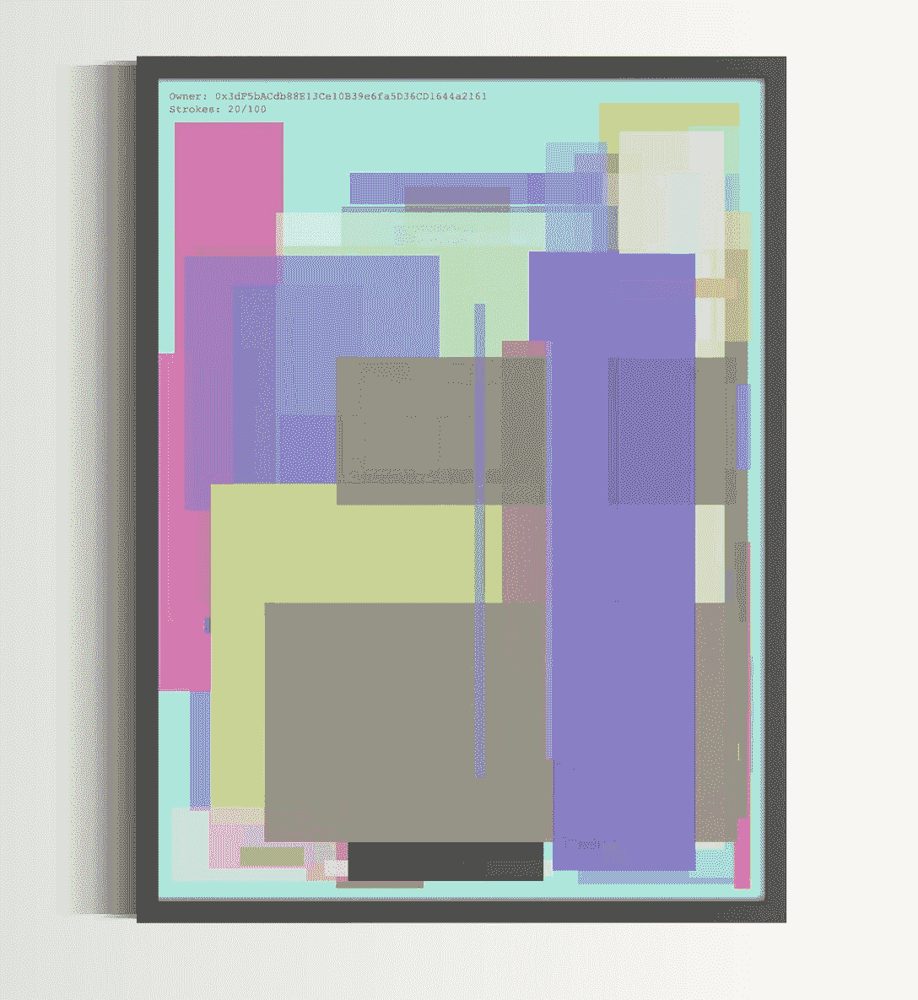

# 雷达下的三个 Web3 项目

> 原文：<https://web.archive.org/web/https://dappradar.com/blog/three-web3-projects-flying-under-the-radar>

## 梅兹梅塔、杰克森·NFT 和莱姆威尔

对于 web3 社区来说，2022 年并不是一个好年景。密码价格已经下降，NFT 的估值也已经下降。随着人们开始严肃地询问我们将何去何从，FUD 已经安顿下来。在这种令人沮丧的环境中，DappRadar 发现了三个创造、创新和规划更光明未来的项目。

**总结**

*   DappRadar 的工具套件可以帮助 alpha 搜索者在 web3 中找到下一个大机会。
*   MeetsMeta、杰克森·NFT 和 LimeWire 是三个较小的项目，试图在竞争激烈的市场中创造一些全新的东西。

随着 web3 [熊市](https://web.archive.org/web/20221119091208/https://dappradar.com/blog/the-ultimate-crypto-bear-market-2022-survival-guide/)持续到 2022 年，平台和创作者正在寻找创新的方式给他们的用户带来价值。

推出一个没有实用性、缺乏想象力的系列，并期望它在 10 分钟内焕然一新，这已经不够了。那些日子已经过去了。

[https://web.archive.org/web/20221119091208if_/https://www.youtube.com/embed/o71ROauqvOY?feature=oembed](https://web.archive.org/web/20221119091208if_/https://www.youtube.com/embed/o71ROauqvOY?feature=oembed)

What are NFTs?

现在，一个项目需要实用性、创造性和前瞻性。我们已经找到了三家符合这一描述的令人兴奋的企业，它们目前正在雷达下飞行。

## MeetsMeta

MeetsMeta 的创始人 Muhammed Khalid 将该平台描述为所有 web3 内容的一站式展示。他在一次聊天中对我说，它提供了元宇宙作为一种服务解决方案，我们聊了从虚拟活动到奖学金项目的一切。

首先，我们问 MeetsMeta 实际上是做什么的，这个平台提供了什么工具。最终，在尝试构建自己的 web3 资源时，他们意识到他们必须从头开始。

所以他们有了一个主意。我们发现了为市场问题制造工具的机会，这不仅有利于我们，也有利于整个区块链社会。

MeetsMeta 正在创建一系列开箱即用的工具，“普通”人可以使用它们来开发自己的元宇宙项目，而无需成为铁杆程序员或数学博士。

MeetsMeta 建立在 NFT 世界的基础上，最近微软宣布 T2 的 NFT 在《我的世界》不受欢迎，这给了它一个打击。哈立德说，这个消息确实令人难过。我们正努力支持所有受此影响的项目。

但是微软的声明并没有削弱这个平台的雄心。“我们从一开始就计划将 MeetsMeta 发展成一个更大的项目，”Khalid 说。因此，建立 NFT 世界只是第一步，”

[https://web.archive.org/web/20221119091208if_/https://www.youtube.com/embed/NDq8iHbJFfY?feature=oembed](https://web.archive.org/web/20221119091208if_/https://www.youtube.com/embed/NDq8iHbJFfY?feature=oembed)

MeetsMeta: a social networking metaverse

该公司计划在一个拥有自己的生态系统和经济的独立平台上开发工具，我们将在这个平台上开发我们已经宣布的一系列工具。

在那之后，他们甚至有了宏伟的计划:“第三阶段将是让我们为自己打造的所有工具对公众开放。任何想开发元宇宙或玩赚游戏的人都可以使用它们，所有这些都在友好的用户界面中

向元宇宙的中间人问好。

## 杰克逊·NFT

杰克逊·NFT 背后的艺术家劳伦斯·罗杰斯在 7 月 18 日宣布，他将启动他的社区制作项目。该声明获得了关注，自那以后，他推出的 Discord 频道已经拥有了近 1000 名成员。

我找到了他，想知道他的艺术灵感从何而来，以及他是如何参与 web3 的。

去年年底，我为 Twitch streamers 开发了一款合作游戏，并开始考虑让它成为一款从玩到赚的游戏。“我就是从那时开始掉进兔子洞的！”

当我看到那些没有真正利用区块链或者在其上创新的项目时，我很失望。从那时起，我开始开发一些概念，我认为这些概念可以用新的方式利用区块链

那么这个项目是什么，它是如何运作的？

杰克逊 NFT 是独一无二的，因为每当有人铸造一个新的，他们添加一个新的笔触所有其他的。当所有 1000 枚代币铸造完成时，它将代表一件真正的合作艺术品。

Example of a completed Jackson NFT – ‘the name comes from the artist Jackson Pollock, whose work I thought it resembled.’

“杰克森是一个创世纪项目，我正在用类似的概念开发一系列作品——持久的、互动的、有意义的艺术，是区块链使之成为唯一可能的。”

动态 NFT 将于世界协调时 7 月 29 日下午 4 点铸造 0.1 ETH。没有白名单，每个钱包只能有一个薄荷糖。

## 利美丝

如果你在 2002 年是一个 15 岁的孩子，你可能知道什么是 LimeWire。对于其他人来说，这是一个从 web2 早期开始的点对点文件共享网站。

在当局取缔盗版音乐和电影后，网站关闭和订阅服务涌现出来取而代之。

现在，这个品牌以 NFT 市场的身份回归。 [GameStop](https://web.archive.org/web/20221119091208/https://dappradar.com/other/marketplaces/gamestop-nft) 并不是唯一一个在互联网新时代复活的传统品牌。

LimeWire 刚刚宣布与酱爆弟弟合作，以 NFT 形式发行这位艺术家的新歌《LimeWire》。

LimeWire 并不是唯一一个使用区块链技术来提高公平性和确保音乐产业所有权的平台。[史努比狗狗](https://web.archive.org/web/20221119091208/https://dappradar.com/hub/wallet/eth/0xce90a7949bb78892f159f428d0dc23a8e3584d75)、[史蒂夫·青木](https://web.archive.org/web/20221119091208/https://dappradar.com/hub/wallet/eth/0xe4bbcbff51e61d0d95fcc5016609ac8354b177c4)和 [DJ 马什梅尔](https://web.archive.org/web/20221119091208/https://dappradar.com/hub/wallet/eth/0xa0eaf6b0df87132c9a28e450a43c1d906defb60b)早已是游戏中的玩家。

This LimeWire NFT sold for $1,050

那么，为什么 LimeWire 是一个值得关注的项目呢？

首先，拥有知名品牌的老牌公司现在有点不景气。我们已经提到了 GameStop，它在 NFT 的市场销量已经超过了比特币基地。1933 年创立的网球服装制造商 Lacoste，6 月份在 NFT 的销售额有所增长。

LimeWire 自己的 NFT 系列目前不为人知。它还没有销售一空，但是它的 Discord 频道已经有将近 32000 名成员。他们还吹嘘自己在推特上有大约 26500 名粉丝[。](https://web.archive.org/web/20221119091208/https://twitter.com/limewire)

区块链资产市场会转向几个大型平台还是许多小型平台，还有待观察。如果是后者，那么 LimeWire 可以成为流行文化和音乐相关的非物质文化遗产的首选地。

## 利用 DappRadar 发现阿尔法

关注我们的博客，聆听我们的分析师并不是了解下一个热点的唯一途径。

我们的工具套件旨在帮助我们的社区发现 dapps，发现趋势并发现下一个热门前景。

这三个资源是现在开始发现新机会的最佳地方。

### Dapp 排名

我们的[排名](https://web.archive.org/web/20221119091208/https://dappradar.com/rankings)页面是世界上唯一一个在一个地方保存如此多信息的地方。简而言之，如果你想知道任何一个 dapp(区块链绝大多数地区)的表现，没有其他地方可以去。

你可以按类型过滤，所以我们有按 [DeFi](https://web.archive.org/web/20221119091208/https://dappradar.com/rankings/category/defi) 、[游戏](https://web.archive.org/web/20221119091208/https://dappradar.com/rankings/category/games)、[交易所](https://web.archive.org/web/20221119091208/https://dappradar.com/rankings/category/exchanges)、[市场](https://web.archive.org/web/20221119091208/https://dappradar.com/rankings/category/marketplaces)等细分的信息。你也可以查看超过 24 小时、七天或一个月的时间段。

使用新的过滤器发现刚刚推出的 dapps。此功能有助于您加入底层项目。

你可以看到所有这些在 48 个区块链被分解。因此，如果你是《蜡像》的粉丝，你可以看到哪些 dapps 在那个网络上表现很好。如果你是[索拉纳](https://web.archive.org/web/20221119091208/https://dappradar.com/rankings/protocol/solana)的粉丝，我们可以告诉你哪些平台值得一试。

### WindowsNT 文件系统（NTFileSystem 的缩写）

我们为您提供关于 NFT 收藏、NFT 市场、NFt 销售、NFT 估价和分数 NFt 的见解和信息。我们也有名人 NFT、NFT 底价、NFT 交易量和 NFT 平均价格的信息。

无论您是刚刚开始 NFT 之旅，还是经验丰富的经销商，DappRadar 都有您需要了解的一切。

[https://web.archive.org/web/20221119091208if_/https://www.youtube.com/embed/gPql9HtNDO8?feature=oembed](https://web.archive.org/web/20221119091208if_/https://www.youtube.com/embed/gPql9HtNDO8?feature=oembed)

DappRadar’s NFT Explorer

### 达普拉达的作品集

有没有想过把你的钱包信息收集到一个地方，这样你就可以一次看到所有的信息？DappRadar 的产品组合允许用户查看他们在[以太坊](https://web.archive.org/web/20221119091208/https://dappradar.com/hub/wallet/eth/)、 [BNB 链](https://web.archive.org/web/20221119091208/https://dappradar.com/hub/wallet/bsc/)和[多边形](https://web.archive.org/web/20221119091208/https://dappradar.com/hub/wallet/polygon/)的加密和 NFT 持有量。

只需将您的 web3 钱包链接到我们的网站，就可以看到您钱包中的所有内容。你还可以从财务角度了解你的 NFT 收藏，看看你在 P&L 专栏中是红是绿。

您的使用统计让您清楚地了解有多少钱以加密货币的形式通过您的钱包转移。

[https://web.archive.org/web/20221119091208if_/https://www.youtube.com/embed/WHL_uYv8riA?feature=oembed](https://web.archive.org/web/20221119091208if_/https://www.youtube.com/embed/WHL_uYv8riA?feature=oembed)

DappRadar’s Portfolio Tracker

 NewsletterUnsubscribe at any time. [T&Cs](https://web.archive.org/web/20221119091208/https://dappradar.com/terms) and [Privacy Policy](https://web.archive.org/web/20221119091208/https://dappradar.com/privacy-policy)